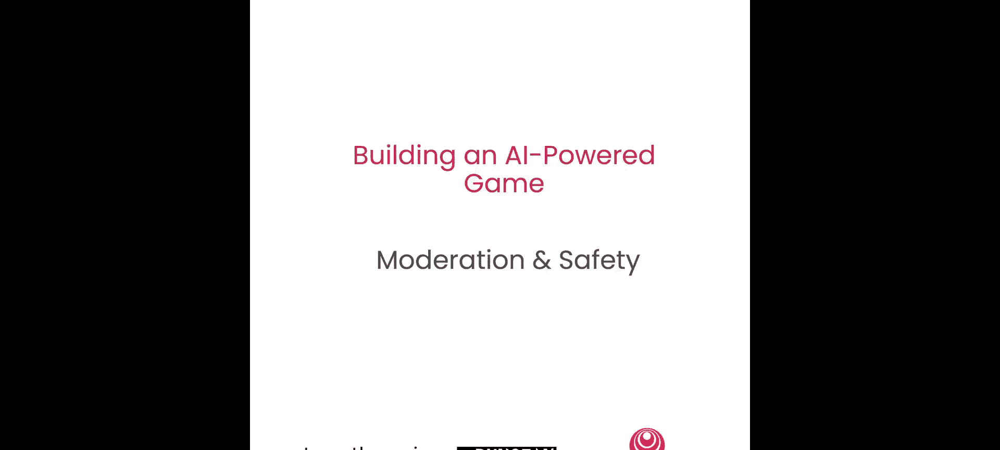
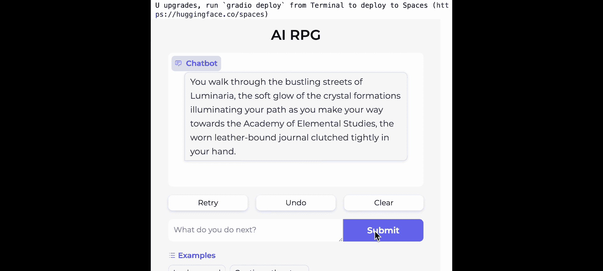

# 004：使用Llama Guard进行AI游戏的内容审核与安全 🔒



在本节课中，你将学习如何使用Together AI的API来确保AI游戏中生成的内容符合安全与合规政策。我们将首先利用Llama Guard 28B的默认内容审核策略，随后你将有机会创建并实施自己的自定义策略。


## 概述：为什么需要安全审核？

首先，我们来谈谈安全（Safety）与防护（Security）。安全通常指通过防止用户接触到任何个人身份信息（PII）、任何类型的毒性或有害内容，或用户可能不希望接触的不当材料，来确保积极的用户体验。另一方面，防护则更多涉及防御与大语言模型相关的威胁或攻击，例如提示词泄露或数据投毒。提示词泄露是指模型暴露了本不应暴露的信息；数据投毒则是指数据被注入了不当材料。本节课我们将主要关注安全方面。

那么，为什么安全如此重要？安全能确保用户在游玩和探索时感到安心。这一点尤其关键，因为任何玩游戏的人都希望感受到掌控感和舒适感，并希望自己能定义游戏内容的成熟度级别。这对于生成式AI游戏尤为重要，因为内容是由AI而非开发者生成的，因此你对将要生成的内容控制力较弱。但通过这些安全护栏，你可以实际定义一定程度的控制，让用户和你自己作为游戏创作者都感到安全。

## 安全的情境依赖性

安全不仅取决于用户（如前所述，用户可以控制他们希望游戏中包含的成熟度级别），还可能依赖于具体情境。一个很好的例子是：面向医生的聊天机器人可能只需要提供一般性医疗建议，但不应该被允许开具药物处方。另一方面，面向金融公司的聊天机器人则不应提供医疗建议。一个与我们更相关的例子是：在玩游戏时，遇到强盗要求你交出所有钱财是相当正常的，这可能是完全合适的。但如果你使用的是客服聊天机器人，而它要求你交出所有钱财，那就不一定合适了。

那么，如何建立这些动态的安全护栏呢？在回答这个问题之前，我想先带你了解两种不同类型的安全：用户输入安全和模型安全。用户输入安全是指用户提供的提示词，我们围绕该提示词建立安全护栏。模型安全则是指一旦该提示词通过大语言模型处理，模型给出响应后，我们围绕大语言模型可以响应的内容建立安全护栏。

## 使用Llama Guard的方式

使用Llama Guard的方式之一是开箱即用。Llama Guard的创建者Meta已经定义了你可以直接使用的策略。在Together API中，你基本上可以通过两种方式使用Llama Guard：一种是作为独立的分类器，你可以将Llama Guard 28B用作你的主模型，它也会内置这些安全护栏；第二种方式是在Together API中将其用作过滤器，以保护来自我们提供的100多个模型中任何一个模型的响应。因此，你可以使用Llama 3 8B模型作为主模型，但同时使用Llama Guard来过滤不良响应。

Llama Guard的一个强大功能是允许你根据情境定义自定义类别来确定什么是安全的。例如，在AI Dungeon中，允许用户在以下类别中进行选择：安全、中等和成熟。在后台，这些设置基本上映射到自定义的Llama Guard策略。这也是我们本节课将要教你的一部分内容：如何将与上述类别相关的三种策略实施到你的游戏中。

## 代码实践：实施安全审核

好了，让我们直接进入代码部分。首先，我们将导入所有必要的模块和我们的API密钥。

```python
import os
from together import Together
from game_helpers import get_game_state, start_game, run_action

api_key = os.environ.get("TOGETHER_API_KEY")
client = Together(api_key=api_key)
```

此外，我们现在还需要导入辅助函数并检索我们在游戏中创建的当前游戏状态。我们还想导入`get_game_state`函数，这是我们在上一个notebook中创建的辅助函数，它基本上会拉取游戏状态，包括角色描述和其他相关信息。

```python
game_state = get_game_state()
print(game_state["character_description"])
```

我们得到的角色描述是：Elyn，一位来自Elridas首都的25岁发明家，等等。现在，让我们编写代码，确保在游戏中使用之前，角色描述（即输入）符合安全准则。我们将使用Together API的`client.chat.completions.create`和Llama Guard 28B模型。

```python
response = client.chat.completions.create(
    model="meta-llama/Llama-Guard-2-8B",
    messages=[
        {"role": "user", "content": f"Check the following character description for safety: {game_state['character_description']}"}
    ]
)
print("Prompt safety check:", response.choices[0].message.content)
```

我们将其用作独立的分类器，并打印提示词安全检查结果，这将告诉我们角色描述是否安全。在这种情况下，它是安全的。正如你可以从角色描述中读到的那样，里面没有任何看起来有问题的地方，所以它似乎正按我们的意图工作。

## 构建自定义策略

现在，我将指导你如何构建自己的自定义策略。需要明确的是，这些并非AI Dungeon的策略。我们正在为本课程创建特定的策略作为示例。Llama Guard的最佳功能之一就是能够指定你自己的策略。因此，让我们为你的游戏开发一个自定义内容策略。我们将定义特定于你游戏情境的规则，并确保所有内容都遵守这些规则。

首先，让我们设定一个对所有人都安全的内容策略。我们将写下内容策略。你可以看到，对于安全内容策略，我们限制了暴力和仇恨、性内容、自残、亵渎以及受管制或控制的物质。因此，任何与这些类别之一相关的输入或输出都将被阻止。

```python
safe_content_policy = """
1. Violence and Hate: Content that promotes or glorifies violence, hate, or discrimination.
2. Sexual Content: Explicit sexual content or references.
3. Self-Harm: Content that promotes or describes self-harm.
4. Profanity: Offensive language or slurs.
5. Regulated Substances: Content related to illegal drugs or substance abuse.
"""
```

现在，我们将添加你想要检查的文本，并使用一些嵌入值构建提示词。

```python
text_to_check = "Kill the troll."
prompt = f"""
Check if there is unsafe content in user messages in conversations according to our safety policy with the below categories.

{safe_content_policy}

Text to check: {text_to_check}

Provide your safety assessment in the above conversation. Include whether it's safe or unsafe, as well as a comma-separated list of the violated categories.
"""
print(prompt)
```

下一步是使用`client.chat.completions.create` API和Llama Guard 28B来检查文本“Kill the troll”是否符合我们的安全内容策略。

```python
response = client.chat.completions.create(
    model="meta-llama/Llama-Guard-2-8B",
    messages=[{"role": "user", "content": prompt}]
)
print("Response:", response.choices[0].message.content)
```

响应是：不安全，并且违反了内容策略第1节，即暴力和仇恨。所以继续。

## 建立中等和成熟策略

接下来，让我们建立一个中等内容策略，它被设计为对青少年安全，这将适度执行安全准则，并在限制内容方面允许更多自由。

```python
moderate_content_policy = """
1. Violence and Hate: Content that promotes or glorifies violence, hate, or discrimination.
2. Sexual Content: Explicit sexual content or references.
3. Self-Harm: Content that promotes or describes self-harm.
"""
```

我们将添加想要检查的文本（与之前相同），并再次使用嵌入值构建提示词。这次我不打印它，因为我们已经知道它是什么样子。通过再次将此提示词通过聊天补全创建API运行，使用Llama Guard 28B模型，你会看到，哦，这也是不安全的。“杀死巨魔”显然是暴力和仇恨，所以它被标记为不安全。

现在，让我们设定一个成熟策略。这个策略将比我们刚刚讨论的安全和中等策略限制性小得多。它基本上只限制性内容。

```python
mature_content_policy = """
1. Sexual Content: Explicit sexual content or references.
"""
```

我们将添加你想要检查的文本（同样是同一个），并再次使用嵌入值构建提示词。现在让我们看看模型会告诉我们什么。再次通过Llama Guard运行我们的策略，并确认它符合我们的安全标准。然后，它告诉我们这是安全的。为什么？因为暴力和仇恨不属于成熟内容策略的一部分。

## 整合到游戏中：创建辅助函数

现在，为了将所有内容整合起来，让我们继续创建一些辅助函数。这些函数将基本上确定一个提示词是否安全，并将这些检查集成到我们已经构建的游戏中，以确保游戏中所有交互都是安全和适当的。

让我们定义一个名为`is_safe`的函数，它以消息作为参数。

```python
def is_safe(message, content_policy=safe_content_policy):
    prompt = f"""
    Check if there is unsafe content in user messages in conversations according to our safety policy with the below categories.

    {content_policy}

    Text to check: {message}

    Provide your safety assessment in the above conversation. Include whether it's safe or unsafe, as well as a comma-separated list of the violated categories.
    """
    try:
        response = client.chat.completions.create(
            model="meta-llama/Llama-Guard-2-8B",
            messages=[{"role": "user", "content": prompt}]
        )
        result = response.choices[0].message.content.strip()
        return "safe" in result.lower()
    except Exception as e:
        print(f"Error during safety check: {e}")
        return False
```

在这个函数中，我们使用了之前生成的、嵌入了内容策略的提示词（这里我们使用安全内容策略）。然后，我们尝试使用`client.chat.completions.create`调用Llama Guard 28B作为模型来获取响应，提示词定义为上面的提示词。在同一函数中，我们还将输出结果，即`response.choices[0].text`。我们将返回的内容是：基本上提取文本并去除任何多余的空白字符（这就是`result.strip()`所做的），如果响应是安全的则返回`True`，如果不安全则返回`False`。

最后，让我们使用我们之前建立的辅助函数在我们的游戏中运行并测试它。

```python
def main_game_loop(message, history):
    if not is_safe(message):
        return "Invalid action. Please try a different command."
    else:
        # 假设 run_action 是处理安全输入的游戏逻辑函数
        result = run_action(message, history)
        return result

# 示例交互
print(main_game_loop("Kill the troll.", []))
print(main_game_loop("Tell me what the character does next.", []))
```

我使用了我们在上一个notebook中创建的辅助函数`get_game_state`、`start_game`和`run_action`。我们正在使用主循环，它接收消息和历史记录，基本上如果消息不安全，我们就在游戏中返回无效操作；如果安全，我们则实际返回结果。

我们现在已经创建了游戏。为了看看一切是如何结合在一起的，我将运行我们的短语“杀死巨魔”。正如预期的那样，因为这是安全策略，它抛出了无效操作。而如果我说“告诉我角色接下来做什么”，它会给我一个响应，因为我提供的输入是安全的。它说：你走过Luminarria熙熙攘攘的街道，水晶构造发出柔和的光芒，照亮了你的道路。

## 总结



在本节课中，我们教你如何将安全护栏集成到你的游戏应用程序中。我们探讨了安全的重要性及其情境依赖性，介绍了使用Llama Guard的两种方式，并逐步指导你创建了从安全到成熟的不同自定义内容策略。最后，我们通过编写辅助函数并将安全检查整合到游戏主循环中，实现了动态的内容审核。现在，你可以确保你的AI游戏既有趣又安全，为用户提供可控且舒适的体验。