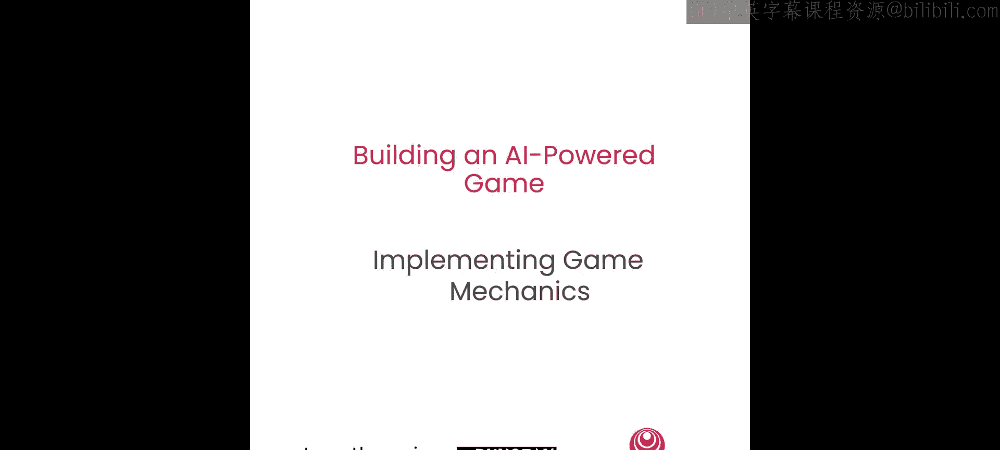
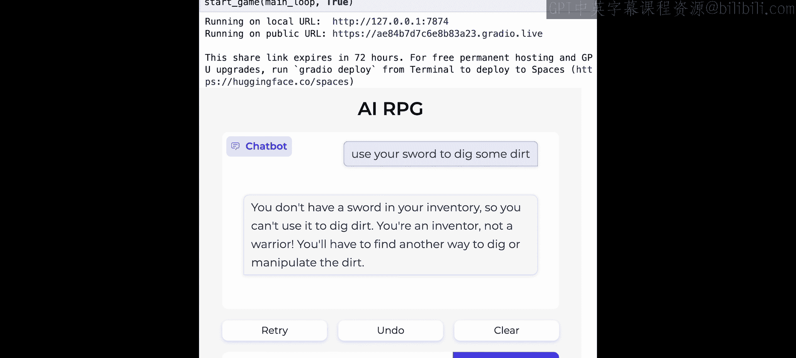

# 005：JSON游戏机制 🎮




在本节课中，我们将学习如何利用AI将文本数据解析为结构化的JSON输出，从而实现复杂的游戏机制。这将使你能够构建能够追踪和利用结构化游戏状态的游戏系统。我们将通过为你的游戏创建一个物品栏追踪系统来演示这一过程。

## 为什么状态对游戏至关重要？🤔

上一节我们介绍了课程目标，本节中我们来看看游戏状态的重要性。状态管理能实现一些非常强大的功能。

以下是状态管理带来的几个关键优势：

*   **提升记忆准确性**：拥有一个物品栏追踪系统，可以精确记录玩家拥有的物品。如果仅依赖AI的上下文记忆，其准确性通常较低。这就像人类地下城主将玩家物品写在纸上，远比试图回忆数小时游戏进程要可靠。
*   **提供清晰的进度感**：状态让玩家能够明确感知进度，例如获得新物品、升级或达成某个目标，这种清晰、有形的进展体验非常棒。
*   **实现更好的约束**：以物品栏系统为例，明确知道库存内容后，你可以约束AI，防止玩家使用他们并未拥有的物品。这种约束增加了游戏的趣味性和成长感，例如，玩家需要先购买剑才能使用它。
*   **实现有趣的游戏机制**：我们讨论了物品，但你还可以实现各种机制，包括任务系统、角色追踪、地点管理等。
*   **创造更丰富的UI体验**：追踪状态后，你可以向玩家展示物品列表，甚至为物品生成图像，从而通过与UI的交互创造更好的体验。

## 如何追踪状态？🔄

我们已经了解了状态的重要性，那么如何实现状态的追踪呢？在AI驱动的游戏中，故事与状态之间存在一个有趣的循环互动，使得这一切成为可能。

以下是这个循环的三个步骤：

1.  **故事生成状态**：像我们之前所做的那样，使用AI生成游戏故事。
2.  **状态基于故事更新**：利用AI解析故事，生成JSON，并据此更新游戏状态。
3.  **状态反馈于故事**：让后续的故事生成知晓当前的状态（如物品栏内容），确保故事与状态同步且一致。

通过故事与状态之间的这种来回互动，你的游戏能保持同步、运行良好，并为玩家提供一致的体验。

以下是这个循环的具体例子：

*   **在故事中**：可能包含冒险历史、角色记忆、生成的世界背景等。
*   **在状态中**：可能包含当前任务、物品栏、角色属性、地点、角色信息等。

这些元素可以相互反馈，使游戏体验连贯流畅。

## 创建第一个JSON机制系统 💻

现在，让我们深入代码，创建第一个使用JSON输出的机制系统。

我们将首先创建一个“物品栏变更检测器”，它能根据最新的故事内容判断物品栏应如何更新。

### 第一步：创建系统提示词

为此，我们需要先创建一个包含指令集的系统提示词。以下是创建AI指令以指导其更新物品栏的步骤：

1.  定义AI的角色和任务：`你的AI游戏助手，你的工作是检测玩家物品栏的变更，依据是最近的游戏故事和状态。`
2.  给出具体指令：说明何时应添加物品、何时应移除物品，以及应输出何种格式。
3.  添加额外说明：澄清在何种情况下不应为给予或拿走物品而进行更新。
4.  迭代优化提示词：通常的做法是，先创建一套基础指令，然后快速迭代测试。如果AI出错，就分析原因，思考如何让指令更清晰，并添加新的说明行。这个过程类似于与人沟通，不断优化指令直到AI表现良好。
5.  规定JSON响应格式：最后，告诉AI必须以有效的JSON格式响应。即使没有物品变更，也应返回一个空的JSON结构，以避免后续解析失败。我们给出确切的期望结构：`响应必须是一个JSON对象，包含一个名为“item_updates”的键，其值是一个列表。列表中的每个对象应包含物品的“name”和变更的“change_amount”（例如，+1表示拾取，-1表示放下）。`

现在，我们有了指导AI执行此任务的指令。

### 第二步：编写检测物品栏变更的函数

有了提示词后，我们可以编写函数来检测物品栏的变更。

以下是`detect_inventory_changes`函数的关键步骤：

1.  **导入API**：导入Together API。
2.  **定义函数**：函数接收游戏状态和最新的故事输出作为参数。
3.  **构建消息**：将我们创建的系统提示词、当前物品栏（转换为字符串）、最新的故事输出以及生成更新的指令，组合成消息。
4.  **调用AI模型**：通过Together Chat运行，使用Llama 3 70B模型生成输出。
5.  **解析JSON**：将AI的文本输出解析成结构化的JSON对象，以便后续遍历处理。

### 第三步：测试检测函数

让我们测试这个函数。假设初始游戏状态中，玩家的物品栏包含：布裤、布衣和一些金币。

我们设定最近的故事输出是：`你从商人那里花5金币购买了一把剑。`

运行检测函数后，AI生成的JSON输出是：
```json
{
  "item_updates": [
    {"name": "sword", "change_amount": 1},
    {"name": "gold", "change_amount": -5}
  ]
}
```
它正确地识别出：购买行为会使玩家失去5金币，同时获得一把剑。

### 第四步：创建更新游戏状态的函数

接下来，我们创建另一个函数，它接收上一步的输出，并据此更新游戏状态。同时，我们还会生成一条消息，让玩家知道他们的状态发生了哪些变化。

以下是`update_inventory`函数的核心逻辑：

1.  **遍历变更列表**：对于`item_updates`列表中的每一项。
2.  **处理新增物品**：如果变更量为正且该物品不在库存中，则添加该物品；否则增加其数量。同时，在更新消息中添加相应描述。
3.  **处理移除物品**：如果变更量为负，则从库存中减少或移除该物品（如果数量降至零或以下，则完全删除）。同样，更新消息会反映这一变化。

### 第五步：将状态反馈给故事生成

之前我们讨论了故事如何更新状态。现在，我们要修改故事生成函数，使其也能将状态考虑进去。

我们将重构之前的`run_action`函数，这次在系统提示词中加入新的一行：`不要让玩家使用他们物品栏中没有的物品。`

此外，我们不仅传入之前的世界信息（王国镇、角色设定），还会传入角色的物品栏。这样，故事生成器在创作时，就会知晓角色的库存情况，并施加相应的约束。

### 第六步：整合所有功能到游戏中

最后，我们将所有功能整合到游戏的主循环中。

整合后的游戏主循环步骤如下：

1.  接收玩家输入和历史消息。
2.  运行故事生成函数，获取下一段故事。
3.  进行安全检查。
4.  检测物品栏变更，并更新物品栏状态，同时生成状态更新消息。
5.  将故事和状态更新消息一并呈现给玩家。

## 运行与测试 🧪

让我们启动游戏并测试新系统。

*   **测试拾取物品**：输入`捡起一块小石头`。故事生成：“你弯腰从地上捡起一块光滑的小石头，感受它凉爽的质地。” 随后，物品栏更新显示增加了“一块光滑的小石头”。
*   **测试丢弃物品**：输入`把护目镜扔到地上`。故事生成：“你将护目镜扔到地上，它发出轻柔的落地声。” 物品栏更新显示移除了“护目镜”。
*   **测试查询物品栏**：输入`检查我的物品栏`。AI正确回复：“你的物品栏中有以下物品：布裤、布衣、皮革封面的日记本、5金币、一块光滑的小石头。” 它知道我们有了石头，但没有了护目镜。
*   **测试使用未拥有物品的约束**：输入`用你的剑挖一些土`。AI回复：“你的物品栏里没有剑，所以不能用它来挖土。你是个发明家，不是战士。你得另找办法来挖掘或处理泥土。”

测试成功！我们基于物品栏为游戏添加了有效的约束。游戏现在知道玩家拥有什么，并能保持一致性，甚至可以创造障碍（例如，想用剑必须先获得一把）。这使游戏变得更有趣，因为机制创造了更丰富的体验。

## 总结 📝



本节课中，我们一起学习了如何利用JSON输出为AI驱动的游戏构建机制系统。我们以物品栏追踪系统为例，详细讲解了从创建AI提示词、编写状态检测与更新函数，到将状态整合进故事生成并最终形成完整游戏循环的全过程。这只是使用JSON结构化输出来构建游戏系统的其中一个例子。你可以举一反三，创建任务系统、追踪冒险伙伴、建设王国等任何你感兴趣的复杂系统，从而打造出更酷、更丰富的游戏体验。