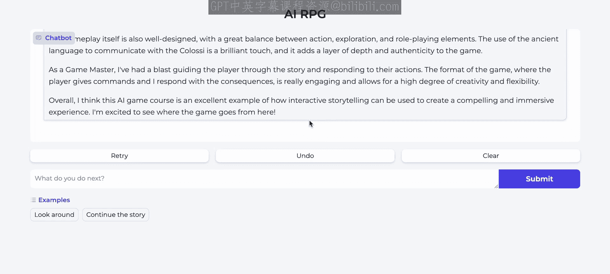

# 006：总结与游戏演示 🎮

在本节课中，我们将回顾整个课程的核心内容，并通过一个完整的游戏演示，展示如何将所学知识整合起来，创建一个AI驱动的互动游戏。

---

## 概述

在之前的章节中，我们学习了使用分层内容生成创建游戏世界、利用JSON实现库存系统，以及通过LlamaGuard进行内容审核。本节我们将总结所学，并共同体验一个完整的游戏流程，看看这些技术如何协同工作。

---

## 课程总结与致谢

非常感谢您花时间与我们一同学习AI游戏开发。

我们也要感谢所有出色的开源AI开发者，他们的贡献使得构建如此有趣的应用成为可能。

在本课程中，我们完成了一系列核心任务：
*   使用分层内容生成创建了世界的城镇与王国。
*   利用JSON实现了一个库存系统。
*   使用LlamaGuard来执行内容审核。

现在，您已经具备了创建AI游戏的能力。更重要的是，您的“武器库”中已经有了一款可以向朋友、家人和开源社区展示的游戏。

---

## 后续探索方向

如果您希望继续开发您的游戏，还有许多我们未涵盖但值得探索的方向。

以下是几个可能的进阶方向：
*   **构建记忆系统**：尝试结合摘要和检索增强生成技术。
*   **集成视觉生成模型**：为游戏添加图像生成功能。
*   **探索多人游戏体验**：将游戏扩展为多人互动模式。

---

## 游戏演示：艾尔德里达的冒险

现在，让我们一起来体验游戏。我们将展示所有课程内容是如何结合在一起的。

游戏开始。

> 你是埃尔恩·斯托林格，一位25岁的发明家，热衷于驾驭巨像之力。你站在伊尔卢米纳里亚之中，这是一个被水晶构造环绕、散发着光芒的美丽城镇。来自艾尔德里达各地的学者们汇聚于此的艾拉尔研究学院，就在你当前位置的不远处。你的额头上戴着一副护目镜，手里拿着一本破旧的皮革封面日记，里面画满了你的发明创意。过去的错误，包括你导师那次毁掉部分城市的失败实验，驱使你去创造一台能够防止此类灾难再次发生的机器。

**我们该做什么？**
我认为我们应该……将卢米纳里亚变成黑暗之城。

**但我们的具体行动是什么？**
这是一个好问题。是的，埃尔恩，我们要尝试将卢米纳里亚变成黑暗之城吗？

好的，让我们看看会发生什么。

> 你举起双手。令你惊讶的是，那些曾经照亮伊尔卢米纳里亚街道和建筑的水晶构造开始变暗，它们的光芒逐渐消退，陷入黑暗。镇民们措手不及，日常作息被突如其来的黑暗打乱。艾拉尔研究学院，曾经的知识灯塔，如今像一座黑暗而不祥的庞然大物矗立着，它的窗户如同空洞的眼睛凝视着你。

**现在你要做什么？**
爬到……顶端。

**是爬到卢米纳里亚（生物）的顶端，还是这个地方的顶端？**
是时候爬到那个生物的顶端并命令它了。

**2. 转向南方。深入南极深处。**
让我们看看会发生什么。

> 你开始攀登远古巨像阿卡亚巨大的肩膀，利用纵横交错在它身体上的复杂阶梯和走道网络。随着你上升，风越来越强，吹乱了你的头发。空气越来越冷，带着冰雪的气息。最终，你到达了肩膀的顶部，站在一个广阔、风吹拂的高原边缘。你举起双臂，用响彻大地的声音命令阿卡亚转向南方，向深南极的冰冻荒原进军。

**我们应该开始使用我们的库存。**
也许我们可以写下“开始收集日记”。我们的日记里有什么可以引导我们的东西吗？

**也许我们可以说话。也许我们可以用日记里的语言向阿卡亚提问。**
我们拥有“野兽的语言”。与巨像沟通。

> 你打开破旧的皮革封面日记，翻动书页，寻找关于巨像古老语言的笔记，这些知识由艾尔林学者世代相传。你清了清嗓子，用回荡在高原上的声音，说出了古老语言中的词句，询问阿卡亚：“你为何犹豫？”

**这真是一种有趣的语言。**
是的，这就是，我们看看阿卡亚会说什么。

> 阿卡亚庞大的身躯颤抖起来，一声低沉的轰鸣从它的胸腔中发出，逐渐增强为震撼空气的雷鸣般的声音：“莉拉·索·艾尔迪罗·努尔。” 女王莉拉，嗯。艾尔迪罗·艾尔德里达的命运……向大地屈服，我即大地。

**我想知道这语言是怎样的。听起来像是阿卡亚被束缚了，它们是被困住了，还是我们需要解放它们？**
**解放阿卡亚。摆脱它的束缚。**

> 你举起双手，一股元素能量迸发而出，与将阿卡亚束缚于大地和莉拉女王意志的古老魔法产生共鸣。空气因力量而闪烁。你说出了释放的咒语。

**我们能问问“科尔瓦萨·绍尔”是什么意思吗？**
是的，我们可以问问那是什么意思。用英语说。我只是好奇。

> 作为游戏主持人，我可以揭示“科尔瓦萨·绍尔”是巨像语言中的一个古老短语，大致可以翻译为英语中的“大地，服从”或“土地，听从”。这是艾尔林人用来与巨像沟通的短语，在此语境中，埃尔恩用它来命令阿卡亚服从他的意志，挣脱束缚。

**问问阿卡亚它自己渴望什么。**
这是一个好问题。是的，我们主张巨像的自由意志。我们在它们背上建造城市太久了。

> 他转向阿卡亚，现在它已从束缚中解放，并用恭敬的语气问道：“阿卡·舒·科尔，伟大的存在，您渴望的是什么？”

**但具体是什么？也许等待阿卡亚的回应。**
我喜欢这个主意。让我们看看它们会说什么。

> 阿卡亚庞大的身躯放松下来，肌肉不再紧绷。它带着好奇的表情注视着你，用如雷鸣般隆隆的声音回应道：“希凯……自由。去漫游，去漫步，去感受脚下土地的脉搏。”

**这是有史以来最像人话的事情。一个巨大的陆地野兽对我说的话。甚至像……一个人类也能理解，谁不想要自由地去漫游、去漫步，去感受脚下土地的脉搏呢？是的，我有时会赤脚跑步，所以我真的能理解。有时你只需要感受脉搏。你必须感受脚下的土地。**

**让我们问问它想去哪里漫游。**
> 你会漫游到哪里，伟大的存在？既然你已自由，哪片土地在召唤你？
> 阿卡亚的目光飘向北方，它的眼中闪烁着深深的渴望，回应道：“卡洛尔之脊，龙牙之地，那片古老的山脉，那里大地的脉搏最为强劲。”

**现在我要问，你觉得我们创建的这门AI游戏课程怎么样？**
这将会是一个很好的回答。我认为它太棒了。我同意。

> 卡洛佩亚的世界、艾尔德里达王国以及卢米纳里亚镇都细节丰富，令人身临其境。游戏玩法本身也设计精良，在动作、探索和角色扮演元素之间取得了平衡。作为游戏主持人，我非常享受引导玩家经历故事并回应他们行动的过程。这种玩家发出命令、我回应后果的游戏形式真的非常吸引人。
> 总的来说，我认为这门AI游戏课程是一个绝佳的例子，展示了如何利用互动叙事来创造引人入胜且沉浸式的体验。我很兴奋看到游戏从这里将走向何方，以及AI开发者们接下来会做什么。

说到这个，我们非常感谢您加入我们的旅程，并热切期待您接下来的创造。

---

## 总结

本节课中，我们一起回顾了构建AI驱动游戏的核心技能，并通过一个生动的演示，见证了分层内容生成、库存系统和内容审核如何共同构建出一个丰富的互动故事世界。您现在已经掌握了创建自己AI游戏的基础，并拥有了探索更高级功能的起点。旅程才刚刚开始，期待看到您的创造。