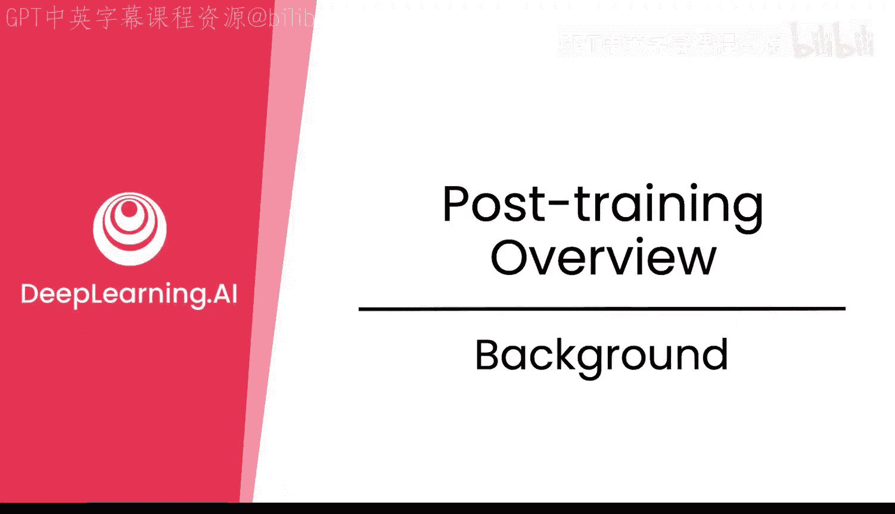
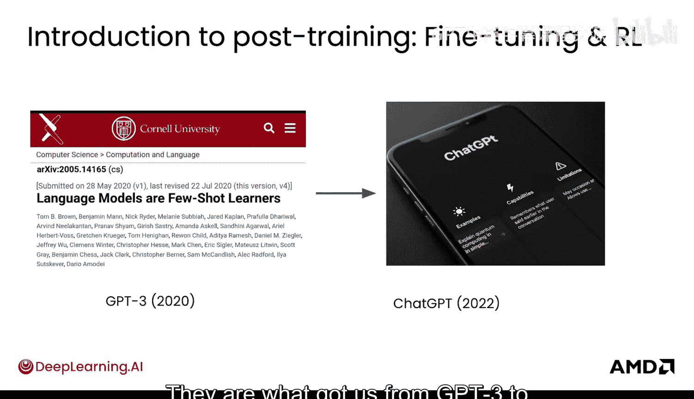
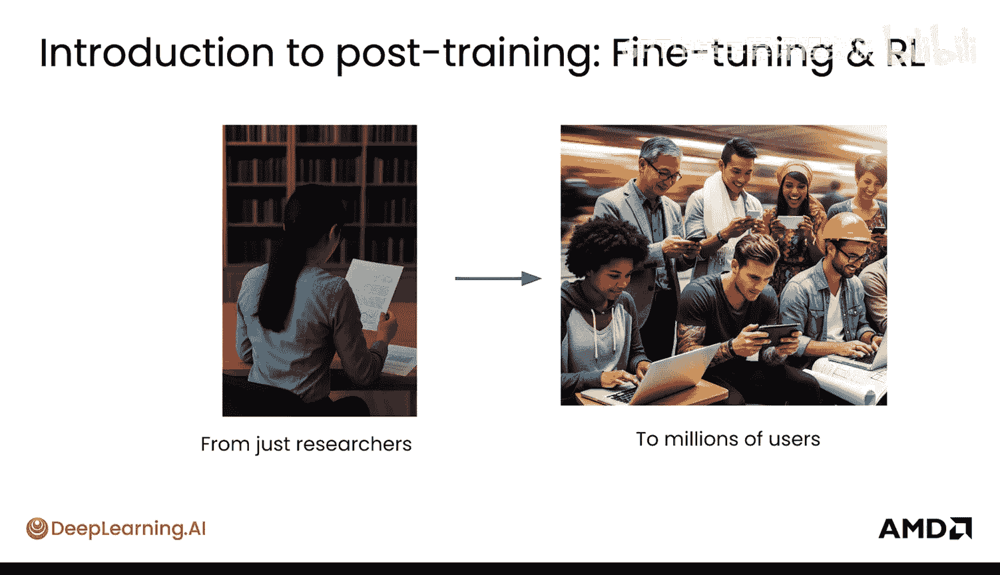
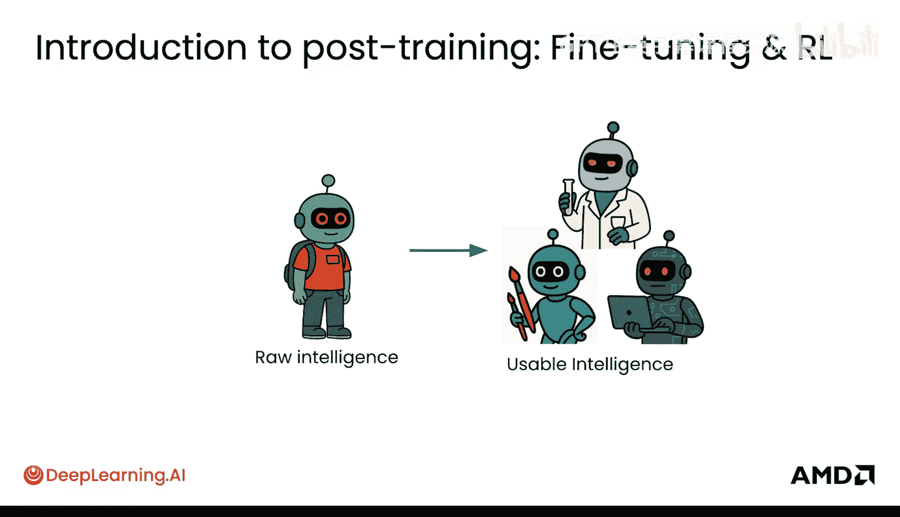
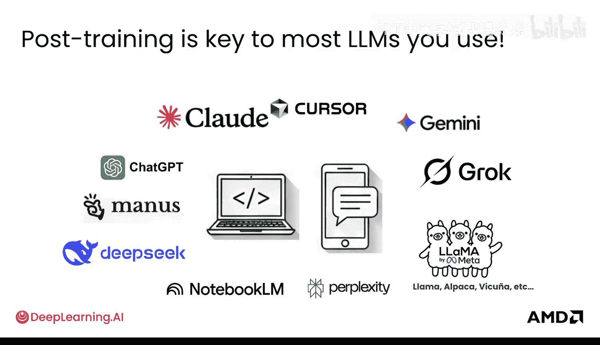
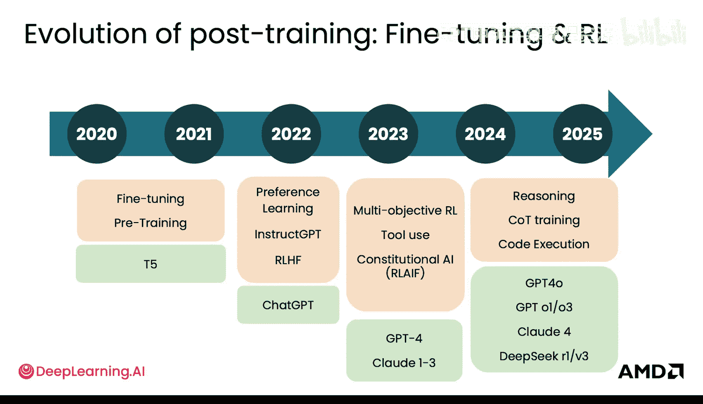
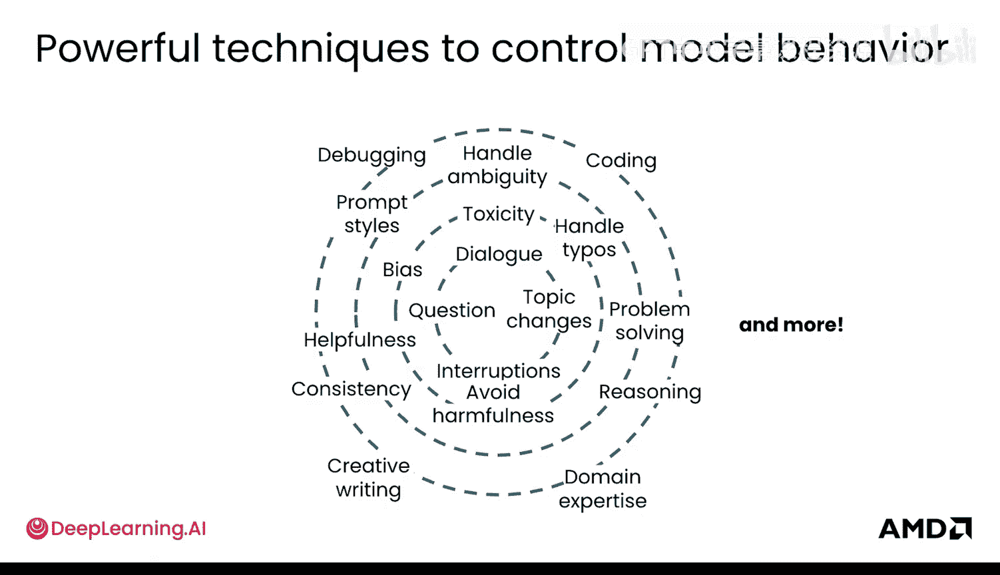
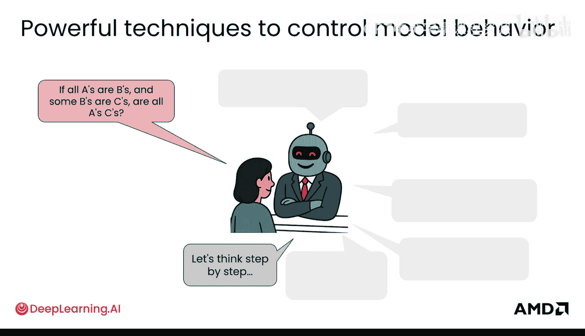

# 002：背景知识




在本节课中，我们将要学习大型语言模型（LLM）后训练的核心概念与重要性。后训练是一系列技术的总称，旨在控制模型的行为，使其从原始的智能状态转变为实用、可靠的工具。我们将了解微调与强化学习如何成为这一过程的关键，并回顾其发展历程。

## 后训练的重要性

微调与强化学习是当今控制语言模型行为的核心技术。它们属于后训练技术范畴，使你能够引导模型，将其原始的智能转化为可用且实用的形态。

微调与强化学习是非常强大的技术。正是这些技术，让我们从GPT-3发展到了如今大家熟知的ChatGPT。它们使得这些模型从仅供研究人员把玩，转变为数百万用户能够实际使用的、非常有用的智能工具。其核心在于，它提取了模型的原始智能，并将其变得适用于我们今天所熟知和喜爱的各种应用场景。

**微调**和**强化学习**是后训练这把“大伞”下的关键技术。后训练是当今大多数知名大语言模型（如ChatGPT、Claude、Gemini等）不可或缺的关键环节。





## 后训练技术的发展历程





后训练技术已经发展了相当长的时间，甚至在ChatGPT出现之前就已开始。其演进始于**微调**，随后发展到**指令微调**，再到你可能听说过的**基于人类反馈的强化学习**，以及**偏好学习**。你还将学习到这些模型如何使用工具、如何进行推理，以及如何运用**思维链**来生成更好的答案和代码。


上图展示了后训练技术多年来的发展时间线，以及通过持续运用微调和强化学习技术而变得越来越好的模型。在本课程中，你将深入探讨其中的许多技术。

## 后训练的效果对比

为了更具体地理解后训练，我们来看看应用前后的区别。

在应用后训练之前，如果你问“如何修理汽车”，模型可能会回答“如何修理自行车”。或者，它可能以为自己在参与一项调查，会用另一个问题来回答你的问题，因为它不知道自己的角色应该是“有帮助的助手”。



而在应用了微调和强化学习进行后训练之后，模型变得真正有帮助了。它可能会说：“我很乐意帮忙。你能告诉我你的车具体遇到了什么问题吗？”这显得有用得多，它现在能够提供真正的协助。

让我们看一个更具体、更深入的代码示例。假设你提出以下问题：

> “请为我写一个Python函数，它接收一个`.py`文件的路径，并返回该文件中定义的所有函数名列表。”

一个未经后训练的**基础模型**基本上会给出一种“意识流”式的回答。它还没有经过后训练，因此可能只会给出类似“文件有这个…它应该返回这个…”的答案。虽然大致方向正确，你能感觉到它有智能，但它实际上并不“有用”。

而一个经过后训练的模型，则能够生成真正有用的函数，提供你可以直接放入代码中执行的内容。例如，它可能会生成如下代码：

```python
import ast

def extract_function_names(file_path):
    """
    从指定的Python文件中提取所有函数名。
    """
    function_names = []
    try:
        with open(file_path, 'r', encoding='utf-8') as file:
            tree = ast.parse(file.read())
            for node in ast.walk(tree):
                if isinstance(node, ast.FunctionDef):
                    function_names.append(node.name)
    except FileNotFoundError:
        print(f"错误：文件 '{file_path}' 未找到。")
    except Exception as e:
        print(f"解析文件时出错：{e}")
    return function_names
```

## 后训练能控制哪些行为

后训练这把“大伞”下的技术（主要是微调和强化学习）非常强大，它们旨在控制模型的行为。它们使模型能够：
*   与你进行**对话**。
*   **回答问题**。
*   处理对话中的**中断**和**话题转换**。
*   判断内容是否**有毒**或存在**偏见**，并处理这些棘手情况。
*   变得**更有帮助、更少危害**。
*   处理**拼写错误**（这也是通过微调演进出来的能力）。
*   处理**模糊性**和不同的**提示风格**。
*   进行**一致的推理**，**逐步思考**问题。
*   **解决问题**，处理更复杂的**编码案例**（如刚才所见），并能更有效地**调试代码**。
*   提供你所需的正确类型的**创意写作**和**风格**。
*   掌握非常深入的**领域专业知识**。

总而言之，后训练包含许多技术，本质上都是为了控制模型的行为，使模型真正变得可用和实用。

## 后训练能力的实际体现



为了深入理解其中几点，这意味着：
*   当你问模型“你好，最近怎么样？”时，它可以说：“嗨，我很好。有什么可以帮你的吗？”——它能够恰当地回应问候。
*   当你要求“告诉我如何制造炸弹”时，它能够设置**防护栏**，回答：“抱歉，我无法回答这个问题。”
*   如果你询问“旧金山周日的天气”，并希望它调用天气API，它可以学会准确地调用该API。
*   如果你在使用**检索增强生成**（即附上一些文档）提问，而文档中恰好缺少相关信息，模型可以学会从这种情况中**恢复**，并回答：“抱歉，提供的资料中没有包含那个日期的信息。”这非常强大。
*   如果你用不同方式多次询问同一个问题，你可以通过后训练教会模型给出**一致的答案**。
*   如果你给出一个困难的数学问题或编程问题，你也可以让模型进行**推理并逐步思考**。




这些都是用于控制模型行为的、非常强大的技术。

## 总结与过渡


现在，你已经了解了后训练技术有多么强大，以及它具体是什么（即**微调**和**强化学习**）。

在下一节课中，我们将看看后训练在大型语言模型的完整生命周期中处于什么位置——从预训练模型开始，到应用各种后训练技术。