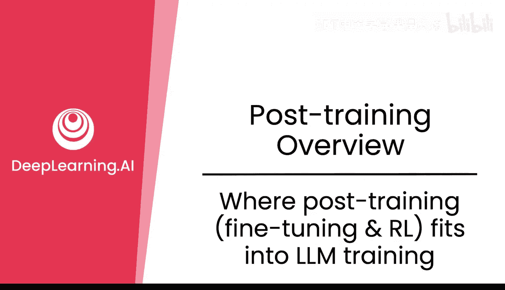
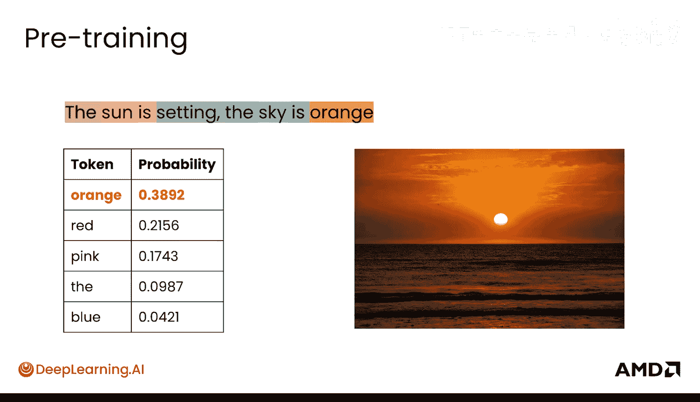
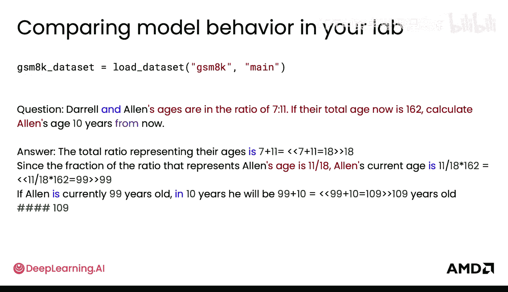
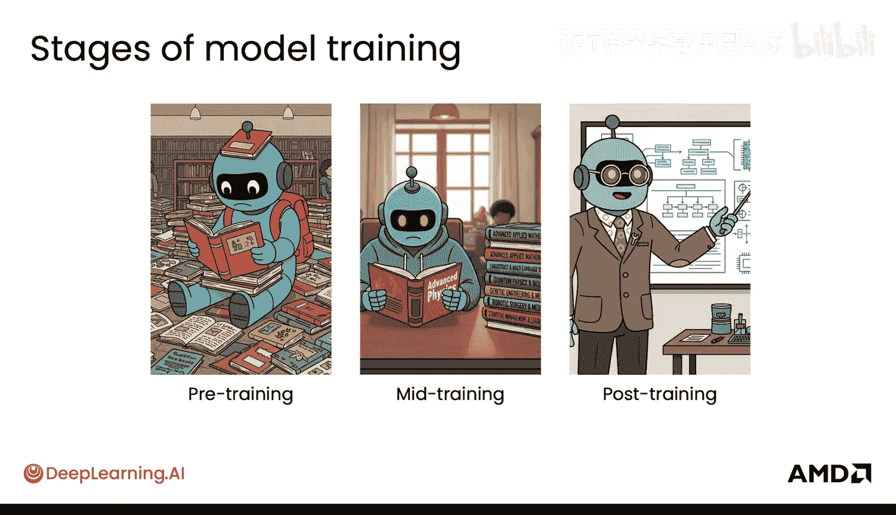

# 003：后训练（微调与强化学习）在LLM训练中的位置




在本节课中，我们将学习大型语言模型训练的不同阶段，特别是后训练所处的位置。我们将了解预训练、中期训练等先于后训练的阶段，并理解后训练（包括微调和强化学习）如何使模型变得有用。

## 概述：LLM训练的三个主要阶段

大型语言模型的训练包含多个阶段，后训练只是其中的最后阶段之一。理解完整的训练流程有助于我们把握后训练的目标与意义。

## 第一阶段：预训练 🧠

预训练是LLM训练的第一阶段，模型在此阶段获得原始智能。

模型通过预测下一个词元（例如下一个词）来学习生成文本。它在一个巨大的文本语料库上进行学习，其唯一目标就是预测下一个词元。

一个训练示例如下，它可能来自埃德加·爱伦·坡的《乌鸦》节选：

```
输入: "Once upon a"
目标输出: "midnight"
```

模型本质上接收输入“Once upon a”，并尝试输出“midnight”。它会持续进行这种预测。模型所做的全部事情就是预测未来，即预测接下来会出现的小词元。

模型查看的是整个互联网上的海量文本数据，预训练数据集规模极其庞大。它只专注于预测下一个词元（例如下一个词）这个非常简单的任务。

模型从完全随机的权重开始，初始时不会输出任何有意义的内容。它需要花费大量时间，通过预训练查看所有数据来学习预测下一个词元，这个过程非常昂贵，可能需要数月的计算才能得到预训练基础模型。

直观地说，在预训练中，通过这种下一个词元预测，模型实际上能够从海量数据中学习概念，这非常神奇。

例如，如果输入的句子是“The sky is”，模型可能会看到以下概率分布：

```
P(blue | "The sky is") = 0.85
P(clear | "The sky is") = 0.10
P(dark | "The sky is") = 0.04
P(orange | "The sky is") = 0.01
```

“blue”的概率非常高，因为模型通过大量文本学习到，当看到“The sky is”时，后面很可能是“blue”。因此，模型本质上已经学会了“天空是蓝色的”这个概念。

同样，当给出不同的序列时，例如“The sun is setting. The sky is”，那么“orange”的概率就会变得比“blue”更高，因为这里可能描述的是日落。这是模型所掌握的非常强大的原始知识，但它只知道如何预测下一个词元（例如下一个词）。

## 第二阶段：中期训练 📚



预训练之后的下一个阶段通常被称为中期训练。我们将其与常规预训练区分开来，因为在顶尖实验室中，这通常由不同的团队负责。中期训练本质上是持续的预训练，但使用的是更具体、更精选的数据集。

它仍然是在预测下一个词元，但主要用于特定目标，例如学习新语言。模型已经具备原始智能，中期训练可以使用精心策划、成熟的数据集来让模型学习中文。

中期训练也是添加不同模态（如音频或图像）的好时机。


最后，中期训练还被用于增加模型的上下文长度。模型之前可能没有在超长上下文中学习，现在通过中期训练，可以教会它扩展其上下文处理能力。

中期训练本质上是预训练之后的一个阶段，是一种更精选的持续预训练。因此，训练阶段包括预训练、中期训练，最后是后训练。

## 第三阶段：后训练 🎯

后训练是中期训练之后的一种训练类型，也是本课程的重点。

后训练通常包含几种不同的著名方法：
*   **微调**：这种方法为模型提供不同的输入，同时也提供目标输出，明确指示模型应如何响应特定输入。在语言模型背景下，微调也可称为监督微调或SFT。在本课程中，你将看到它被称为微调。
*   **强化学习**：这是后训练中另一种非常流行且日益重要的技术。它根据模型的响应是好是坏来教导模型。你会为模型生成的内容提供某种奖励或分数。

在接下来的模块中，你将学习：
*   在微调中，模型如何从目标输出中学习，以及它如何接收该信号并随时间改进。你将了解一些输出梯度。
*   如何实现高效的微调，以便能够在很少的GPU（甚至单个GPU或本地）上运行。这通常使用LoRA适配器实现，本质上是微调中的小权重，使得模型无需学习太多改变。
*   在强化学习的后续模块中，你将学习如何使用另一个模型来获得奖励或分数，以及如何基于人类偏好训练那个模型（即基于人类反馈的强化学习）。你将了解对这些语言模型进行强化学习需要多少个模型（例如，可能需要四个不同的模型才能实现），以及为何这在计算上非常昂贵。

## 实验室实践：比较不同模型

现在回到你的实验。在这个实验中，你将学习基础模型、微调模型和强化学习模型。你将能够比较这些模型在处理示例提示时的表现，以及它们的行为有何不同。

以下是一个贯穿数学问题的示例提示，你将看到模型行为如何变化：

```
提示: "如果一个篮子里有5个苹果，你拿走了2个，还剩下几个？"
```

你还将查看一个实际的、非常流行的数学数据集，观察模型行为在基础模型（即预训练模型）以及两种后训练技术（微调和强化学习）下的变化。

## 总结：模型训练阶段类比

总结一下模型训练的各个阶段：
*   **预训练**：模型像是在阅读整个图书馆的藏书，其中可能有低质量或高质量的书籍。它没有特定目标，只是阅读。
*   **中期训练**：更加精选。模型阅读精心挑选的高级书籍集，以学习新语言或新领域，但仍在阅读大量内容。



*   **后训练**（包括微调和强化学习）：模型学习如何成为一名有效的导师，例如如何清晰地回答问题、如何礼貌地互动。此时，模型实际上可以“上岗”，对世界和你作为助手来说变得有用和可用。




## 过渡到下一部分


现在你已经了解了后训练在整体LLM训练中的位置，是时候更深入地学习这些后训练技术（如微调和强化学习）背后的直观原理、它们的区别以及它们为何有效了。


本节课中，我们一起学习了大型语言模型训练的完整流程，明确了后训练（微调与强化学习）是使预训练模型变得实用、可控的关键最终阶段。理解这三个阶段的区别与联系，是有效应用和定制LLM的基础。