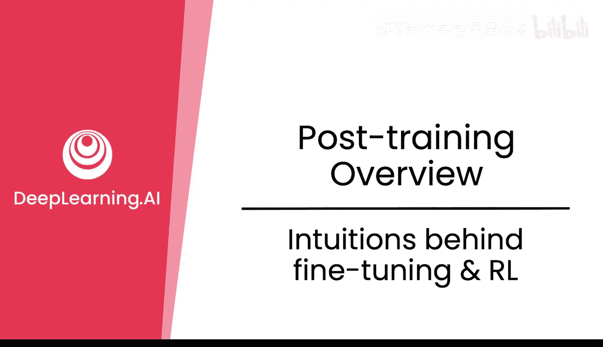
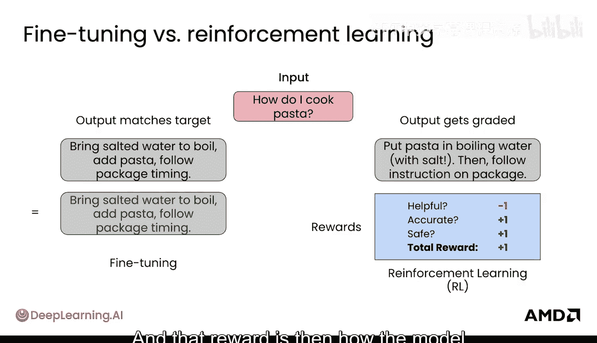
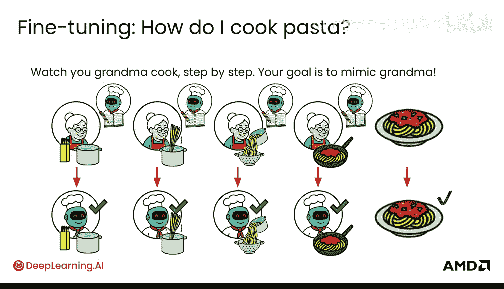
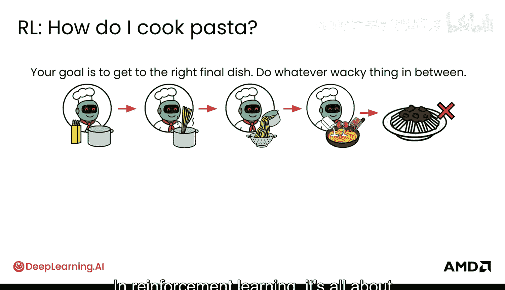
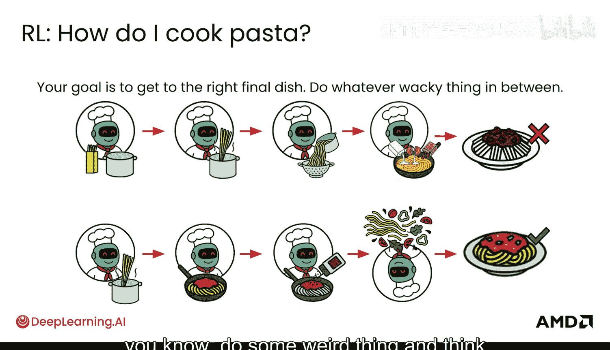
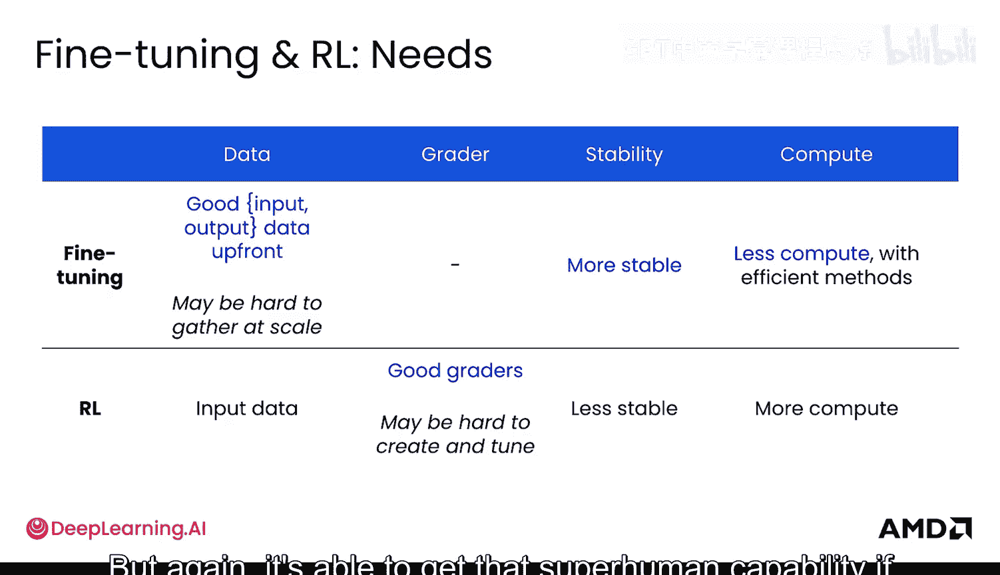
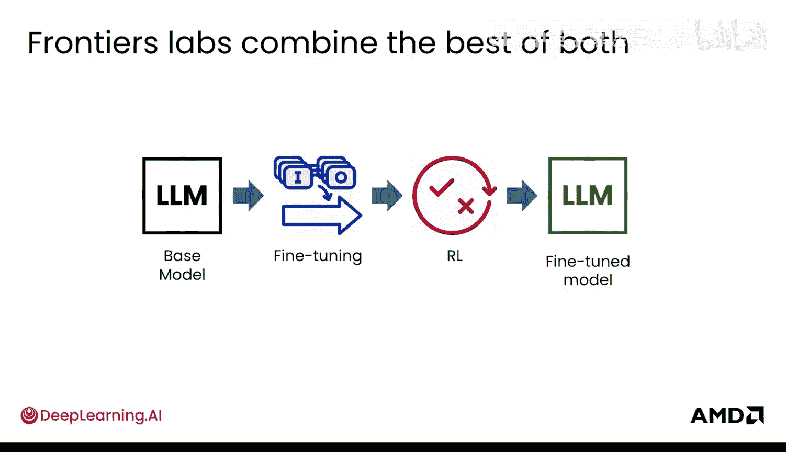
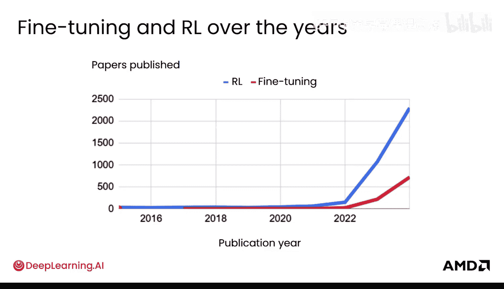

# 004：微调与强化学习的核心直觉 🍝

在本节课中，我们将要学习大型语言模型后训练中的两项关键技术：微调与强化学习。我们将通过一个有趣的“煮意面”例子，深入理解它们背后的核心直觉、区别与联系。

## 概述

微调与强化学习都是让预训练模型适应特定任务或提升表现的重要方法。理解它们如何工作以及何时使用，是有效应用大模型的关键。

## 微调 vs. 强化学习：核心区别

首先，我们通过一个具体例子来理解微调与强化学习的根本区别。

假设输入是：“如何煮意面？”

*   **在微调中**，模型的目标是使其输出与某个给定的“目标答案”完全匹配。
    *   **目标输出**可能是：“将盐水煮沸，加入意面，按照包装说明的时间煮。”
    *   模型会逐词尝试生成与目标匹配的序列：“将…（匹配）…盐水…（匹配）…煮沸…（匹配）”。它的核心任务是**精确模仿**给定的目标。

*   **在强化学习中**，模型输出的具体内容并不重要。
    *   模型可能输出：“把意面和盐放入沸水中，然后遵循包装指示。”这与目标措辞不同。
    *   关键在于，这个输出之后会被一个“评分器”评估，获得一个**奖励分数**。评分标准可能包括：回答是否有帮助、是否准确、是否安全等。
    *   模型通过这个最终的总奖励来学习其输出是好是坏。

## 直觉类比：向奶奶学做菜 🧓

为了更形象地理解，我们可以用一个类比来说明。

### 微调的直觉：步步模仿

**微调就像一步步观看奶奶做饭并模仿她。**

你的目标是精确复制奶奶做意面的每一个步骤。模型试图模仿奶奶在制作这道菜时的每一个具体动作。当然，最终做出的意面也应该是正确的，但整个过程的核心在于**对每一步的精确模仿**。

### 强化学习的直觉：只看结果

**强化学习则只关心最终做出正确的菜。**

中间步骤无关紧要，你可以做任何古怪的事情，比如把意面抛向空中。只要最终端出来的意面是正确的，你仍然会获得积极的奖励，被告知“做对了”。

这种机制能带来有趣的结果：
*   **积极面**：使模型能够学习到奶奶方法之外的新方式，甚至可能发现比奶奶的食谱更好的步骤。
*   **潜在问题**：模型可能会做一些奇怪的事情，并因为最终结果正确而认为那是正确的做法。

## 主要优势与特点

以下是两种方法的主要优势和特点对比。

### 微调的优势
*   **稳定可靠**：人们常说它“就是管用”。它能正确模仿数据中的步骤，理解所提供数据的整体分布，从而稳定地匹配目标输出。
*   **成熟高效**：技术发展时间更长，有更稳定的解决方案和更高效的实现方法，通常需要更少的计算资源。

### 强化学习的优势
*   **激发超常能力**：能够发展出近乎“超人”的能力，想出比我们要求它学习的步骤更好的解决方案，这非常强大。
*   **灵活性高**：不局限于固定的步骤，鼓励探索和创新。

## 需求与挑战

两种方法对资源的需求和面临的挑战也不同。

### 微调的需求
*   **需要高质量数据**：因为目标是模仿，所以提供的“目标输出”数据必须非常优质。
*   **需要预先准备数据**：有时大规模收集此类高质量数据比较困难，但这取决于具体领域。

### 强化学习的需求
*   **需要评分器**：它不需要“目标输出”数据，但需要一个好的“评分器”或方法来为模型的最终输出打分（奖励）。
*   **评分器是难点**：制作和调整一个好的评分器本身就很困难，并且可能存在被“钻空子”的风险。这是强化学习中最难做对的部分之一，也影响了其稳定性。
*   **计算成本高**：方法相对不稳定，通常需要投入大量的计算资源才能达到理想效果。

## 实践中的结合应用

前沿的实验室通常会结合两者的优点。

通常的流程是：一个预训练的基础模型首先通过**微调**来学习一些基本模式，然后通过**强化学习**来学习以自己（可能更好）的方式解决相同问题的额外方法，最终得到一个升级版的模型。

## 发展历程

微调与强化学习多年来都非常流行。下图展示了这两个领域发表的论文数量，可以看出强化学习（尤其是在语言模型中的应用）近年来热度显著上升。

（此处原为图表，示意强化学习论文数量增长趋势）

## 总结

本节课中，我们一起学习了微调与强化学习的核心直觉。
*   **微调**的核心是**数据**，它通过模仿优质的目标输出来学习。
*   **强化学习**的核心是**评分**，它通过最终结果的奖励信号来学习。

理解这两种范式的区别——一个是“过程导向”的精确模仿，另一个是“结果导向”的奖励驱动——将帮助你在不同场景下为模型选择最合适的后训练方法。下一节，我们将更深入地探讨使它们各自发挥作用的关键要素。