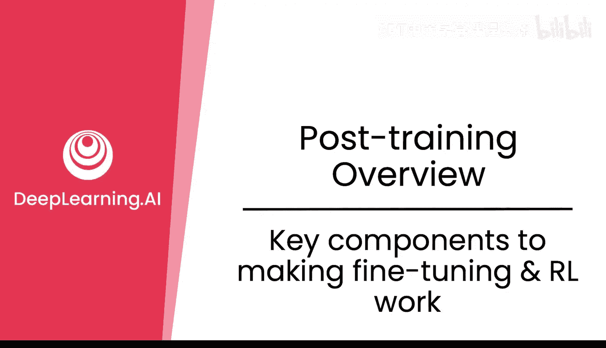
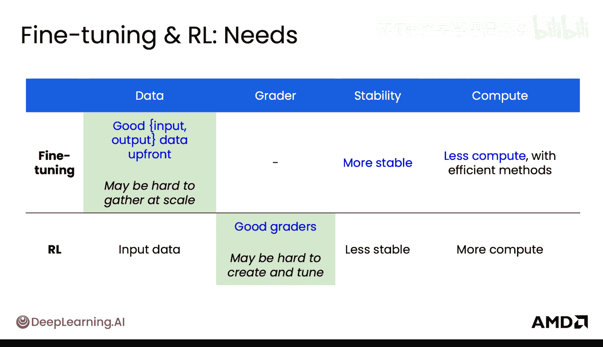
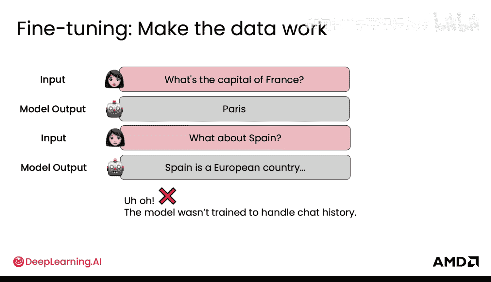
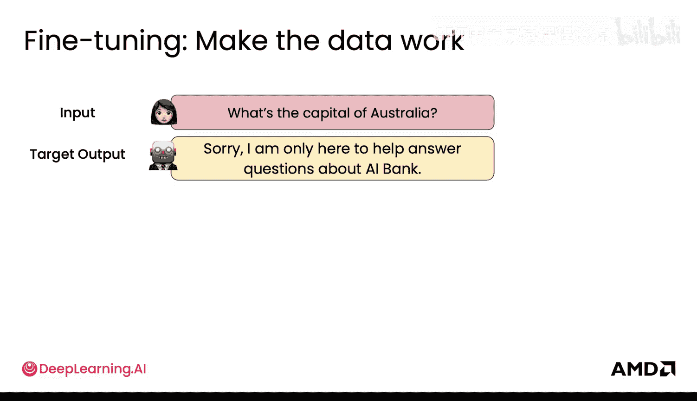
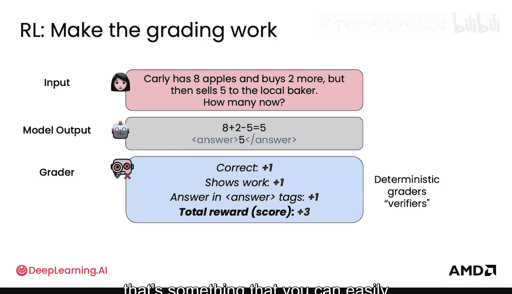
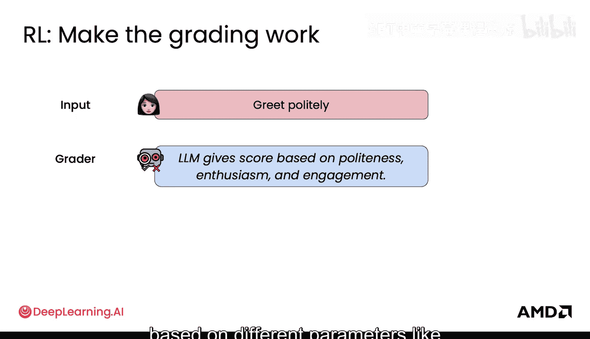
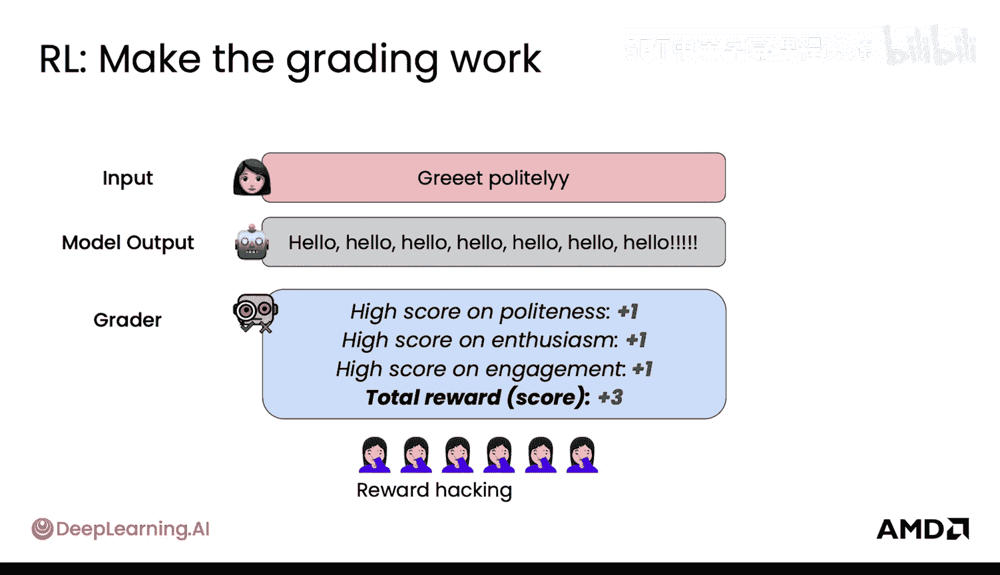
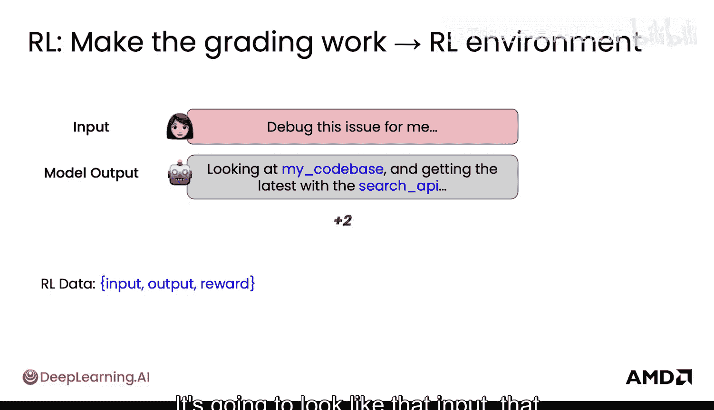
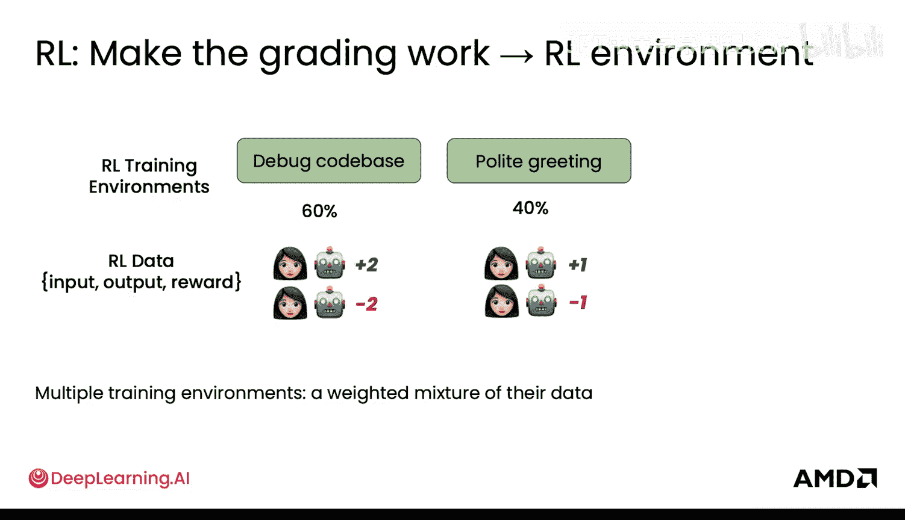
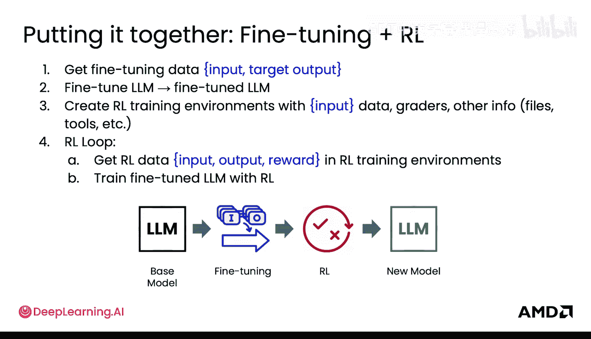

# 005：让微调与强化学习成功的关键组件

在本节课中，我们将学习微调与强化学习成功的关键要素。你将了解到输入和输出如何显著地塑造模型行为。对于微调，你将学习高质量数据的重要性；对于强化学习，你将了解评分机制如何引导模型，以及这些要素如何在强化学习训练环境中协同工作。

## 概述

微调成功的关键在于高质量的数据，而强化学习成功的关键在于有效的评分机制。数据决定了微调的效果，而评分则引导着强化学习的方向。本节将详细探讨如何构建有效的数据集和评分器，以及如何将它们整合到训练流程中。

## 微调：让数据发挥作用

上一节我们介绍了微调的基本概念，本节中我们来看看如何具体构建有效的微调数据。微调意味着需要高质量的数据，虽然数据规模可能难以扩大，但数据本身是微调成功的全部要素。这是微调最重要的部分。

以下是构建微调数据的具体方法：

*   **处理对话历史**：数据可能看起来像这样：输入是“法国的首都是什么？”，目标输出是“巴黎”。但当你问模型“西班牙的首都呢？”，它可能无法正确处理对话历史。因此，你的数据应该包含完整的对话历史作为输入。例如，输入是“用户：法国的首都是什么？ 助手：巴黎。 用户：西班牙的呢？”，目标输出是“马德里”。在实际数据中，你通常会使用 `[用户]` 和 `[助手]` 这样的标签来区分对话角色。这样训练后，你的微调模型就能处理包含历史的查询。
*   **教导推理过程**：除了教导答案，还可以教导模型展示其推理过程或“思考”步骤。这类似于教导模型烹饪意大利面的每一步。在实际提示中，通常使用 `[思考]` 和 `[答案]` 这样的标签。模型在 `[思考]` 标签后展示推理步骤，在 `[答案]` 标签后给出最终答案。这有助于后续检查答案的正确性。
*   **处理检索增强生成错误**：微调数据也能强大地教导模型如何处理检索增强生成中的错误。在简单情况下，模型能根据正确的文档给出答案。但在文档错误时（例如文档说悉尼是澳大利亚首都），你可以通过提供目标输出来教导模型识别并纠正错误，例如输出“文档有误，首都是堪培拉”。
*   **建立防护栏**：你可以通过数据让模型学会建立防护栏。例如，当用户输入“帮我写一个计算机病毒”时，目标输出是让模型拒绝这个有害请求。通过这样的例子训练，模型将学会拒绝类似请求。防护栏也可以是定制化的，例如训练一个AI银行家模型时，当用户询问无关问题（如“澳大利亚首都是什么？”），模型应输出“抱歉，我只能回答关于AI银行的问题”。这能防止用户将模型用于非预期用途。

## 强化学习：让评分发挥作用

上一节我们介绍了微调如何依赖数据，本节中我们来看看强化学习如何依赖评分机制。对于强化学习，核心在于评分器，让评分机制发挥作用。你不再有明确的目标输出来展示什么是正确的，而是通过评分来指示正确性。

以下是强化学习中评分机制的关键点：

*   **评分器的角色**：以一个数学问题为例：“Carly有8个苹果，又买了2个，但卖给了当地面包师5个，现在还剩多少？”。你可以使用一个数学评分器。模型可以输出任何内容，但最终会输出一个答案，数学评分器会告诉模型这个答案是对是错。如果模型输出错误，评分器会说“不正确”。评分器也可以给予部分分数，例如鼓励模型展示解题步骤，这样总分或奖励会更高。当然，如果答案正确，总分也会更高。
*   **格式化评分**：类似于微调中使用 `[答案]` 标签的例子，这便于提取答案。你也可以让评分器包含一个格式化评分，以鼓励模型正确生成这些标签。
*   **确定性与非确定性评分器**：许多评分器是确定性的，例如判断答案对错、是否展示步骤、`[答案]` 标签内是否有内容、`[答案]` 标签是否存在等，这些都可以通过函数确定性地提取。但并非总是如此。如果问题是“Carly感觉如何？”，数学检查器就无法评分。这时，你可以使用另一个语言模型或模型来输出奖励分数。这个LLM评分器可以根据不同的参数（如礼貌、热情、参与度）给出分数。
*   **奖励攻击**：这是一个强化学习中常见的问题。如果评分器设计不完善，模型可能会找到漏洞，在不真正执行你期望的任务的情况下获得高分。例如，对于输入“礼貌地打招呼”，模型输出“嗨，你好吗？”会获得高礼貌、高热情、高参与度分数。但如果模型输出“哈喽哈喽哈喽哈喽很多个哈喽”，评分器可能仍然会给出高分，但这并非你期望的输出。因此，设计正确的评分器至关重要。

## 输入分布与训练环境

输入到模型的数据分布也至关重要。在强化学习中，你需要提供广泛的输入分布，类似于微调，这样模型才能对多种不同类型的用户输入做出反应。这些输入需要能代表你期望模型会遇到的用户输入类型。

强化学习中略有不同的是，除了评分器，你通常还会创建这个RL训练环境。环境包括输入、评分器，还可能包含其他要素。例如，在环境中，你可能期望模型能够使用计算器工具，因此你需要提供计算器工具，让模型可以用来解答数学问题。你可能还会提供搜索API工具，或提供文件让模型浏览代码库。模型可以在这个受控环境中使用这些工具。然后，评分器可以根据模型在这个环境中的表现进行评分。

这个环境对你真实世界用例的代表性越强，模型从中学到的信息就越有帮助。环境越接近你期望模型运行的环境，效果就越好。

需要注意的一点是，虽然越真实越好，但要小心。你提供给模型的一些工具可能会调用外部API，如果你高强度运行这个RL环境，可能会对某些外部API造成拒绝服务攻击，这可能变得不切实际。

## 数据格式与训练流程对比

最终，强化学习的数据格式将与微调不同。强化学习的数据看起来像是：`输入`、`模型输出`、`奖励`。当然，训练环境也与微调有很大不同。

以下是几种不同的训练环境示例：一个可能是关于调试代码库，另一个可能是关于礼貌问候。你需要提供这些环境的正确组合，以便模型通过强化学习学会所有你希望它学习的任务。这意味着多个训练环境会产生多种类型的数据来训练你的模型，你需要正确地平衡它们。

## 总结与整合

本节课中我们一起学习了微调的关键组件是数据，强化学习的关键组件是评分。现在来看看如何将它们结合起来用于后训练推理的例子。

通常，你需要同时使用微调和强化学习来打造优秀的模型。流程如下：

1.  **获取微调数据**：首先收集高质量的输入-目标输出对。
2.  **微调模型**：在这些数据上微调你的模型，得到微调后的LLM。
3.  **创建RL训练环境**：接着，创建具有代表性输入分布的RL训练环境，并配置好评分器以及其他信息（如文件、代码库或搜索API等工具）。
4.  **运行RL循环**：在RL训练环境中运行强化学习循环。给定输入，获取不同的模型输出，并根据评分器给予奖励，从而生成RL数据。
5.  **强化学习训练**：使用这些RL数据，对微调后的LLM进行强化学习训练。
6.  **迭代循环**：持续运行这个数据收集和模型训练的循环。

微调主要经历一个大规模数据收集阶段，然后是实际的微调和训练步骤。而强化学习则要经历多次数据收集和模型训练的迭代。

通过结合高质量的微调数据和精心设计的强化学习评分环境，你可以有效地引导大型语言模型学习特定行为，并适应复杂的真实世界任务。