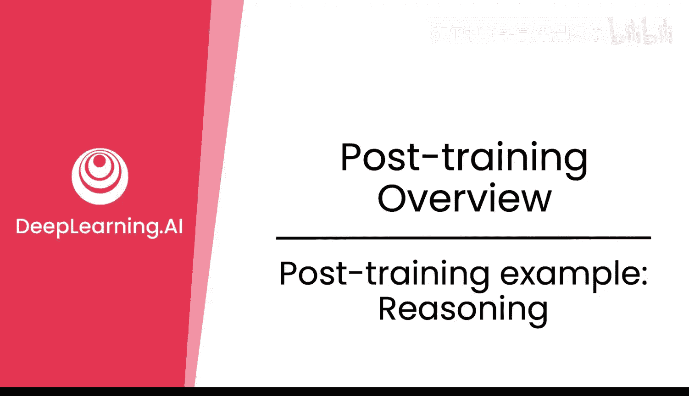
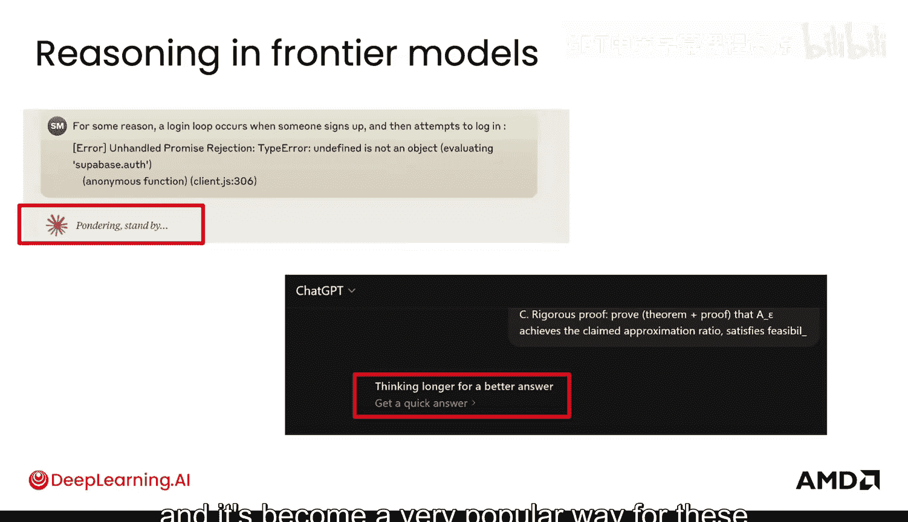
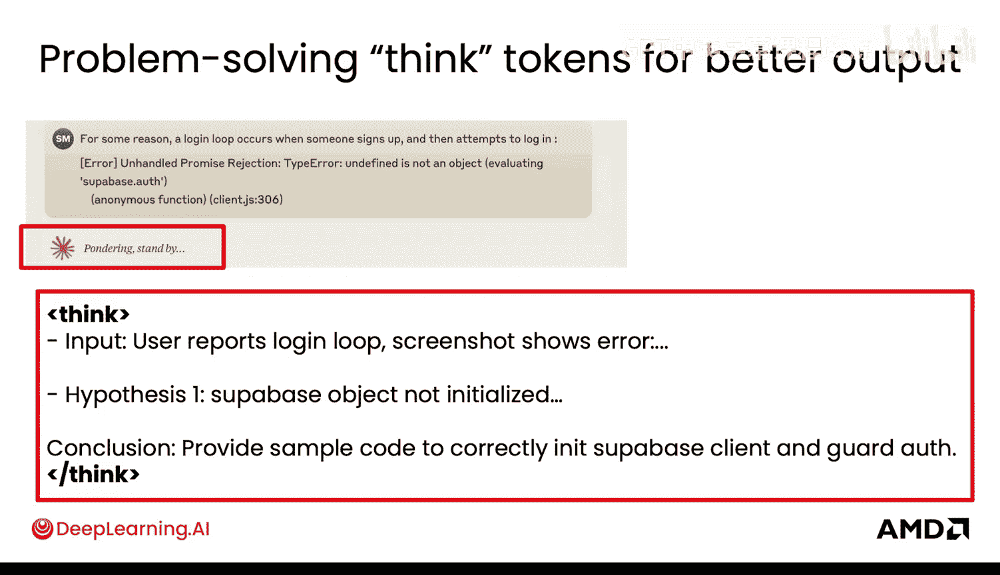
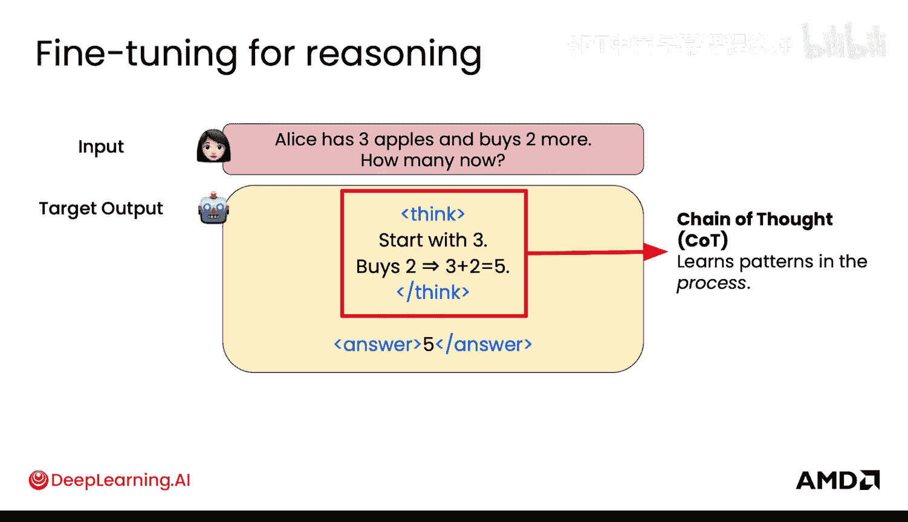
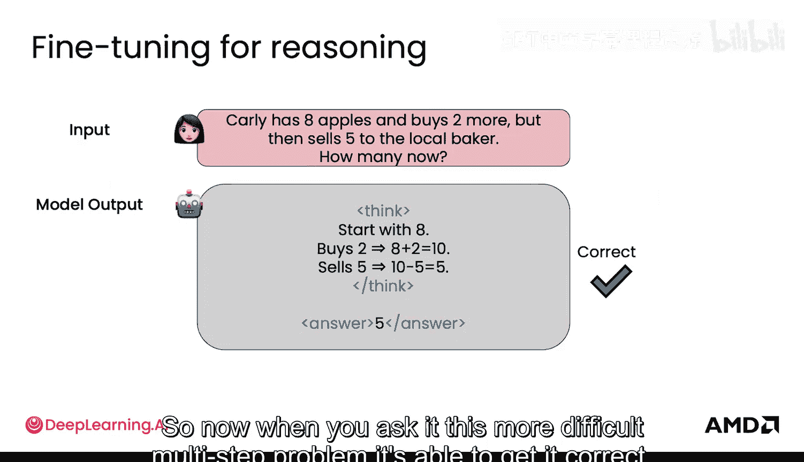
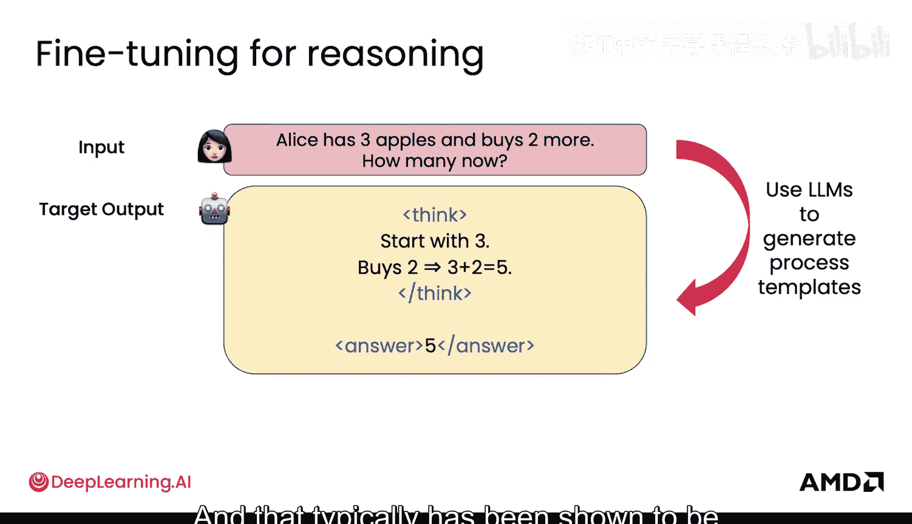
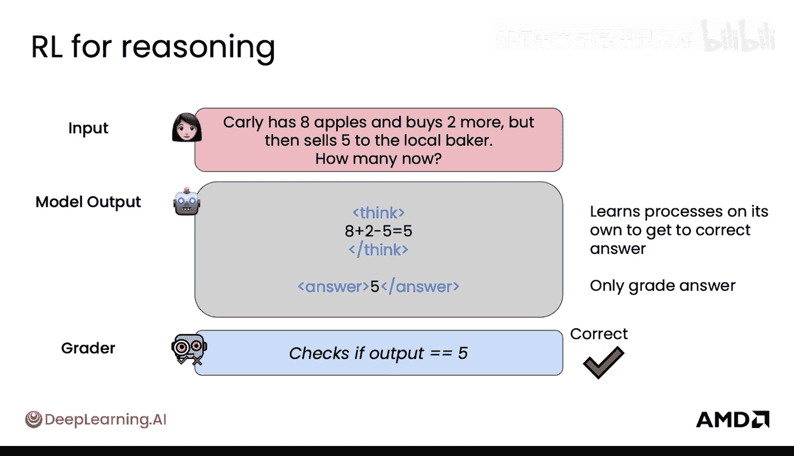
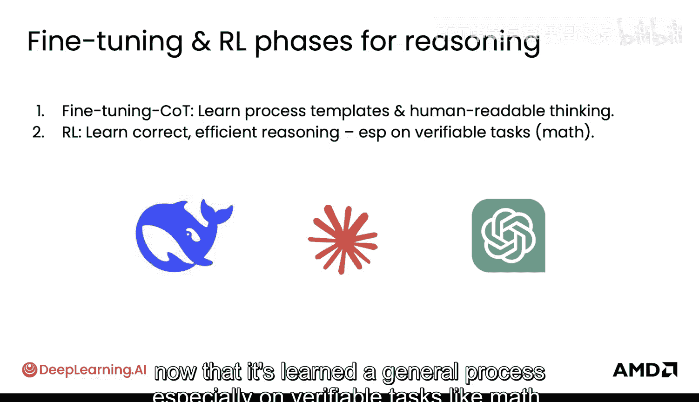
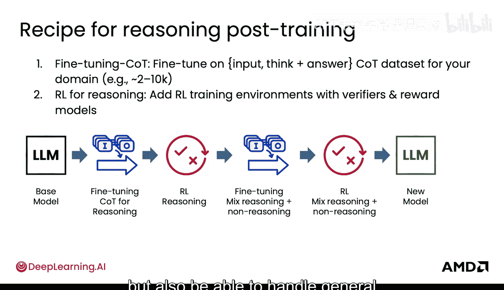

# 006：后训练示例 - 推理能力

在本节课中，我们将要学习如何通过微调与强化学习来提升大型语言模型的推理能力。推理能力是前沿模型（如ChatGPT、Claude等）的核心特性之一，它使得模型能够“思考”并生成更准确的答案。我们将通过具体的数学问题示例，拆解微调和强化学习在训练模型进行有效推理时所扮演的角色。

## 概述：推理能力的重要性 🧠

推理能力在前沿模型中已经得到了显著发展。正是微调和强化学习技术使得这些模型具备了真正的推理能力。

你可能在ChatGPT中见过“思考更久以获得更好答案”的提示，或在Claude中见过“沉思中”的待机状态。基本上，在前沿模型中，你会看到一些类似的小提示，表明模型正在“思考”。这就是这些不同前沿模型中的推理过程，它已成为模型生成更佳答案的一种非常流行的方法。

在这些“推理”标签背后，实际发生的是模型在输出**思维令牌**。本质上，模型正在输出不同的假设，得出不同的结论，以便更准确地回答你的问题。为了实现这一点，模型使用了后训练技术，包括微调和强化学习。接下来，你将学习如何通过针对推理的微调和强化学习，有效地让模型做到这一点。

## 微调用于推理 🔧

上一节我们介绍了推理能力的重要性，本节中我们来看看如何通过微调来具体提升这种能力。

对于微调，具体是什么样子呢？首先，你可以有一个输入，其中包含一个数学问题，以及一个仅包含答案的目标输出。这看起来是正确的，模型学习了类似数学问题的模式和答案，这很好。

但是，当你尝试解决一个更复杂的数学问题时，模型可能会显得有些脆弱。它只是根据先前答案的模式来猜测答案，这并不完全是你希望它做的。

因此，你可以做的是，教给它一个略有不同的目标输出，这个输出实际上包含了**推理过程**，即一步一步的步骤。通常，我们会把这些步骤放入`<think>`这样的“思考”标签中。这样，模型实际上是在“思考”这些不同的步骤，然后给出一个`<answer>`标签中的答案。这被称为**思维链**。

这个思考部分被称为思维链，它学习的是**过程**中的模式，而不仅仅是答案中的模式。这一点非常重要，因为它帮助模型更有效地进行推理。

现在，当你向它提出这个更困难的多步骤问题时，它就能够正确解答。本质上，你可以使用LLM来帮助生成这些过程模板，然后将其用于推理的微调。这是非常强大的，你也可以大规模扩展这种方法。这通常被证明在让模型更有效地推理方面非常有效。

## 强化学习用于推理 🏆

我们已经了解了微调如何通过思维链教会模型推理过程。现在，让我们转向强化学习，看看它如何以不同的方式提升推理能力。

对于强化学习用于推理，它是什么样子呢？你可以有同样的数学问题，但这里你会有一个数学检查器。在这种情况下，它将检查输出是否正确。如果输出是5，而答案也是5，那么它就是正确的。

强化学习有趣的地方在于，只要答案正确，`<think>`标签里发生什么并不重要。它可以是任何内容。它可以是“Carly Carly Carly how about that with Apple”，里面可能有点疯狂，但它仍然能得到正确答案。它能够输出冰岛语、蒙古语，并用拉丁语做数学，仍然能得到正确答案。

这对于人类来说可能更难理解，但模型实际上能够学会这种解决数学问题的新方法并得到正确答案。最终，我们仍然给予它正确的奖励。它还可以学会比人类展示的更好的方法，或者学会更高效的方法，就像这里展示的，比仅针对特定冗长过程和步骤进行微调的模型更高效。这确实非常强大。

为了更深入地理解这一点，我发现DeepSeek-R1模型非常有趣。这个DeepSeek-R1模型仅通过强化学习就学会了推理，没有任何微调。它只使用了这些类型的数学检查器和格式检查器（用来检查那些`<think>`标签是否存在）。它确实只使用了非常简单的模型评分方式，但模型表现得相当好。

然而，它也遇到了一些挑战，例如大量的无休止重复、可读性差以及语言混合问题。因此，最终对于这些前沿模型，它们通常进行两个阶段：第一阶段是微调阶段，通常使用思维链来学习过程模板和人类可读的思考（例如，不混合语言）；第二阶段是强化学习步骤，在模型已经学会一般过程的基础上，学习正确且高效的推理方法，特别是在数学等可验证的任务上。

## 实际训练配方 📋

上一节我们分别探讨了微调和强化学习在推理中的作用，本节我们来看看它们在实际中如何结合成一个完整的训练流程。

实际上，这看起来像一个这样的配方：首先，你拥有用于思维链微调的数据，并在此基础上进行微调（可能需要2千到1万个示例）。然后，你进行用于推理的强化学习，这时你会添加那些带有验证器的强化学习训练环境，通常还包括**奖励模型**——这些模型学习超越简单验证检查的奖励。

对于前沿模型，通常会有多轮这样的过程。所以，你会先进行仅针对推理的微调，然后进行推理强化学习，接着再进行另一轮微调和另一轮强化学习。你会看到，在这个特定模型（DeepSeek-R1）的最后几轮中，你会混合推理和非推理能力，这样你最终得到的模型既能够处理数学和编码等推理任务，也能够与人类进行一般的对话和交流。

## 总结 ✨

本节课中我们一起学习了如何通过微调与强化学习来赋予大型语言模型强大的推理能力。

我们了解到，**微调**通过提供带有`<think>`和`<answer>`标签的**思维链**数据，教会模型一步一步的推理过程，使其能够解决复杂问题。而**强化学习**则通过奖励正确的最终答案，允许模型探索更高效、甚至人类难以理解的推理路径，从而优化推理过程。在实际应用中，前沿模型通常结合这两种方法，先通过微调建立基础的、人类可读的推理模式，再通过强化学习进行优化和效率提升，并经过多轮迭代，最终得到一个既能熟练推理又能自然对话的强大模型。