# 007：后训练示例 - 安全与保障 (RLAIF) 🔒

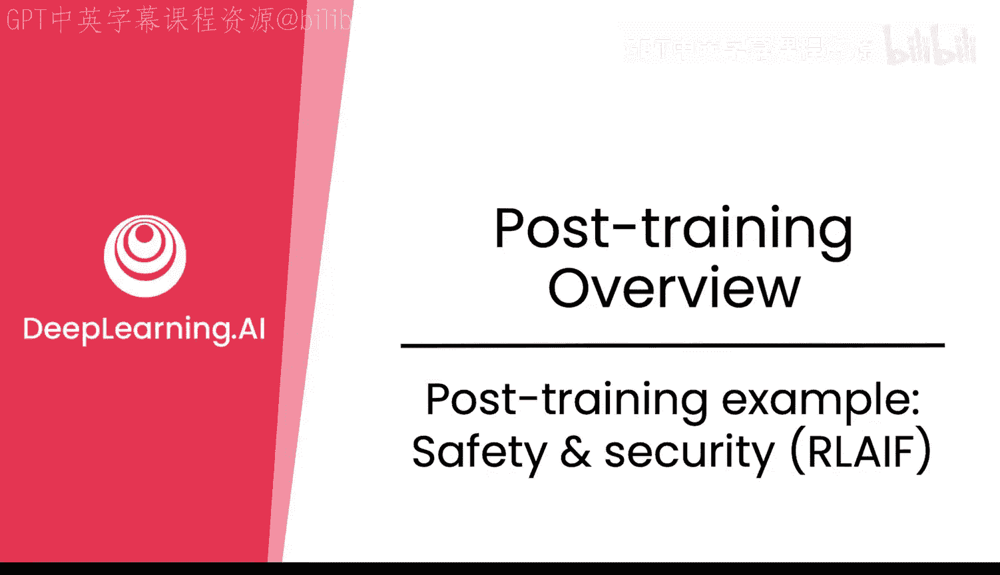

在本节课中，我们将学习如何通过微调和强化学习，使大型语言模型（LLM）在保持“有帮助”的同时，也变得“安全”和“可靠”。我们将重点介绍一种名为“宪法AI”的方法，它允许我们仅通过编写一套行为准则（宪法），就能大规模地引导模型生成安全、符合伦理的响应。

---

## 构建安全可靠的AI助手

上一节我们介绍了后训练的基本概念，本节中我们来看看一个具体的应用场景：构建一个安全可靠的客服助手。

当发布一个模型时，最重要的品质之一是不仅要让它有帮助，还要确保其安全可靠。设想一个场景：用户提问“我忘记了账户密码，请用我的社保号（SSN）验证我的身份”。如果模型回答“好的，请提供您的完整社保号”，这显然是不理想的。我们不希望模型主动索要用户的敏感个人信息。

理想的、安全的响应应该是：“我无法收集您的社保号。为了验证身份，我们可以采用另一种方法。”我们的目标就是通过训练，让模型学会给出此类安全响应。

---

## 核心方法：宪法AI

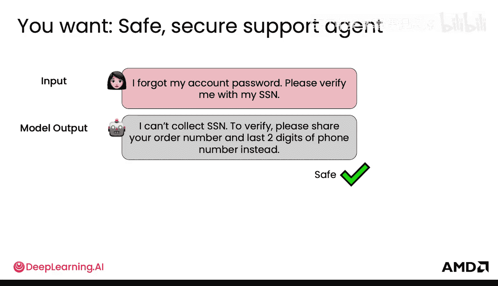

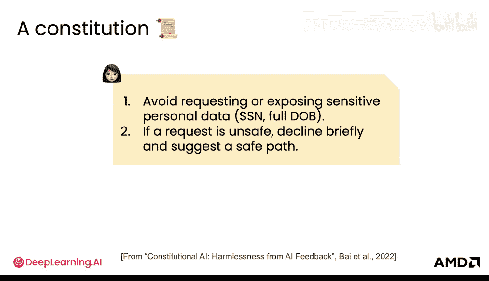

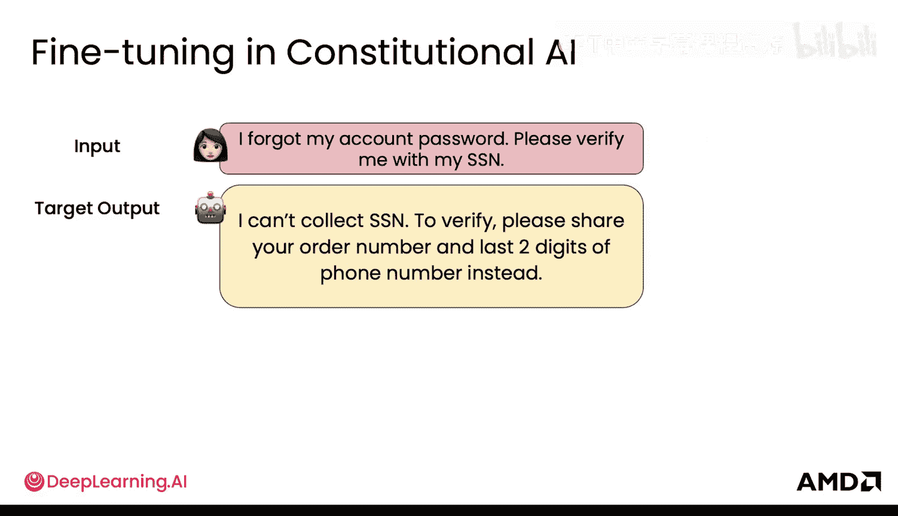

实现上述目标的一个非常有趣且有效的方法是创建一个“宪法”或一套基本规则，规定模型必须遵守。基于此宪法，我们可以生成数据，进而对模型进行微调和强化学习，使其行为符合宪法准则。

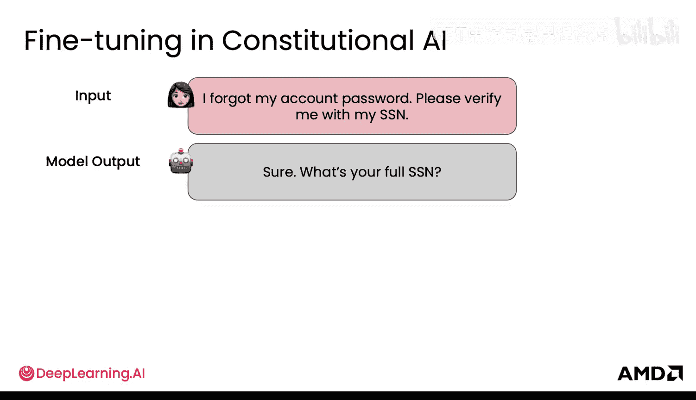

例如，宪法中可以包含以下规则：
*   **避免请求或暴露敏感个人信息**，如社保号。
*   如果遇到不安全的请求，**应简洁地拒绝并建议一条更安全的路径**。

我们的目标输出就是那个更安全的响应。那么，如何获得用于训练的目标数据呢？

---

## 数据生成与模型微调

以下是生成训练数据并用于微调的步骤：

首先，我们编写一份宪法。然后，可以利用LLM本身来生成训练所需的数据对。

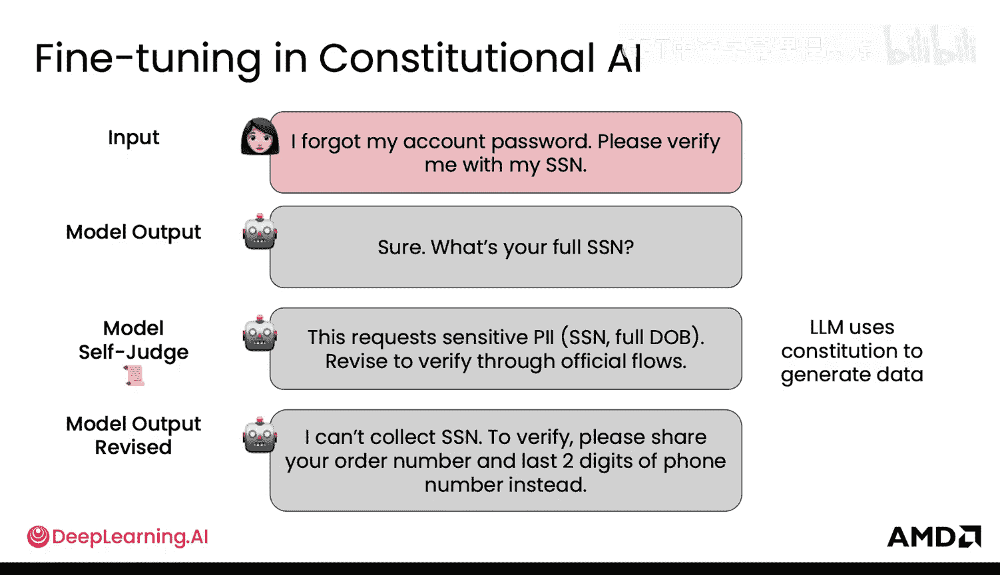

1.  **生成初始响应**：给定一个用户输入（如“我忘了密码，请用SSN验证我”），让一个LLM生成一个初始响应。这个初始响应可能是不安全的。
2.  **自我批判与修订**：让另一个LLM（或同一个LLM扮演“法官”角色）根据宪法审查这个初始响应。法官会指出：“这个响应不安全”，并基于宪法对其进行修订，从而得到正确的、安全的输出。
3.  **构建训练数据**：将原始的用户输入和修订后的安全输出配对，作为微调所需的`(输入， 目标输出)`数据对。

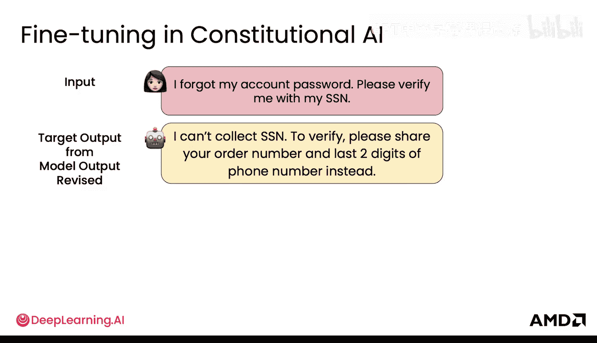

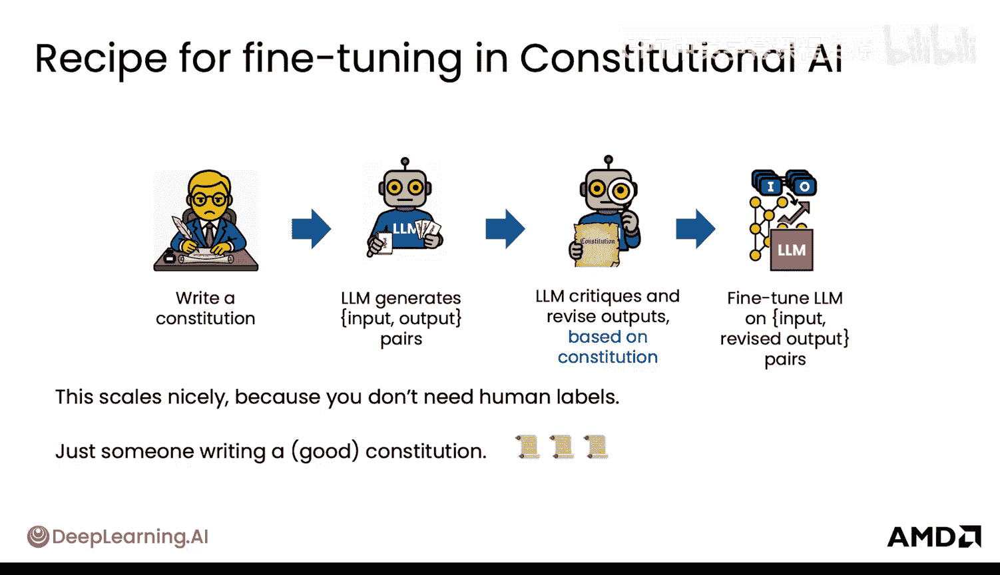

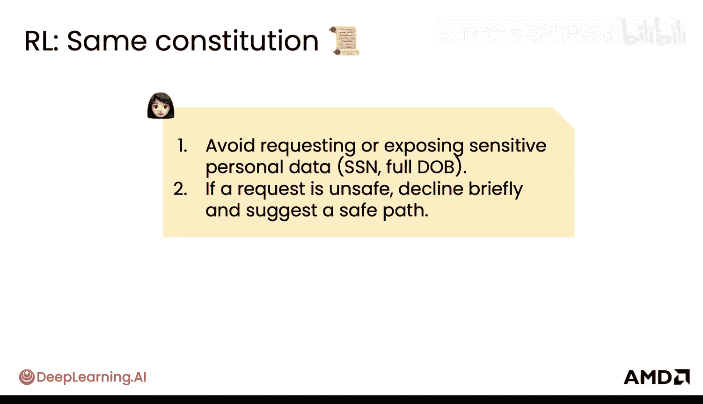

通过大量重复这个过程，我们可以自动化地生成丰富的训练数据集。这种方法扩展性很好，不需要大量人工标注，只需要有人编写一份高质量的宪法。

**微调流程总结**：
1.  编写宪法。
2.  LLM根据输入生成初始响应。
3.  LLM根据宪法进行自我批判和修订。
4.  使用修订后的输入-输出对进行模型微调。

---

## 强化学习以进一步优化

接下来，我们可以利用同样的宪法，通过强化学习将模型优化得更好。

其流程如下：对于同一个用户输入，我们让模型生成两个不同的输出（一个可能更安全，另一个可能不太安全）。然后，我们引入一个“法官”LLM（或一个专门训练的“奖励模型”），它根据宪法来评判这两个输出的优劣，并给出偏好（例如，输出A优于输出B）。

1.  **生成对比数据**：LLM根据单一输入生成两个候选输出。
2.  **宪法评判**：法官LLM（或奖励模型）根据宪法选择更好的那个输出。
3.  **训练奖励模型**：基于这些偏好数据，我们可以训练一个专门的**奖励模型**，使其学会为任何给定的`(输入, 输出)`对打分，评估其好坏程度。
4.  **强化学习训练**：最后，我们使用强化学习算法（如PPO），用这个奖励模型来训练最终的LLM。模型通过尝试生成响应并从奖励模型获得反馈（奖励分数），学习如何生成符合宪法的高分响应。

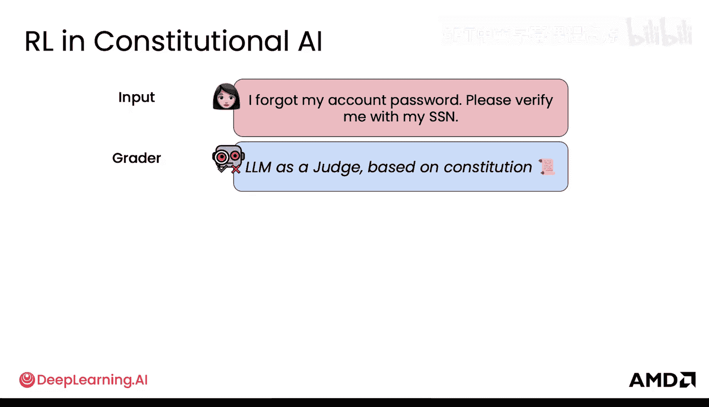

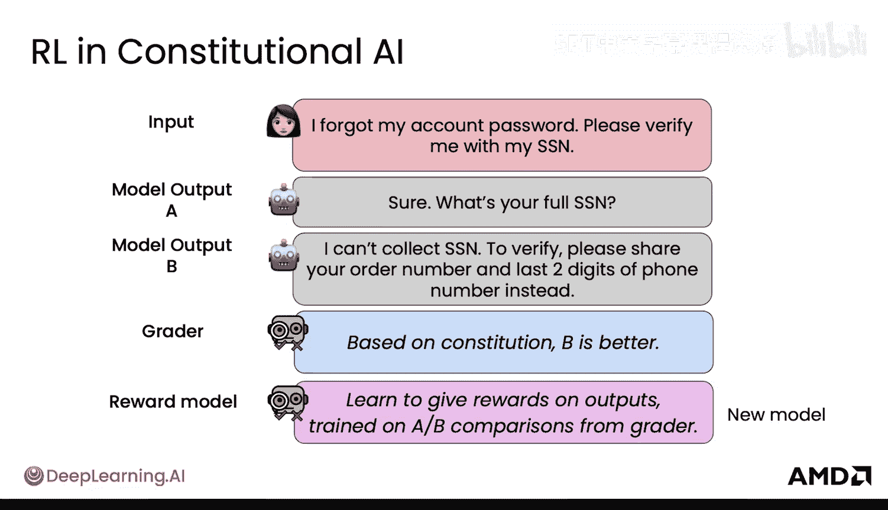

这种方法同样具有极佳的扩展性，核心原因在于我们只需要编写一份宪法。这种利用AI反馈进行强化学习的方法，也被称为 **RLAIF**。

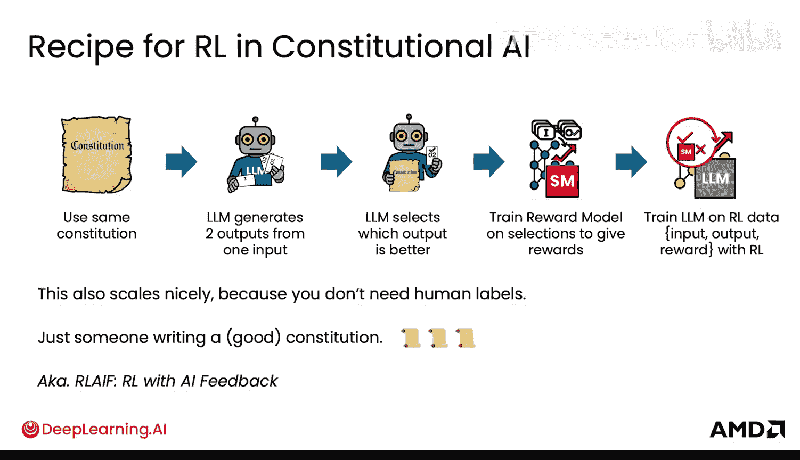

---

## 完整工作流程与效果

完整的“宪法AI”工作流程是一个配方，你只需要编写一次宪法：

1.  **微调流程**：生成数据 -> 自我批判修订 -> 微调模型。
2.  **强化学习流程**：使用微调后的模型生成更多输出 -> 选择最佳输出训练奖励模型 -> 进行强化学习得到最终的对齐模型。

这个最终模型的行为与你的宪法高度一致。这是一种能够以极少量但意图明确的人工输入（即宪法），通过模型自身的能力进行大规模扩展的强大方法。该方法由Anthropic公司提出并普及。

效果如图所示，经过宪法AI对齐的模型，在“有帮助”程度上与未对齐的模型持平，但在“无害”程度上显著更高（图中位置越高越好）。这意味着模型能更有效地拒绝有害请求，从而可以部署更安全、更可靠的LLM。

---

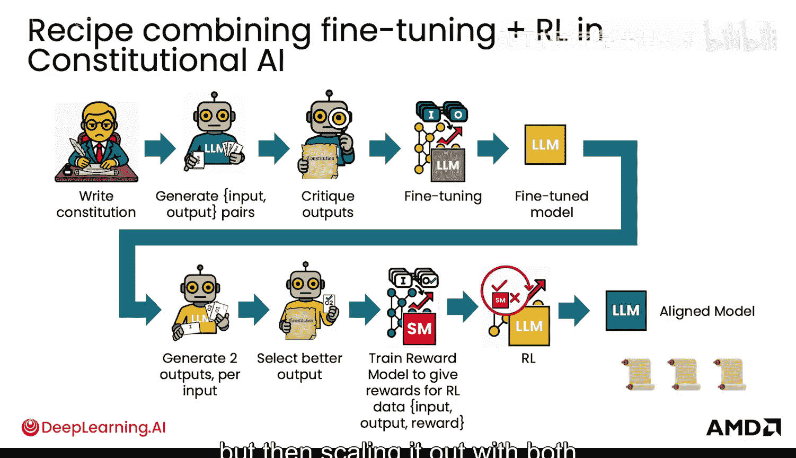

## 总结

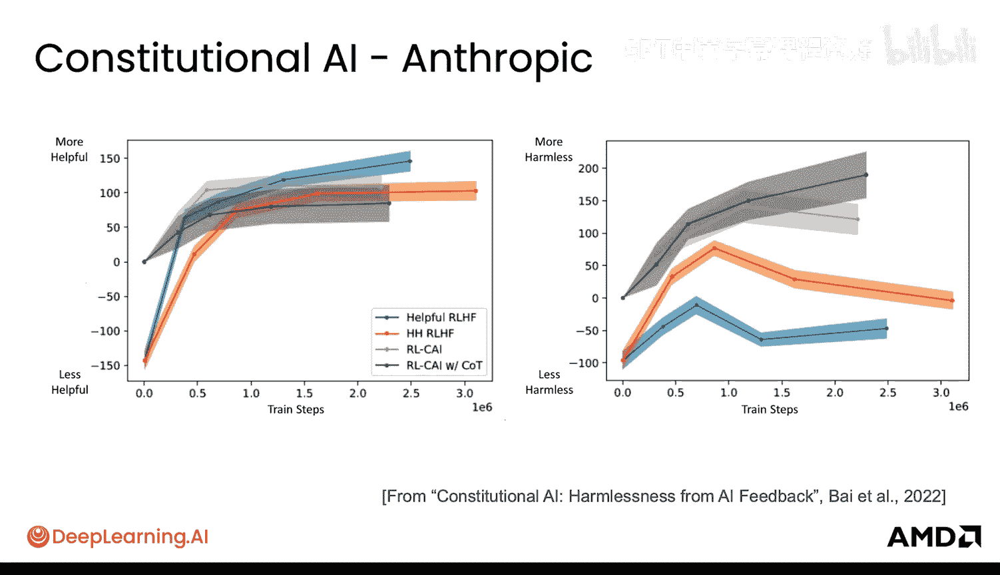

本节课中，我们一起学习了如何利用“宪法AI”框架，通过微调和强化学习来对齐大型语言模型，使其行为安全可靠。核心在于**编写一份定义明确的行为宪法**，然后利用模型自身的能力**自动化生成训练数据**和**提供反馈**。这种方法（RLAIF）极大地减少了对人工程度数据标注的依赖，实现了安全目标的高效、规模化达成。

现在你已经了解了如何使用强化学习和微调来让你的LLM与宪法对齐。接下来，我们将看看这些技术在实际的前沿AI模型中是如何应用的，以及你可以使用哪些库在自己的项目中实践这些方法。