# 008：真实世界中的后训练实践 🚀

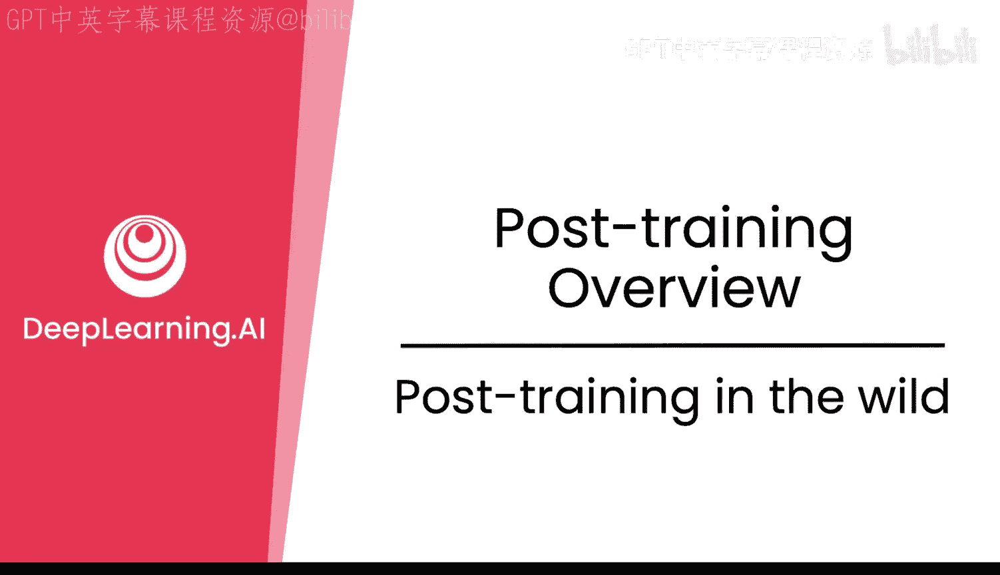

在本节课中，我们将学习前沿研究实验室如何将微调与强化学习技术结合起来，构建出强大的语言模型。我们将通过分析DeepSeek R1、Qwen和Llama等知名模型的训练流程，了解后训练在真实世界中的复杂迭代过程，并探讨如何利用开源模型进行你自己的后训练项目。

## 前沿模型的组合策略 🔄

上一节我们介绍了微调和强化学习的基本概念，本节中我们来看看前沿实验室如何精确地使用并将它们组合在一起，形成一个完整的训练流程。

前沿实验室会结合微调和强化学习两者的优势，多次迭代使用这两种技术，以获得性能更优的模型。为了深入理解具体的模型后训练过程，我们可以以DeepSeek R1为例进行分析。

## DeepSeek R1的迭代流程 📈

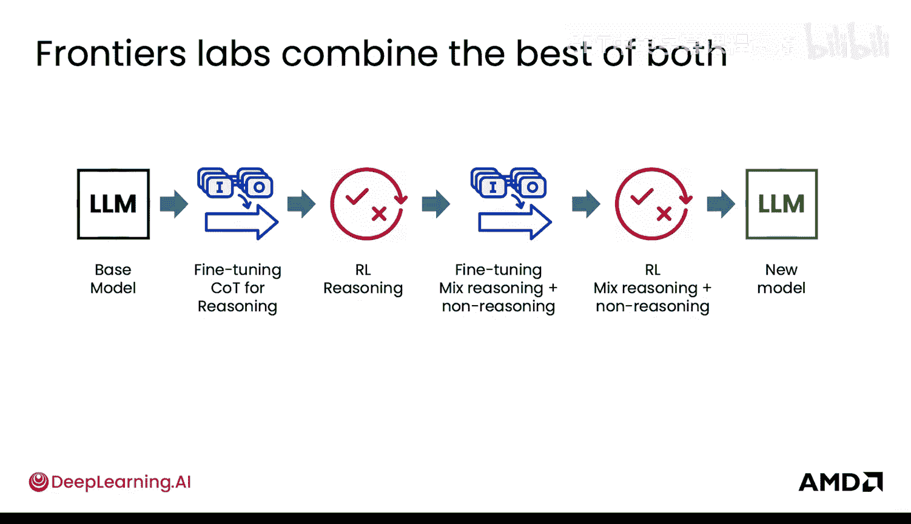

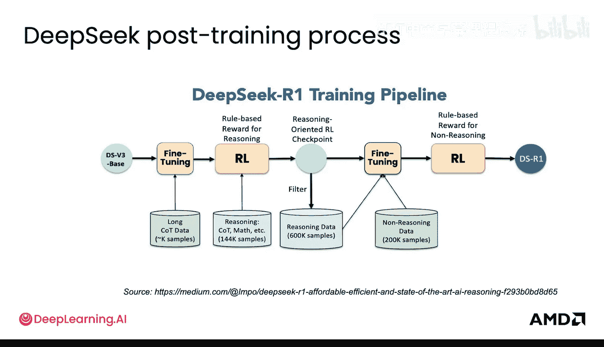

以下是DeepSeek R1模型的构建步骤：

1.  **获取基础模型**：首先，他们使用预训练好的基础模型。
2.  **思维链微调**：在长思维链数据上进行微调。
3.  **推理强化学习**：在微调后的模型基础上，针对推理任务进行强化学习。
4.  **数据生成与再训练**：使用该模型生成更多推理数据，将其与非推理数据混合。
5.  **再次微调**：在新混合的数据集上再次进行微调。
6.  **最终强化学习**：在最新模型上进行强化学习，最终得到DeepSeek R1模型。

可以看到，这个过程比单步操作更为复杂。模型在不同检查点的输出可以被用来为下一个检查点生成训练数据。

## 其他模型的实践案例 🏗️

Qwen模型同样多次使用了微调和强化学习。其流程可以概括为：基础模型 -> 思维链微调 -> 强化学习 -> 再次微调 -> 通用强化学习，最终得到Qwen模型。

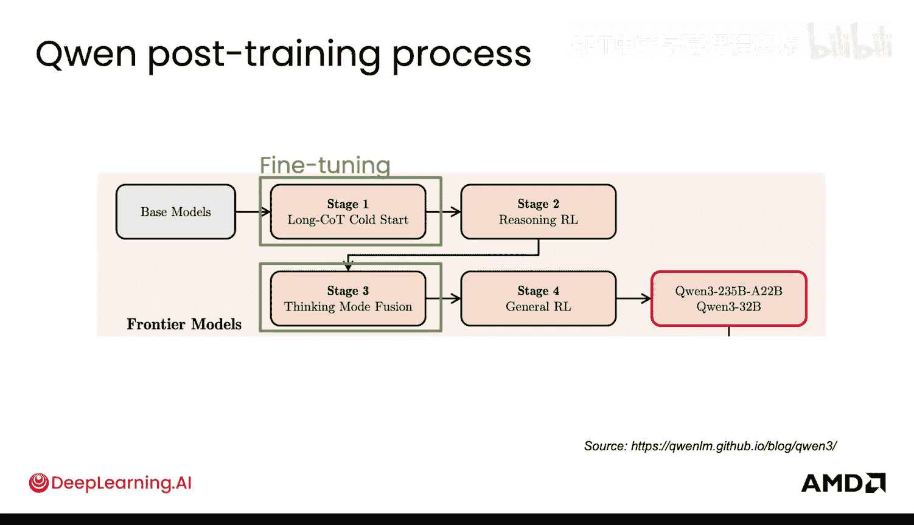

Llama模型也采用了多步的监督微调和强化学习。这里，SFT代表监督微调，即我们之前讨论的针对语言模型的微调类型。一个有趣的现象是，强化学习中使用的奖励模型也辅助了一个称为“拒绝采样”的过程。该过程让模型生成大量数据，然后只挑选出最好的样本，用于下游的高质量微调数据。接着，模型会针对特定能力进行微调，并使用如DPO等算法进行强化学习。最佳模型会被选出，并用于持续优化整个数据微调流程。这是一个高度迭代的过程，而非简单的一步微调、一步强化学习。

## 后训练的应用场景与后续步骤 🌍

了解了后训练如何融入整体流程。我们已经看过预训练、中期训练，以及之后的**后训练**。

后训练完成的模型可以部署到托管API（如ChatGPT或Claude），也可以开源，例如DeepSeek R1或Qwen模型。在这之上，便是构建智能体、实现RAG以及开发SaaS应用的阶段。

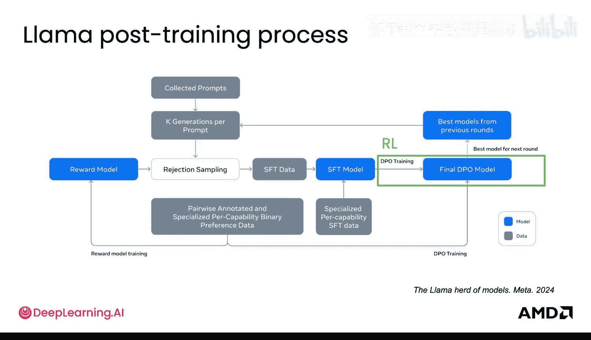

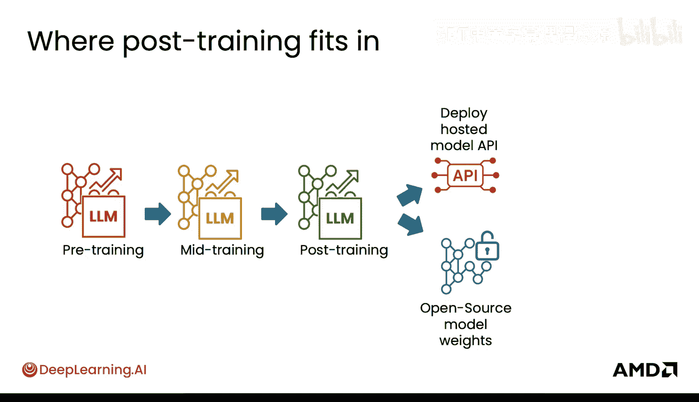

在获得开源模型后，你可以持续进行后训练。你可以在模型上不断地进行微调和强化学习，这些步骤并不一定需要是原始后训练流程的一部分。这正是开源社区正在做的事情。

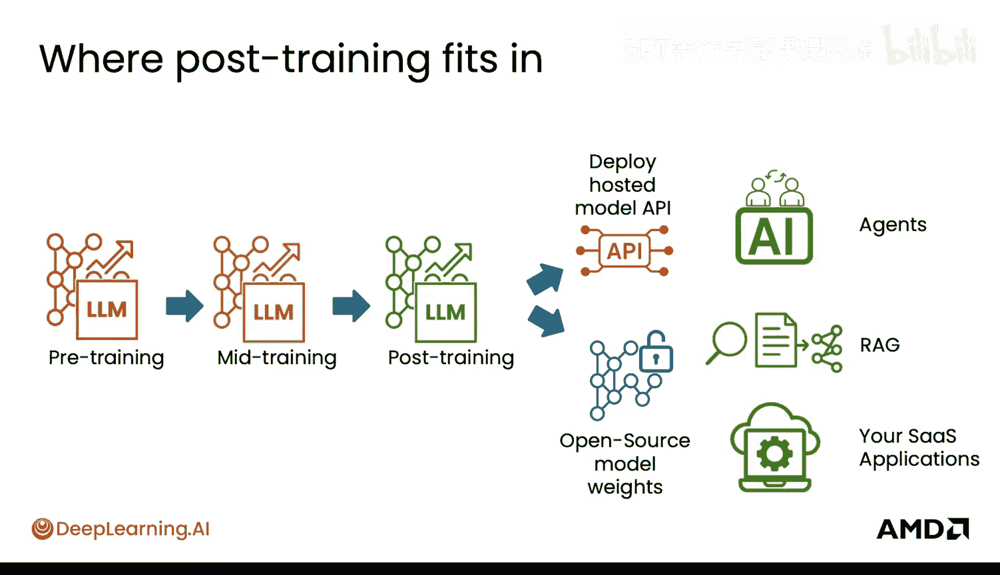

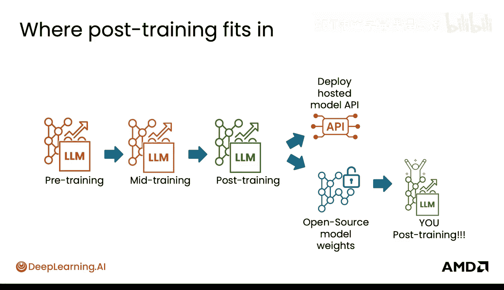

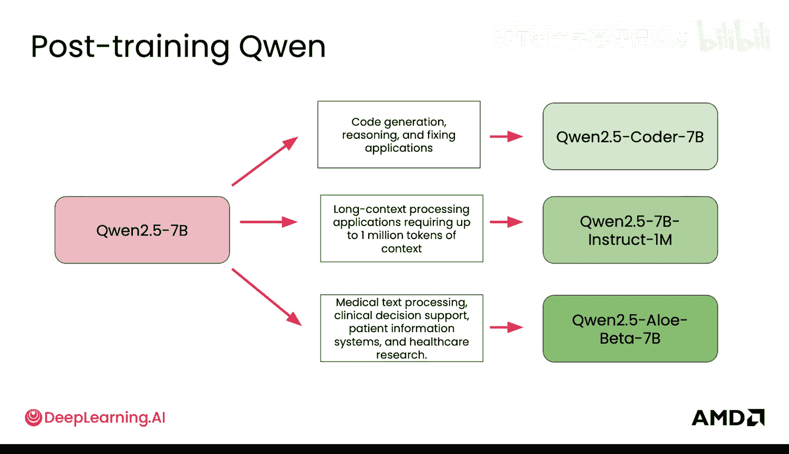

社区以Qwen等模型为基础，进一步进行了后训练，例如用于代码生成、支持百万token的超长上下文处理、医疗文本处理等。社区对Llama的各种变体模型表现出了极大的热情。

下图展示了Llama变体模型的丰富生态。当像Meta这样的公司发布Llama这样的开源模型时，整个社区会参与进来，将其分叉成各种不同的变体。你可以使用许多库来自己完成这项工作，从而开始贡献你自己的变体模型。你将在实验环节看到其中一些模型。

## 后训练的重要性与灵活性 ⚙️

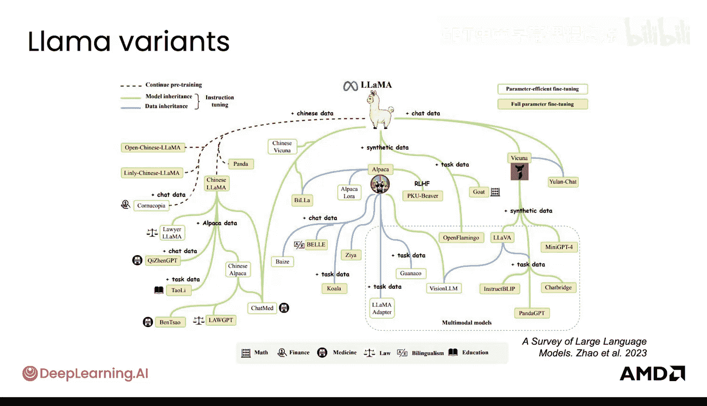

最后，这是属于你的后训练。这一点至关重要：你能够获取这些模型，并根据你的需求调整其行为。当然，调整的幅度可以很大（需要重型计算资源），也可以很轻量（例如在你的本地机器或AI PC上完成）。你将在接下来的模块中探索这些可能性。

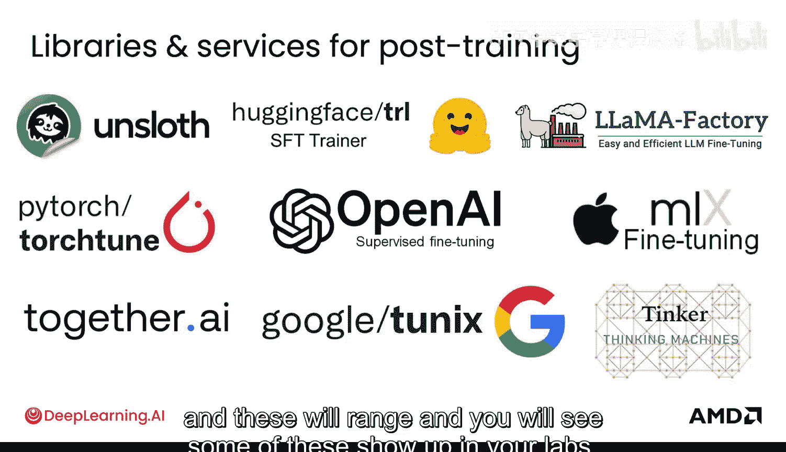

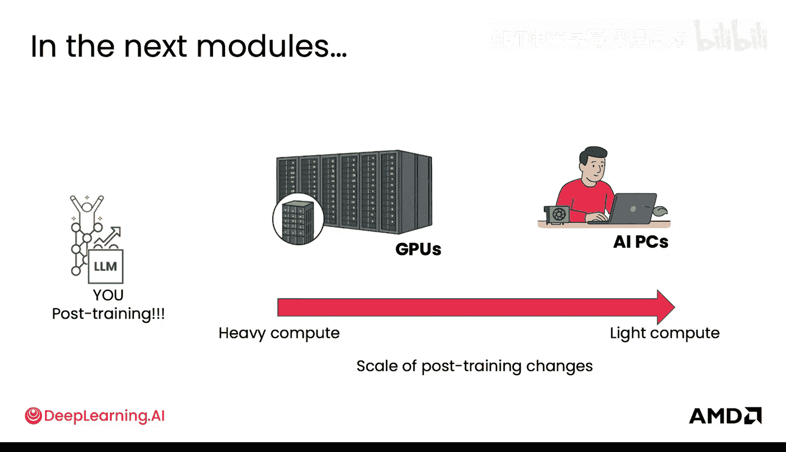

## 总结与展望 🎯

本节课中我们一起学习了强大的后训练技术（如微调和强化学习）如何工作、其背后的原理，以及它们如何共同塑造前沿模型。接下来，你将深入探讨每一项技术的工作原理、背后的精确数学原理，以及它们如何真正地塑造模型行为。