# 009：数据需求与准备方法 📊

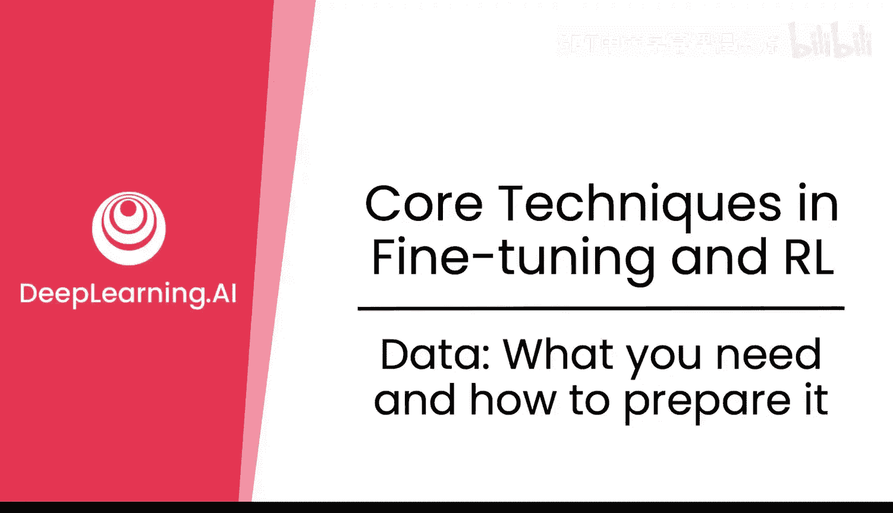

在本节课中，我们将要学习后训练阶段所需的数据类型、如何准备这些数据，以及如何通过正确的数据划分来避免数据泄露，从而确保最终模型的可靠性与泛化能力。数据是后训练（包括微调和强化学习）最重要的基石之一。

## 数据概览

上一节我们介绍了后训练的重要性，本节中我们来看看其核心燃料——数据。无论是微调还是强化学习，数据都至关重要。我们先概览两种方法所需的数据，然后探讨如何防止不同数据划分之间的泄露，以确保最终可以信任你的大语言模型的表现。

毫不夸张地说，后训练的成败很大程度上取决于你的数据。数据至关重要。

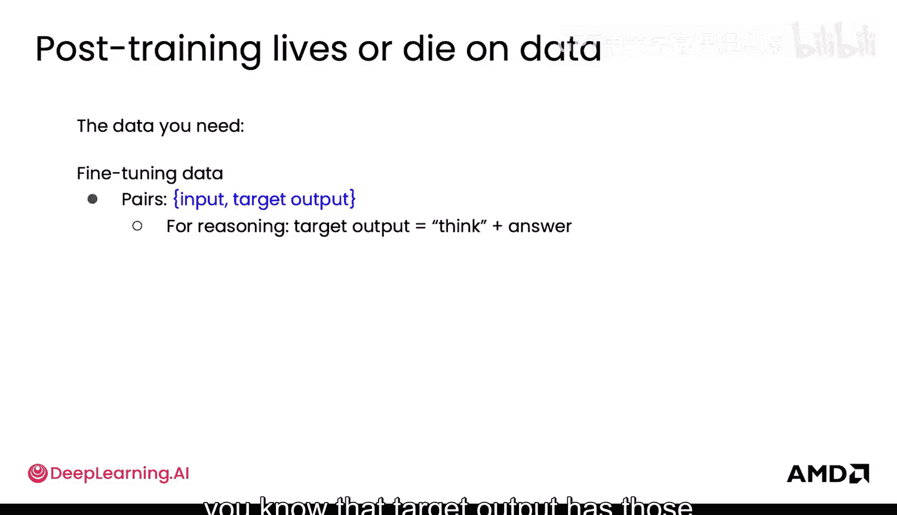

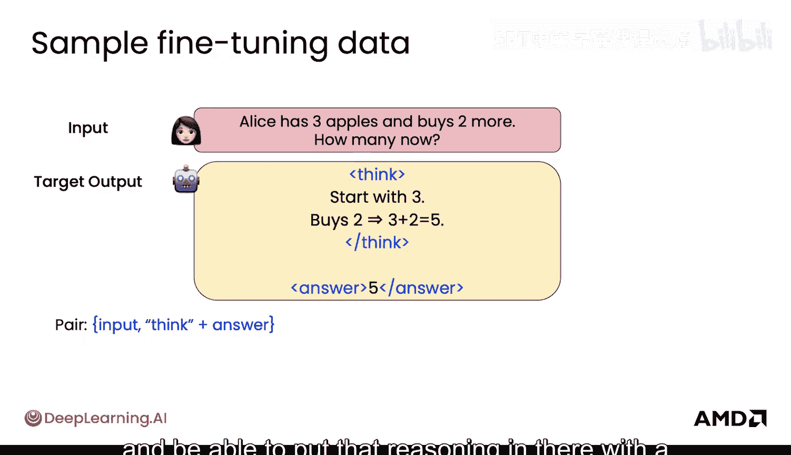

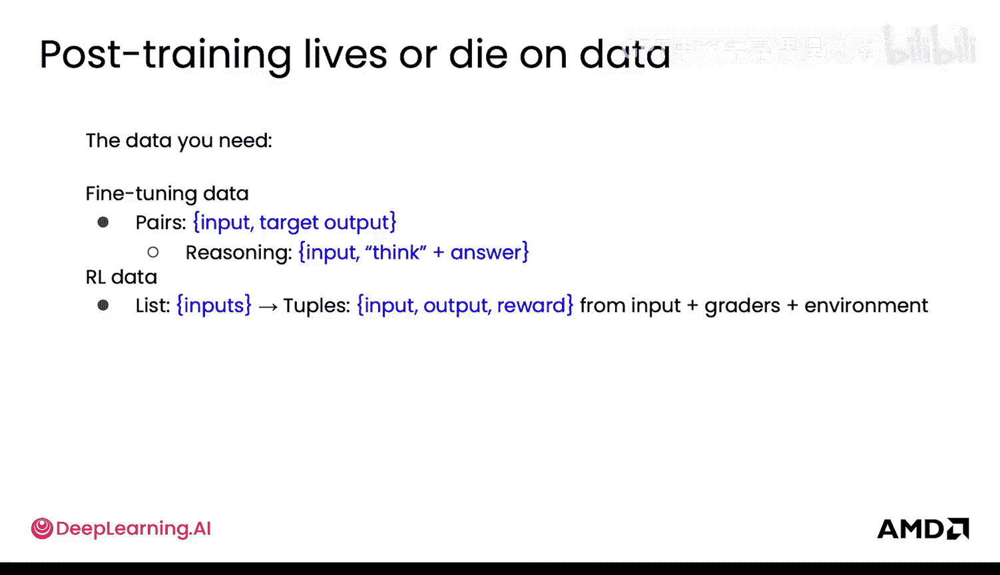

### 微调数据

对于微调，数据看起来是**输入**和**目标输出**的配对。对于推理任务，目标输出中会包含思考过程标记和最终答案。

以下是微调数据的一些具体示例：
*   输入可以是：“爱丽丝有三个苹果，又得到两个，现在有多少个？”
*   目标输出是：`<think>` 爱丽丝最初有3个苹果，又得到2个，所以是3+2=5。`</think>` `<answer>` 5 `</answer>`

因此，对于推理任务，你可以添加这些思考标记，将推理过程放在其中，并在答案标记之间给出最终答案5。

### 强化学习数据

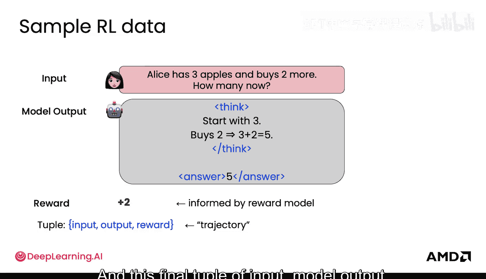

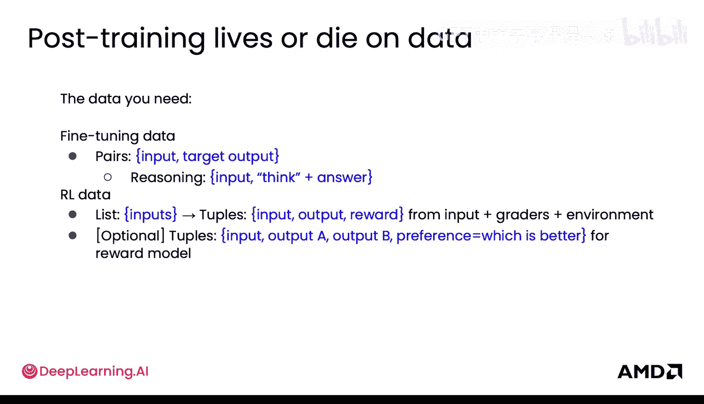

对于强化学习数据，其结构是**输入、模型输出和环境奖励**的三元组。你让评分者给出奖励，并准备输入列表。

然后模型产生输出和奖励。本质上，这就是一个强化学习数据样本的样子：你可能有一个相同的输入，模型实际给出了包含思考和最终答案的输出，这被称为一个**rollout**（展开），即模型在此展开其响应。接着会有一个奖励，这个奖励可以由某种数学检查器给出，也可以由另一个称为**奖励模型**的模型来为这次rollout的好坏打分。这个最终的（输入，模型输出，奖励）三元组被称为一个**trajectory**（轨迹）。

如果你使用奖励模型，还有一个可选的元素：一个包含你的**输入、两个模型输出（如输出A和B）以及一个偏好**（指明哪个更好）的元组。其具体形式是：你有相同的输入，然后可能有一个包含思考和答案的模型输出，以及第二个只说“5”的模型输出。显然，偏好是A，因为它更好。这个偏好可以由人或另一个LLM标注。本质上，你得到这个最终的元组：输入、模型输出A、模型输出B和偏好。

以上就是你的全部数据。现在，数据准备的下一步，也是最重要的步骤之一，是划分你的数据。

## 数据划分

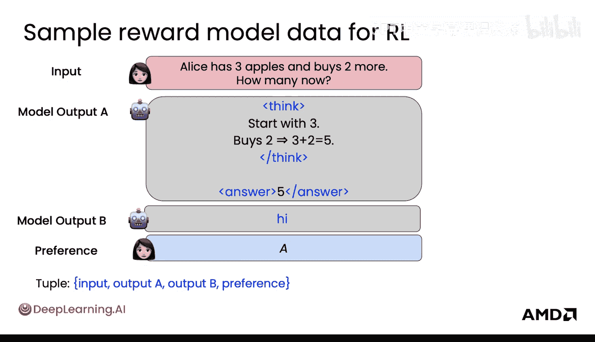

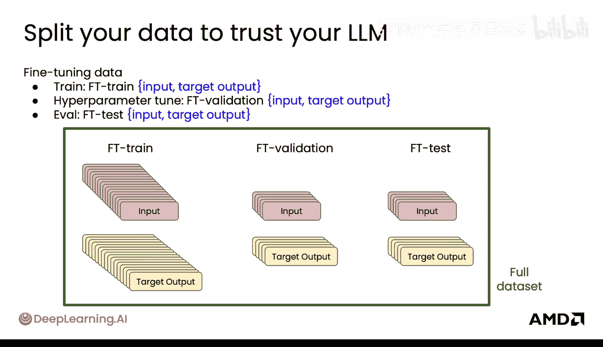

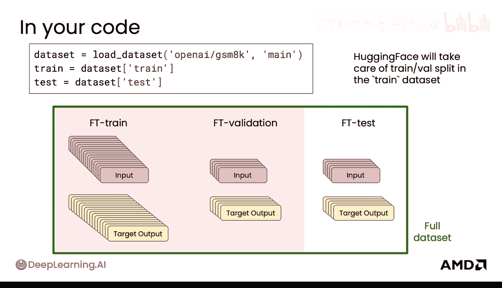

只有正确划分数据，你才能真正信任你的LLM确实表现良好。

### 微调的数据划分

对于微调，典型的划分如下：
*   **训练集**：你实际用于训练模型的数据。这将是你的最大数据集。
*   **验证集**：用于进行超参数调优的数据集。
*   **评估集/测试集**：这是严格保留的数据，不用于超参数调优，只在最后测试模型，以查看模型的实际表现。

在你的代码中，这看起来像是你可以加载数据。至少在Hugging Face中，你的训练数据和测试数据是分别指定的。在你的训练数据中，默认会随机选择一个子集用于验证。

### 奖励模型的数据划分

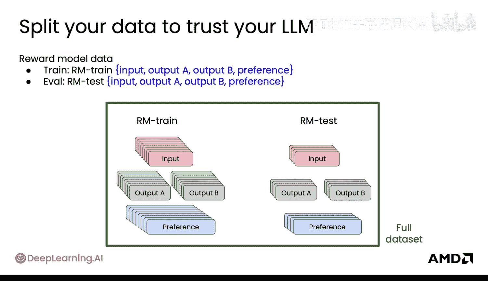

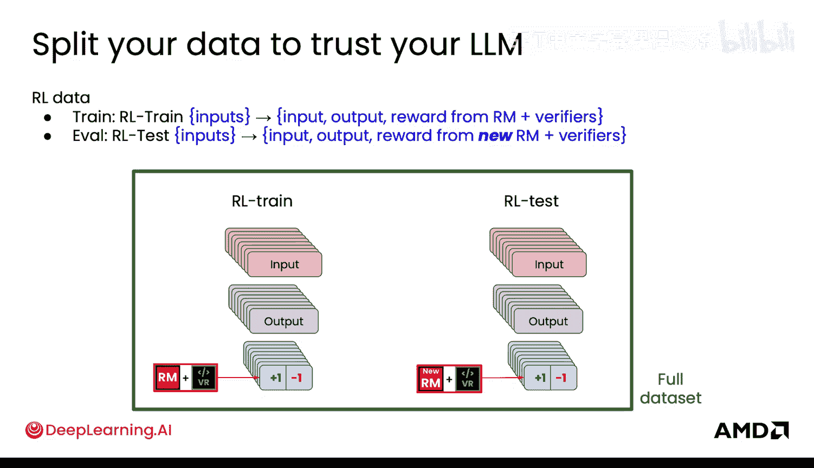

对于你的奖励模型，可以发生非常类似的事情。你也可以划分你的训练数据集和测试数据集。你可以在训练数据集中拥有那个验证数据集。但本质上，它不仅仅是输入和目标输出对，而是输入、两个不同的模型输出以及偏好。

### 强化学习轨迹的数据划分

对于你的强化学习轨迹，你也会有用于训练和测试的部分。划分方式如下：对于训练，你使用你的奖励模型和验证器（如数学检查器）来给出奖励。但对于测试，你需要非常小心的是，如果你使用奖励模型，则应使用在不同偏好数据上训练的新奖励模型。否则，模型可能会“钻空子”，在测试中看到训练中已经见过的东西，这就形成了一种泄露。

最后，我强烈推荐的最后一个评估环节是：除了所有这些你精心准备并严格保留的评估测试集之外，增加一个额外的评估集。这个集合中的输入是模型几乎从未在你的原始数据集中见过的，你混入这些**长尾输入**和**分布外输入**，只是为了看看模型在它们上面的表现，以及它是否能如你所期望的那样正确处理。

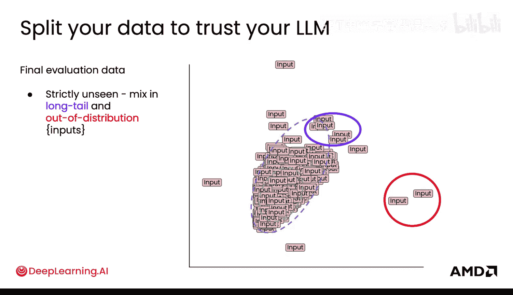

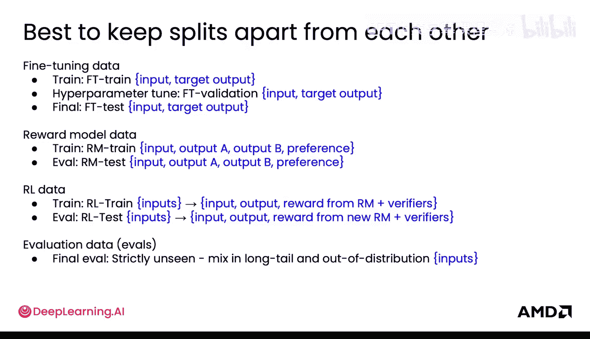

在继续探讨这些数据集之间的泄露问题之前，我们先来总结一下目前的数据类型：你的微调数据、奖励模型数据、强化学习数据（包括rollouts和trajectories），以及所有这些步骤最终评估所需的输入数据。

## 数据泄露与预防

那么，泄露到底意味着什么？如何防止它发生？泄露甚至可能不是发生在完全相同的样本上，而是发生在**分布相似的样本**上。任何在分布上相似的东西都可能破坏你的数据划分。

你可以通过大量**去重**来控制这一点。前沿实验室的人们花费大量时间对数据集进行去重，以确保他们可以信任模型能够正确地泛化到测试集。因此，去重是一个非常重要的步骤。

你可以使用像**MinHash**这样的工具来查看这些样本是否相同或相似，即使稍微扰动一下，它们仍然是相似的样本。

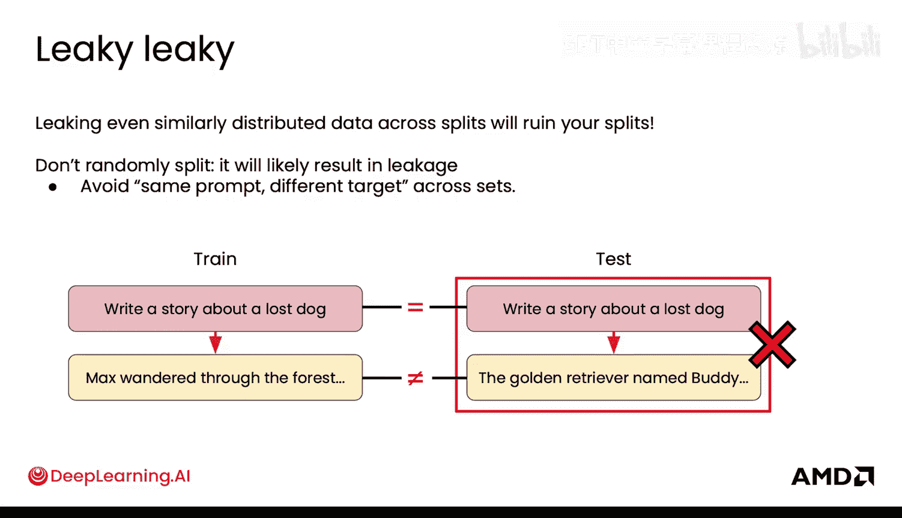

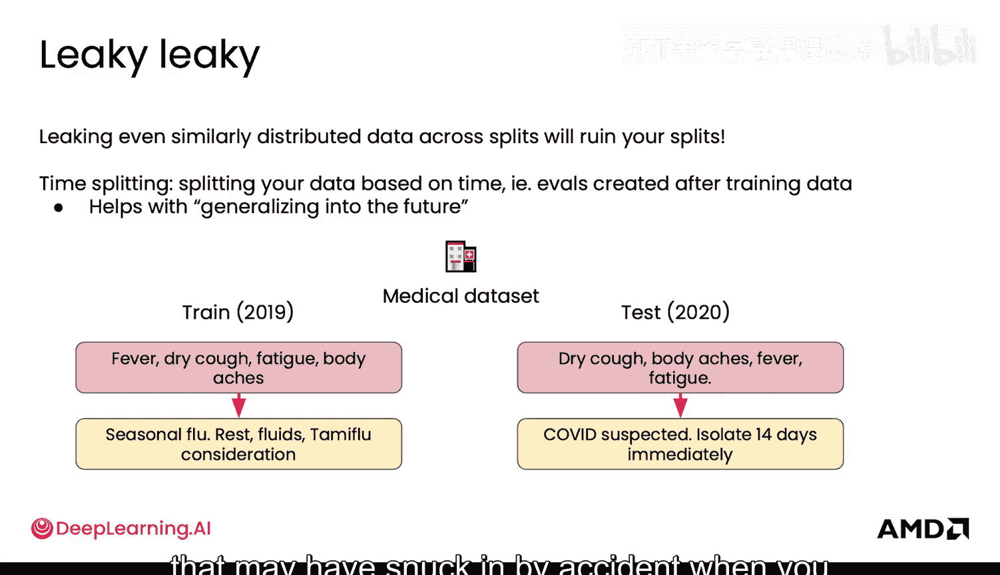

你还需要**避免随机划分**。我认为进行随机划分非常诱人，但这很可能导致泄露，因为相似的内容可能跨越那个划分。

最后，一个值得了解的最佳实践是：**基于时间划分数据**可能非常有趣。起初你可能会觉得这不公平，但你希望你的模型能够随着时间泛化。你希望你的模型能够处理，例如，如果它在2019年的数据上训练，仍然能够处理2020年新冠疫情中的某些场景，即使它没有见过。因此，如果你关心你的模型泛化到未来，这是一种划分方式，也是一种避免在最初收集数据时意外引入某些偏见的方法。

总结一下，要对数据划分和污染保持高度警惕。这是你能够信任你的模型、信任从模型获得的结果真正良好、并且可以将其部署到世界上的一个非常重要的部分。

这就是为什么数据准备是一项如此巨大的工作。在这些前沿实验室内部，有庞大的团队专门负责数据工作。已经出现了一些非常有趣的启发式方法，例如实验室可能只使用其数据的1%，因为那是最干净、最前沿的数据，使用其余99%的数据实际上会降低模型性能。因此，让你的数据变得非常好是极其重要的。

在接下来的模块中，你将看到那些严格保留的评估集或所有的评估测试集以及强化学习测试环境如何发挥作用，并帮助你实际避免进行超过十倍的实验，从而真正让你得到一个更好的模型。因此，这是你的数据中一个非常、非常重要的子集，需要正确处理。

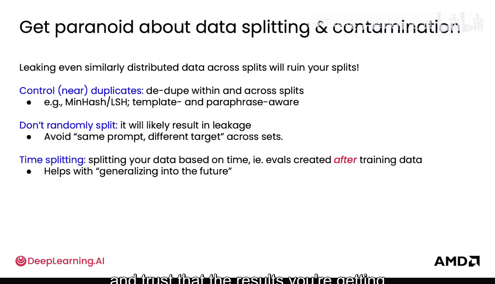

然后，你还将了解你实际上需要多少数据，例如，要达到下一个好模型真正需要多少数据，以及为了达到那个下一个模型、下一个任务和你希望模型学习的前沿领域，获取这些数据有多大价值。

现在你已经学习了如何准备数据，接下来看看如何将这些文本数据转化为模型可以实际处理的**标记**。