# 010：2. 数据-模型读写数据的令牌（可选）🔤

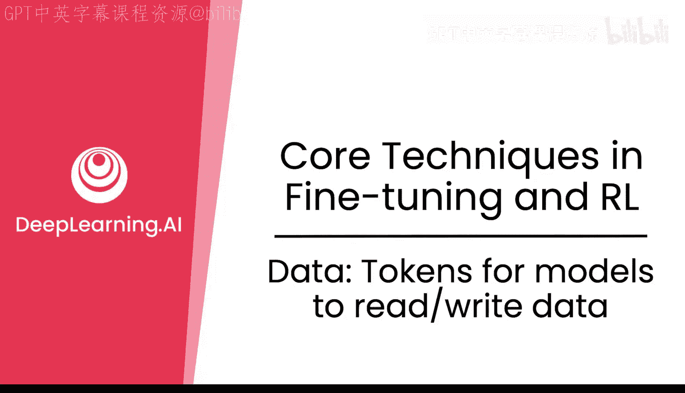

在本节课中，我们将学习大型语言模型（LLM）如何“阅读”和“生成”文本。核心在于理解**令牌（Tokens）**的概念，这是模型处理文本的基本单位。我们将探讨文本如何被高效地编码为数字（令牌化），以及模型如何通过这些令牌进行理解和生成。

---

模型通过称为**令牌**的单元来“消费”文本。这些令牌是文本的不同片段，在后训练中被高效编码。重要的是要知道，这些**分词器（Tokenizers）**——能够将文本转换为固定大小编码的模块——是与模型一同训练的。因此，有时你需要固定（冻结）它们以获得正确的结果。

那么，你有一段文本。如何高效地将其编码为数字，以便模型读取、处理并输出文本呢？你可以像人们通常做的那样编码文本，例如使用字典中的单词或字母表中的字符。但是否有更高效的编码方式？答案是肯定的，它们被称为**令牌**。

你可以使用词级或字符级令牌，但还有一些非常有趣的算法，例如**字节对编码（Byte Pair Encoding, BPE）**，它能将训练文本压缩成更高效的字符串（例如“ing”）。因此，像“swimming”或“going”这样的词会重复使用“ing”这个字符串。模型词汇表中的所有令牌集合被称为**词汇表（Vocabulary）**。对于GPT-3，它拥有约50,000个BPE令牌，因此其词汇表大小约为50,000。这个数字非常庞大，但将其编码成这些小片段（令牌化）是非常高效的。

然而，令牌化也引入了一些有趣的问题。其中最著名的问题之一是“计算‘strawberry’中字母‘r’的数量”。这对语言模型来说是一个非常困难的问题，因为它们基于令牌操作。令牌可能是“straw”和“berry”，因此模型无法真正“看到”令牌内部的内容，它可能只数出两个‘r’。这已成为AI领域的一个长期笑话。当然，你可以通过确保单个‘r’被单独令牌化，或者令牌能够有效处理这种情况来缓解这个问题。

从下图中你可以看到，使用BPE进行令牌化与仅使用字符进行令牌化相比，每个句子的令牌数量可以变得非常低。这是同一个数据集，你可以看到分布向左移动，这显示了BPE在令牌化文本时的高效性。

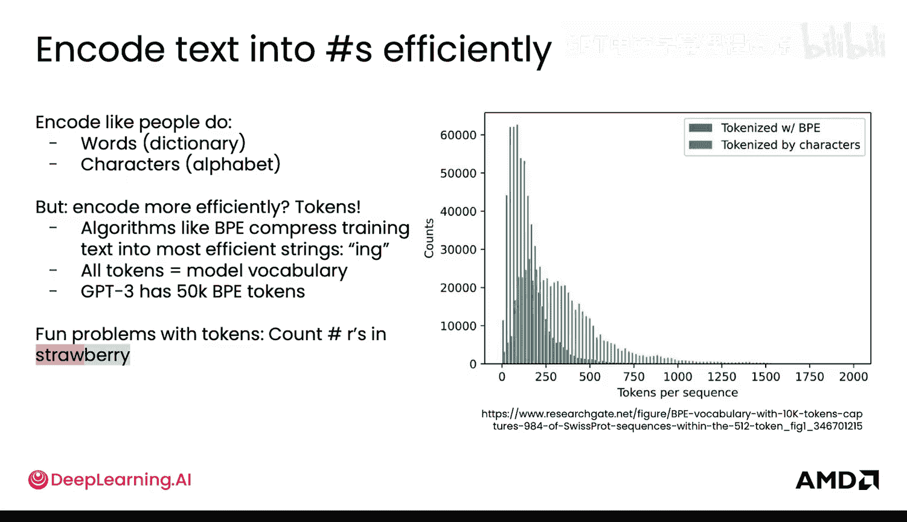

那么，令牌是如何融入整个流程的呢？你有一段文本，将其转换为令牌，然后LLM能够处理这些令牌并生成下一个令牌。接着，这个令牌可以被转换回文本。当然，生成的下一个令牌会被附加到输入模型的整个令牌序列中，以循环预测下一个令牌。

用于将文本编码为令牌，以及将令牌解码回文本的工具被称为**分词器（Tokenizer）**。进一步观察分词器，你可以看到文本中哪些词是不可分割的，并看到这些令牌。整个序列被细分为不同的片段，每个片段称为一个令牌，它们被映射到词汇表中的一个ID。这本质上是一个简单的查找表，最终被映射为一个数字。然后，这些数字被输入模型，模型可以使用数学运算（我们稍后会看到）来处理这些数字。本质上，分词器的输入和输出如下所示：你传入文本，它就能给你这些ID；解码过程则相反，你给它这些ID，它就能将其转换回文本。

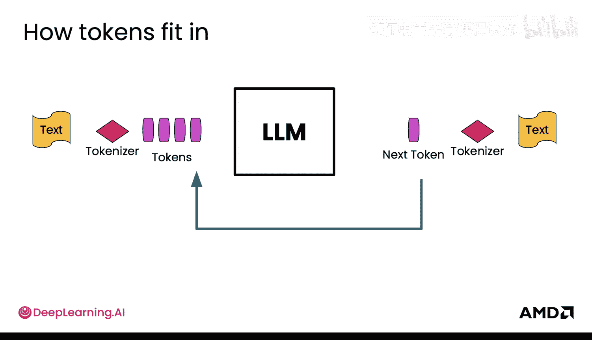

接下来是**嵌入（Embeddings）**。那么令牌实际上是如何进入模型的呢？它们基本上是每个令牌的语义表示。当你的令牌ID被映射到模型的第一层（即嵌入层）时，嵌入层的大小与词汇表大小相同。你可以将令牌ID视为索引到这个嵌入矩阵中。这个嵌入矩阵与模型一同训练，用于在令牌进入模型时，从语义上表示每个令牌。

随后，模型将产生**概率**。它将在整个词汇表上产生这些概率，然后从这些概率中选取一个令牌ID。最简单的方法是进行某种**贪婪采样（Greedy Sampling）**或**贪婪选择（Greedy Selection）**，即选择概率最高的令牌ID。在模型的生成函数中，默认就是采用这种方式，你无需指定任何参数，它只是贪婪地选择概率最高的令牌。

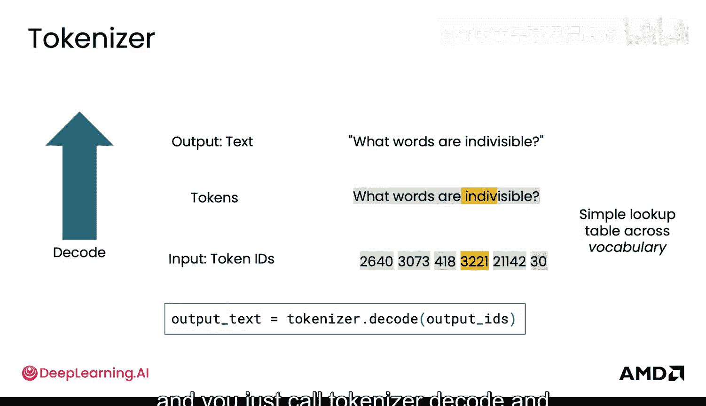

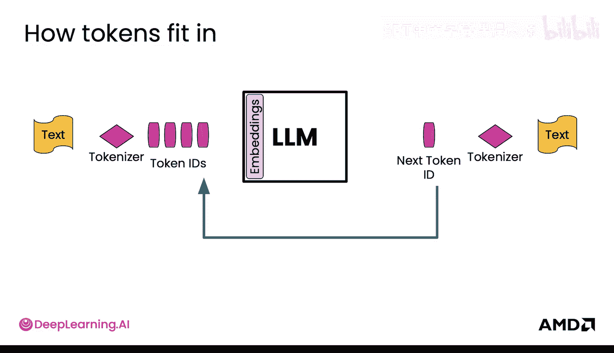

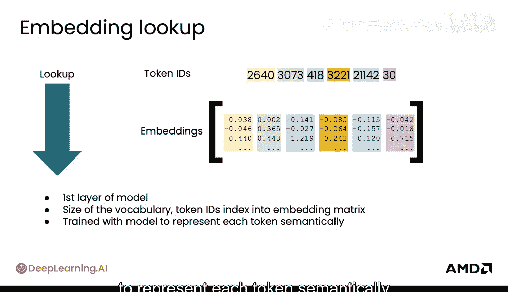

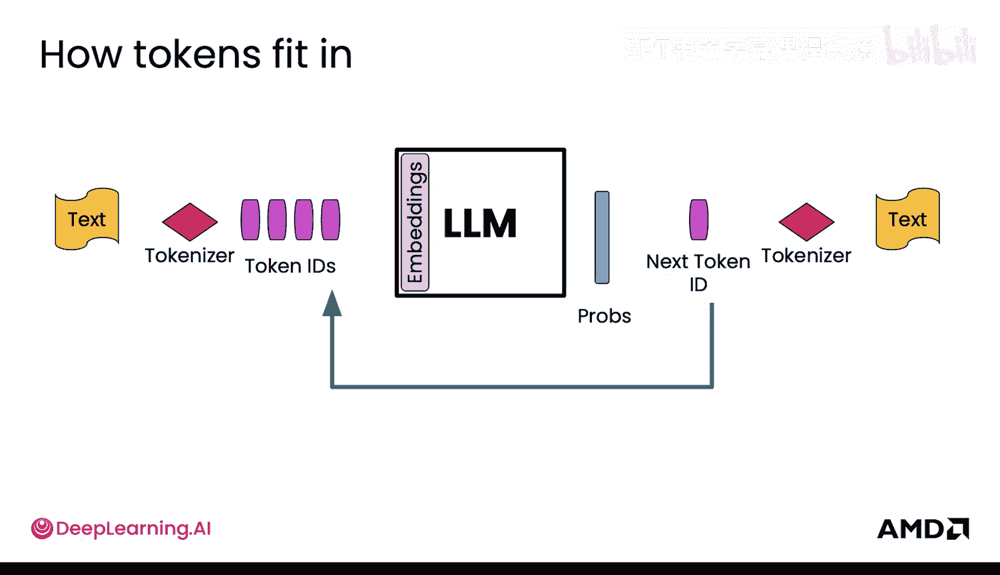

例如，如果令牌ID0的概率是0.5，模型就会选择它。你也可以从词汇表的概率分布中进行**采样（Sampling）**。通过采样，你可能也会选择令牌ID2。在采样时，你可以使用采样算法选择不同的结果。有趣的是，你可以调节采样算法的随机性或确定性程度。通过设置**温度（Temperature）**参数，你可以控制这一点。将温度设置为0意味着你不希望采样有任何变化，这实际上使采样变得与贪婪选择相同。但你也可以提高温度值。

下图直观地展示了温度的作用：在左侧，温度0.25时，主要选择“vanilla”，虽然也有一点点“strawberry”，但本质上限制了可采样的范围；而在温度2（更高温度）时，不同“风味”的分布更加均匀。这样，模型就能在这个分布上进行采样，为其下一个令牌获得更多的随机性。

最后，从词汇表概率中获取下一个令牌ID的另一种方法是**束搜索（Beam Search）**。束搜索能够在你采样时跟踪多个不同的序列。当你采样不同的令牌时，这些分支会分叉，变得略有不同，但束搜索会跟踪顶部的“束”（即顶部的候选序列）。例如，对于两个束，你可能会采样两个不同的令牌ID，并将最好的那些保留在内存中。如果有三个束，你最终可能会得到类似下图的输出。当用户要求“写一首诗”时，模型可能会生成“The sun is setting soon”、“The sun rises about the hills”和“Three roads divergent in a wood”这三个候选序列，并将它们作为顶部候选束保留。

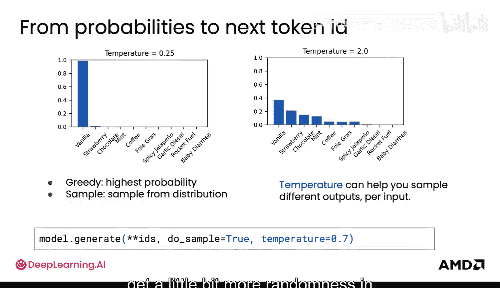

至此，我们了解了模型输出的最终概率如何被处理，以选择下一个令牌ID，并循环进行下去。为了提高在GPU上的效率，所有这些过程都可以**批处理（Batching）**，以便并行处理，更快地获得一个或多个文本的输出。

当你将多个不同的序列批处理在一起时，你可能会看到类似下图的情况：多组令牌ID通过嵌入查找转换为嵌入向量。但实际上，它们的长度会不同。通常的做法是添加**填充令牌（Padding Tokens）**。这些填充令牌基本上是空令牌，用于确保所有序列长度相同，以便我们可以在GPU上高效处理。GPU要求批处理中的张量大小相同，以便更高效地进行矩阵乘法和运算。

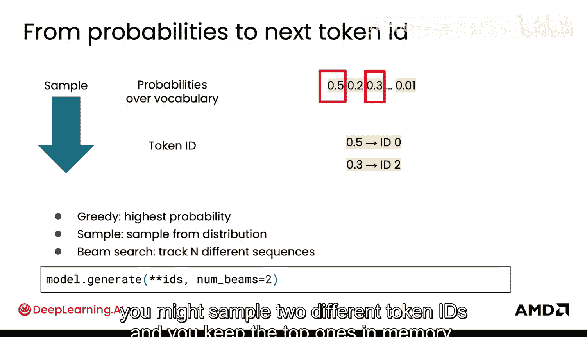

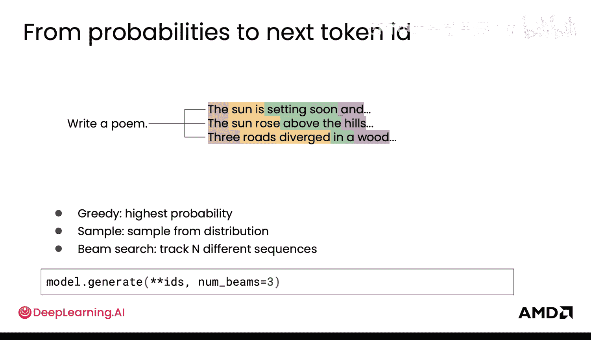

下图展示了一个使用分词器并查看其如何进行填充的示例。这是在序列前添加（前缀）填充令牌，使它们具有相同长度（使用ID 0）。

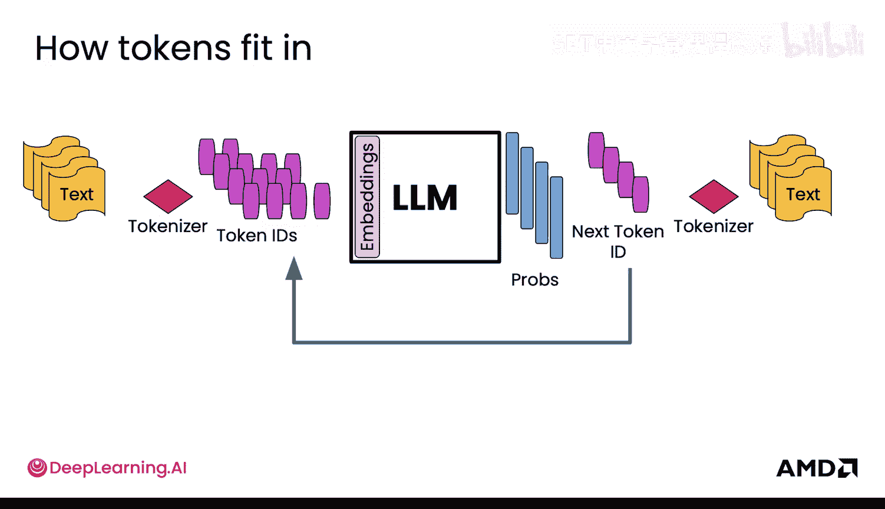

你已经了解了分词器的工作原理。分词器通常与模型绑定，或者更准确地说，模型与其分词器绑定。在Hugging Face中，通常使用`AutoTokenizer`功能，它基本上可以接受任何模型名称，并将其映射到该模型使用的适当分词器。你可能已经猜到，由于这些分词器与不同的词汇表大小相关联，因此为特定模型使用什么分词器以及它用什么训练非常重要，这对后训练至关重要。

为了比较几种分词器，你可以通过Transformers库使用它们。这里有一个基于大小写的BERT模型的分词器，你可以看到这里产生的令牌带有“#”符号，这是在分割单词时使用的。使用Hugging Face是相当容易管理的。

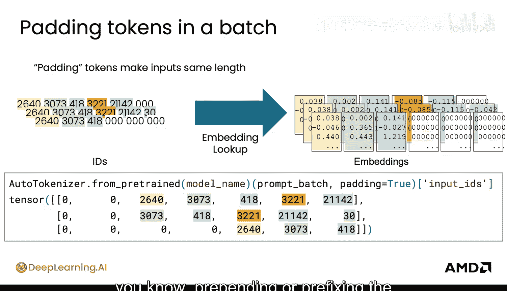

这是另一个名为T5-small模型的分词器，它使用下划线表示空格，将空格包含在令牌中，并在整个序列前添加下划线作为起始序列标记。而这个来自DeepSeek模型的分词器可能看起来非常奇怪，它使用一个奇怪的“Ġ”字符表示空格，不将多个空格合并为一个，但会将它们分组到单个令牌中。这里的主要要点不是记住这些不同的令牌及其输出，而是要看到这些分词器在如何令牌化和选择子串来表示不同序列方面存在很大差异。如果你看到像那个奇怪的“Ġ”字符，也不必惊慌。

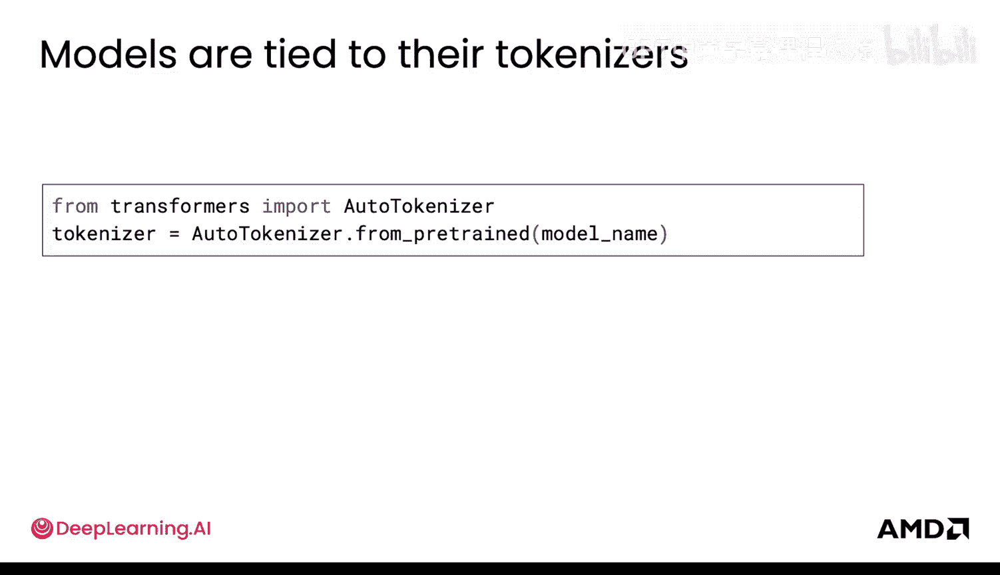

那么，这一切如何影响后训练呢？在后训练中，当你进行非常小的更改时，实际上可以只冻结嵌入层，不需要做太多改变，前提是你保持相同的词汇表。例如，在**指令微调（Instruction Tuning）**阶段，你也可以冻结分词器，因为词汇表没有变化，所以不需要继续训练它。

当你进行较大的更改时，你就需要做出调整。你可能会倾向于训练你的嵌入层，因为那些语义表示可能会改变。假设你正在训练一个法律领域的LLM，它学习了很多法律词汇和行话，可能其中有一些新的首字母缩略词。为了学习这些，你真的需要继续训练那些嵌入向量，以便在添加新术语或专业术语时，能更有效、高效地捕捉其语义含义。

当添加新术语或特殊标记时，你会想要训练你的分词器，因为你的词汇表会发生变化。如果你保持分词器冻结，可能无法高效地表示这些新标记。因此，当你改变词汇表大小时，需要考虑这一点。你还需要调整模型嵌入层的大小，因为它依赖于词汇表大小。通常的做法是先对新嵌入进行“预热”或训练，然后再训练所有部分。

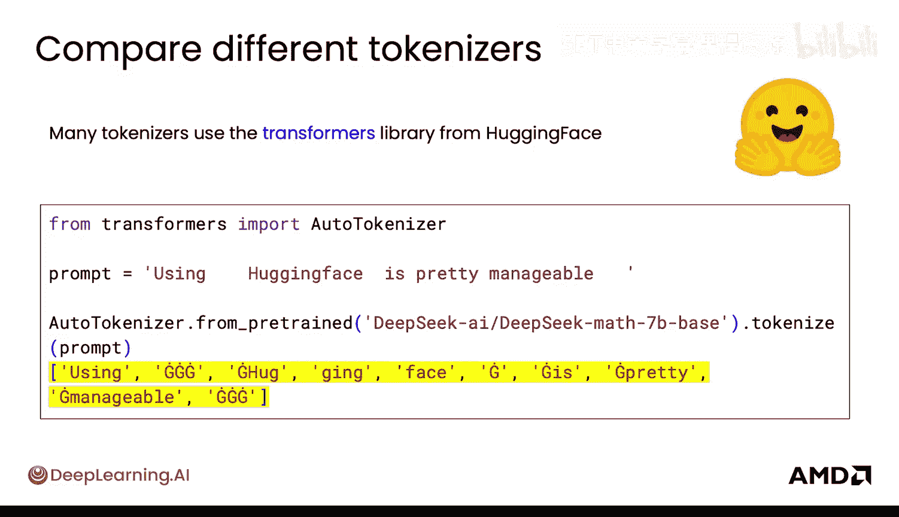

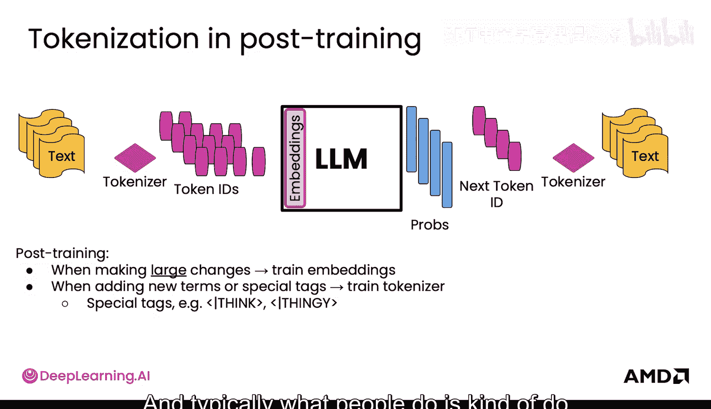

---

**总结**

在本节课中，我们一起学习了大型语言模型处理文本的核心机制——**令牌化**。我们了解了文本如何通过**分词器**被高效地分割和编码为数字令牌，以及这些令牌如何通过**嵌入层**转换为语义表示。我们还探讨了模型生成文本的几种策略：**贪婪选择**、基于**温度**参数的**采样**以及**束搜索**。最后，我们看到了这些概念如何应用于后训练实践，例如在词汇表变化时调整分词器和嵌入层。理解令牌是理解LLM工作原理的基础，为后续的微调技术学习做好了准备。