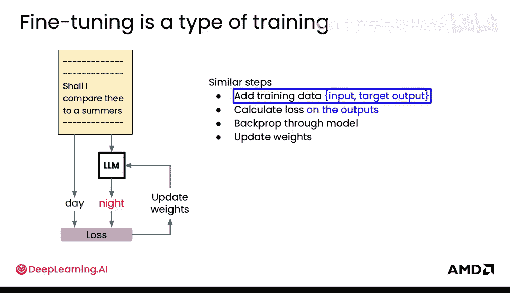
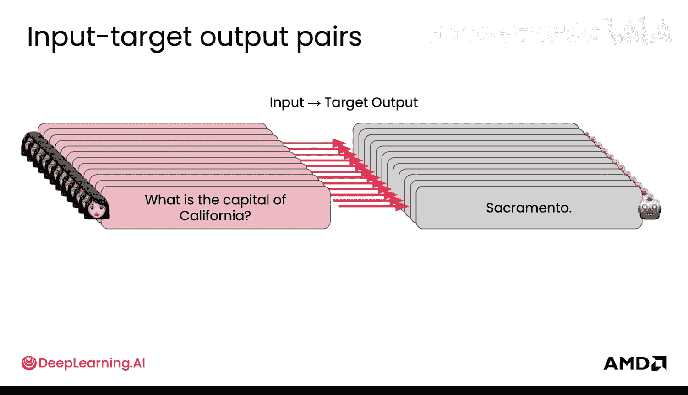
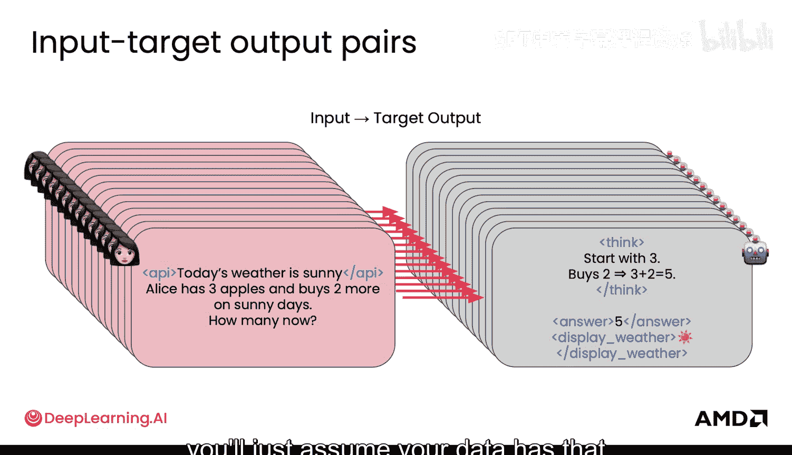
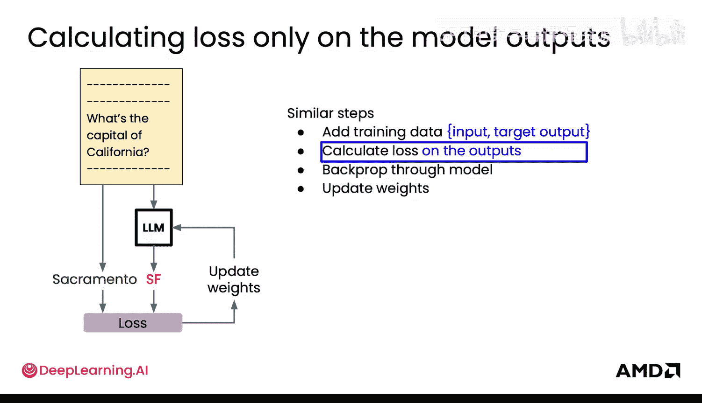
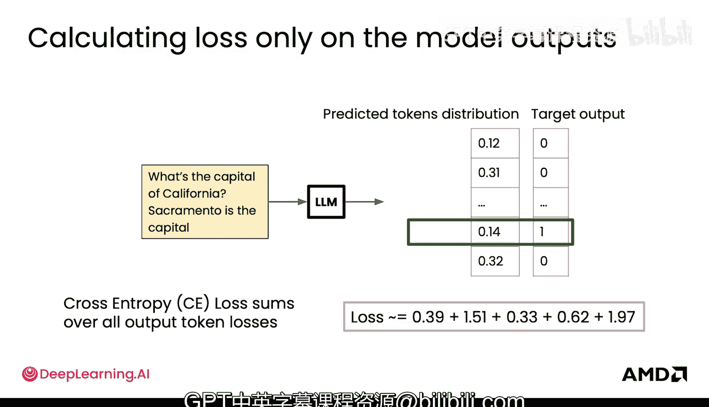

# 011：损失、梯度与权重更新（第一部分）🔢

在本节课中，我们将学习微调背后的核心数学原理。我们将探讨如何计算损失、如何通过反向传播计算梯度，以及如何更新模型权重。理解这些概念对于有效进行模型微调至关重要。

## 概述

上一节我们介绍了微调的基本概念。本节中，我们将深入探讨其背后的数学机制，包括损失计算、梯度传播和权重更新。这些步骤是训练和微调任何神经网络的基础。

## 神经网络训练回顾

首先，快速回顾一下神经网络的训练过程，因为微调遵循大致相同的步骤。

1.  **模型初始化**：模型从一个起点开始。在标准训练中，它可能输出无意义的预测。
2.  **计算损失**：使用训练数据，计算模型预测与目标之间的差异，这个差异就是损失。公式可以表示为：
    `损失 = 损失函数(模型预测, 真实目标)`
3.  **反向传播梯度**：通过反向传播算法，计算损失相对于模型中每个权重的梯度。这帮助我们理解每个权重如何影响最终的损失。
4.  **更新权重**：使用优化算法（如随机梯度下降），沿着减少损失的方向更新模型权重。

在微调中，我们从一个**预训练模型**开始。这意味着模型的起点远优于随机初始化的模型，它可能已经能输出有意义的文本，而非随机字符。

微调步骤有两个主要特点：
1.  训练数据是**配对**的，包含输入和对应的目标输出。
2.  损失仅根据模型的**预测输出**与**目标输出**之间的差异计算，而不考虑输入部分。反向传播和权重更新的过程则与常规训练相同。

## 微调数据与损失计算

接下来，我们具体看看微调中的数据与损失计算。

### 训练数据格式

微调需要特定格式的训练数据。以下是数据的关键特点：

*   数据由许多**配对示例**组成，展示了期望模型如何行为。
*   示例格式为：`输入 -> 目标输出`。
*   例如：`输入：“加利福尼亚的首府是？”`，`目标输出：“萨克拉门托”`。
*   在后续课程中，你会看到更复杂的配对，例如带有特殊标签的输入和输出，用于连接工具或其他功能。
*   精心设计这些示例会极大地影响模型的性能。

在本节中，我们假设数据已具备这种“输入-目标输出”的配对结构。

### 前向传播与损失计算

有了数据后，微调过程如下：

1.  **运行模型**：将输入数据送入模型，获得预测的输出。
2.  **计算损失**：将模型的预测输出与目标输出进行比较，计算损失。

让我们通过一个例子具体说明。假设输入是：“加利福尼亚的首府是？”，模型预测的下一个词元（token）是“SF”（旧金山），其概率为0.6。而正确的目标词元是“萨克拉门托”，模型赋予它的概率仅为0.12。

正确的目标输出应该是一个**独热编码**的分布：在“萨克拉门托”位置的概率为1，其他所有词元位置的概率为0。

损失计算的目的是衡量模型预测的概率分布（即所有词元的概率）与真实的独热分布之间的差异。我们希望**最大化正确词元（此处是“萨克拉门托”）的似然或概率**。

### 交叉熵损失

实现这一目标的常用算法是**交叉熵损失**（在语言建模中也称为**负对数似然**）。

`交叉熵损失 = -Σ(真实分布_i * log(预测分布_i))`

对于独热编码的目标，公式简化为：
`损失 = -log(模型对正确词元的预测概率)`

交叉熵损失直接优化正确词元的对数似然。其中的**对数项**本质上会惩罚低置信度预测。这意味着模型不仅要学会“选择”正确的词元，还要尽可能**确信**自己的选择是正确的。

因此，语言模型学习的不仅仅是对词元进行排序，而是为整个预测的词元分布分配良好的概率值。

**示例对比**：
*   如果模型预测“萨克拉门托”的概率是0.12，则损失约为 `-log(0.12) ≈ 2.12`。
*   如果模型预测“萨克拉门托”的概率是0.68（并且预测正确），则损失约为 `-log(0.68) ≈ 0.39`。

这表明，模型预测得越正确、越自信，损失值就越低。

### 计算整个序列的损失

以上我们只看了第一个预测词元。现在来看如何计算整个目标输出序列的损失。

假设完整的目标输出是：“萨克拉门托是首府。” 这是对“加利福尼亚的首府是？”的回答。

在损失计算中，有一个关键点：**损失掩码**。我们只计算模型在**输出部分**的预测损失，而**输入部分**的损失被忽略不计。这就是之前提到的“仅对输出计算损失”的含义。

具体计算时，我们使用一种称为**教师强迫**的技术。在预测下一个词元时，我们不使用模型自己上一个时刻的预测结果作为输入，而是**强制将正确的目标词元**作为输入。这样做可以实现非常高效的训练，因为它使得整个序列的计算可以并行化。我们不需要等待模型逐步生成输出，而是可以一次性完成整个序列的前向传播，通过一次大的矩阵乘法运算计算出所有损失。

接着，模型继续预测后续的词元（如“是”、“首府”等），直到预测出一个序列结束符。我们将所有输出词元的损失概率结合起来。通常，联合概率是各概率的乘积。但由于交叉熵损失中的对数项，这个概率乘积转化为了对数概率的**求和**。这使得优化过程更加容易，避免了大量概率值相乘可能导致计算机难以处理的数值过小或爆炸问题。这是对数似然在人工智能领域无处不在的一个重要原因。

## 总结

本节课中，我们一起学习了微调背后的核心数学原理。我们回顾了神经网络训练的基本步骤，并重点探讨了微调中特有的数据格式和损失计算方式。我们了解到微调使用配对数据，并通过交叉熵损失函数来优化模型，使其不仅做出正确预测，还要对自己的预测有高置信度。此外，我们还介绍了教师强迫技术和损失掩码的概念，这些对于高效计算序列损失至关重要。理解这些基础是进行有效模型微调的关键。在下一部分，我们将继续学习梯度计算和权重更新的具体过程。