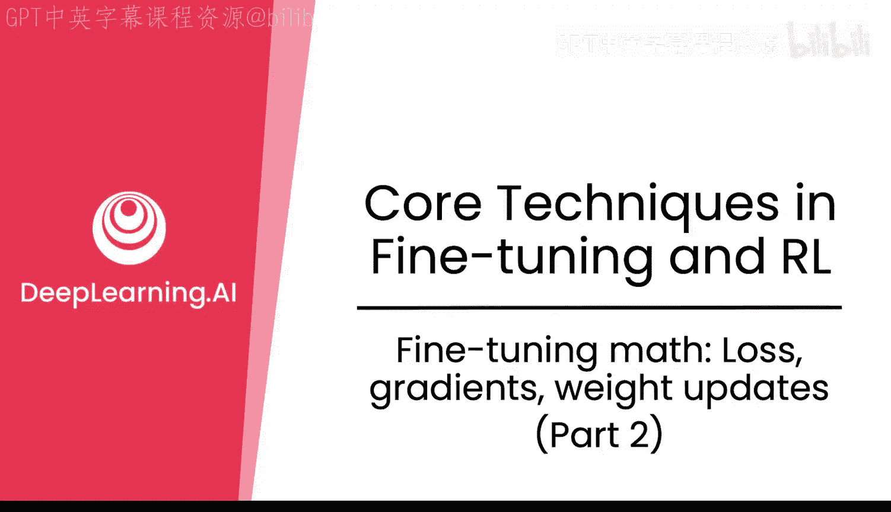
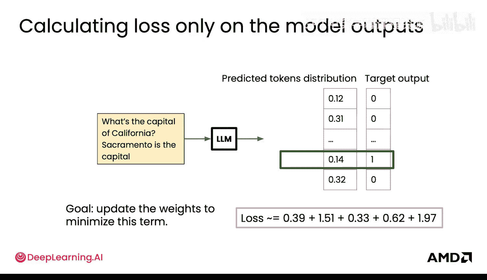
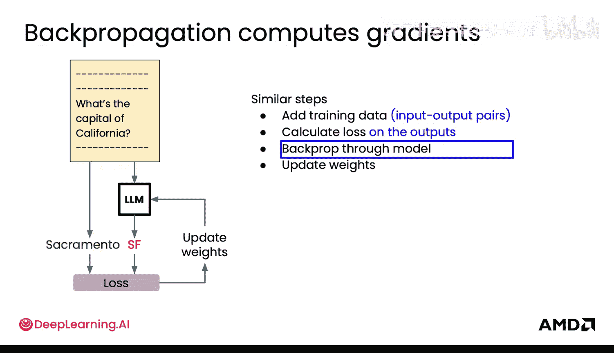
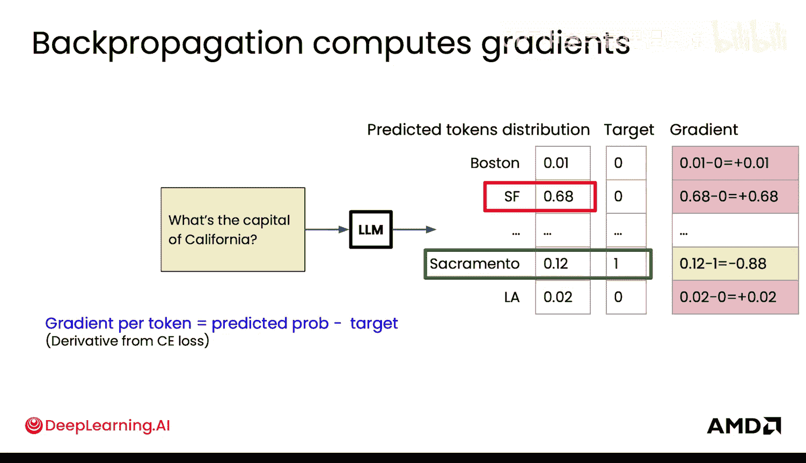
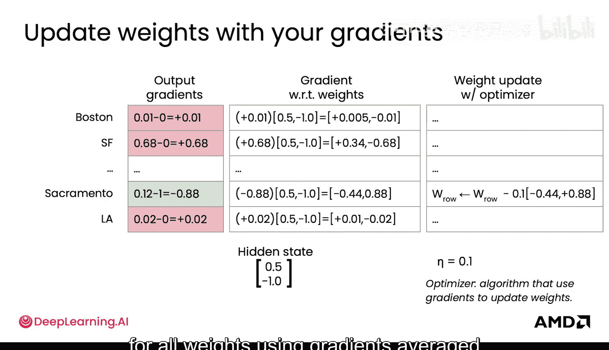
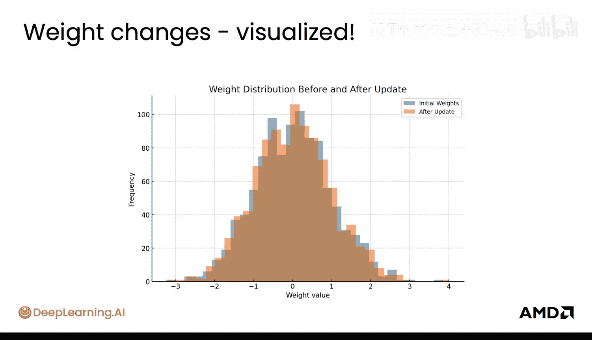
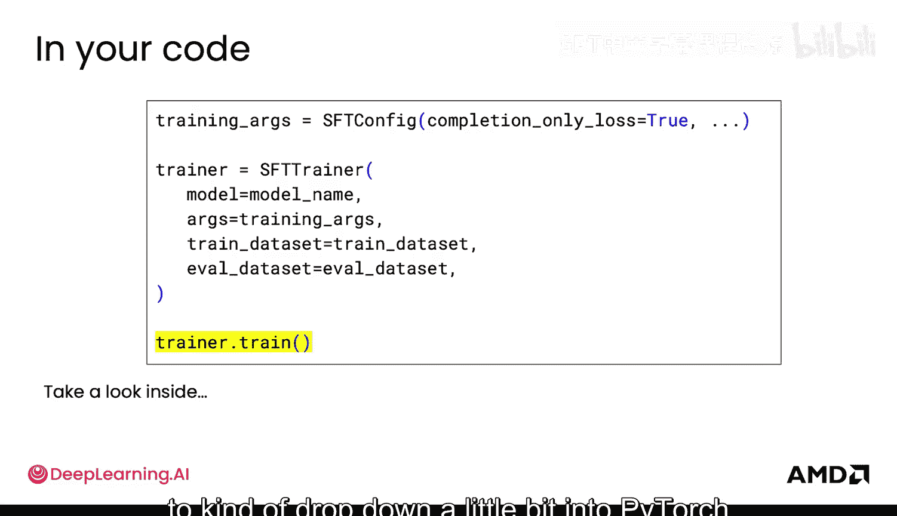
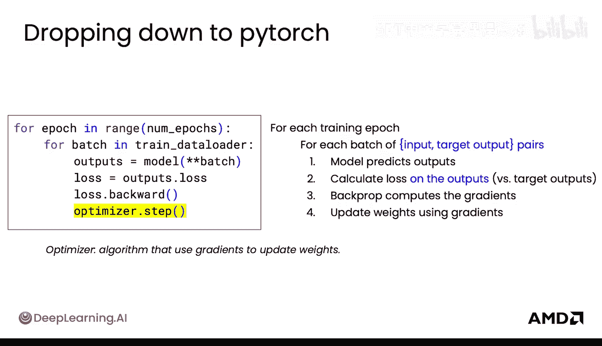

# 012：损失、梯度与权重更新（第二部分）

## 概述

在本节课中，我们将要学习如何利用计算出的损失值来更新大型语言模型的权重。我们将深入探讨反向传播、梯度计算以及优化器如何协同工作，以最小化损失并提升模型的预测准确性。

---

上一节我们介绍了如何计算交叉熵损失，以衡量模型预测的偏差。本节中我们来看看如何利用这个损失值来指导模型权重的更新，从而让模型“学习”并改进。

我们的目标是让模型最小化这个损失项。损失代表了模型整体预测的偏差程度。损失越小，模型表现越好。因此，下一步就是利用这个损失项，计算模型中每一个权重应该如何更新、以及朝哪个方向更新，才能最小化损失。我们希望模型增加输出正确答案“Sacramento”的概率，同时降低输出其他错误答案（如“SF”、“Boston”）的概率。反向传播正是完成这项工作的机制。

反向传播会从最靠近最终损失计算的最后一层开始，反向计算到模型的第一层。它会计算每个权重对损失的影响方向和大小。

具体来说，它会计算损失相对于模型中每一个权重的**梯度**。梯度本质上告诉你应该如何改变权重，才能使模型更可能输出正确答案（本例中的“Sacramento”），并降低输出其他所有答案的可能性。

梯度就是损失相对于每个权重的**导数**计算。这个过程是迭代进行的，梯度会通过模型反向传播，因此得名“反向传播”。

为了更直观地理解，可以想象你站在一座山上。你的损失就是你的海拔高度（你站得多高），你的权重就是你的XY坐标位置（你站在哪里）。那么，梯度就是你的**斜率导数**，即山坡的陡峭程度和方向。这就是梯度下降需要前进的方向。

对于交叉熵损失，其导数计算相对简单：`梯度 = - (目标概率 - 预测概率)`。如果我们进行实际计算，可以看到“Sacramento”（正确答案）对应的梯度为负值，而其他所有答案的梯度为正值。这指明了权重更新的方向和幅度。

然而，直接使用梯度来更新权重本身并不那么简单。假设你的最后一个隐藏状态在这里。基本上，你的输入经过模型转换后变成了这个向量（这是一个简化示例，实际隐藏状态维度更大）。它本质上代表了输入语义的压缩表示。这个隐藏状态随后被投影，并转化为在词汇表上所有输出词元的预测分布。

这里的每一个输出词元都有一行权重，连接着隐藏状态。损失相对于每一个权重的梯度，等于**输出梯度**乘以**隐藏状态**。隐藏状态实际上决定了这里每一行权重更新的幅度。它告诉我们如何调整权重以改进预测。

然后，你可以利用这些信息更新权重。梯度本质上是局部信号，比如“把这个权重推高一点”或“把这个权重推低一点”。但如果你仅根据一个样本的完整梯度进行更新，模型可能会对这个样本过拟合，并可能忘记其他样本。此外，原始梯度可能太小或太大，导致学习过程不稳定。

这时就需要**优化器**登场。优化器帮助你决定如何使用这些梯度来更新权重。这里展示了一个最简单的优化器：**随机梯度下降**。你通过减去梯度乘以某个**学习率**（这里设为0.01）来更新每个权重。在实践中，大型语言模型会使用更高级的优化器，如Adam或AdamW。

对于一个拥有数十亿参数的LLM，这种更新会并行发生在所有权重上，并使用数据批次中计算出的平均梯度。

更新权重后，一个非常酷的事情是你可以观察单次更新带来的变化。这张图展示了模型中所有权重的分布，蓝色是旧权重，橙色是新权重。可以看到，仅仅经过一次更新步骤，整个分布就发生了微小的偏移。橙色的分布应该能让LLM更接近输出“Sacramento”。

如今，这些步骤通常被封装在Hugging Face的`Trainer`类中。如果你使用Hugging Face，只需指定模型、训练参数、数据集等。对于监督微调，它被称为`SFTTrainer`。在微调的超参数中，重要的是指定`completion_only_loss=True`，这意味着你只会在输出（通常称为“补全”）上计算损失，而不会在输入上计算。然后，你可以调用`trainer.train()`来启动我们刚刚介绍过的整个训练循环。

但为了理解内部发生了什么，快速看一下`Trainer`内部是很有帮助的。在PyTorch层面，训练循环大致如下：

以下是训练循环的核心步骤：

1.  **前向传播**：对于每个训练批次（一组输入-目标输出对），模型会预测一些输出。
2.  **计算损失**：使用之前提到的交叉熵损失，计算模型输出与目标输出之间的损失。
3.  **反向传播**：利用损失值，通过反向传播计算所有权重的梯度。
4.  **权重更新**：优化器根据梯度和学习率，决定更新的方向和步长，并更新权重。

这个循环会为下一个批次重复，并遍历所有数据`num_epochs`次。

---

## 总结

本节课中我们一起学习了微调的核心数学过程。我们了解了如何通过反向传播计算梯度，这些梯度指明了如何调整模型权重以减少损失。我们还介绍了优化器（如SGD）的作用，它利用梯度和学习率来实际执行权重更新。最后，我们看到了这些步骤如何被封装在现代深度学习框架（如Hugging Face的`Trainer`）中，使得实际训练过程更加简洁高效。

接下来，我们将深入探讨如何调整这些超参数，以使模型能够有效地学习。