# 013：微调超参数——超参数调优（第一部分）🎯

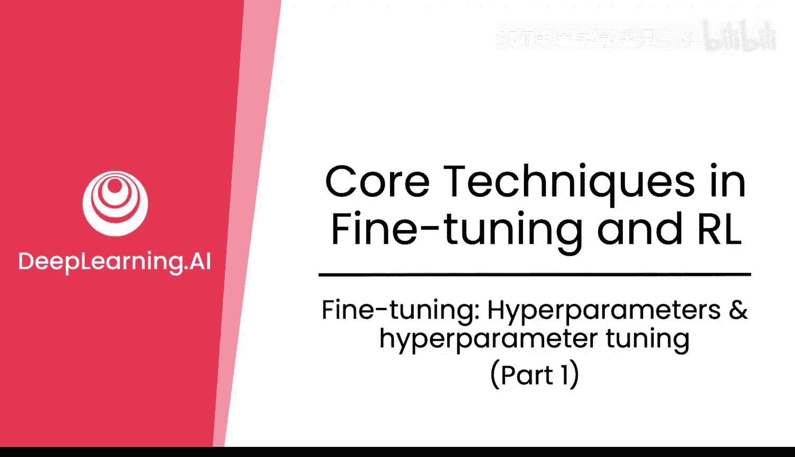

在本节课程中，我们将学习后训练阶段中至关重要的超参数。理解并正确设置这些参数，是确保模型稳定、高效学习的关键。

超参数对于后训练阶段实现良好且稳定的训练至关重要。你可能需要设置或调整超参数，使其不同于默认值，以便更好地适应你的具体任务。

## 学习率 📈

上一节我们介绍了超参数的重要性，本节中我们首先来看看最核心的超参数之一：学习率。

学习率通常缩写为 **LR**。它本质上控制着模型在每一步中更新其权重的幅度。选择一个合适的学习率对于确保模型高效、有效地学习至关重要。

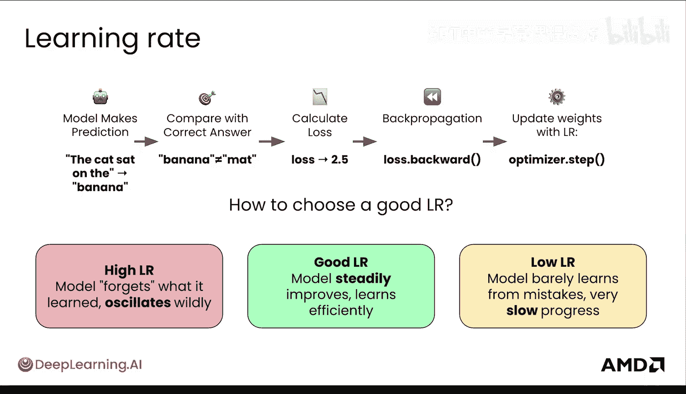

学习率可能过高，导致模型学习不稳定，对每个样本都“反应过度”；也可能过低，导致学习过程极其缓慢。

为了更深入地理解，我们可以可视化模型尝试补全短语“the cat sat on”时的不同情况。

*   **学习率过高**：模型的更新非常混乱，损失值上下剧烈跳动，输出结果可能是乱码。如果学习率过高，你通常会看到损失值报告为 **NaN**（非数字）或 **Infinity**（无穷大）。
*   **学习率适中**：损失曲线随着每个训练轮次平滑、稳定地下降，直到收敛并停止下降。模型学习效率高，并能产生连贯、正确的补全结果（例如“the warm blanket”）。
*   **学习率过低**：模型几乎不学习，损失下降但极其缓慢。输出结果可能不完整或语无伦次，因为模型没有足够地更新权重来学习数据中的模式。有时，如果学习率过低，模型的学习甚至会停滞。

在实践中，你会看到介于这些极端情况之间的各种状态。确定合适的学习率很大程度上依赖于经验。

然而，有一些很好的默认值可以参考。你还可以在训练期间使用**学习率调度器**动态调整学习率。以下是两种流行的策略：

*   **余弦退火**：如左图所示，你可能希望在早期距离目标较远时学习得更快，然后平滑衰减。
*   **带预热期的线性衰减**：学习率开始时较低，逐渐增加，在预热期结束后再稳步下降。直观上，这给了模型一个“热身”时间，让其内部统计量先稳定下来，然后再全速学习，避免训练在最初几步就偏离方向。

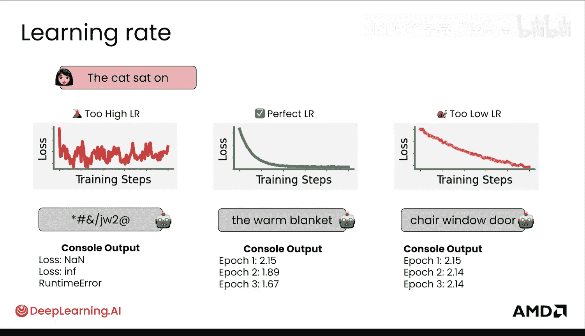

这些是经过时间发展形成的一些最佳实践。不过，新方法并不总是带来显著提升，这个领域可能仍有改进空间，或者意味着我们已经为这些模型找到了相当不错的学习特性。

除了学习率调度器，不同框架（如 Transformers 和 PyTorch）中的优化器也会为你提供相当合理的默认学习率。对于大多数微调任务，使用 **AdamW** 优化器，学习率设为 **5e-5**（即 5 乘以 10 的负 5 次方）是一个很好的起点。

**AdamW** 是著名的 Adam 优化器的一个变体。它使用**自适应学习率**，这意味着它会根据模型中的每个参数自适应地缩放更新幅度。同时，它将**权重衰减**解耦，这是一种正则化损失的方法，通过鼓励整体上更小的权重，使大语言模型学习更稳定，不易因特定样本而产生剧烈波动，从而防止过拟合。

有很多很好的、合理的默认设置，建议从这里开始，然后根据你的具体用例进行经验性实验。

## 训练轮次 🔄

接下来，我们看看另一个超参数：训练轮次数。

一个**轮次**意味着模型已经完整地看过一遍你训练数据中的所有样本。在预训练中，你可能听说过大语言模型只训练一个轮次，因为数据量非常庞大。然而，在后训练中，你通常会在高质量数据上训练**多个轮次**。这允许模型多次看到你的高质量数据，从而使其能够细化理解。

因此，你通常会在这里训练多个轮次。第一次、第二次、第三次……这很直接。

选择合适的轮次数同样依赖于经验。

*   **过早停止**：例如，在一个轮次后就停止，模型可能**欠拟合**。它学得不够，其响应可能仍然类似于之前的检查点。
*   **最佳停止点**：这是一个模型泛化能力最好的点。模型已经从你的样本中学习了可以泛化到新输入的模式，而没有死记硬背它们。
*   **训练过多轮次**：如果训练过多轮次（例如 15 轮），模型开始输出记忆中的训练样本。对于新文本，它基本上完全失败，因为它只是在回忆，而不是从你的样本中进行泛化，甚至可能开始遗忘之前的能力。

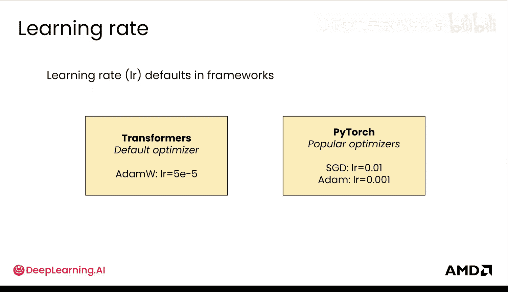

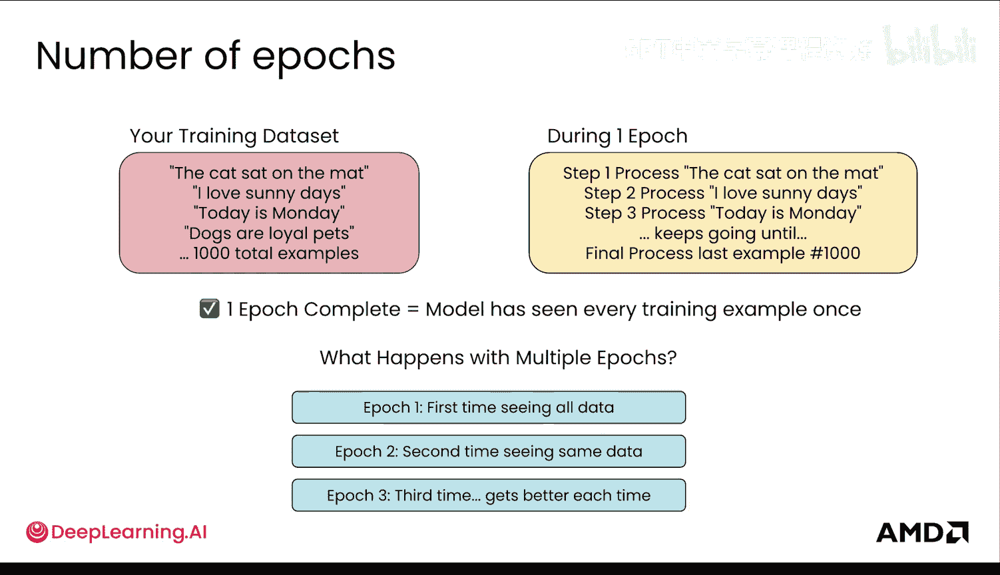

这就是为什么监控**验证损失**（后面会详细讲）并在正确的时间点停止训练至关重要。确保调整这个参数。

你也可以通过数据上的**步数**或**批次**数来调整，这比轮次数更精细。同时，你希望在每个轮次中打乱数据顺序，让模型以不同的顺序看到数据。

**快速补充**：还有一个**过度训练**的概念。有时在过度训练中，在模型停止改进并似乎开始过拟合之后，你可能会看到性能再次提升。这是当前研究中一个非常有趣的现象，通常被称为**双重下降**。

## 批次大小 📦

另一个超参数是**批次大小**。这是模型在更新权重之前一起处理的训练样本数量。

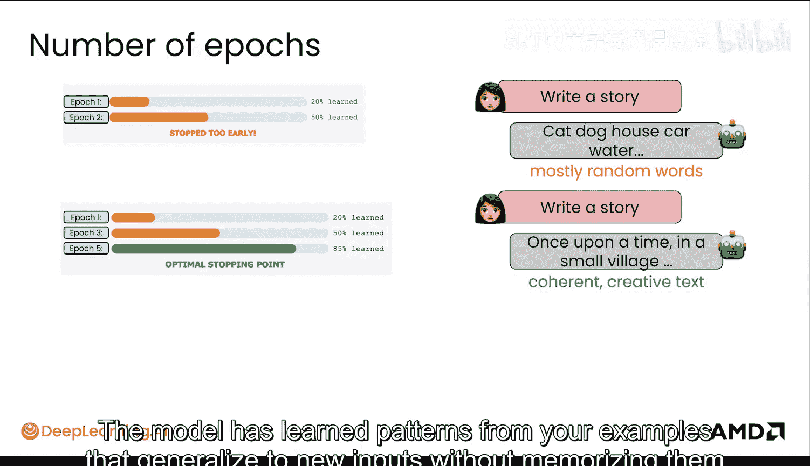

*   **小批次大小**：例如 4，模型会频繁更新以遍历整个数据集（每次处理一小批）。这导致更新次数多但每次更新幅度小，训练过程可能更嘈杂。在极端情况下，你完全可以用批次大小为 1 进行训练。
*   **大批次大小**：例如 2048，模型一次处理许多样本，因此更新次数更少，但每次更新更稳定。

小批次大小每个轮次更慢（因为更新次数多），但每次占用的 GPU 内存更少，这在硬件有限时是一个不错的选择。大批次大小每个轮次更快，但需要更多的 GPU 内存。

AMD 拥有具有巨大内存（称为高带宽内存 HBM）的 GPU，允许在单个 GPU 上运行更大的批次大小。如果你有支持它的硬件，这对于在非常大的数据集上进行训练非常理想。

除了批次大小和数据本身，具体需要多少内存当然还取决于你的模型大小以及你在该模型中更新的权重数量。

如果你设置的批次大小对于你的 GPU 来说太大，训练将因内存不足错误而崩溃。解决方法很简单：减少批次大小，直到它适合可用的 GPU 内存。

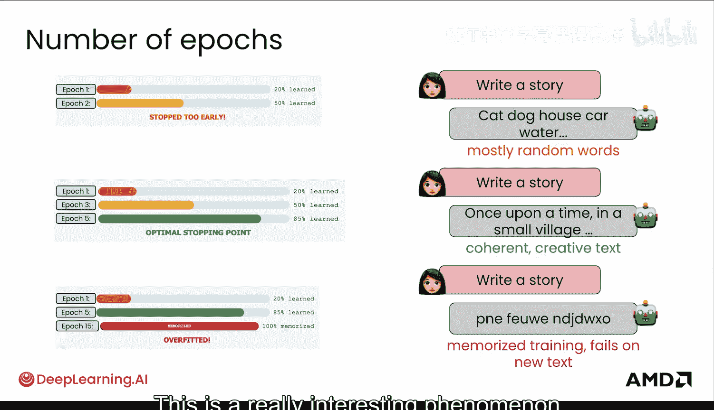

你可能已经注意到，这里提到的批次大小数字都是 2 的幂次方。这是有意为之的，目的是为了最优地利用你的 GPU。

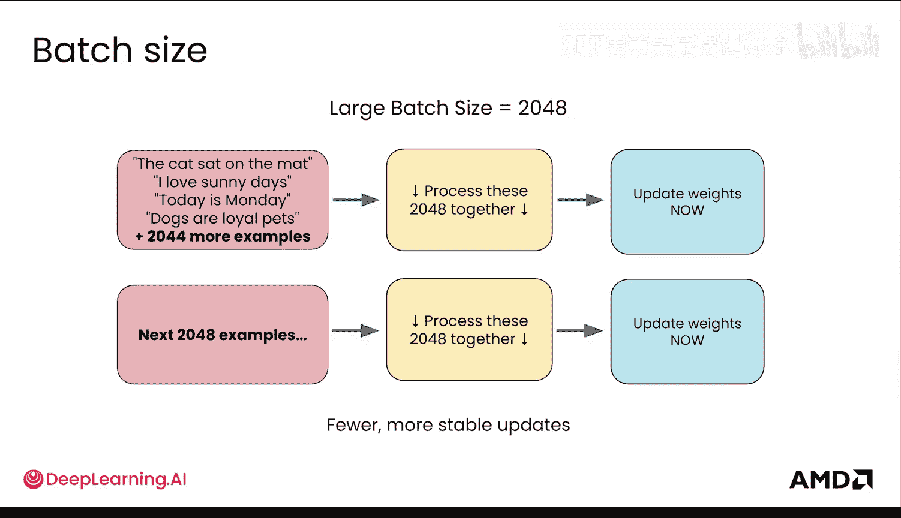

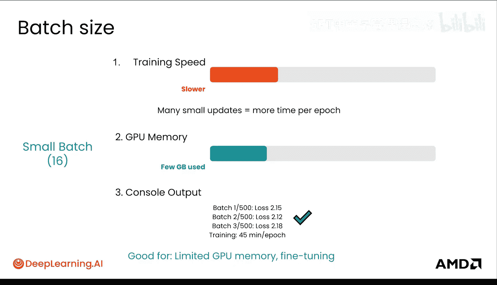

## 代码中的体现 💻

那么，这些超参数在你的代码中是什么样子的呢？以下展示了这些超参数如何出现在之前看到的训练参数中，并传递给训练器。

你可以看到为训练集设置的不同批次大小项，当然也为验证集和测试集传递了相应的参数。

```python
# 示例：在训练参数中设置超参数
training_args = TrainingArguments(
    output_dir="./results",
    learning_rate=5e-5,          # 学习率
    num_train_epochs=3,          # 训练轮次
    per_device_train_batch_size=16, # 训练批次大小
    per_device_eval_batch_size=64,  # 评估批次大小
    warmup_steps=500,            # 预热步数
    weight_decay=0.01,           # 权重衰减
    # ... 其他参数
)
```

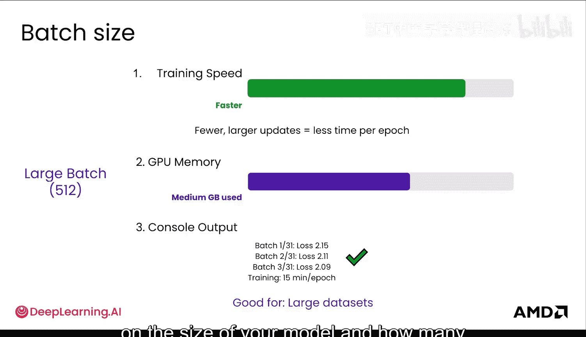

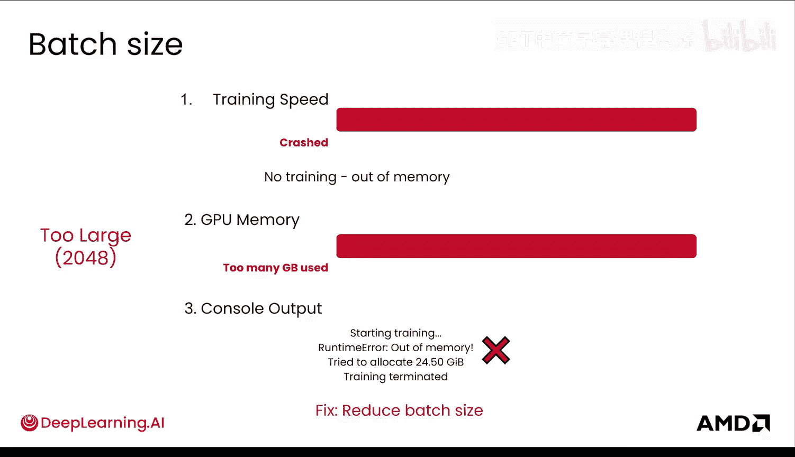

---

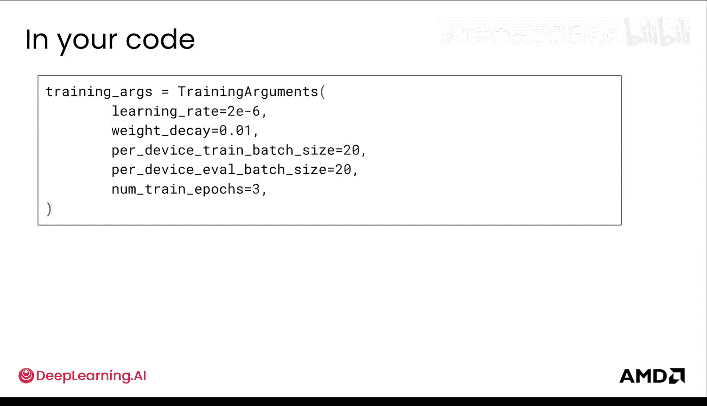

**本节课总结**：在本节课中，我们一起学习了后训练微调中的三个核心超参数：**学习率**、**训练轮次**和**批次大小**。我们了解了它们各自的作用、设置不当的影响、合理的默认值或起始点，以及如何在代码中进行配置。正确理解和调优这些参数是获得理想微调效果的基础。下一节我们将继续探讨其他重要的超参数。