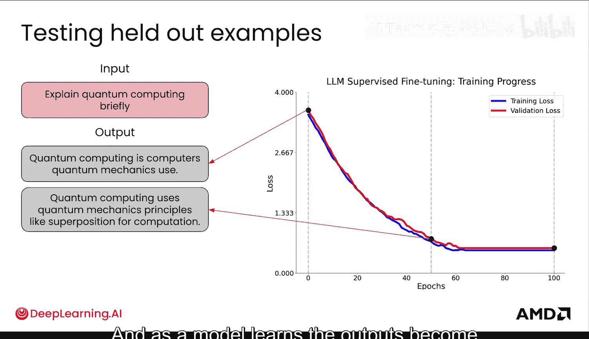
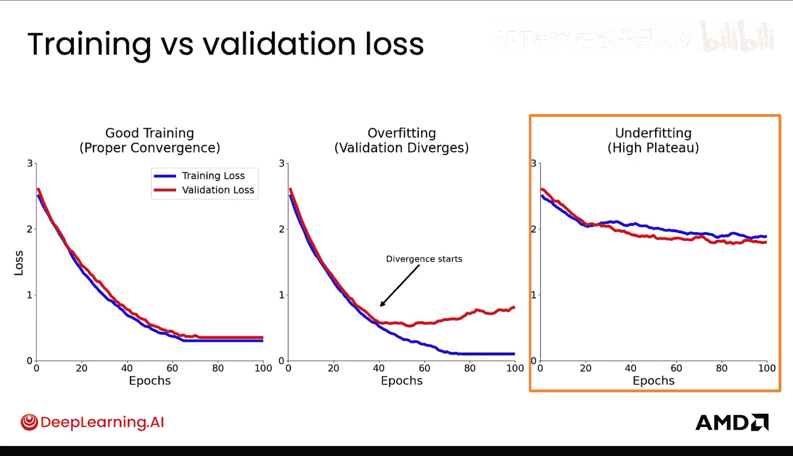
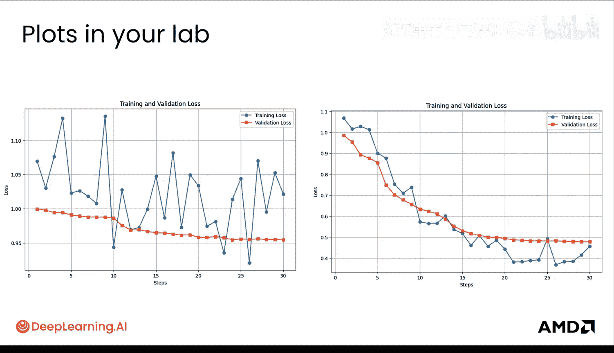
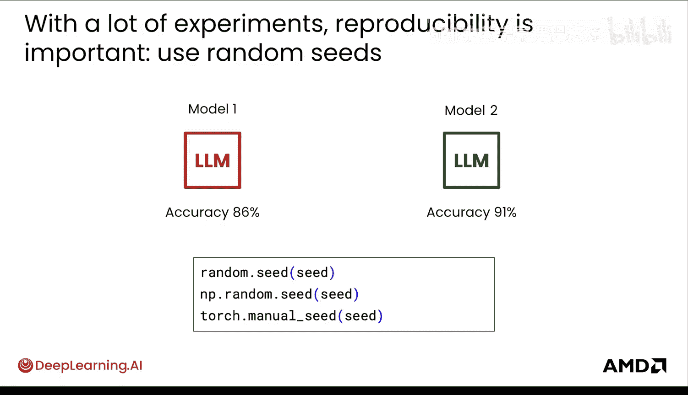

# 014：6. 微调超参数与超参数调优（第二部分）

## 📊 概述

在本节课程中，我们将学习如何通过监控模型的训练过程来判断超参数选择是否有效。我们将重点理解训练损失和验证损失这两个关键指标，并学习如何解读损失曲线以识别过拟合和欠拟合。最后，我们将探讨确保实验可复现性的重要性。

## 📈 监控模型学习进度

上一节我们介绍了超参数的基本概念，本节中我们来看看如何评估超参数设置的效果。

关键在于监控模型的学习进度。你之前已经了解了损失函数，但在训练大型语言模型时，监控损失曲线至关重要。这是理解模型性能的核心，能帮助我们调整超参数，并凭经验判断何时出现问题、何时进展顺利。这可以说是AI训练的“黑魔法”。

你通常需要跟踪两个非常重要的指标：**训练损失**和**验证损失**。

*   **训练损失**：模型在当前用于训练的数据集上计算出的误差。
*   **验证损失**：模型在一个独立的、从未见过的“留出”数据集上计算出的误差。这个数据集专门用于在训练过程中调整超参数，目标是优化（降低）验证损失。

你需要确保所有超参数的调整都是为了使得验证损失达到合适且尽可能低的水平。请注意，验证集不同于你的最终评估集或测试集，后者是另外留出的，**不会**用于调整超参数。

## 📉 解读损失曲线

随着训练的进行，我们期望模型在验证集上的输出会随着损失下降而不断改进，变得更连贯、更正确。

以下是评估模型在训练和验证损失上表现的例子：当你向模型提问一个训练数据中不存在的问题（例如“请简要解释量子计算”）时，你可以观察其输出质量的演变过程。在训练早期，模型的回答可能不完整、重复或带有预训练模型的特性。随着模型学习，其输出会变得更连贯和全面。

绘制这两种损失曲线能告诉你很多信息。尽管在后续课程中你会看到，测试集或评估集对于后训练的成功可能更为关键，但让模型稳定学习是基础前提。

在一个良好的训练过程中，两种损失都会下降并最终收敛。

*   如果**验证损失开始上升，而训练损失持续下降**，这实际上是**过拟合**的明确信号。这意味着模型正在记忆训练数据，并丧失了泛化到验证集的能力。
*   如果**两种损失都在一个较高的值上趋于平缓**，则说明模型**欠拟合**。这可能是因为模型复杂度不够，或者训练时间不足。

需要说明的是，在研究中我们发现，有时“过拟合线”并不完全是坏事，实际上有时能让模型表现更好，我们常称之为“双下降”现象。损失会先下降，再上升，然后再次下降。但这仍然是当前模型理解方面的研究课题。

以下是一些比刚才看到的更真实的损失曲线图，它们会直接出现在你的实验记录中。

左侧图表显示欠拟合，损失值过高；右侧图表则收敛良好。请注意，曲线并不完全平滑，这取决于你绘制损失的频率，以及你保存模型检查点以在验证集上运行并获取验证损失的频率。

## 🔬 开始超参数调优与确保可复现性

现在你可以开始进行超参数调优了，这个过程非常依赖经验，每个超参数的设置都颇具经验性。

其中一个最重要的建议是：**确保实验的可复现性**。只有这样，你才能知道你的实验是否真正成功，才能决定是否要推广你的新发现或技术，抑或那只是随机运气。在大量训练中，随机运气是可能发生的。

例如，由于随机性，你可能运行了两个略有不同的实验，得到了86%和91%两个不同的准确率，而没有设置任何随机种子。这可能只是多次运行产生的方差。

**随机种子**是一种控制训练中随机性的方法，例如权重初始化和数据洗牌。控制这种随机性对于调试、比较实验以及确保科学可复现性都至关重要。

你可以设置相同的随机种子，这意味着希望在不同次运行中获得理想情况下完全相同的结果。请注意，在软件栈的更底层（例如在GPU上运行的Python、NumPy或PyTorch内核级别）可能还存在其他随机性，你无法直接用Python直接控制。

虽然本课程不会深入讲解，但如果你希望深入研究，有一些关于LLM训练确定性的精彩论文，旨在使其更具可复现性。

## 🎯 总结

本节课中我们一起学习了如何通过监控训练损失和验证损失曲线来评估超参数设置的有效性，识别过拟合与欠拟合的迹象。我们还强调了在超参数调优过程中设置随机种子以确保实验可复现性的重要性。掌握了这些，你就能更有把握地引导模型进行稳定的学习。

现在你已经学会了如何调整超参数以实现良好稳定的训练，接下来，你将了解如何通过参数高效微调技术进行更高效的训练。