# 015：7. 参数高效微调 (PEFT) 🎯

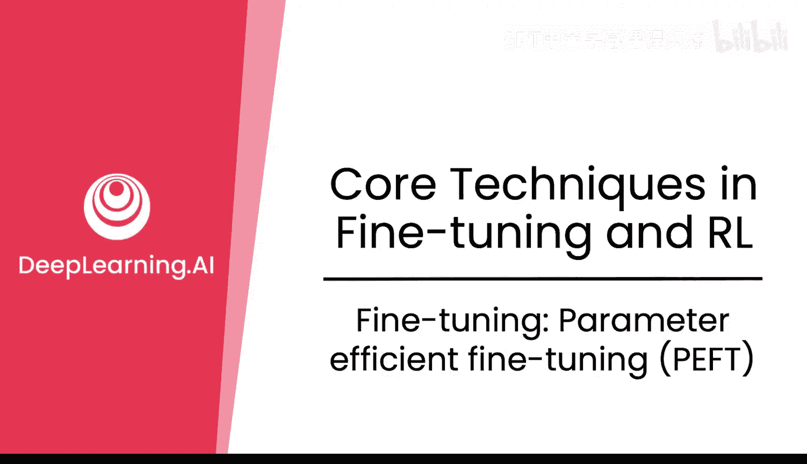

在本节课中，我们将要学习一种流行的模型微调方法——参数高效微调技术。我们将探讨其核心原理、优势以及具体实现方式，特别是深入理解LoRA这一关键技术。

---

## 概述：参数高效微调的必要性

微调整个模型成本高昂。更新所有权重意味着需要在GPU中存储梯度，这需要双倍的内存。此外，优化器也需要存储状态。因此，微调所需的内存通常是模型本身大小的两到三倍。计算这些梯度也需要更多的算力，这总体上意味着更高的成本。

如果你需要为不同的任务微调多个模型，每个模型都需要在不同的GPU上运行，因为它们体积庞大，可能无法同时放入单个GPU。这使得模型不易移植，难以在不同服务器间移动。

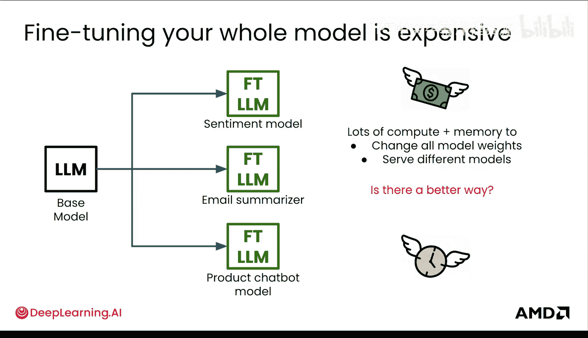

那么，有没有更好的方法呢？答案是肯定的，它源于一个非常有趣的发现。

---

## 核心发现：权重更新的低秩特性

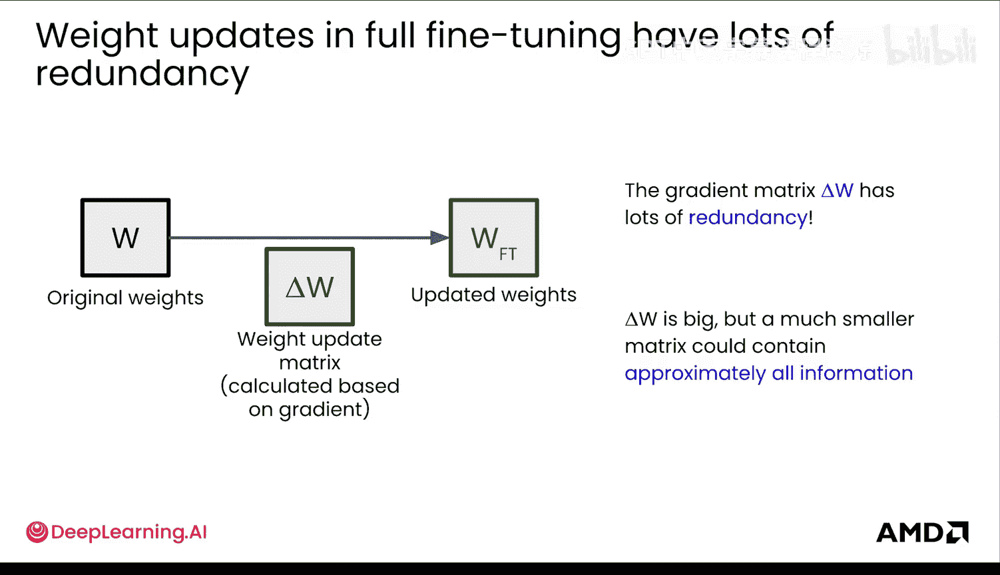

研究发现，大型语言模型在微调过程中的权重变化（即Delta W）存在大量冗余。这并非指LLM权重本身冗余，而是指基于梯度和优化器更新权重的矩阵（即权重更新）存在冗余。许多来自新微调数据的权重更新本质上是无信息的，或者说，噪声多于信号。

换一种说法，你可以用权重更新矩阵中少得多的参数来相当准确地表示微调过程中的语言模型变化。这相当于用更少的参数捕捉主要信号，并丢弃噪声。

为了直观地证明这一点，你可以对权重更新矩阵进行奇异值分解。你会发现，大部分信息实际上可以由前几个奇异值表示。这意味着其余方向贡献甚微，通常可以被近似忽略。

在线性代数中，这意味着权重更新矩阵可以近似为**低秩矩阵**，即一个更小的矩阵。这能极大地节省参数。

---

## 低秩近似与适配器

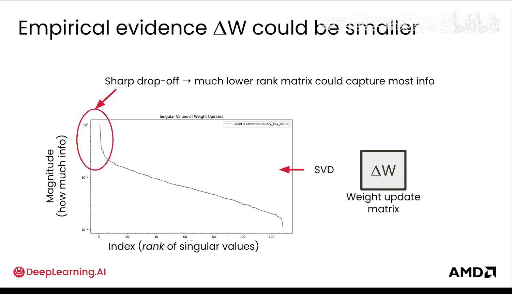

这意味着更新可以变得更小，而基础模型可以保持冻结状态。训练时，这些较小的更新权重通常被称为**适配器**。

更直观地理解，微调期间的权重更新更像是“粗线条”的调整，而非“精雕细琢”。也许应该称之为“粗调”而非“微调”。

通过一个类比来理解：在左侧，你有多个独立的微调模型。但在右侧，你可以拥有多个适配器，它们可以共享同一个基础模型。这在存储上带来了巨大的节省。

---

## 低秩分解的实现原理

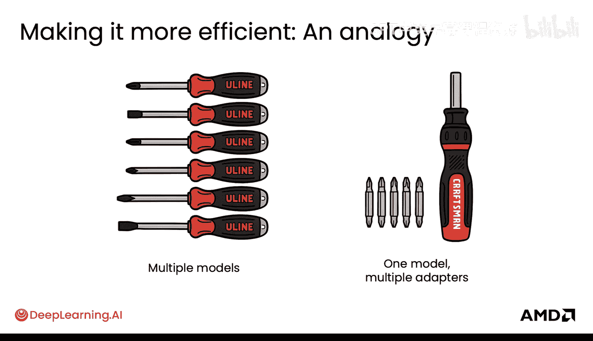

既然节省如此显著，如何实现这个低秩矩阵呢？这依赖于一种称为**秩分解**的基础矩阵运算。它本质上是**有损压缩**或一种**矩阵去噪**的方法，只保留高信号部分。

例如，一个大型矩阵可能是100x100，总共有一百万个参数。但它实际上可以分解为两个较小的矩阵，其秩为2，这将参数减少到仅4000个。这非常惊人，因为这意味着需要训练和存储在内存中的参数减少了250倍。

我们可以将其推广到秩R。这里的R是一个超参数，代表分解矩阵的最大秩。理想情况下，秩R应远小于原始矩阵的维度。如果秩相同，那就回到了完全微调。

---

## 超参数R与Alpha

在最初的LoRA论文中，**R=4**通常是一个不错的起点。但实际上，最佳值因任务而异。更令人惊讶的是，秩为1也常常有效。对于强化学习，秩为1通常表现良好。你也不需要为每个LoRA层设置相同的秩，但这属于更深入的研究范畴。

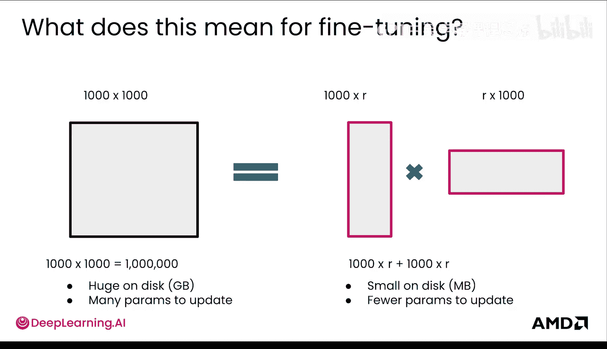

像所有超参数一样，你需要根据放置LoRA的层数，最重要的是你的**数据集大小**，来经验性地找到合适的R。较小的数据集和变化可能允许使用较小的R，而较大的更新可能需要较大的R。

其他超参数也会改变。例如，对于LoRA，通常建议使用比完全微调高10倍的学习率。

---

## LoRA的工作原理

现在你了解了低秩分解，接下来看看它是如何具体实现的。

放大到一个权重矩阵：该矩阵接收输入X，经过所有层修改后，输出隐藏状态，该状态随后由后续层处理，计算损失并进行反向传播。这是常规的完全微调过程。在某个时刻，该矩阵的权重在完全微调中被更新，所有权重基本都被改变，因此Delta W的大小等于所有权重。

为了理解LoRA中发生的情况，可以将其单独移出。你可以看到，完整的Delta W权重实际上可以用那些LoRA矩阵来近似。这些矩阵通过点积运算创建一个Delta W矩阵，然后接收输入X并输出隐藏状态，其余部分相同。

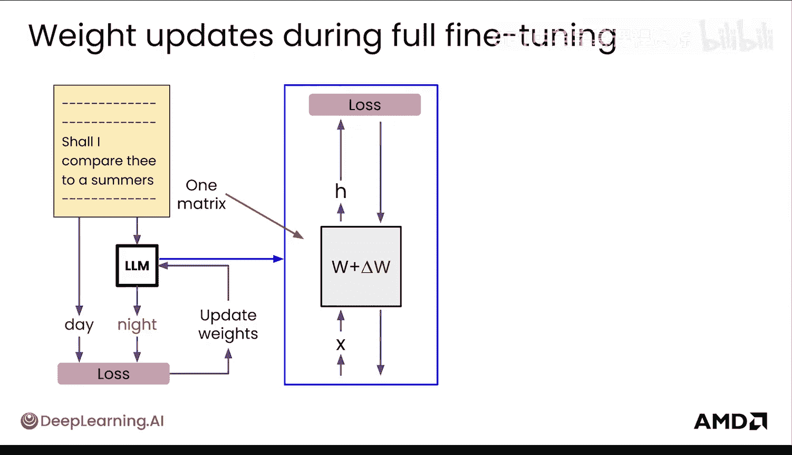

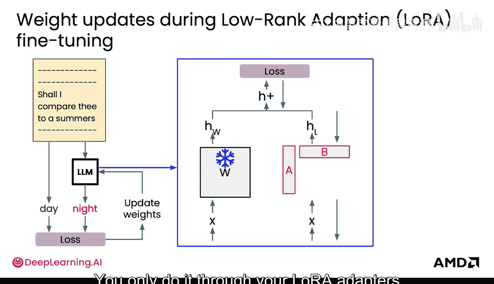

但真正有趣的是，你的主要权重全部被冻结，当反向传播发生时，你只通过那个Delta W进行，即只通过你的LoRA适配器进行。这为你节省了大量资源。

---

## LoRA在模型中的位置

如果你观察一个标准的LLM架构，你会看到解码器块，其中有前馈层和自注意力层。最初的LoRA论文研究了在自注意力块中添加适配器。最近的研究也表明可以将LoRA应用于所有层，而不仅仅是注意力层。你可以自行实验哪种方式最适合你。

具体来说，LoRA论文研究了在查询和值矩阵上添加LoRA，如下图所示，其余权重保持冻结。这样你就知道LoRA被添加在哪里了。

如果你对深入研究LoRA感到好奇，你经常会看到LoRA图表由这些梯形表示（如原始论文所示），用以示意矩阵的秩变小。但从技术上讲，矩阵应该更准确地用之前看到的矩形矩阵来描绘。

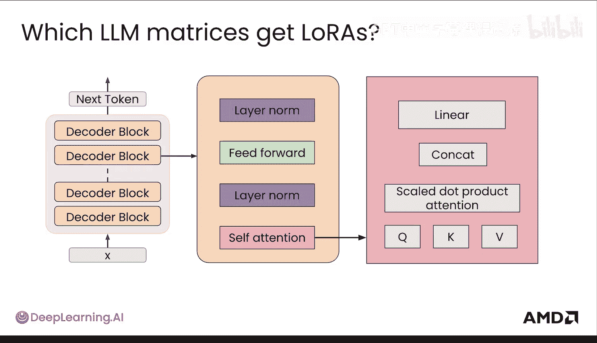

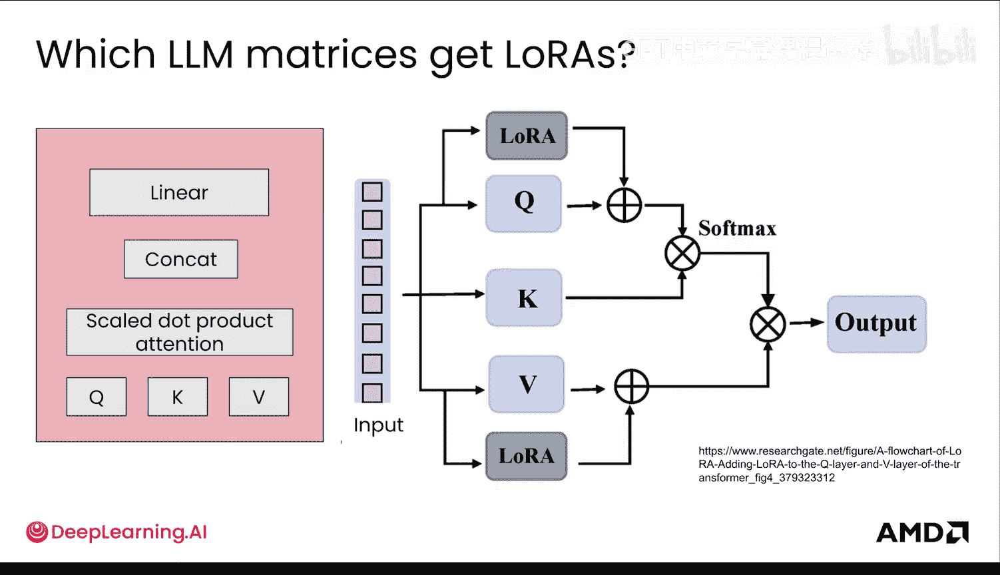

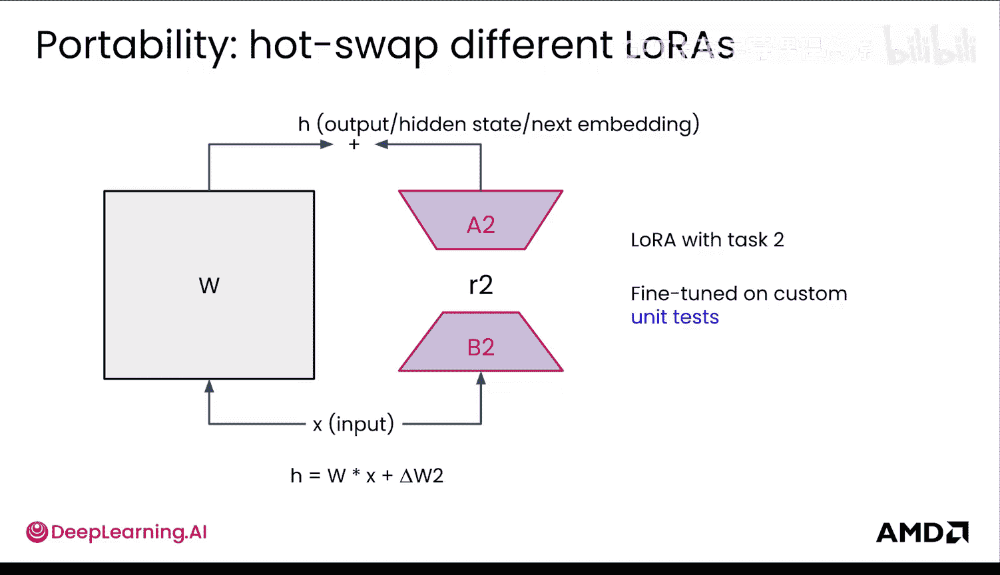

---

## 内存节省对比

你听到了这么多关于节省GPU内存的讨论，现在是时候进行对比了。

顶部是常规的完全微调。底部是LoRA。
1.  首先，无论如何都需要将整个基础模型装入GPU内存。这部分两者相同。
2.  其次，你需要为LoRA适配器添加空间。它通常比这里显示的要小得多，这里只是为了展示和可视化。
3.  接着，你需要为整个模型的梯度分配内存。对于LoRA，这部分可以非常小，远小于这里显示的，即使是0.1%也可能。这里展示的是一个较大的LoRA（25%）。
4.  下一部分取决于优化器，但本质上是依赖于梯度内存的优化器状态。
5.  最后，前向传播需要为LoRA多分配一点内存，特别是如果你期望热切换它们。不过，LoRA也可以融合回模型中，以获得与常规前向传递相同的计算效率。

显然，LoRA能让你在此处节省大量内存。这是一个对完全微调非常慷慨的描绘，LoRA实际上可以节省比这多得多的资源。

---

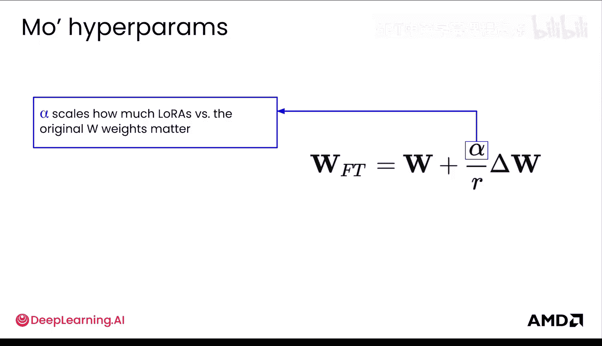

## 实践与总结

现在你理解了LoRA，可以开始用它进行构建了。有许多开源框架可以帮助你。

**优点**是你可以非常快速地开始，有时甚至可以在本地进行。通常，LoRA是开始进行微调的首选方式。
**缺点**在于超参数调优。尽管情况正在改变，但与常规完全微调相比，目前可用的优秀默认值较少。当然，本地训练通常只针对较小的模型。

在Hugging Face Transformers及其参数高效微调库中，你可以看到秩R和alpha超参数。你还可以看到LoRA被附加在查询和值矩阵上。你可以添加自己的配置，你只需要获取任何模型，然后用LoRA配置的LoRA模型包装它即可。

LoRA属于更广泛的**参数高效微调**技术集合的一部分，这些技术使得微调或一般性地更新LLM变得更加高效。这通常用于微调，但也将用于你接下来要学习的强化学习中。

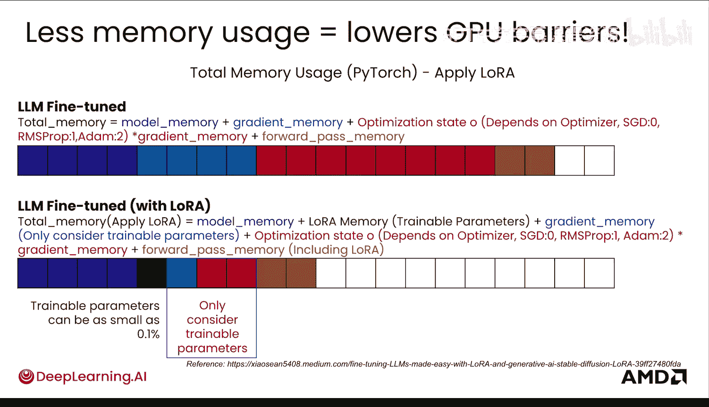

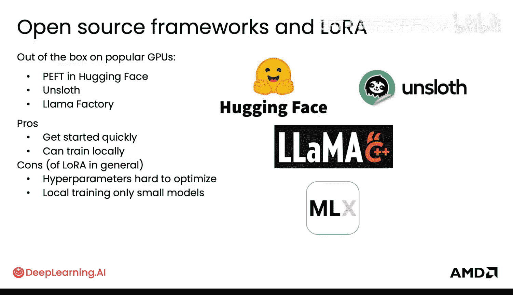

---

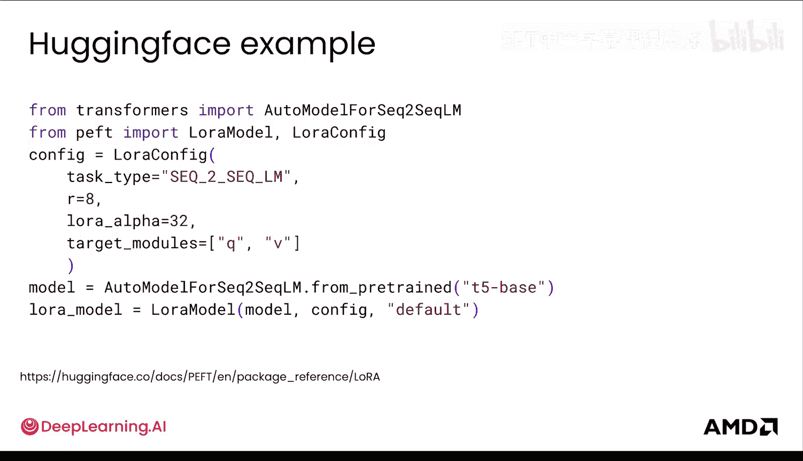

## 总结

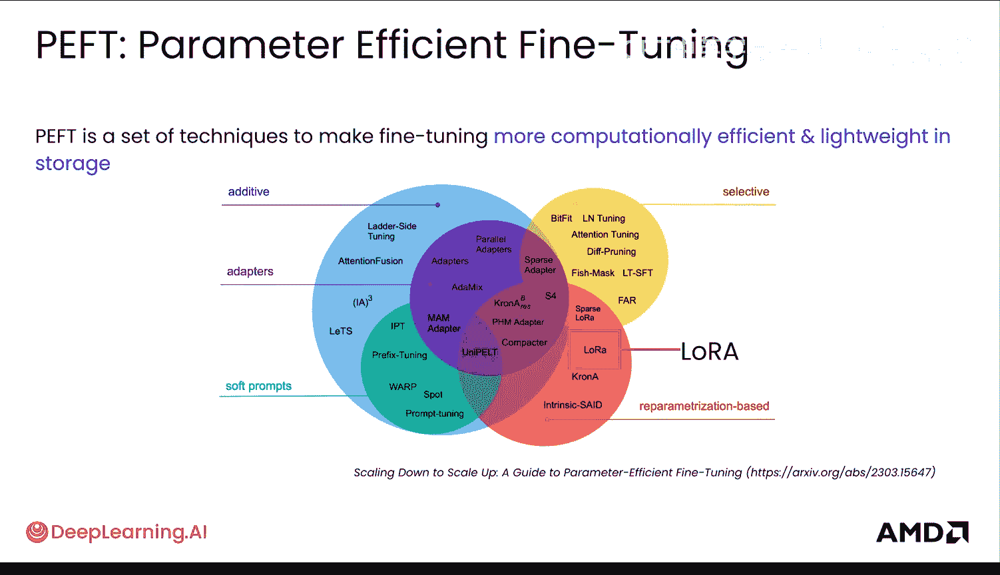

本节课中，我们一起学习了参数高效微调的核心概念。我们了解到完全微调的成本和局限性，并深入探讨了LoRA技术如何通过低秩分解来近似权重更新，从而大幅降低内存和计算需求。我们还了解了LoRA的关键超参数及其在模型中的具体应用位置。最后，我们对比了LoRA与完全微调在内存使用上的差异，并指出了其优缺点。掌握PEFT技术，特别是LoRA，是高效进行大模型定制化迭代的关键一步。