# 016：奖励与偏好学习

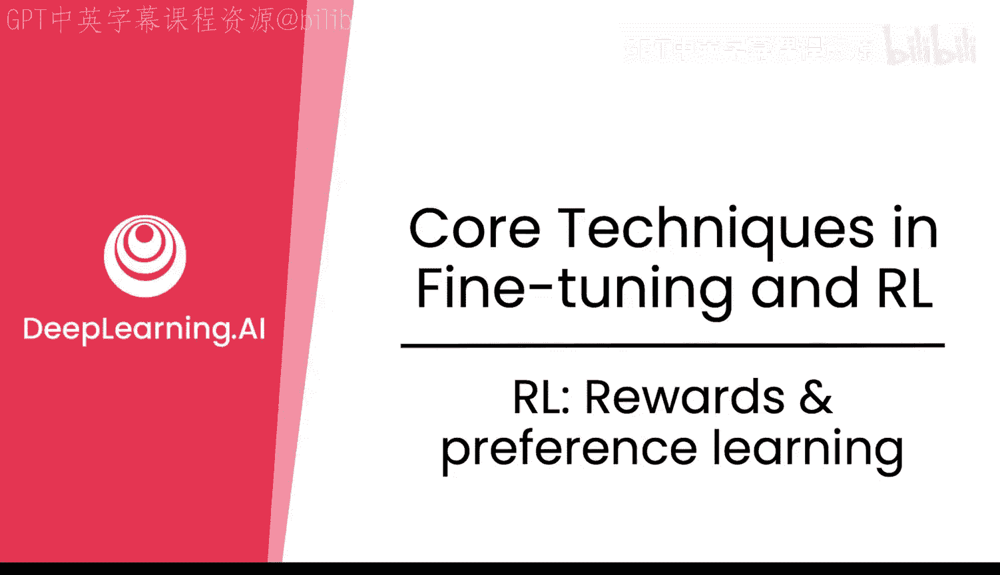

在本节课中，我们将要学习强化学习中的核心概念——奖励，以及如何通过偏好学习来训练一个奖励模型。我们将探讨奖励在强化学习中的作用，它与微调的区别，以及如何构建和使用奖励模型与验证器。

## 奖励：强化学习的核心驱动力

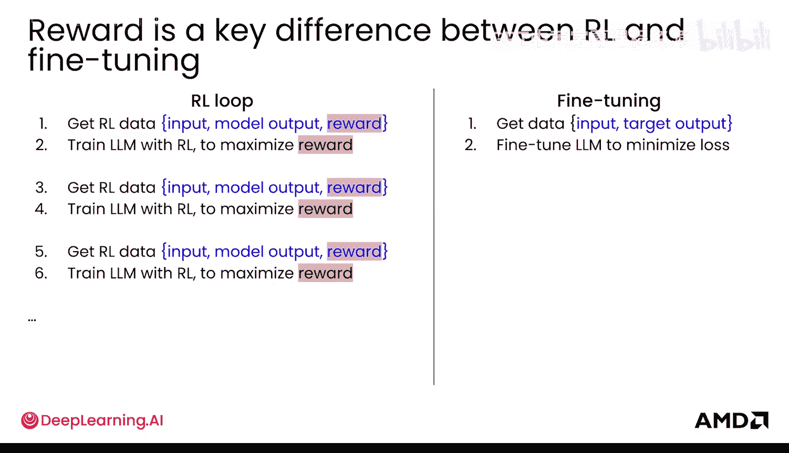

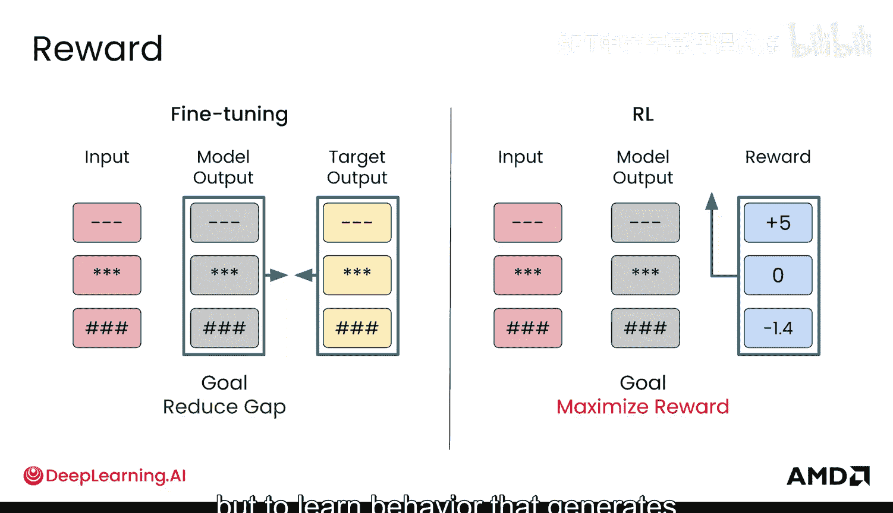

奖励是强化学习中最核心的概念之一。它是一个单一的标量数值，可以是正数或负数。通常，一个好的模型响应会获得正奖励（如+1），而一个坏的响应会获得负奖励（如-1），类似于一种惩罚。

## 强化学习与微调的关键区别

上一节我们介绍了奖励的基本概念，本节中我们来看看强化学习与微调之间的几个关键区别。

首先，强化学习涉及一个数据收集、训练、再收集、再训练的循环过程，而不仅仅是先收集所有数据再进行一次性训练。其次，两者的输入虽然都需要一批输入数据，但强化学习没有明确的目标输出。强化学习中的输出是模型的预测，其目的是为了计算奖励。奖励正是强化学习与微调之间的关键差异所在。

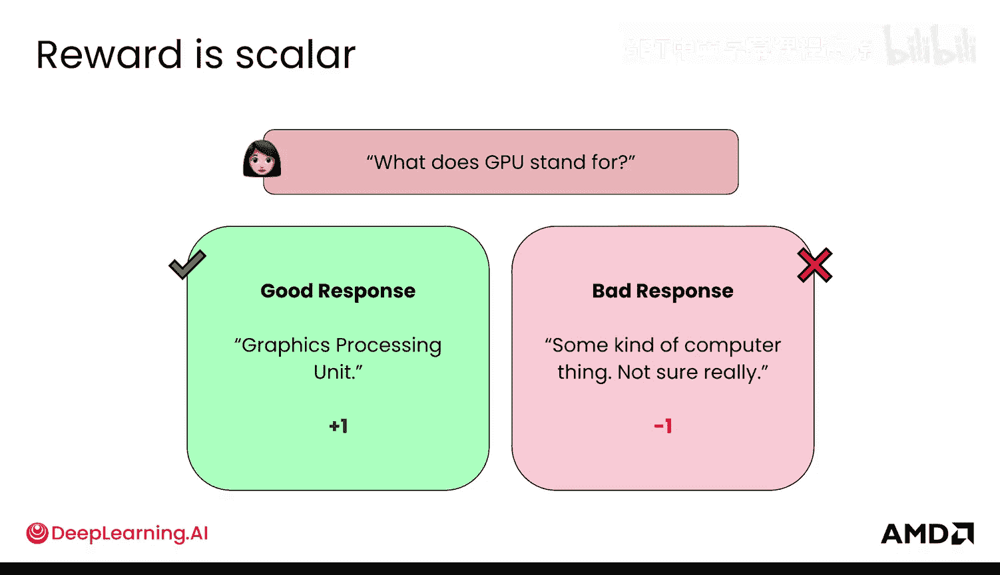

在微调中，你有一个明确正确的目标输出，你的目标是通过最小化损失函数来缩小目标输出与模型预测输出之间的差距。在强化学习中，情况则大不相同。这里没有单一正确或目标输出。相反，对于给定的输入和输出，你提供一个奖励，这是一个数值分数，用于告诉模型该响应的好坏程度。强化学习的目标不是匹配特定目标，而是学习一种行为，以生成能够最大化此奖励的输出。

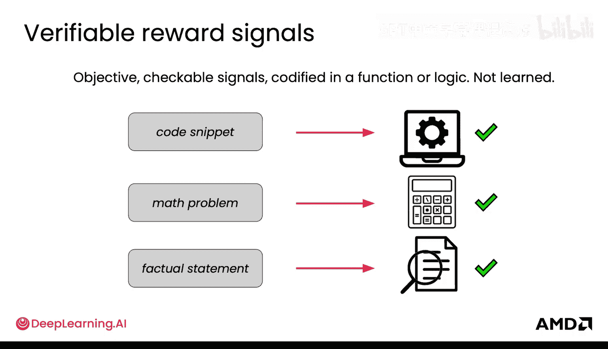

## 获取奖励：验证器

那么，具体如何获取奖励呢？最简单的方法之一是使用可验证的信号或验证器。这些验证器依赖于客观标准。

以下是使用验证器的一些例子：
*   如果模型生成代码，验证器可以检查代码是否能编译或运行无误。
*   如果模型生成数学解答，验证器可以检查其是否得出了正确的最终答案。

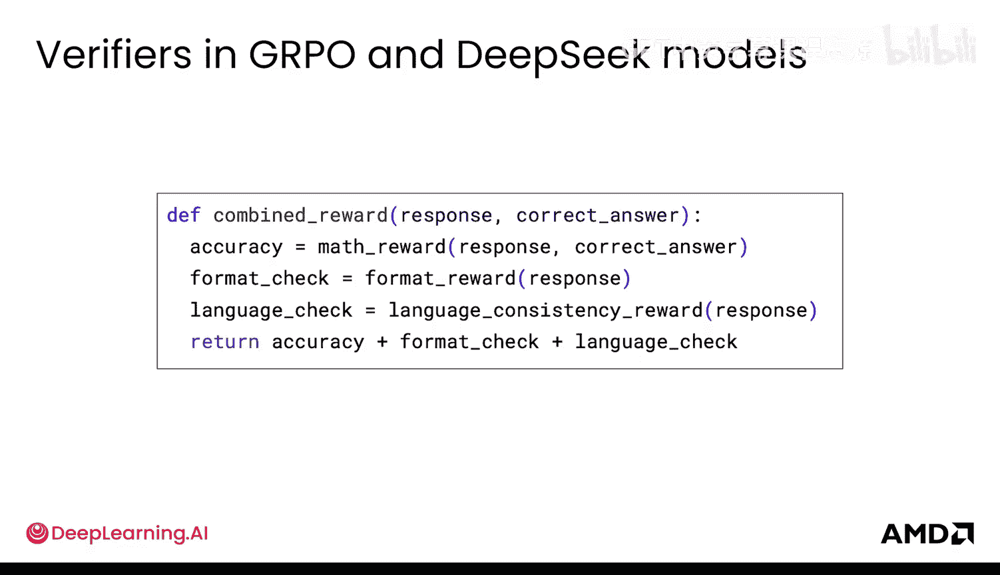

这可能会让人困惑，因为微调似乎也会检查数学问题是否正确。区别在于：在微调中，模型必须输出与目标完全一致的响应字符串。如果响应中包含推理步骤，但推理过程与目标不完全相同，模型也会受到惩罚。而在强化学习中，模型在其推理过程中即使输出一些无意义的内容，只要最终答案正确，仍然可以获得正奖励。

验证器通常是一个脚本或程序，而不是人。它们就像是给出奖励的检查器。例如，DeepSeek的模型就非常著名地使用了验证器。他们的DeepSeek-R1-Zero模型实际上只使用了两个验证器，并完全通过强化学习进行训练。一个验证器用于检查数学问题的答案是否正确，另一个用于检查模型的响应格式是否使用了特定的推理标签。仅凭这两个验证器就实现了强大的效果。

另一个例子是DeepSeek-R1模型，它使用了一个奖励函数来惩罚混合语言（特别是中英文混合），以确保输出只使用一种语言，从而提高人类可读性。

为了了解这些验证器如何组合成单一的奖励信号，这里有一个简单的求和公式：`combined_reward = sum(programmatic_checks)`。这个组合奖励函数展示了如何在准确性、格式和一致性等多个目标之间进行平衡。

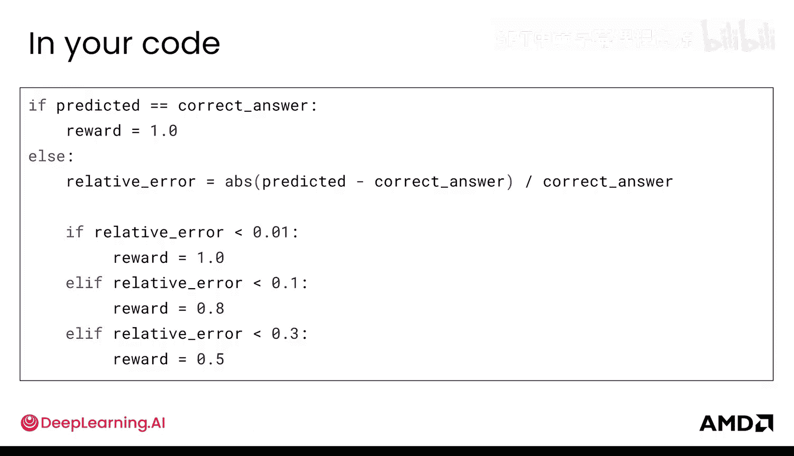

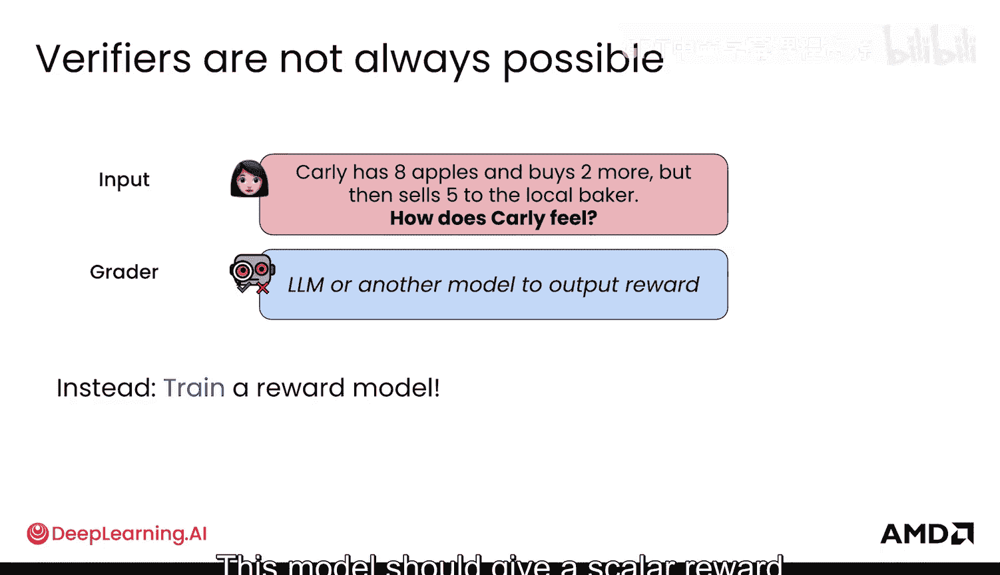

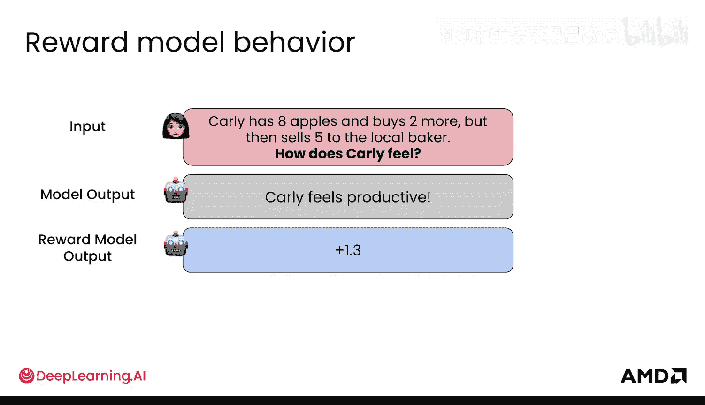

在你的实验代码中，你可以这样操作：如果模型预测了正确答案（即使推理错误），可以给予奖励1；或者，你可以根据错误的程度给予部分奖励，为模型提供一些关于偏离程度的线索。

## 验证器的局限性与解决方案

这一切看起来如此简单，那么有什么陷阱呢？验证器只适用于具有明确可验证标准的领域。你可以检查数学是否正确，但可能无法通过编程方式验证模型是否具有同理心或是否乐于助人。

这里的解决方案是训练或使用另一个模型。你可以使用一个语言模型作为评判者，或者更常见的做法是训练一个奖励模型。这在基于人类反馈的强化学习中很常用。这个模型应该根据其学习到的标准输出一个标量奖励。你希望你的奖励模型在给定一个输出时，能输出一个标量奖励（例如+1.3），并且希望这个标量能匹配你关心的输出质量，比如是否乐于助人或态度友好，在其他情况下也可能是安全或可靠。

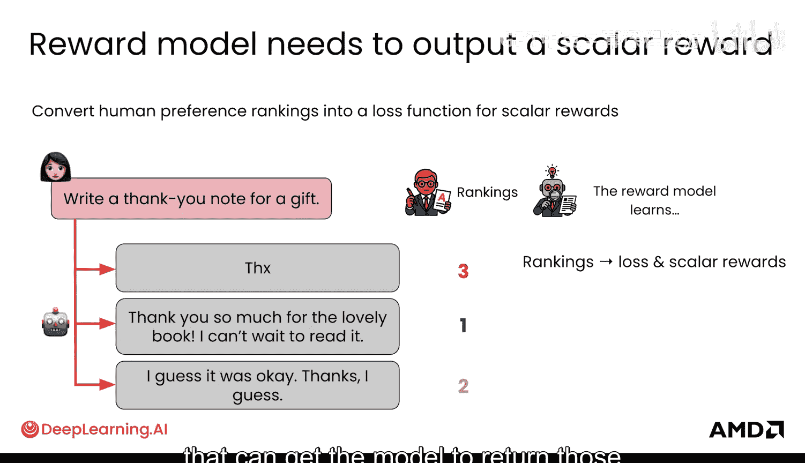

## 训练奖励模型：偏好学习

现在，让我们深入探讨奖励模型是如何训练的。目标是编码人类的偏好。事实证明，有一种方法可以获取人类对多个模型输出的排名，并将其作为数据来微调一个语言模型，使其成为奖励模型。

以下是训练奖励模型的基本步骤：
1.  首先，向一个人展示多个模型响应，由人工标注者对它们进行排名。
2.  奖励模型在这些数据上进行训练。它不学习如何写作或输出那些推理内容，它只学习这些排名模式。
3.  原始的排名本身通常不能直接用于训练。你需要将这些排名转化为可用于训练损失函数的形式，使模型能在每个输出上返回标量奖励。

具体来说，你可以将排名转化为偏好对。例如，如果人类标注者认为输出A优于输出B，你就得到了一个偏好对 (A, B)。接下来，让奖励模型分别预测输出A和输出B的奖励值。由于我们知道人类更偏好A，我们希望最大化A的奖励与B的奖励之间的差值。这意味着你的奖励模型会给偏好的A赋予高奖励，给不太偏好的B赋予低奖励。

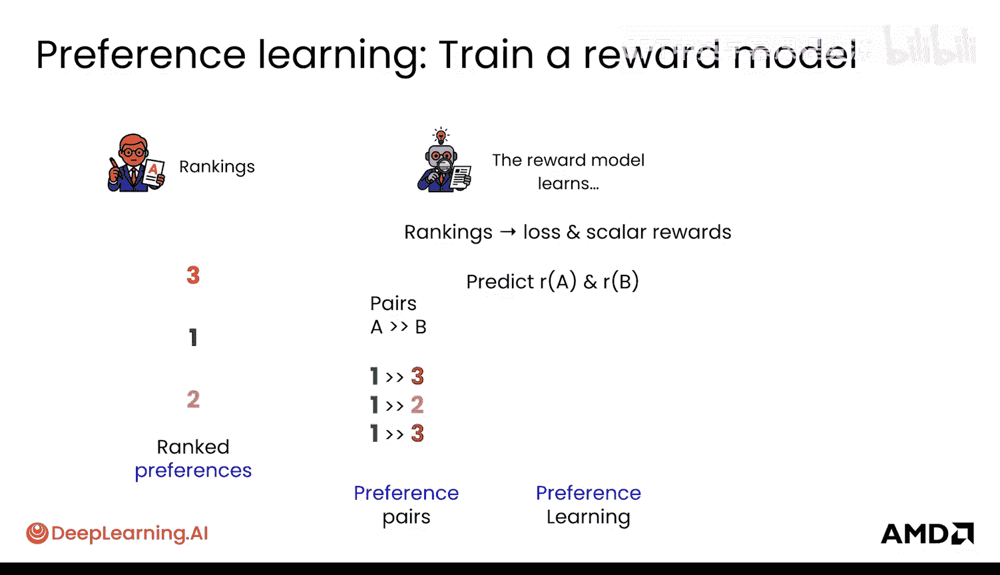

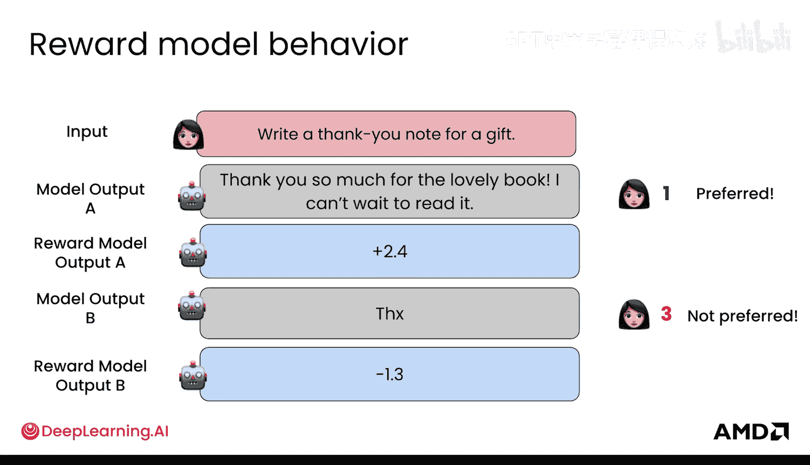

为了将其转化为概率，你可以使用该差值的sigmoid函数。直观地说，这基本上得到了A远优于B并被更偏好的概率。如果sigmoid值接近1或100%，意味着A的奖励远大于B；如果两者相同，则为0.5。这样，你就得到了损失函数。之后，进行标准的微调操作来训练模型。

这个过程被称为偏好学习。它通常涉及微调一个语言模型的头部，使其输出一个标量值。奖励模型也常被称为偏好模型，它们是同一个模型。

偏好对不一定需要由人来提供，也可以由另一个语言模型生成。偏好学习过程用于获取奖励模型，它也被用于ChatGPT的训练中。在ChatGPT中，这个过程被称为基于人类反馈的强化学习。首先，从模型中采样多个输出，然后由人类标注者对这些响应从好到坏进行排名。接着，将这些排名转化为偏好对，并用这些偏好数据来训练一个奖励模型，以输出奖励并编码这些偏好信息。

## 奖励模型与验证器的比较

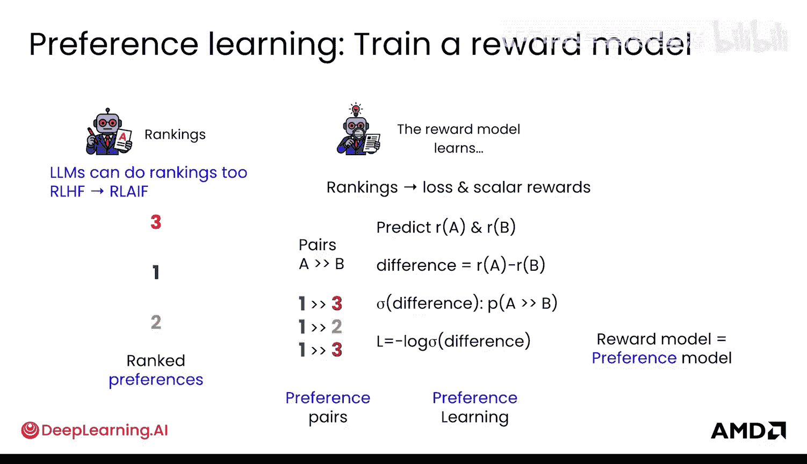

你已经了解了验证器和奖励模型，现在来对它们进行一些比较。在实际应用中，你通常会同时使用两者，但用于编码不同的东西。

对于奖励模型，其流程是：收集人类偏好数据（如排名），训练奖励模型，然后使用奖励模型来学习代表人类偏好的奖励信号。对于验证器，流程有些类似：定义客观指标，实现检查器或函数，并以编程方式生成这些信号。

奖励模型最大的优点之一是，如果你无法确切写出验证器所需的具体函数，你可以使用数据来代表你的目标。但困难之处在于，你的数据可能被奖励模型以某种不完美的方式学习。此外，由于它不是完全客观的，奖励模型可能被“欺骗”，你的主模型可能会找到一种方法从奖励模型那里获得高奖励，即使输出并不好。

对于验证器，有时难点在于运行验证器的计算开销。有时你需要在成千上万的样本上运行验证器，如果验证器检查某种代码的速度非常慢，那么它就不是一个反馈给强化学习循环中模型的好信号。

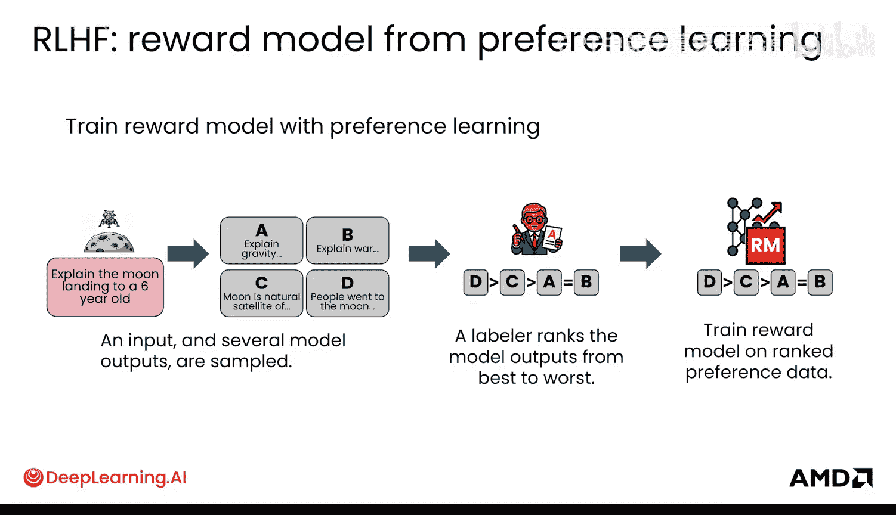

因此，它们适用于不同的任务：
*   **奖励模型**对于相当主观的任务至关重要，例如使模型与人类价值观对齐、改进对话、使模型交互更愉快。
*   **可验证的奖励（验证器）**则完美适用于更客观的任务，例如事实正确性、数学问题或代码。

## 整合到强化学习数据流中

现在，让我们将这些概念与你的强化学习数据流联系起来。

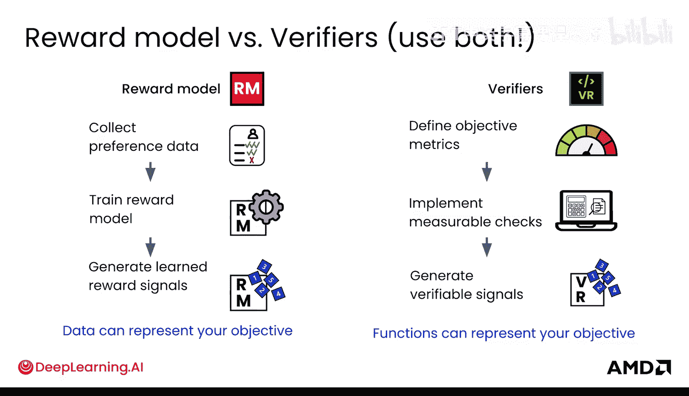

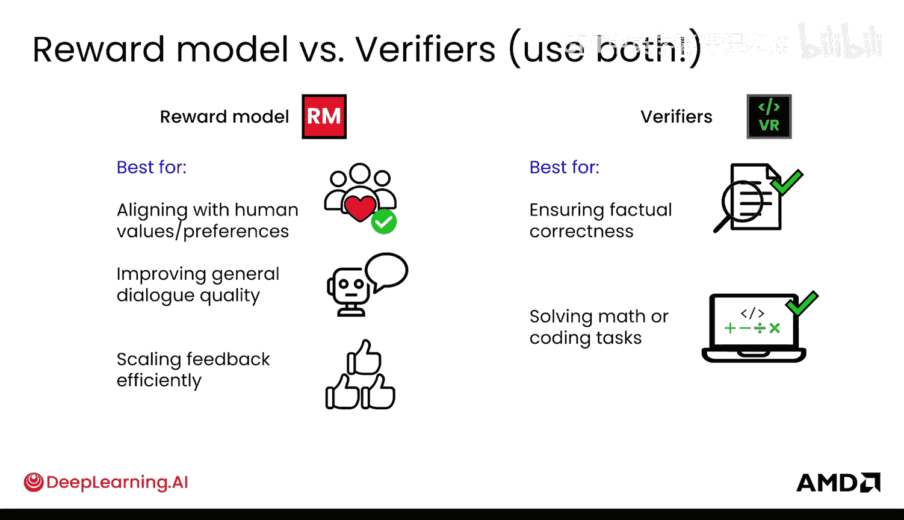

首先，给定你的输入，你会得到模型输出，这被称为“展开”。如果你使用奖励模型，你可能会获得偏好数据，然后将其转化为偏好对。你的数据将看起来像这样，用于训练你的奖励模型。你的奖励模型可以产生标量奖励，类似于你的验证器。这些奖励被应用到你的“展开”上，从而得到一条“轨迹”。轨迹包含输入、模型输出和奖励。然后，你使用这些轨迹，通过强化学习来训练你的语言模型，以最大化该奖励。当然，这里存在一个循环：生成数据、应用奖励、获取轨迹，然后最大化奖励。

## 总结

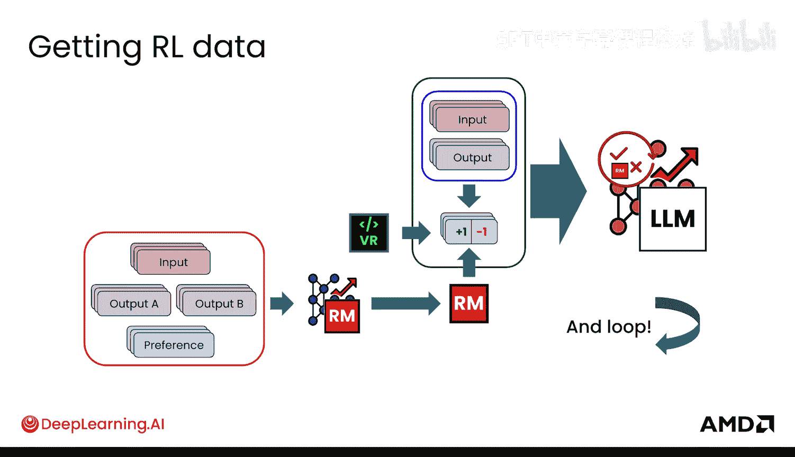

本节课中，我们一起学习了强化学习中的奖励概念以及如何通过偏好学习来训练奖励模型。我们探讨了奖励作为标量数值的核心作用，比较了强化学习与微调在目标和流程上的根本区别。我们介绍了两种获取奖励信号的主要方法：基于客观标准的验证器和基于人类偏好数据的奖励模型。我们详细讲解了偏好学习的步骤，包括从人类排名到偏好对的转化，以及如何训练模型输出代表偏好的标量奖励。最后，我们比较了奖励模型与验证器的优缺点及适用场景，并将它们整合到完整的强化学习数据循环中。理解这些概念是掌握如何利用奖励信号来引导语言模型行为的关键一步。