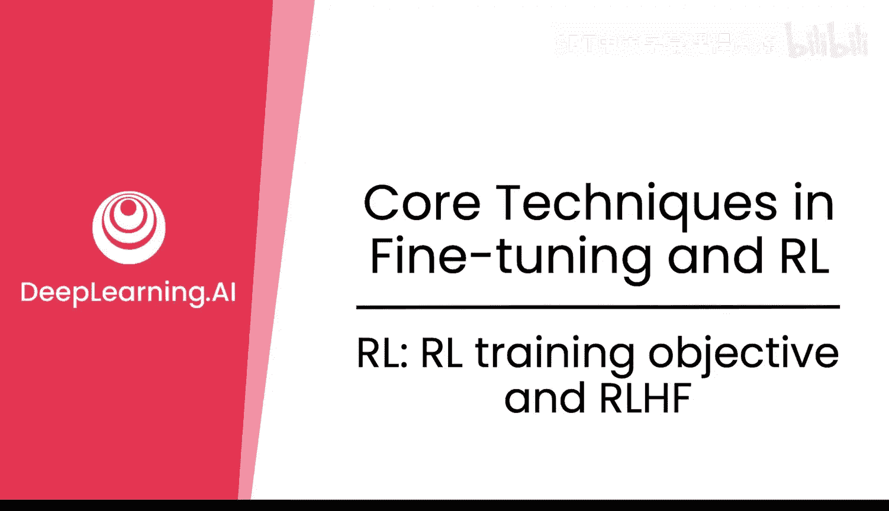
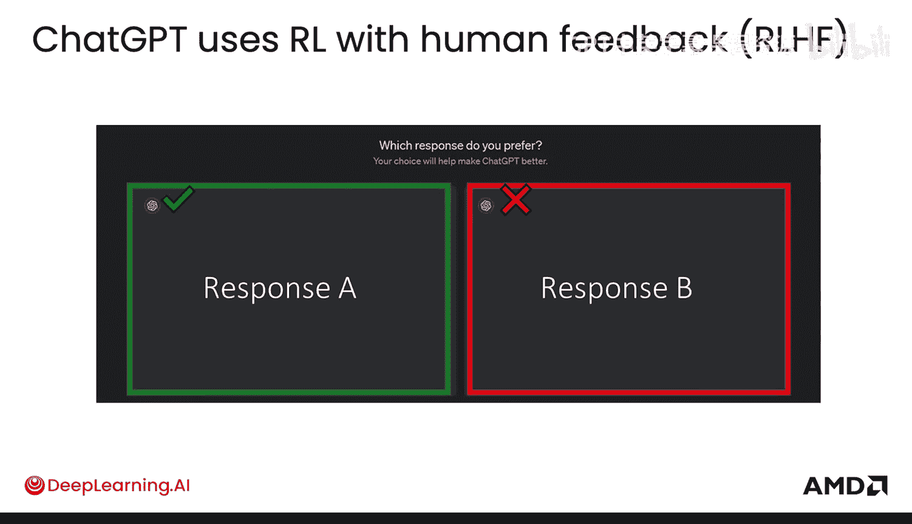
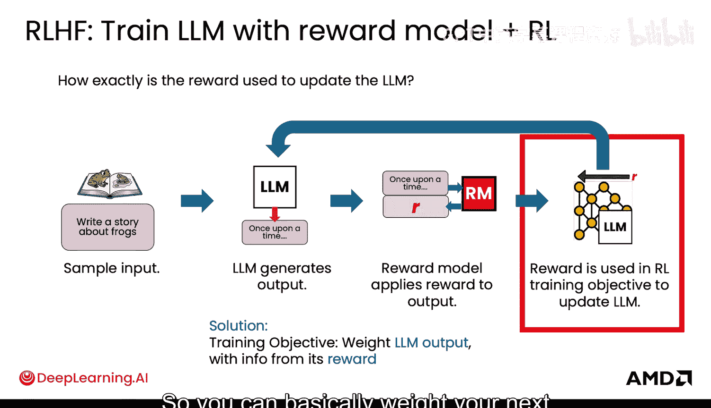
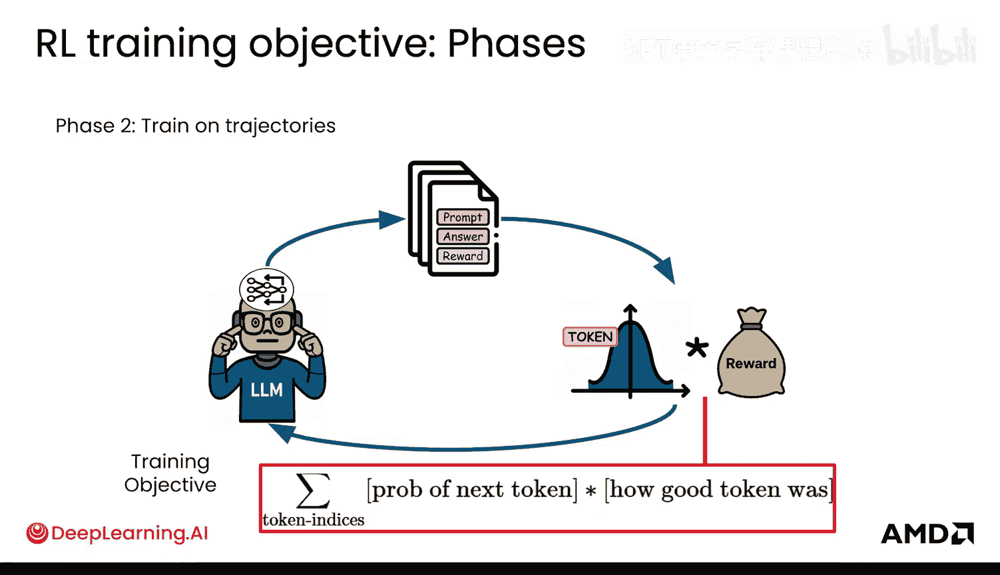
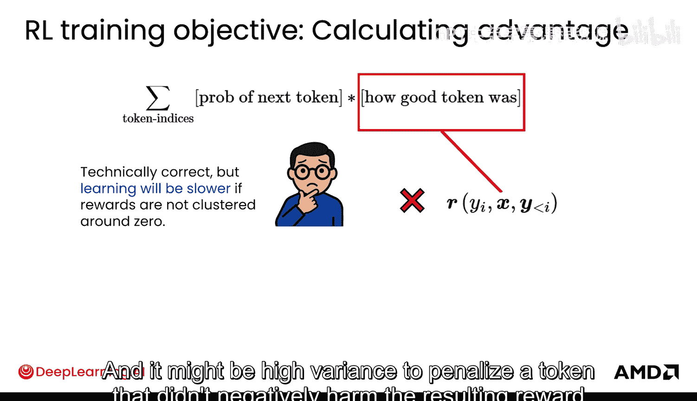
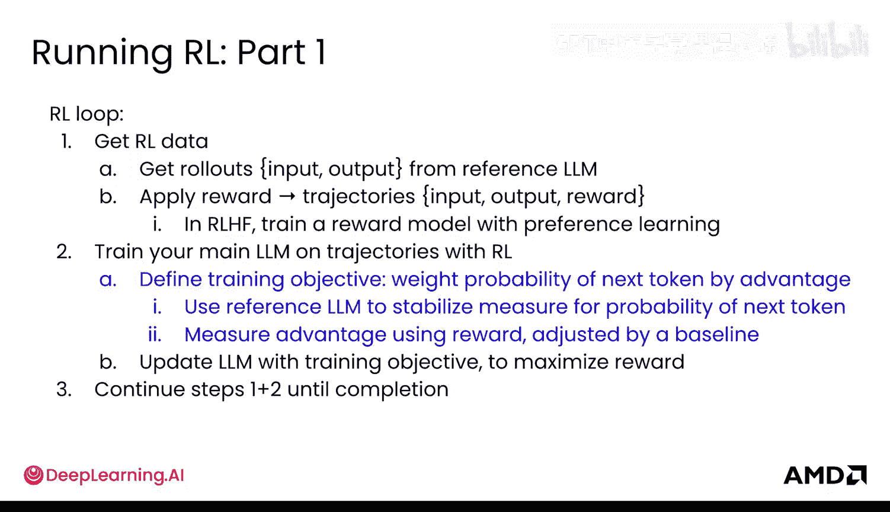
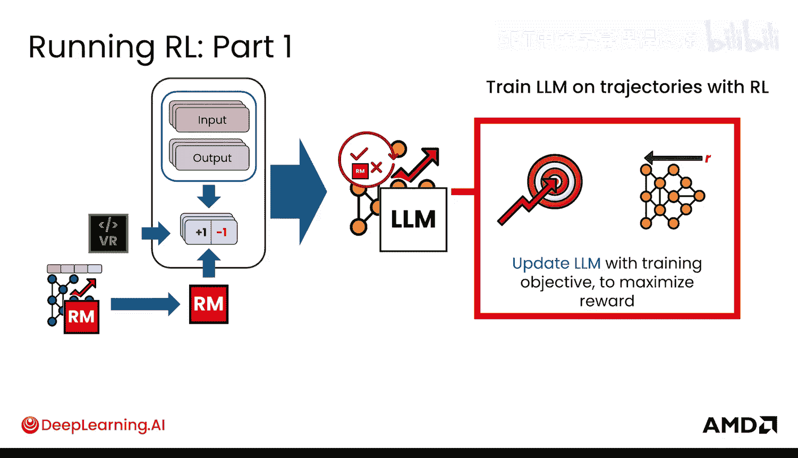
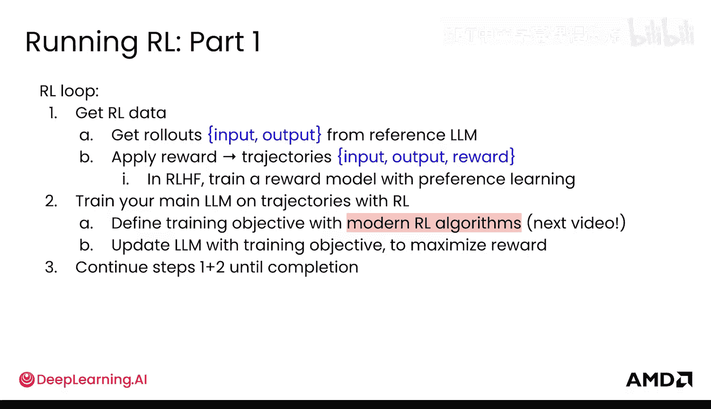

# 017：RL训练目标与RLHF

在本节课程中，我们将深入探讨强化学习训练的核心：如何定义训练目标。我们将从人类反馈强化学习的基本流程开始，逐步拆解其背后的数学原理和实现细节，并解释为何需要引入参考模型和基线值来稳定训练过程。

## 强化学习训练的目标

强化学习训练的目标是最大化奖励。

但如何具体定义训练目标？我们将在接下来的内容中详细探讨。

## RLHF流程概览

如果你使用过ChatGPT，你可能见过这样的界面：系统给出两个回复选项A和B，并询问你的偏好。这是RLHF的第一步，即收集人类反馈数据。RLHF是ChatGPT最初使用的核心流程。

本质上，RLHF使用了一个通过人类标注员排序偏好学习得到的奖励模型。流程如下：采样一个输入，大型语言模型生成一个输出，然后奖励模型对该输出应用奖励，得到轨迹。接着，该奖励被用于强化学习训练目标中，以更新大型语言模型。

## 核心挑战：奖励不可微分

目标是反向传播奖励信息以更新模型，使模型能够最大化奖励。但这里存在一个主要问题：**奖励不是直接可微分的**。你无法简单地反向传播奖励，因为奖励不在梯度中。

如果奖励来自验证器，则没有权重可供反向传播。即使使用奖励模型，奖励仍然不是LLM输出的可微分函数。因此，如何调整模型，使其产生能获得更高奖励的输出，是一个挑战。

此外，LLM输出是一个样本，它被传递给奖励函数。从奖励模型权重反向传播，经过采样操作，以获取语言模型权重，这个过程非常棘手。

## 解决方案：加权令牌概率

因此，训练目标可以转变为：**增加导致高奖励的令牌的生成概率，并降低导致低奖励的令牌的生成概率**。具体做法是，根据该输出获得的奖励来加权其下一个令牌的概率。

以下是训练循环的回顾：
1.  获取数据。
2.  进行训练，在训练中定义目标。

具体到RLHF中：你获得轨迹，应用奖励。你通过偏好学习训练一个奖励模型来应用该奖励，然后你使用强化学习在这些轨迹上训练你的语言模型。在此过程中，你使用轨迹来定义训练目标，以反向传播奖励信息，然后你用该训练目标更新你的语言模型以最大化奖励，并循环此过程。

## 深入训练目标

现在，让我们深入探讨这个训练目标。你正在用奖励对语言模型的输出进行加权。

更技术性地说，你是在用该令牌的“好坏程度”（基于奖励）来加权语言模型输出中某个输出令牌的概率。

首先看第一项：下一个令牌的概率。这部分很直接，它来自你的语言模型，因为它输出的是下一个令牌的概率。理论上这没问题，但实际上，由于计算原因，考虑到你实际更新语言模型和收集数据的方式，这有些不稳定。

## 实践中的两阶段训练

在实践中，训练通常分为两个阶段：
1.  **数据收集阶段**：语言模型读取所有输入提示，生成答案输出，并为每个输出获取奖励。你得到这个轨迹数据集。这个阶段通常是离线的，意味着它独立完成，没有实时更新的模型。你生成大量输出，并使用你的奖励模型对它们进行评分。你可以通过大批量高效地生成这些数据，所做的只是运行推理，然后在那些轨迹上运行你的奖励模型推理。
2.  **训练阶段**：你通常在静态的轨迹数据集上进行训练。目标仍然是最大化给定令牌的概率（由其奖励或“好坏程度”加权）。你通常以比第一阶段数据收集小得多的批次进行循环。这是因为训练对内存和计算的要求很高。这就是为什么在实践中通常是两个阶段。你很快就会看到强化学习训练在计算上是多么昂贵和密集，因为它涉及许多模型。

## 稳定性挑战与参考模型

第一阶段的数据是由当时存在的模型生成的。但在第二阶段，你不断更新模型。模型随着每一个批次而变化，这意味着它现在分配的概率与实际生成数据时的概率不同。这造成了不匹配，并使训练过程非常不稳定。

解决这个问题的方法是使用一个**参考模型**。你保存一份原始更新前模型的副本，这就是数据收集时使用的模型。你不是使用当前模型的概率，而是使用当前模型的概率相对于参考模型概率的比率。直观地说，这个比率告诉你模型改变了多少以及它是如何改变的。如果比率大于1，意味着你的新模型比参考模型更有可能产生某个令牌；如果小于1，则可能性更低。这通过将更新锚定到一个固定的参考点来稳定训练。稳定性将是强化学习训练中反复出现的主题，因为它大多数时候都非常不稳定。

现在，你从一个参考语言模型获得了你的轨迹数据。

## 奖励项与基线值

现在看看方程的另一半：奖励项，即令牌的“好坏程度”。使用原始奖励是有效的，但它可能效率低下，并导致大的噪声梯度，从而引起训练波动。此外，如何将序列级别的奖励分配到各个令牌上也不明确。奖励是序列级别的，不是令牌级别的。惩罚一个没有对最终奖励产生负面影响的令牌，或者反之，可能会带来高方差。

因此，你需要为每个令牌估计一个**基线值**，即你期望模型对于特定令牌获得的奖励，然后你根据它超出或未达到期望的程度进行反向传播。这也使学习更加稳定。

试想，如果你的所有奖励都是正的，模型将试图一直增加所有令牌的概率，只是某些令牌增加得更多一些。如果所有奖励都是负的，情况类似。学习会变慢，因为很难区分它们。最佳实践是让奖励集中在零附近，这样你就有正负奖励的混合。当然，也有一些研究对此提出挑战，所以请自行尝试。这里只是按照RLHF最初的做法进行。

使奖励围绕零中心化的方法是引入某种类型的基线，并从奖励中减去该基线以使其中心化。同样，这个基线是每个令牌的平均或期望奖励。你得到的中心化奖励，即令牌超出或未达到期望的程度，在强化学习文献中通常被称为**优势函数**。优势函数表示你的令牌有多好。

回顾一下，从奖励中减去基线得到的结果值称为优势。如果一个响应的优势是正的，说明它比平均或期望的要好；如果是负的，则更差。这为模型提供了更清晰的信号：增加具有正优势的令牌的概率，降低具有负优势的令牌的概率。请注意，计算优势的方法有很多，你将在下一个视频中探索另一种方法。

这是一个通过估计期望奖励使奖励围绕0中心化的简单技巧，它已被证明能显著加速学习。这是一张来自Sutton和Barto的《强化学习导论》教科书的图表。在这个案例中，他们的强化学习算法称为REINFORCE，使用基线后学习速度更快。图中的绿色线比红色线更快地达到了更高的奖励。

## 模型与计算开销

现在你有了用奖励更新语言模型的训练目标。

让我们稍作总结。到目前为止，你需要跟踪两个模型：
1.  你正在学习的语言模型：由于梯度和优化器状态，它占用更多内存。
2.  用于生成轨迹的冻结参考语言模型。

提前透露一下，在下一个视频中，你将看到有四个模型在起作用。你已经学习了如何训练奖励模型，而基线估计将来自第四个模型。这就是为什么强化学习如此消耗内存，并且需要大量的计算机内存和GPU来运行，特别是与你之前看到的监督微调相比。希望随着我们找到更高效的方法，这种情况会随着时间的推移而改变。

## 本节总结

现在你有了训练目标。数据在这里，你通过用优势加权下一个令牌的概率来定义你的训练目标。你使用参考语言模型来稳定下一个令牌概率的度量，并通过用基线调整奖励来度量优势。然后你用这个训练目标更新你的语言模型以最大化奖励，并循环此过程。

很好，这就是强化学习中通用且基本的训练目标。在下一个视频中，你将探索如何定义一些现代的训练目标，包括RLHF所使用的确切目标。

你已经学习了如何以基本方式定义训练目标。现在，让我们看看现代强化学习算法PPO和GRPO是如何定义强化学习训练目标的。