# 018：PPO与GRPO算法详解 🧠

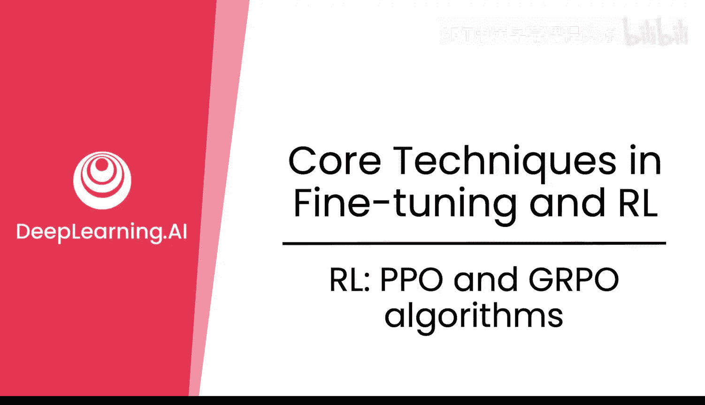

在本节课中，我们将学习两种最流行的强化学习训练算法：近端策略优化（PPO）和分组相对策略优化（GRPO）。我们将深入探讨它们的目标函数、工作原理以及核心区别。

## 概述

上一节我们介绍了强化学习训练的基本目标。本节中，我们来看看两种实现该目标的具体算法：PPO和GRPO。这两种算法都旨在通过最大化奖励来优化模型策略，但在计算优势和基线的方式上有所不同。

## 重温强化学习训练目标

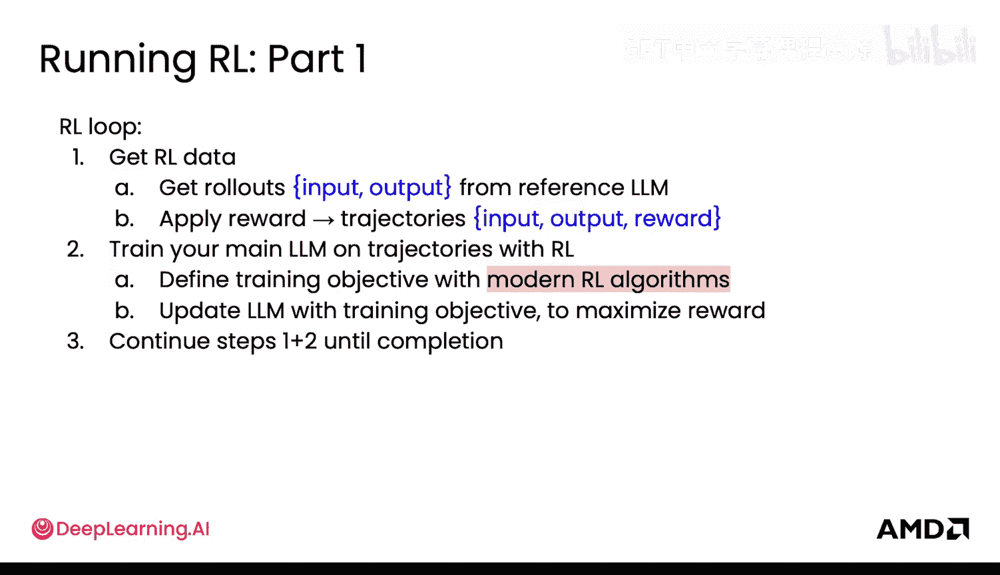

首先，我们回顾一下之前学到的强化学习训练目标。其核心是最大化某个概率项与某个奖励项的乘积之和。为了获得更好的性能，概率项是当前模型与生成数据（或“推演”）的参考语言模型之间的比率，而奖励项应该是经过基线中心化的优势函数。这引出了一个问题：如何计算基线 `b` 来计算优势？有多种方法，本视频将介绍其中几种。

## PPO：近端策略优化

PPO是RLHF中使用的标准方法。其标准做法是训练另一个模型作为基线。这个模型的唯一任务是预测每个标记的预期奖励，而不仅仅是整个输出序列的奖励，即使在生成过程中也是如此。它使用实际奖励作为目标标签，通过常规的监督微调进行训练。

这使得我们可以计算每个标记步骤的优势，而不仅仅是整个响应的优势。对最终奖励贡献更多或更少的标记将获得不同的权重。

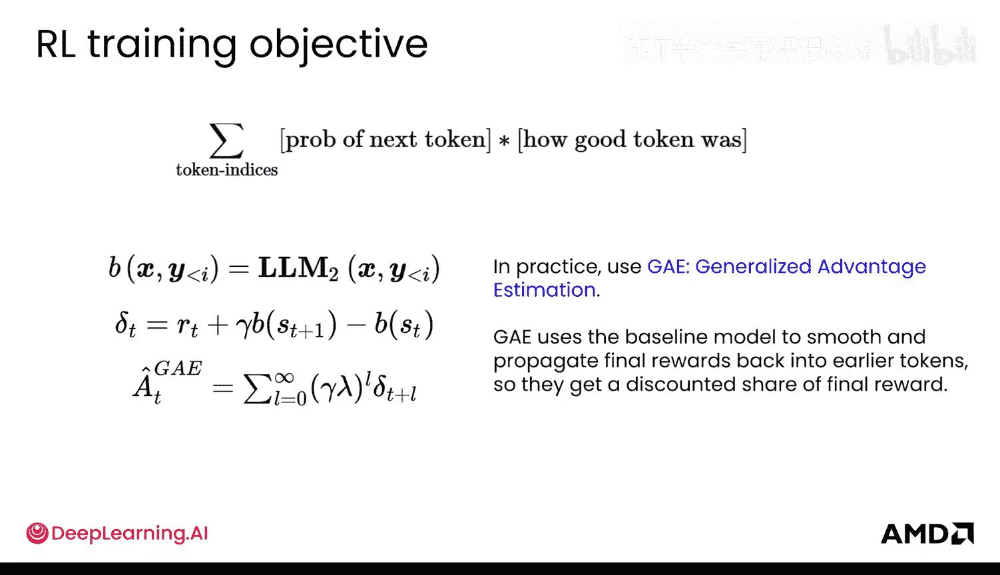

在实践中，这通常通过为同一个语言模型添加一个新的“头”来实现，用于预测每个标记的预期奖励。

为了使每个标记的奖励估计更准确和平滑，通常会使用优势函数估计器，如广义优势估计（GAE）。GAE使用基线模型将最终奖励反向传播到更早的标记，因此更早的标记会因最终结果而获得功劳或责备，并通过某个折扣因子携带先前的奖励。这平滑了跨标记的奖励。

具体的数学公式如下所示，但了解每个细节并不重要，只需知道这是实践中用于估计优势的方法。

```math
A_t^{GAE(γ, λ)} = \sum_{l=0}^{∞} (γλ)^l δ_{t+l}
其中 δ_t = r_t + γ V(s_{t+1}) - V(s_t)
```

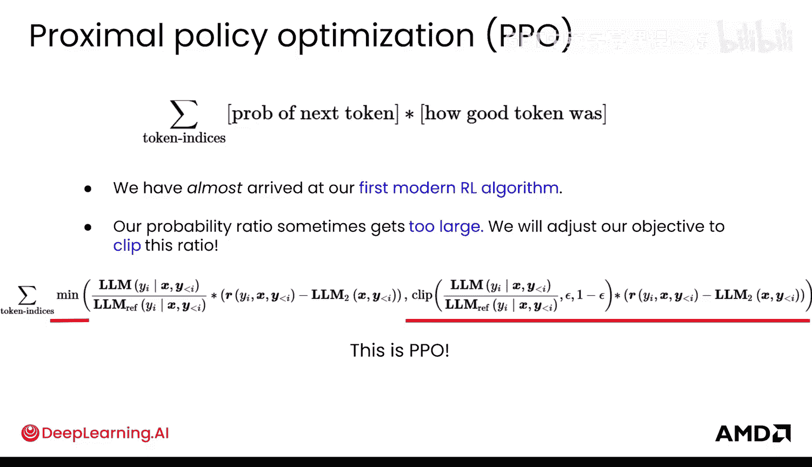

这引出了第一个算法：近端策略优化（PPO）。还有一个最终的要点：有时概率比率会变得非常大，这可能导致巨大且不稳定的更新。PPO通过“裁剪”这个比率来解决这个问题。

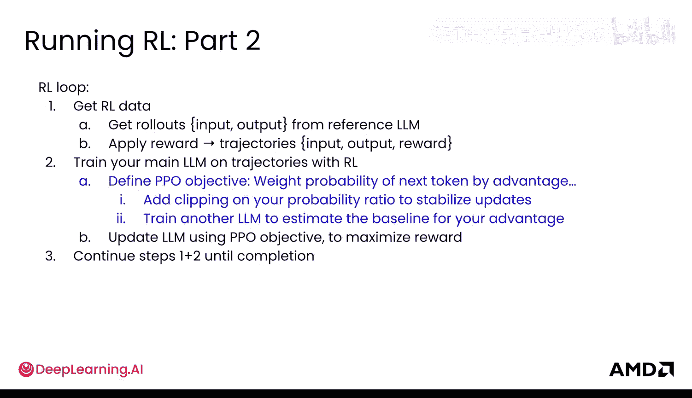

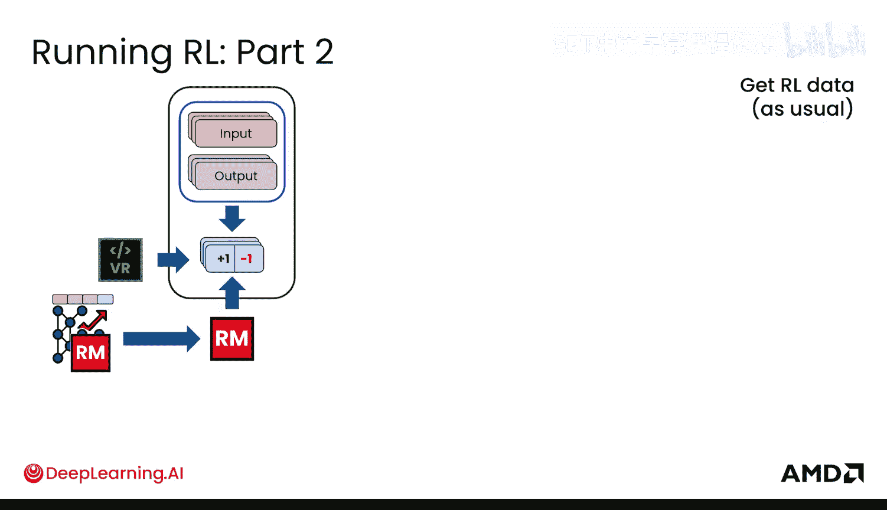

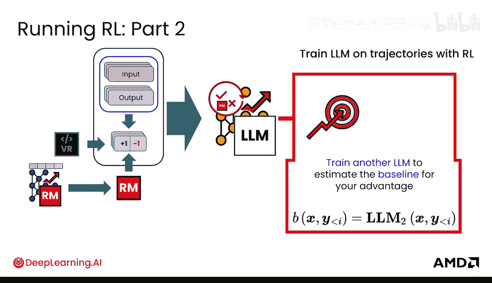

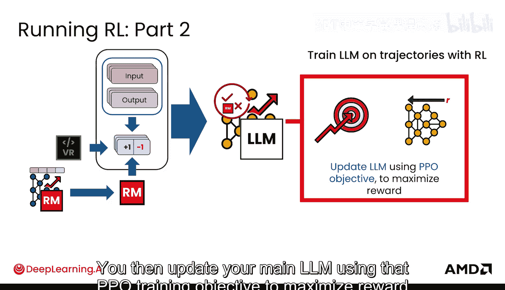

这个数学项实际上是在选择裁剪后的更新和未裁剪的更新中较小的那个。这防止了权重更新超过某个阈值，因此不允许大的变化。这是PPO的核心思想：采取小而稳定的步骤，防止模型在训练过程中崩溃。

以上就是完整的PPO训练目标。

在完整的强化学习循环中，PPO是训练环节的一部分。从图示来看，你有了训练目标，并在此处添加了裁剪。你训练另一个语言模型来估计优势的基线，然后使用那个PPO训练目标来更新你的主语言模型以最大化奖励，并循环进行。

完整的PPO设置需要几个不同的模型：你正在训练的主语言模型、冻结的参考模型，以及你也在训练的基线估计模型。这在计算上非常昂贵，管理起来也很复杂。好消息是，这催生了更高效的新算法，其中之一就是GRPO。

## GRPO：分组相对策略优化

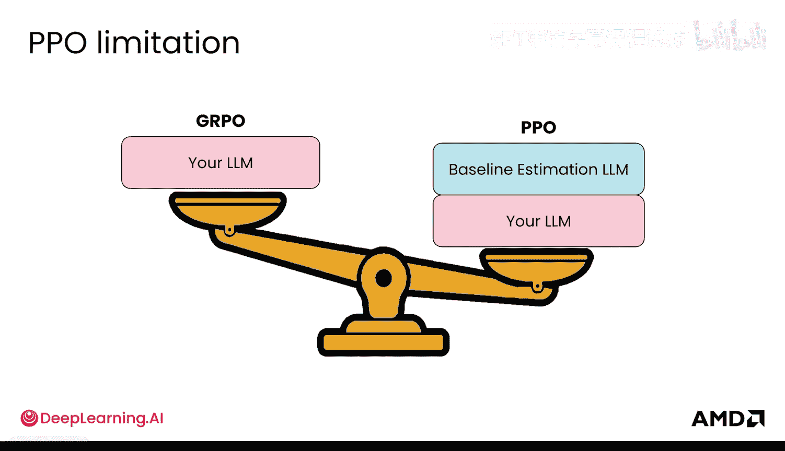

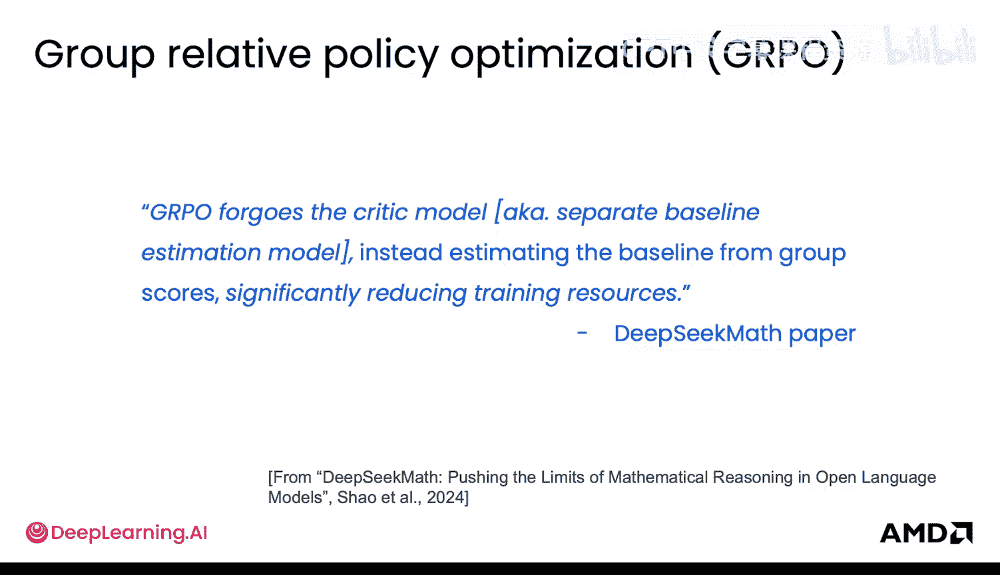

GRPO由深度求索公司最近提出，其关键创新在于去掉了独立的基线估计模型。论文中阐述了GRPO相对于PPO的关键创新，它改变了计算基线以获得优势的方式，这是主要的变化，但它能够显著减少训练资源。

那么，这具体是如何实现的呢？请记住，基线估计模型的全部意义在于估计基线奖励，以便输出围绕零聚集，并且奖励的功劳更公平地分布在各个标记上，只有表现优于或差于预期的标记才能获得强烈的学习信号。这确实减少了方差，并更有效地在序列中分配功劳。

GRPO提出的问题是：与其训练一个完整的独立模型来预测平均或预期奖励，为什么不直接为单个输入生成一组多个输出，并计算该组的实际平均奖励呢？这就是GRPO的核心思想。它非常简单，是一种即时估计基线的直接方法。

具体来说，GRPO通过为每个输入实际抽取多个不同的输出（作为一个组）来计算基线，然后减去平均奖励并除以标准差。这显然不再需要那个额外的模型，但它确实需要更多的采样。这就是GRPO的优势计算方式。

进一步编码说明，你可以指定想要采样的输出数量，以及用于获得这些变化的温度参数。温度参数有助于为每个输入采样不同的输出。

回到强化学习训练目标，GRPO的目标与PPO非常相似，但基线不再是另一个模型的预测，而是单个输入的一组输出的原始奖励的平均值。编码表示，基线方程如下所示，只是对不同序列的奖励进行归一化，非常简单。

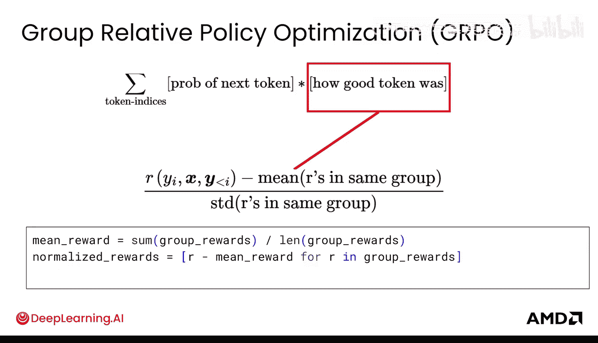

```math
A_i = \frac{R_i - μ_R}{σ_R}
其中 μ_R 是组内奖励的平均值，σ_R 是标准差
```

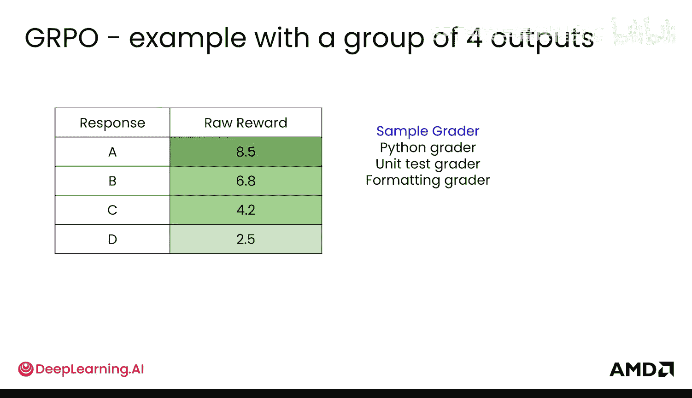

需要注意的是，优势估计现在是在序列级别，而不再像PPO那样在标记级别。

让我们看一个具体例子。假设你从单个输入中采样了四个输出，然后有不同的评分器（如格式检查或单元测试）为每个输出给出一个聚合奖励。然后，基线就是这些分数的平均值。接着，你可以通过减去该基线来计算每个响应的优势。注意，在原始奖励中，它们都是正数，但现在你得到的优势分布是围绕零中心化的。然后，响应A和B将具有正优势，因此强化学习更新将增加它们的概率；而C和D将具有负优势，因此它们的概率将被降低。

这就是GRPO。它保留了PPO中的裁剪，只改变了优势计算。

再深入一点，你的GRPO目标是通过优势（带裁剪）来加权下一个标记的概率，类似于PPO，但你的优势计算将不同。你需要对一组输出中的奖励进行归一化，然后使用这个目标更新你的语言模型以最大化奖励，就像在PPO中一样。在你的代码中，它看起来会是这样：对于一个特定的输入，你生成一组输出（即单个输入的多个输出），然后计算该组的奖励，接着得到平均奖励来计算优势，非常简单。然后，你将这个计算奖励的函数作为奖励函数传入，传入你的GRPO参数、数据集和模型，然后就可以开始训练。

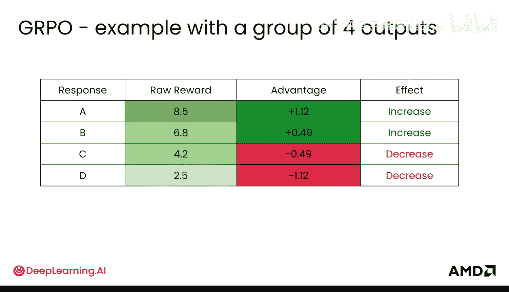

GRPO本质上从这四个不同的模型中移除了这个模型（基线估计模型），这很棒，因为在PPO中你通常也需要训练它，这不仅占用大量空间，而且也可能不稳定。

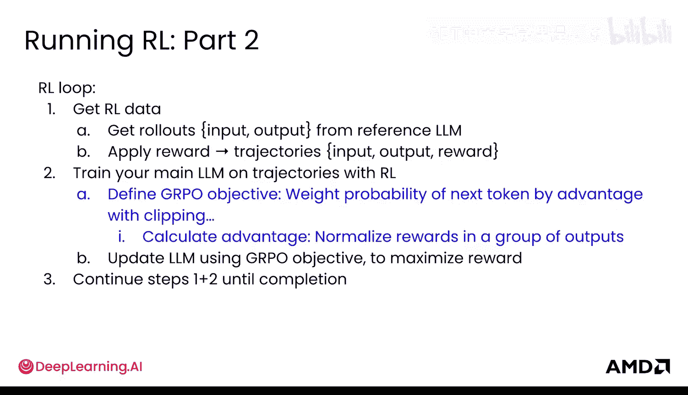

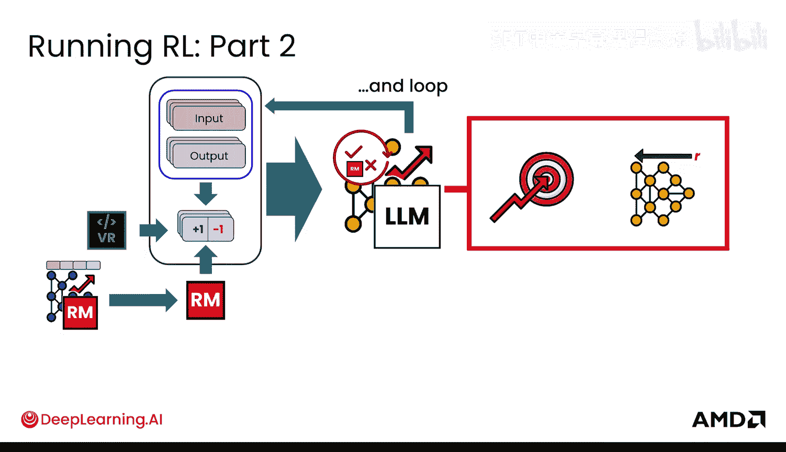

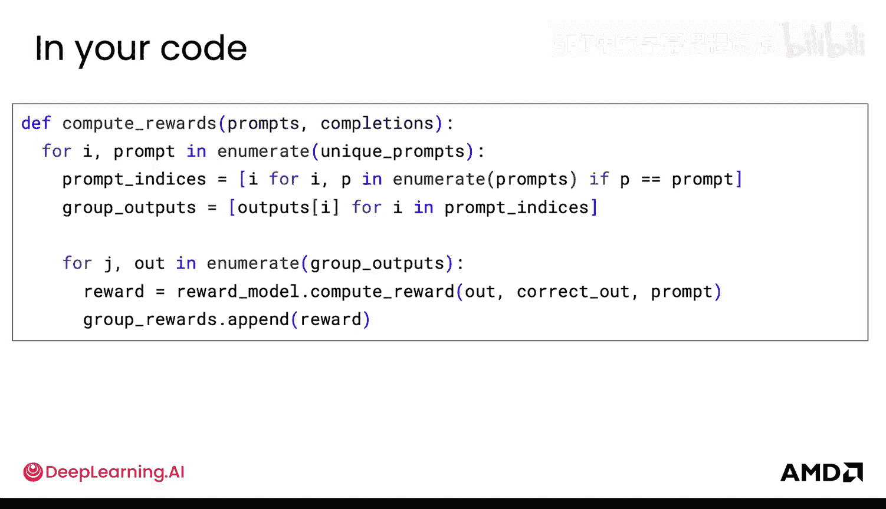

## PPO与GRPO的完整对比

以下是PPO和GRPO的完整对比。总体上仍有许多相似之处，但关键区别在于：第一，基线估计模型消失了；第二，你可以看到优势计算非常不同，一个使用基线估计（每个标记的预期奖励），另一个使用分组计算。

| 特性 | PPO | GRPO |
| :--- | :--- | :--- |
| **基线模型** | 需要独立的基线估计模型 | 无需独立模型，使用组内平均奖励 |
| **优势计算** | 基于标记级别，使用GAE平滑 | 基于序列级别，使用组统计归一化 |
| **计算开销** | 高（需训练额外模型） | 较低（但需更多采样） |
| **稳定性** | 通过裁剪比率保证 | 同样使用裁剪，依赖组统计 |
| **核心创新** | 引入裁剪防止大更新 | 用组平均替代基线模型 |

## 方法演进简史

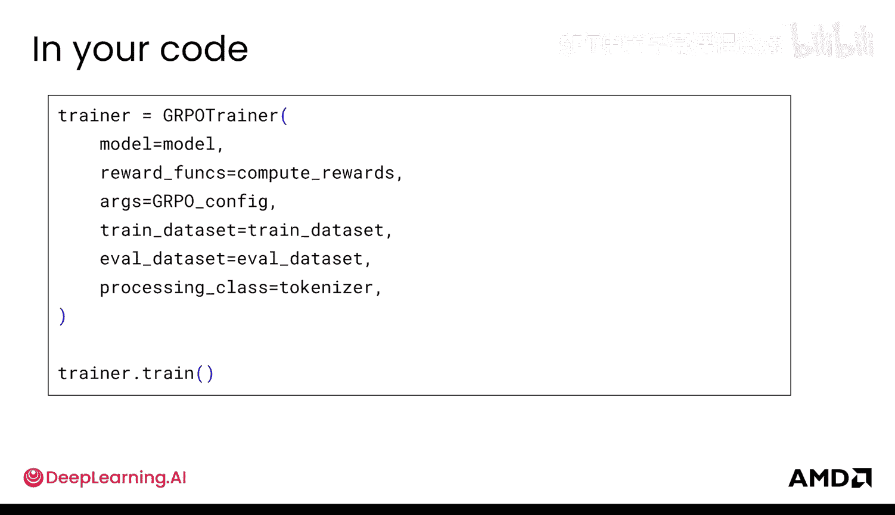

学习这些方法的过程相当激动人心。以下是所学方法的一点历史脉络：从ChatGPT发布前使用的基于PPO的RLHF，到用AI提供反馈替代人类的RLAIF（以遵守某些准则），再到GRPO，以及将GRPO与验证器和奖励模型结合以进行有效推理。

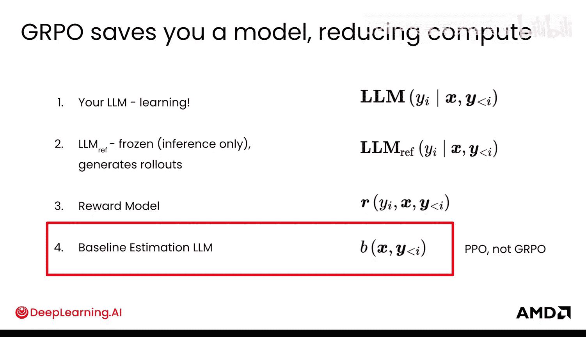

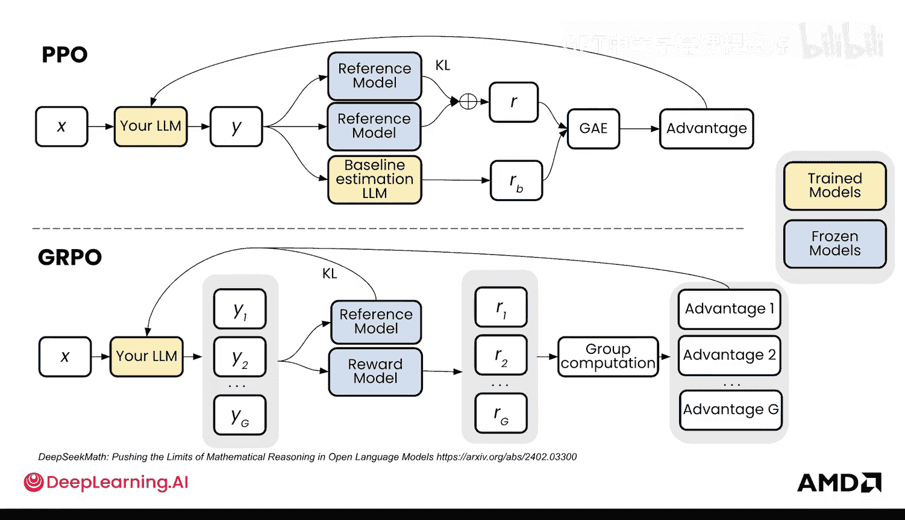

再次纵观全局，无论你使用PPO还是GRPO，它们都位于定义强化学习训练目标的环节。在这个循环中，你的训练目标可以是PPO或GRPO，你通过最大化奖励来更新你的语言模型，并不断循环。

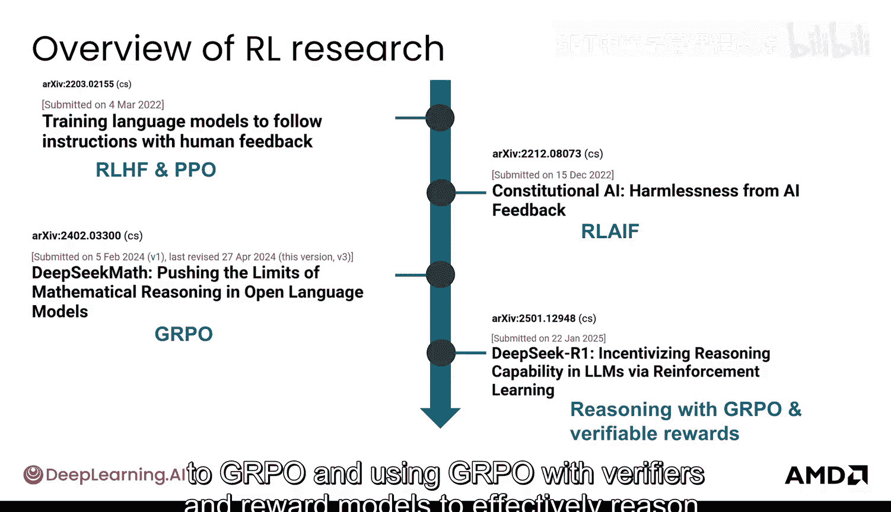

## 总结

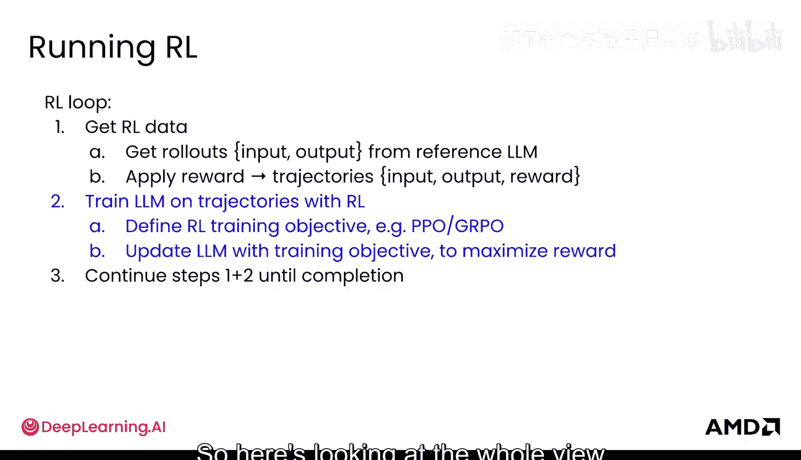

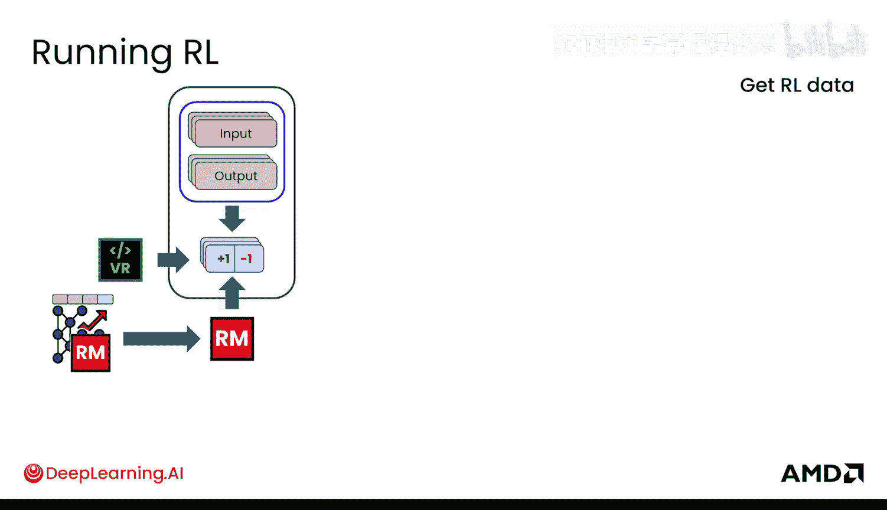

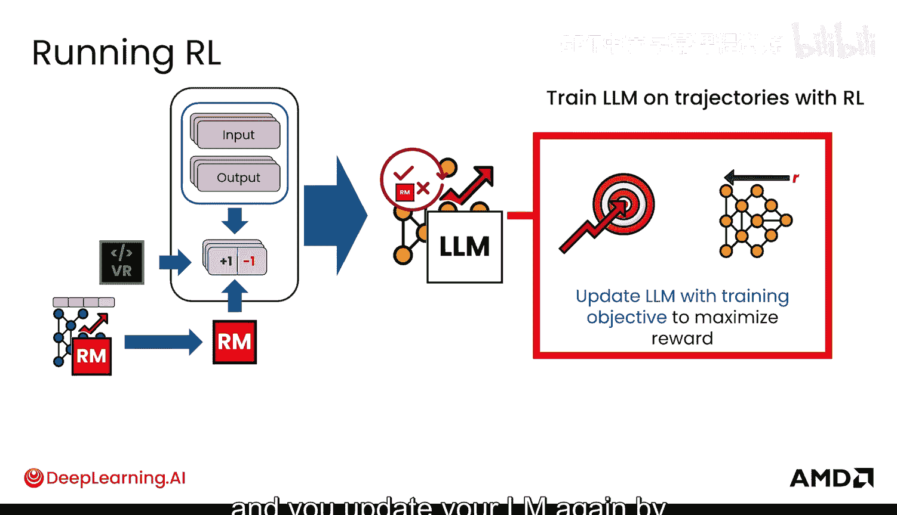

本节课中，我们一起学习了两种主流的强化学习算法：PPO和GRPO。我们了解到PPO通过引入独立的基线模型和裁剪机制来实现稳定训练，而GRPO则创新地使用分组输出的统计量来替代基线模型，从而降低了计算复杂性和资源消耗。两者都旨在更有效、更稳定地将人类（或AI）的偏好反馈融入语言模型的训练中。

恭喜你完成了第二模块的学习！虽然涉及不少数学内容有些困难，但希望你对微调和强化学习有了一些直观的理解。接下来，我们将看看如何利用评估集（你的测试集）作为“北极星”来指导整个训练过程。