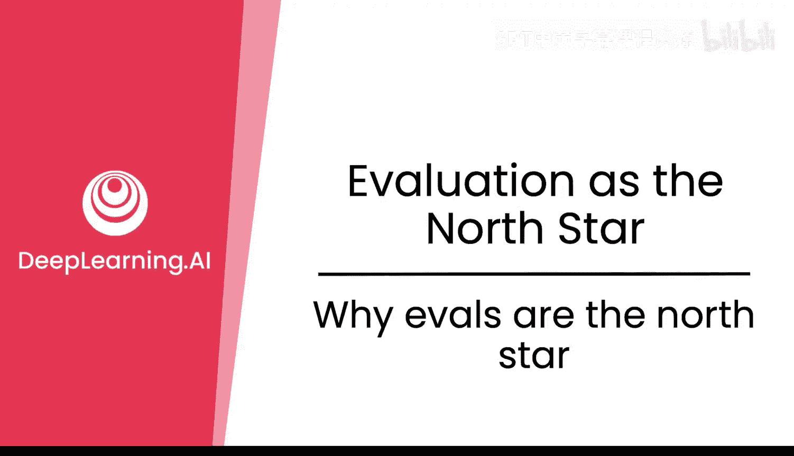
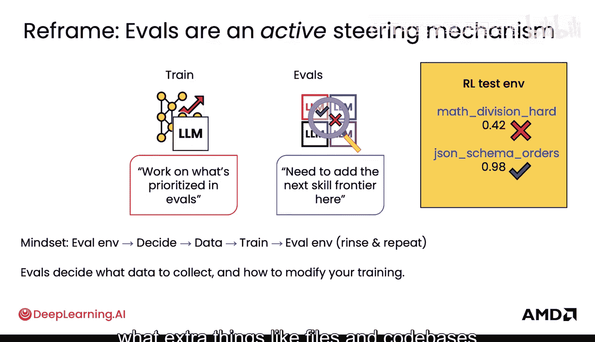
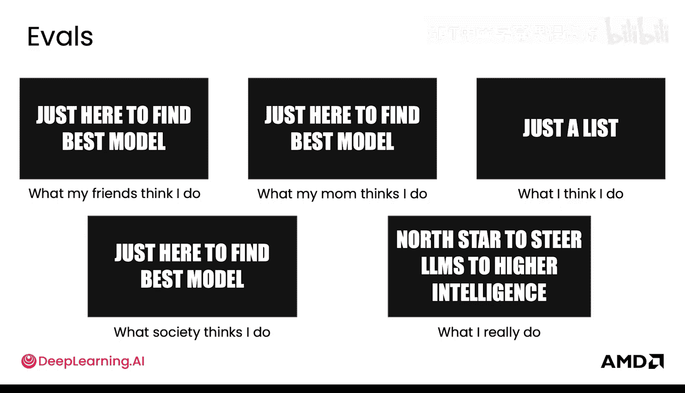

# 019：为什么评估是指引方向的北极星 🌟

在本节课中，我们将要学习评估（Evals）在大型语言模型（LLM）开发中的核心作用。我们将澄清一个常见的误解，并解释为什么评估不仅仅是模型的“期末考试”，而是一个主动的、用于引导模型向更高智能水平发展的关键机制。

## 评估的常见误解

许多人认为评估是被动的，类似于期末考试。这种观点认为，评估的唯一用途是检查你是否找到了最佳模型，或者比较一个模型与另一个模型的优劣。在这种误解下，真正的“工作”发生在训练阶段：你准备好数据，进行训练，得到一个最终分数，任务就完成了。

这种误解可以概括为：评估只是训练结束后在旁进行的一次性检查，一旦完成，训练工作就结束了。

## 评估的实际作用：主动引导

然而，事实并非如此。评估可能遗漏关键问题。例如，如果评估集没有包含大数字运算或除法运算的示例，模型在这些方面的错误就无法被发现。即使你在评估集中加入一个示例，也不能保证能捕捉到所有潜在问题。

因此，精心设计评估集实际上能帮助你深入理解模型的工作原理。这是一个**主动范式**，而非被动检查。评估的作用是引导模型朝着正确的方向发展。

## 评估驱动的开发循环

如果你想为模型增加一项新技能，正确的做法是**首先将其纳入评估集**，然后进入训练循环。

以下是评估驱动开发的核心循环步骤：

1.  **定义评估**：首先，在评估集中明确你想要模型掌握的新技能或需要改进的方面。
2.  **进行训练**：训练过程将专注于解决评估集中所设定的优先任务。
3.  **再次评估**：训练后，使用评估集对模型进行测试。
4.  **分析并迭代**：根据评估结果，决定下一步行动（例如，收集更多特定数据、调整训练参数），然后重复步骤2和3。

这个循环可以表示为：`评估 -> 决策（数据/训练） -> 训练 -> 再评估`，如此循环往复。

## 评估如何指导决策

评估不仅能衡量模型表现，更能指导整个开发过程：

*   **数据收集**：评估结果能告诉你需要收集哪些类型的数据来弥补模型的不足。
*   **训练调整**：无论是微调还是强化学习，你的评估环境（或测试环境）将帮助你决定下一步尝试哪些输入、调整哪些参数。
*   **环境构建**：为了更真实地评估模型，你可能需要向环境中添加额外的文件、代码库等资源。

## 总结：评估是指引方向的北极星

本节课中，我们一起学习了评估在LLM开发中的真正角色。

尽管普遍看法（包括你的朋友、家人甚至整个社会可能都这么认为）将评估视为一份被动的、用于寻找最佳模型的检查清单，但实际上，**评估是指引大型语言模型通向更高智能的北极星**。它是一个主动的、持续进行的引导机制，而非一次性的终点测试。

理解了评估的核心重要性后，在下一节中，我们将具体看看不同类型的评估指标和测试集。