# 020：测试集与指标 📊

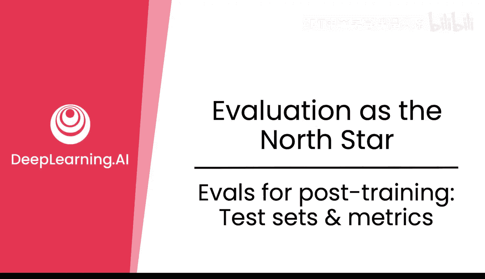

在本节课中，我们将学习如何评估后训练阶段的大型语言模型。我们将探讨评估测试集、各种评估指标，并了解如何通过这些工具来衡量模型在改变其行为方面的实际表现。

## 评估的重要性

上一节我们介绍了后训练的基本概念，本节中我们来看看如何评估后训练的效果。在预训练阶段，损失（loss）和困惑度（perplexity）等指标对于确保模型表现良好至关重要，这关系到训练的稳定性。然而，在后训练阶段，评估（Evals）可能更为重要。这涉及大量的数据集和准备工作，但它们能帮助我们理解模型在改变其行为方面的实际效果。

后训练阶段损失函数不足的原因是，虽然它对于像预训练中预测下一个词元（token）非常有效，但它对用户体验而言意义不大。而用户体验正是后训练中“可用智能”真正重要的方面。后训练的损失可能会下降，但这主要只是监督学习（SL）训练正在进行的指标。

## 什么是评估？

那么，评估究竟是什么呢？评估包含一系列内容，其中之一是评估集或测试集。这些是语言模型之前未见过的保留数据，代表了您希望模型实际具备的期望行为。

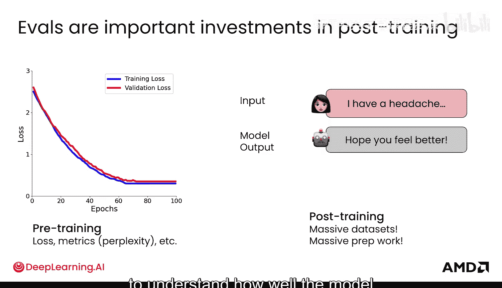

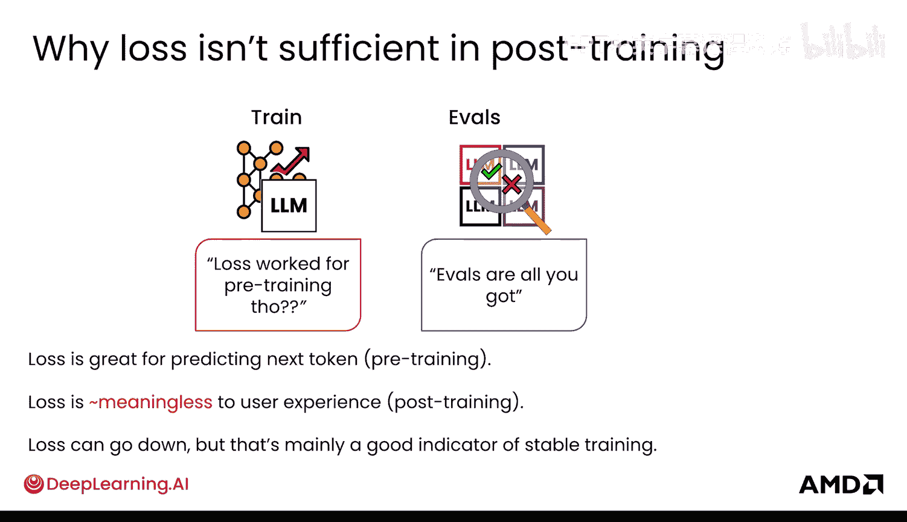

在微调中，评估集看起来像这样：

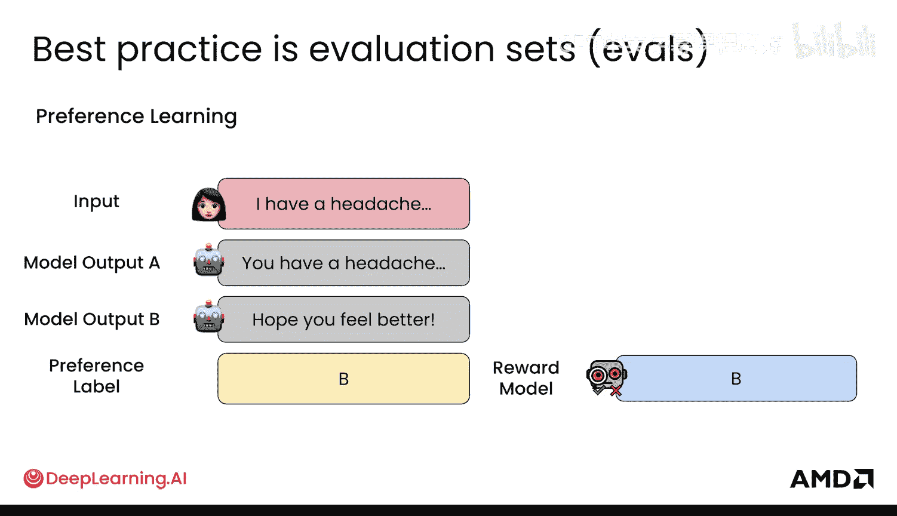

本质上，有一个输入和一个期望输出，然后您可以将其与模型的输出进行比较。在偏好学习中，情况非常相似：会有一个输入、两个模型输出，然后是一个偏好标签。您可以将其与您的奖励模型实际输出的内容进行比较，看看有多接近。在这种情况下，匹配度是关键。

## 评估指标

除了评估测试集，您还可以使用不同的指标以不同方式评估模型。

以下是几种常见的评估指标：

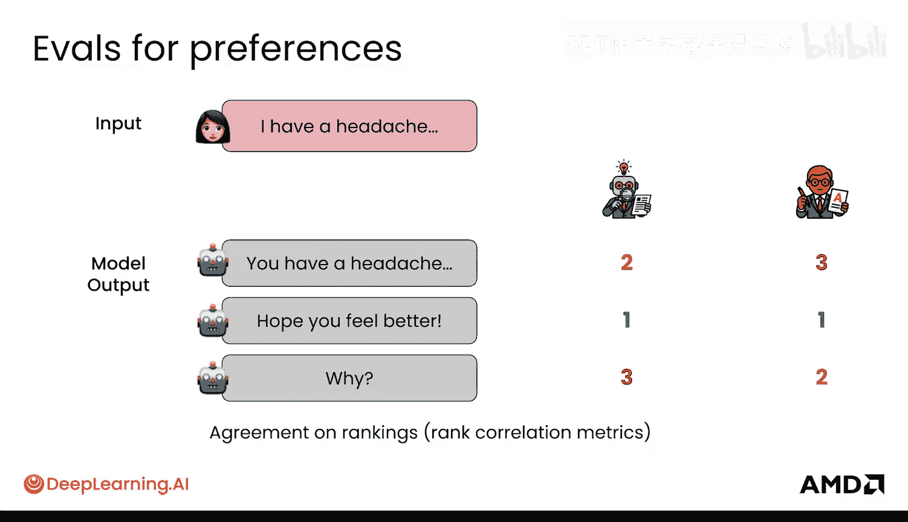

*   **Elo评分**：例如，您可以获得两个不同模型之间的相对分数，并使用Elo评分。这在象棋中很常见，通过查看大量不同对局中的胜、负和平局来评估。
*   **排名相关性指标**：如果您处理的是排名和偏好问题，实际上有很多排名相关性指标可以告诉您一个排名与另一个排名有多接近，基本上是排名的一致性。
*   **正确性检查**：当正确性可以验证时，您可以对强化学习（RL）中的评分者做类似的事情，实际上使用评估评分者来检查正确性或格式。以下是JSON输出的另一个例子。
*   **Pass@K**：另一种评估方法是让模型输出，比如说三个不同的输出，看看其中是否有任何一个实际上是正确的。这被称为“pass at three”。这意味着在所有三个例子中，至少有一个是正确的。这是一种更宽松的评估方式，表明如果您从模型中采样更多输出，它可能在您的任务上表现良好。您可以将其推广到“pass at K”，您会在报告结果的论文中经常看到这个指标。

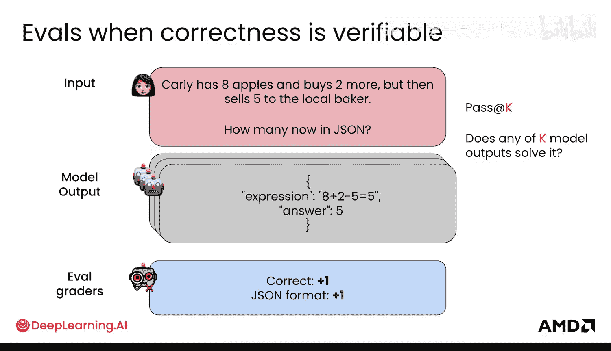

除了正确性，您还希望您的模型能够：

## 校准与不确定性

在不确定性方面表现良好，校准（calibration）就是其中的一个衡量标准。它关乎确保模型预测为概率的值，在现实中最终与该概率相符。

校准的著名例子是：当模型预测80%的降雨概率时，现实中是否真的80%的时间下雨？就像模型置信度是否可信一样，特别是如果您将这些词元概率用于下游应用甚至模型集成。例如，70%对于不同的模型可能意味着不同的事情。您肯定认识一些过度自信或自信不足的人，您希望能够衡量您的模型校准得有多好。

评估校准有不同的方法：

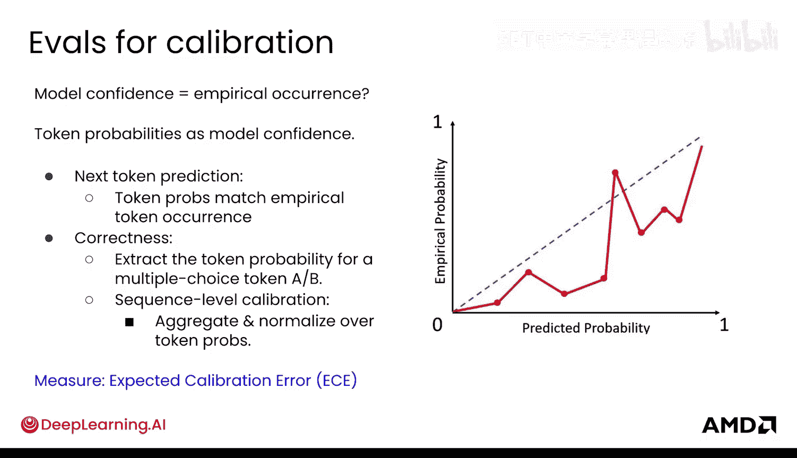

*   **词元概率匹配**：您可以查看词元概率与实际词元出现频率的匹配程度，即词元实际出现的频率。
*   **多项选择题应用**：您还可以对多项选择题做一些有趣的事情。对于多项选择题，您可以有四个不同的选项A、B、C、D，并提取对应选项词元的概率。
*   **序列级校准**：最后，您还可以在整个序列上进行聚合，并对那里的词元概率进行归一化，以理解序列级别的校准。
*   **预期校准误差**：最后，像预期校准误差（Expected Calibration Error）这样的指标将帮助您量化模型校准的程度。

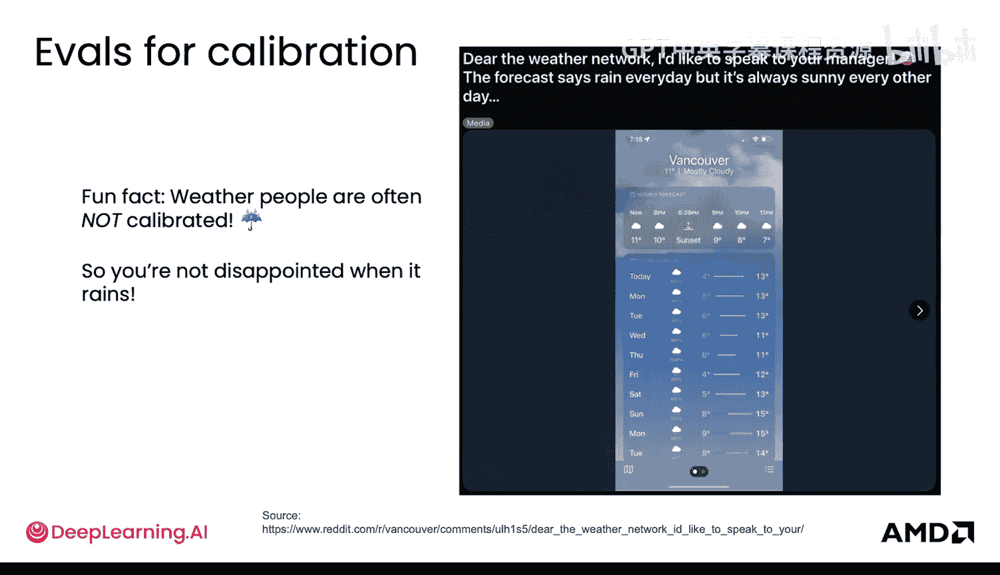

关于校准的一个有趣事实是，天气预报员实际上常常没有校准，这是为了在实际下雨时不让您失望。

## 拒绝与不确定性

除了校准，关于不确定性还有更多内容。如果让模型说“我不知道”，这可能比它在不同时候产生幻觉（hallucinate）要好。这被称为拒绝（refusal）。

在模型中评估这一点的一种方法是设置一个置信度阈值，比如 `0.7`。如果概率低于该阈值，那么模型就直接说“我不知道”，而不是输出它认为的内容。您可以发现，假设在100个数学问题上，如果您不允许它说“我不知道”（即不允许拒绝，只是常规测试方式），它可能答对65%。但如果您允许它说“我不知道”并拒绝其中一些答案，也许它拒绝了20个，它实际上可能获得更高的分数。这非常有趣，这意味着您的模型实际上可以表现良好，并且您实际上可以使用其概率的置信度阈值来帮助您过滤它何时应该输出内容。

## 效率指标

最后，您不能忽视效率指标。有很多不同的方法来评估您从模型获取输出的速度。

以下是关键的效率指标：

*   **延迟（Latency）**：获取输出所需的时间。
*   **首词元时间（Time to First Token, TTFT）**：获取它输出的第一个词元所需的时间。
*   **每输出词元时间（Time per Output Token, TPOT）**：这是一种稳态解码速度，衡量它为您输出整个序列的速度。
*   **吞吐量（Throughput）**：其他不同的衡量标准包括每秒每GPU的词元数，您可以跨并发请求聚合吞吐量以衡量可扩展性。
*   **成本（Cost）**：每个词元的成本（Co per token）和每个样本的成本（Co per sample）也非常重要。输入和输出词元在不同的API中通常权重不同，执行它们所需的成本也不同。
*   **词元效率（Token Efficiency）**：这类似于您从模型获得的有效词元是什么，与获取您所需答案的简洁程度相比，它有多啰嗦。

## 综合评估与基准

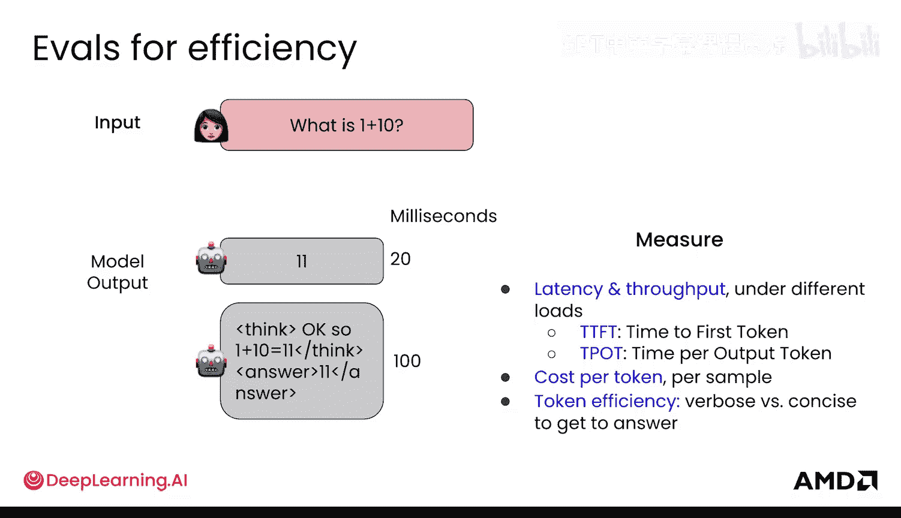

原来，在所有指标上进行评估是最佳实践，这样您才能全面了解模型的实际表现。斯坦福大学的HELM就是一个例子，它代表语言模型的整体评估（Holistic Evaluation of Language Models）。

HELM旨在跨多个不同维度评估模型。它的做法是在不同的多样化任务上评估模型，例如问答、摘要、分类（如垃圾邮件检测）。这些不是孤立的测试，它们代表了跨越不同领域（如医疗、法律、新闻、金融）的42种不同场景。HELM的优点是它是一个活的基准（living benchmark），他们不断用新的场景更新它。

虽然HELM很棒，并且有一系列这类复合指标，但直到最近，传统基准测试大多是用简单任务来测试模型，比如那些考试题、编程谜题、实验室场景或较短的提示。这些是相对简单的基准测试，这对于进度跟踪很有用，尤其是在语言模型的早期阶段。但现在我们开始衡量真实工作了。

OpenAI的GPTVal实际上将评估提升到了专业任务水平。它包含了真实的交付成果、真实的参考文件，以及为评估做出贡献的真实专家专业人士。具体来说，GPTVal有大量不同的任务。

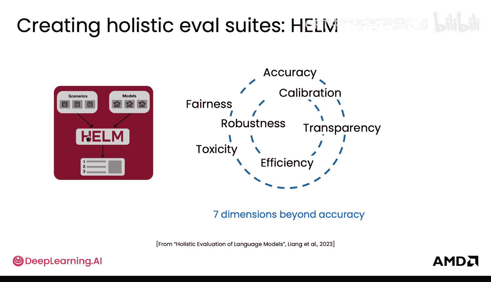

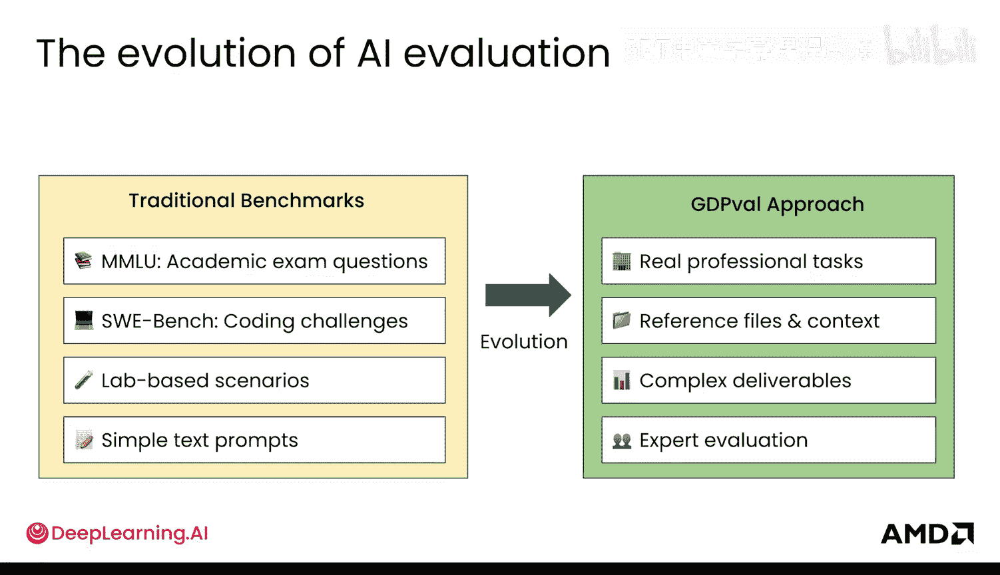

超过1300个任务，来自9个不同行业的44种不同类型的工作。贡献者是在其行业拥有超过14年经验的专业人士，这非常庞大。交付成果是真实的，包括文档、幻灯片、蓝图、护理计划等，这些在他们的工作中确实重要。环境是真实的，包括工作环境中真实文件的复杂性和上下文。然后，评分他们力求公平，所以他们尝试进行盲审专家评分。当他们发布这个时，比较AI和人类的工作，那些盲审专家评分者同样是之前未见过输出的专业人士。

真正有趣的是，OpenAI在GPTVal上运行了GPT-4和GPT-5，性能在一年内增长了两倍多。这表明这些模型在处理现实世界复杂性方面更好，并且正变得越来越好。专家评分者将生成的交付成果与人类的交付成果进行比较，发现其质量真的接近行业专家产生的工作质量。他们还发现Claude Opus 4.1的输出在近一半的任务中被评为与人类一样好或更好。

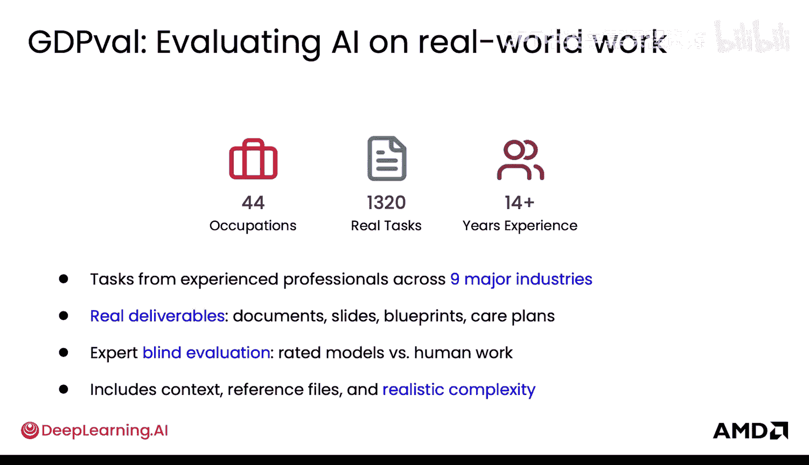

因此，随着GPTVal趋于饱和，我们将需要为更难的现实世界任务设计新的基准测试。我很期待看到这些新基准是什么，因为我认为我们将不断产生新的基准测试，以满足这些模型当前的下一个前沿。

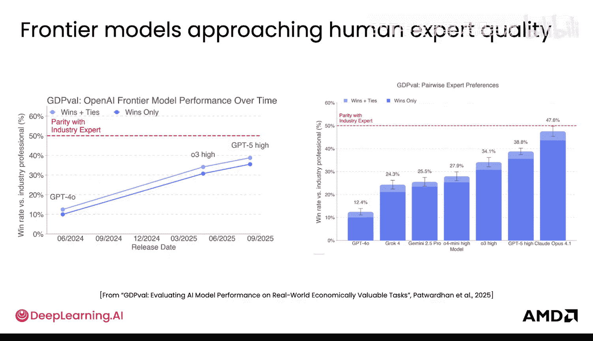

## 总结

本节课中我们一起学习了后训练阶段评估大型语言模型的关键概念。我们了解了评估测试集的作用，探讨了包括正确性（如Pass@K）、校准、不确定性（如拒绝机制）和效率（如延迟、吞吐量）在内的多种评估指标。我们还介绍了从传统基准（如HELM）到更贴近真实工作场景的评估体系（如GPTVal）的发展。这些评估工具对于衡量模型行为改变的实际效果、指导后训练过程以及推动模型在复杂现实任务中不断进步至关重要。

现在您已经了解了微调和偏好学习中的一些指标和基准，是时候看看强化学习的测试环境及其工作原理了。