# 021：RL测试环境与监控RL更新 🔍

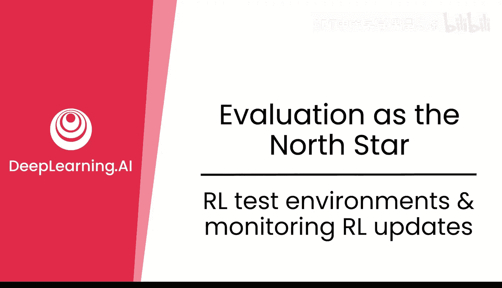

在本节课中，我们将学习如何为强化学习（RL）训练构建可靠的测试环境，并了解在RL训练过程中需要监控的关键指标。这对于确保模型性能真实有效、避免“奖励黑客”等问题至关重要。

## RL测试环境的重要性 🛡️

RL测试环境对于评估RL训练的效果非常重要。在评估经过RL训练的模型时，我们需要警惕一种被称为“奖励黑客”的现象。模型可能在训练损失（EL）上看起来表现很好，但一旦在RL环境中运行，其行为可能是有害的。奖励黑客行为通常涉及微小的百分比和错误，在测试集上难以被捕捉，但其影响可能相当不利。

上一节我们介绍了RL训练的基本概念，本节中我们来看看如何构建一个可靠的测试环境来应对这些问题。

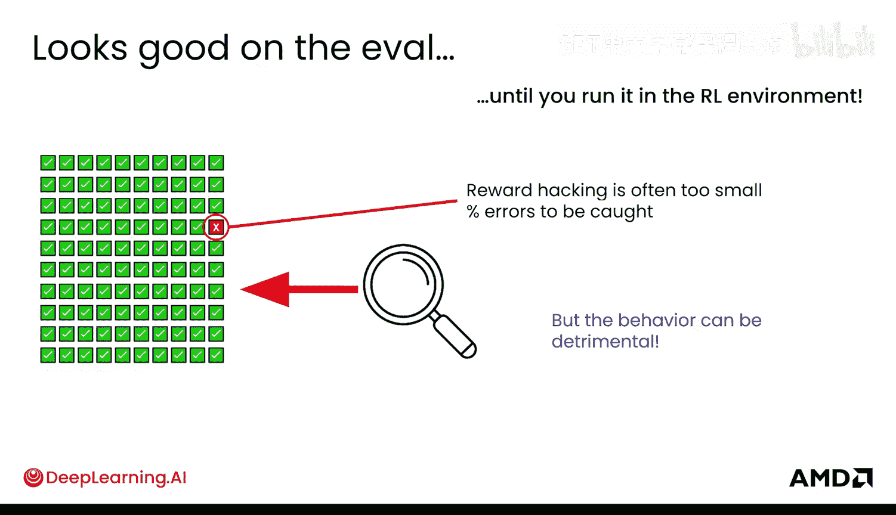

## 构建RL测试环境 🧊

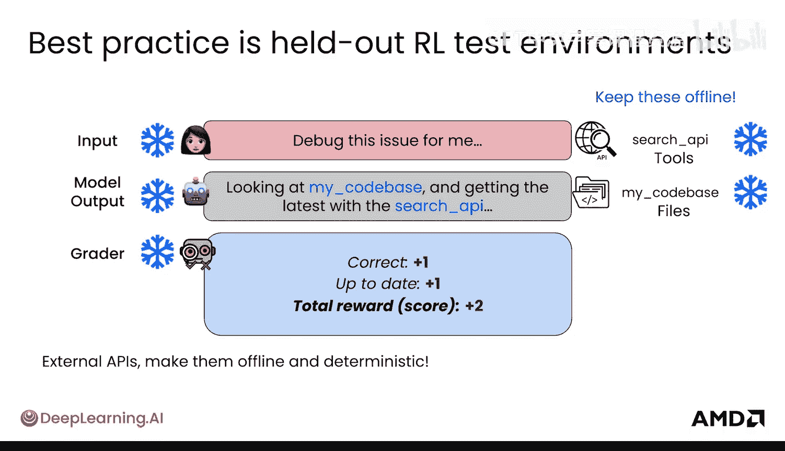

最佳实践是创建一个RL测试环境。你可能见过之前的RL环境，但这次的环境是“冻结”的。这意味着评分器、工具和文件等组件都被固定下来。

你需要使这个环境尽可能具有确定性，以确保其可靠性和可复现性。如果你使用了外部API（如搜索API），应尽可能使其离线，以便能够复现结果。这意味着你需要提前预收集一些API信息。

以下是构建确定性RL测试环境的关键步骤：

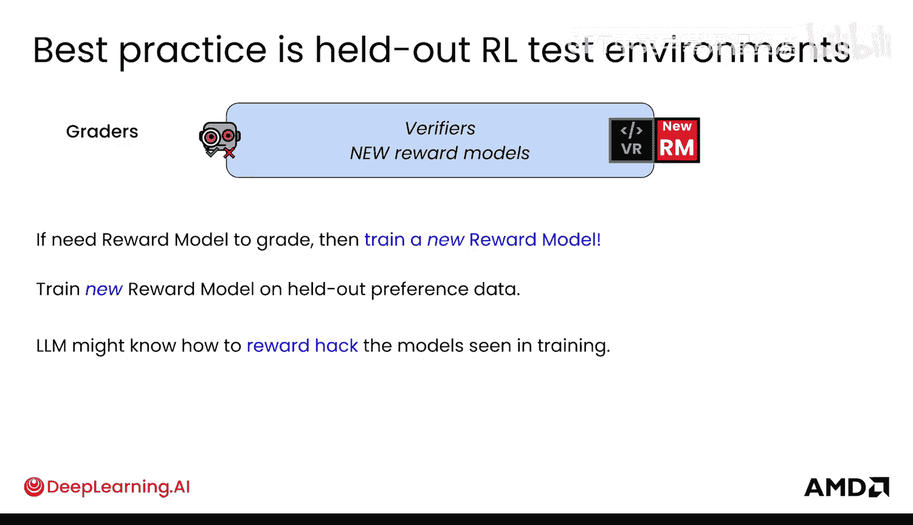

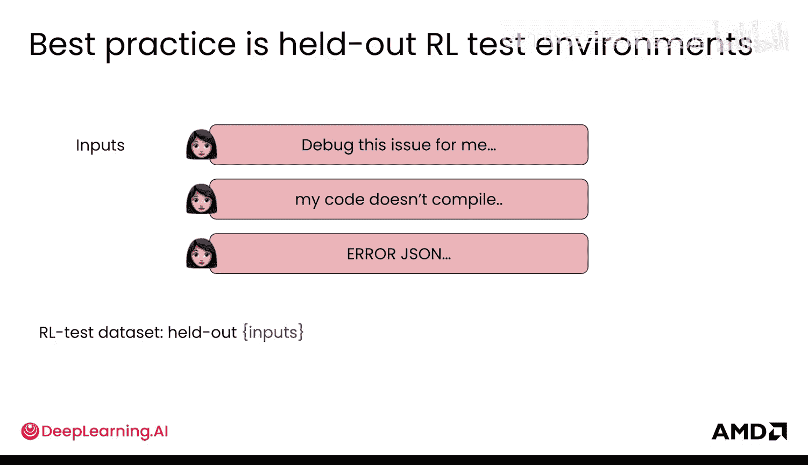

*   **冻结评分器**：使用程序化的、固定的评分逻辑。
*   **固定随机性**：设置固定的随机数生成器种子。
*   **冻结时间**：环境内部的时间被固定，避免因日期/时间查询导致结果变化。
*   **确定性解码**：例如，将温度等参数固定。
*   **预收集工具响应**：将工具的离线响应存储在固定装置中。
*   **固定内部排序**：如果工具涉及任何内部排名，也需固定其随机性。
*   **冻结文件系统**：代码库和文件系统状态保持固定。

一切都需要与这个RL测试环境的“快照”保持一致。

## 各类评估数据集概览 📊

现在，我们来盘点一下所有的评估集：不同的测试集和RL测试环境。

在测试集中，你会看到用于微调的测试集，也会看到用于奖励模型的测试集。实际上，如果你需要为RL测试环境使用一个新的奖励模型，那么这个奖励模型应该在训练中从未见过的偏好数据上进行训练。否则，LLM可能会学会如何“黑客”它已经在训练中见过的奖励模型。

你还必须使用一组在训练环境中模型从未见过的输入。这些输入是模型完全没有接触过的。

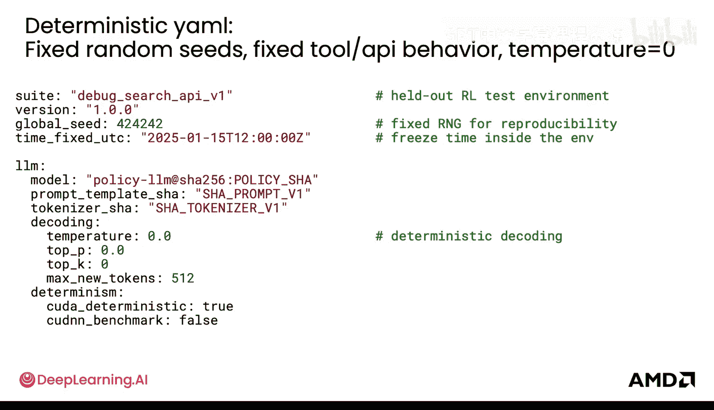

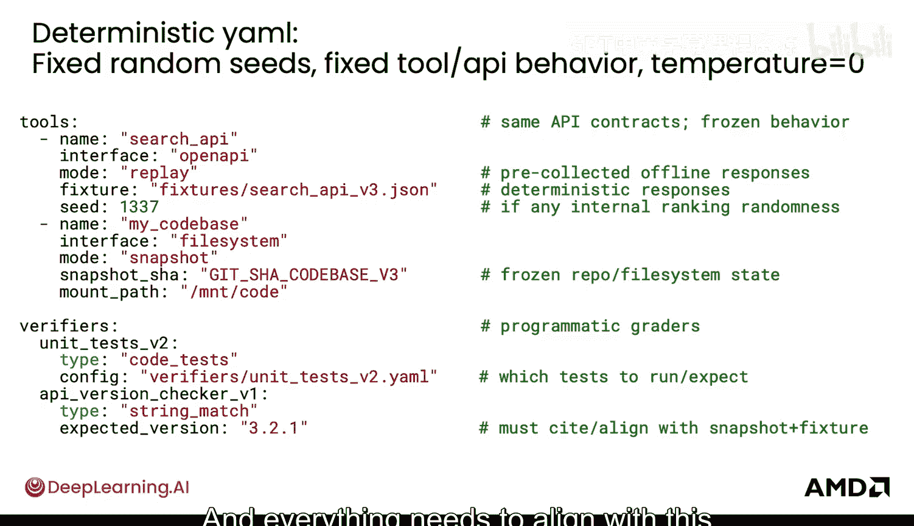

此外，最终评估数据也非常重要。它基本上是未见过的、多样化且极端的输入混合，可用于对抗性测试或红队测试。其核心目的是用非常不同的可能输入来测试模型，看哪些能“越狱”模型，哪些不能。

## RL训练过程中的监控指标 📈

在RL训练期间，你可以监控哪些方面呢？以下是一些关键的监控指标：

*   **KL散度**：衡量训练后的模型与基础模型之间的差异，防止模型漂移过远。
*   **对齐税**：奖励模型给出的奖励分数与人类评估之间的差距。
*   **样本效率**：需要多少次“推演”才能从模型中获得最大收益。
*   **推演多样性**：如果所有推演结果看起来都一样，那么模型就发生了“坍缩”。

接下来，让我们逐一深入了解这些指标。

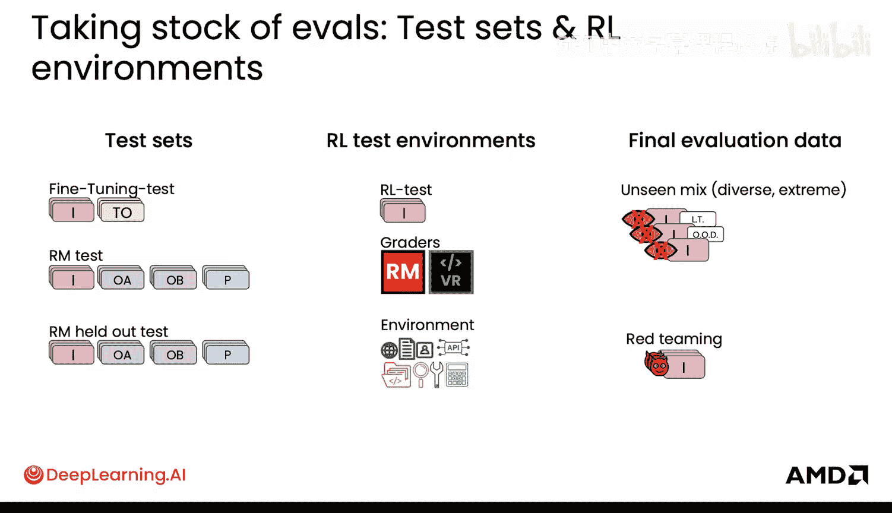

### 监控KL散度

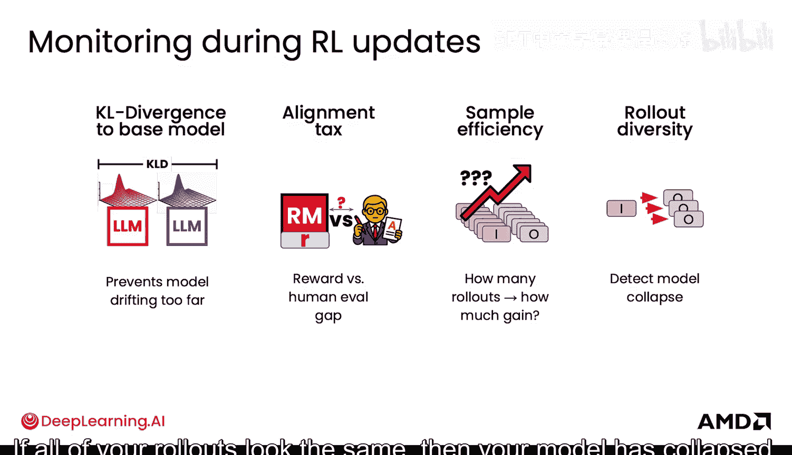

KL散度是衡量两个概率分布差异的方法。在这里，它指的是基础模型的分布和你更新后模型的分布。如果两个分布相同，KL散度为零（单位是“纳特”，自然单位）。如果使用以2为底的对数计算，单位则是更常见的“比特”。

一个安全的KL散度范围通常在0.1到0.2纳特之间。如果KL散度达到1.5纳特，你可能会看到新模型的输出虽然流畅，但可能过度偏好使用某些词汇（例如到处使用“量子”一词），这不是我们想要的。

**修复方法**是添加KL惩罚项或降低RL学习率，以减少这种漂移。

### 理解对齐税

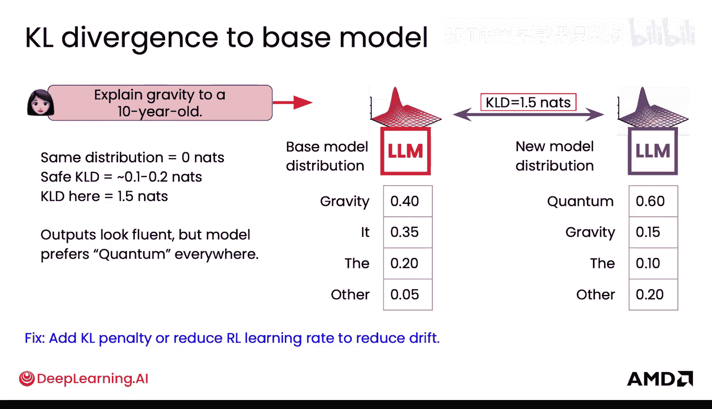

对齐税指的是奖励模型给出的奖励分数与人类实际评分之间存在的差距。这种情况可能很微妙。例如，奖励分数可能跃升了0.23点，但在训练中从第50000步到第100000步，人类偏好评分几乎没动。这意味着模型很可能在“玩弄”奖励模型。尽管人类偏好评分也有所上升，但与奖励模型的分数相比，其变化微乎其微。

**修复方法**很可能是在那些奖励分数高但人类评分低的输出上重新训练奖励模型，使其能够平衡并更接近人类评估。

### 检查推演与样本效率

如果你的模型大量产生相同或相似的输出，缺乏变化，那么就出现了推演输出的“坍缩”。

**修复方法**是在奖励函数中通过某种熵奖励来鼓励多样性。通常，你会希望增加推演次数，以更好地利用每一个输入，并在评分时获得多样化的结果（假设没有发生坍缩）。这对于GRPO等方法尤其重要。

然而，增加推演次数并不总是意味着更好的输出。如果情况并非如此，不要随意浪费计算资源去扩展推演。相反，应该改进你的评分标准或奖励信号，并鼓励探索。

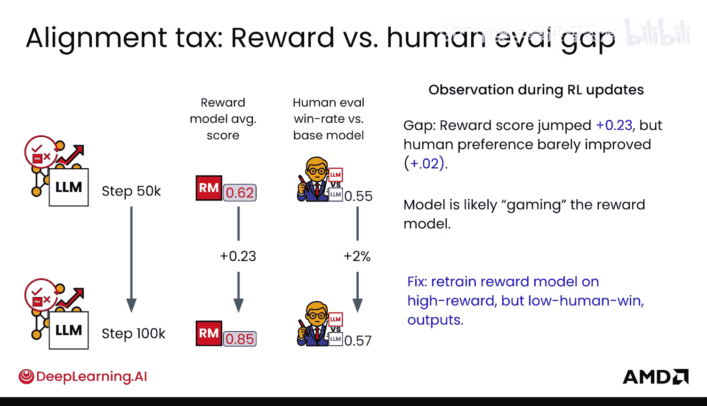

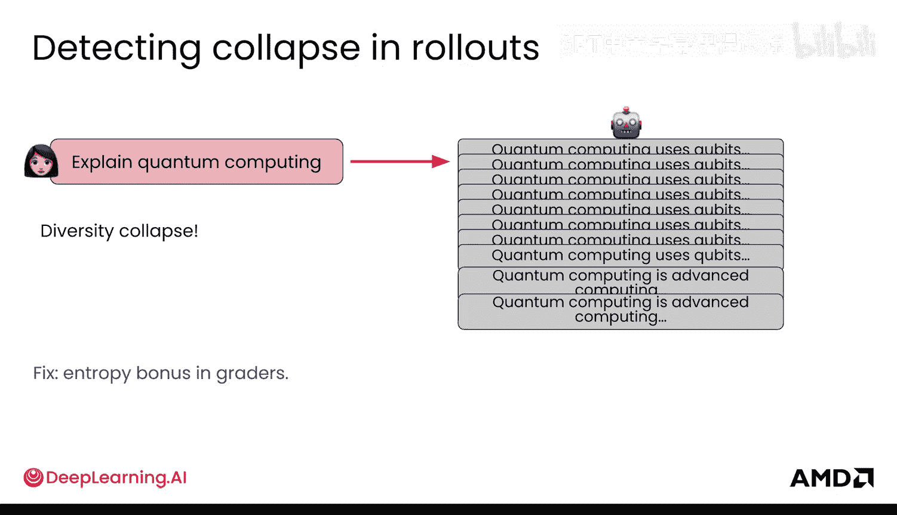

## 总结 🎯

本节课中，我们一起学习了构建RL测试环境的重要性和具体方法，其核心在于创造一个确定性的、可复现的评估场景以对抗奖励黑客。我们还介绍了在RL训练过程中需要监控的几个关键指标：**KL散度**、**对齐税**和**推演多样性**，并了解了它们异常时的表现及应对策略。

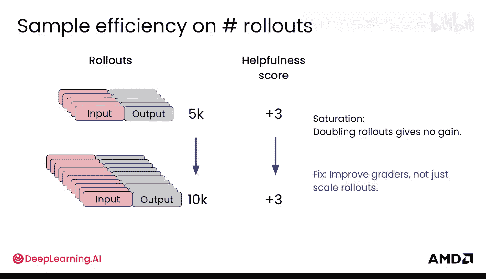

现在你已经知道如何构建RL测试环境，接下来可以更深入地审视奖励黑客现象，了解其发生的原因以及如何缓解它。