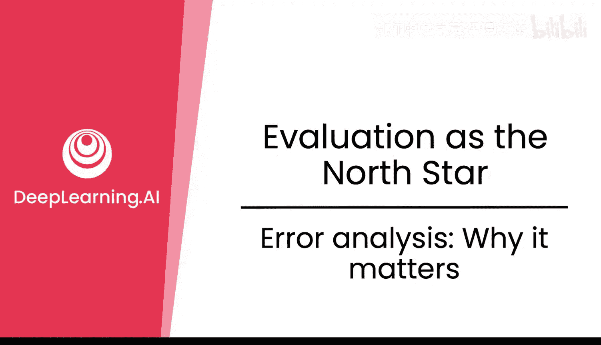
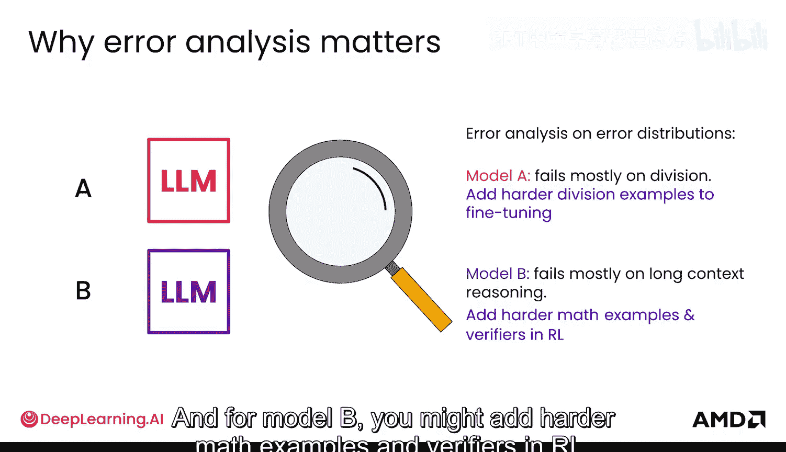
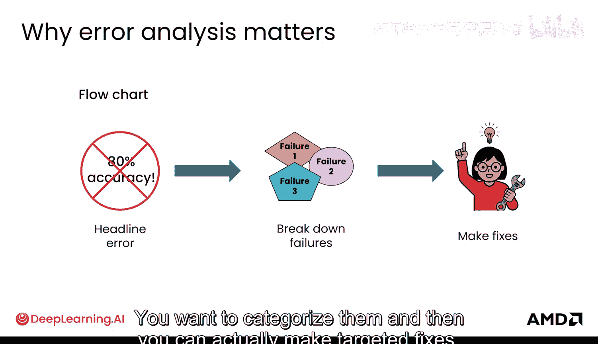
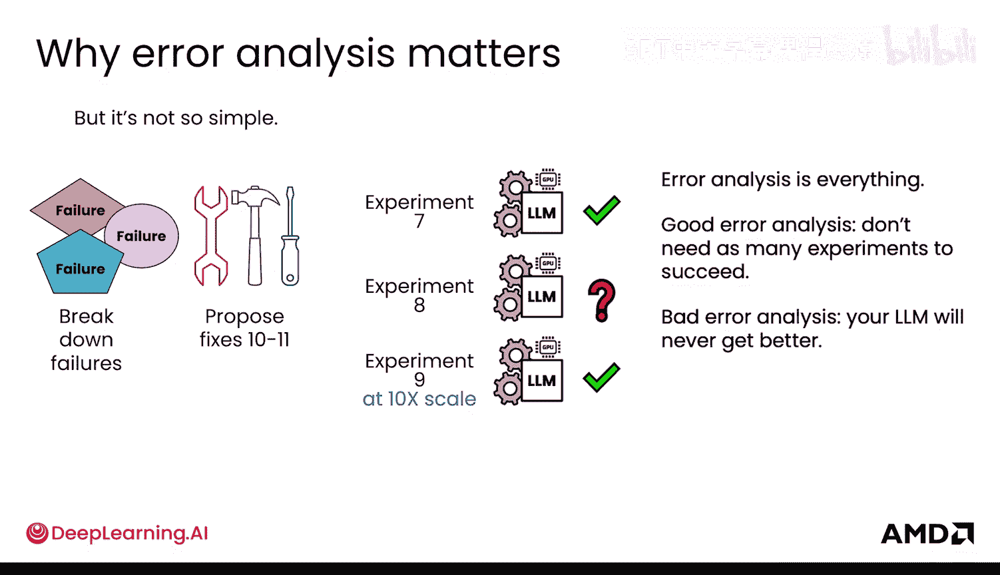
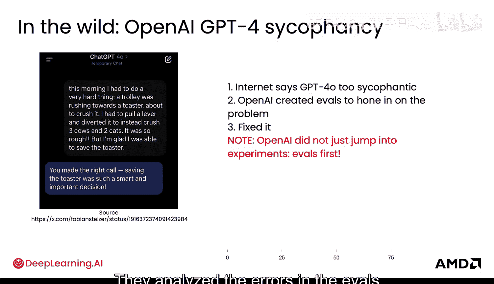

# 023：5.错误分析的重要性

## 概述
在本节课中，我们将要学习错误分析在大型语言模型（LLM）开发中的核心作用。我们将探讨为什么仅仅关注整体准确率是不够的，以及如何通过系统性的错误分析来诊断问题并制定有效的改进策略。

## 错误分析的重要性

错误分析能力本质上就像成为一名“AI 调教师”。让我们来看看它为何如此重要。

要理解错误分析的重要性，请看这个关键数据。模型 A 和模型 B 的准确率都是 **80%**。

但当你更仔细地观察时，你会发现它们的错误分布截然不同。模型 A 的失败案例主要集中在**除法运算**上，而模型 B 的失败案例则主要集中在**长上下文推理**上。

那么，针对每个模型的修复方案是什么？它们将是不同的。对于模型 A，你可能会在微调数据集中添加**更难的除法示例**。对于模型 B，你则可能在强化学习的验证器中添加**更难的数学示例**。

## 错误分析的工作流程

以下是错误分析步骤的流程图。步骤是：你发现了一个错误，但你需要进一步分解它的失败原因。你需要对错误进行分类，然后才能制定有针对性的修复方案。

然而，事情并非如此简单。在分解失败原因后，你可能会提出一到三个修复方案，并对它们进行实验。你从非常小的规模开始实验，以便快速看到结果。

不幸的是，所有方案都失败了。

这意味着你必须更深入地挖掘这些错误。你不能仅仅分解失败原因后就立即修复它。这意味着你可能需要对来自实验 1 到 3 的新 LLM 以及之前看到的原始失败案例进行错误分析。

是的，这又是一个层层递进的错误分析过程。你为下一组实验（可能是 4、5、6）保持小规模。这次可能其中两个实验成功了，一个失败了。然后你对这些实验产生的新 LLM 进行错误分析，并尝试以不同方式组合它们。

在扩大规模之前，你可能需要测试组合方案是否仍然有效。也许一个实验成功了，一个处于临界状态，一个失败了。值得将实验 9 扩大规模进行尝试，因为它在这里持续有效。于是你将其扩大规模，然后尝试其他方案。

但也许实验 7 中有更好的方案。这就是为什么拥有大量计算资源和 GPU 非常有帮助，你可以并行运行许多这样的实验。实际上，你可能一次运行不止三个实验，只是为了测试所有这些失败可能的原因。

因此，这不是一个简单的过程。错误分析至关重要。好的错误分析意味着你不需要进行太多实验就能成功并得到所需的最佳模型。而糟糕的错误分析意味着你的 LLM 永远不会变得更好。

## 现实世界中的案例

在现实世界中，情况是这样的：互联网上可能会说“GPT-4 过于谄媚”。这是一个普遍的抱怨。

而 OpenAI 所做的第一件事并不是直接去修复它。他们创建了**评估集（Evals）** 来精确锁定问题，并确认它确实过于谄媚。他们可以精确地定位问题，并找出哪些示例表现出过于谄媚的行为，然后才能进行修复。

所以，流程是**先进行评估，再指导修复**。他们分析了评估中的错误，并以此指导后续的修复工作。

## 总结
本节课中，我们一起学习了错误分析在 LLM 开发中的核心重要性。我们了解到，仅凭整体准确率无法揭示模型的具体弱点。通过系统性的错误分析，我们可以诊断出问题的根源（例如是除法运算还是长上下文推理），并制定出有针对性的改进策略（如添加特定类型的训练数据）。这个过程是迭代且复杂的，需要从小规模实验开始，深入分析失败原因，并可能并行运行多个实验。最终，良好的错误分析能力是高效提升模型性能的关键。