# 024：错误分析与诊断干预 🔍

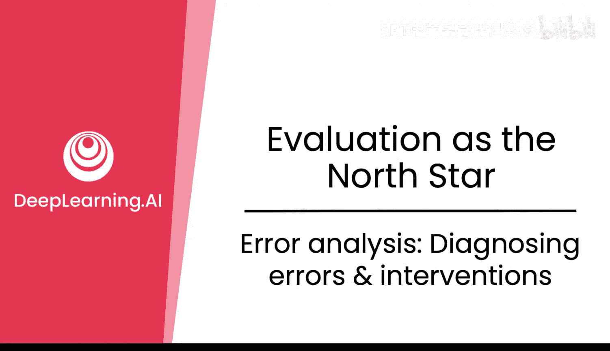

在本节课中，我们将学习如何诊断大型语言模型（LLM）的错误，并探讨相应的干预措施。我们将通过具体示例，了解错误分析的流程、聚类方法以及常见的错误类型。

## 概述

诊断模型失败的原因可能很困难。我们来看一个具体例子。

模型输出是错误的。但错误的原因是什么？模型在推理过程中混淆了某些信息。它将自己的估计与后续的推理混合，最终导致答案错误。

仅通过观察一个例子，很难检查和理解问题所在。是推理过程有问题，还是模型在处理除法步骤时出现了错误？这一点并不明确。

例如，对于“23除以13等于多少？”这个问题，即使模型回答错误，这可能只是一个偶然错误。模型是不会做数学运算，还是不会做除法？

在另一个输入“23除以13”中，模型却回答正确。因此，在这两个例子中，问题可能完全与除法无关。也许问题出在输入中是否包含问号。

你需要观察模式，以理解错误的形态，从而为模型提出正确的修复方案。

## 模式与聚类

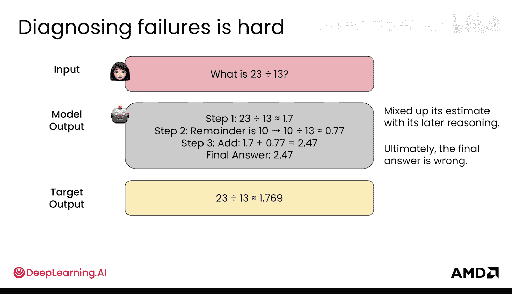

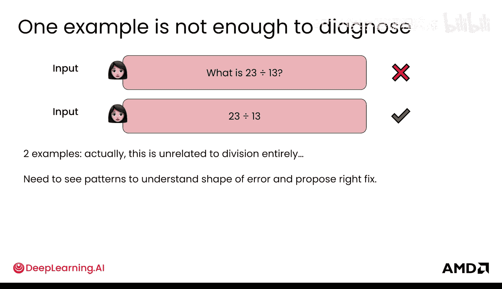

你需要找到方法将相似的例子聚集在一起。当然，你可以手动扫描结果，这并非一个糟糕的初步方法。但在大规模处理时，你可能需要方法来对失败案例进行文本聚类。

以下是聚类文本的方法。

### 基于相似性的文本聚类

一种聚类文本的方法是查看相似性，你将在后续实验中探索这一点。

这里有两段文本，例如“23除以13等于多少？”和“将23个苹果平均分给5个人吃”。这些文本输入到一个语言模型嵌入模型中，该模型将文本转换为嵌入向量（即数字向量），并计算余弦相似度。

**余弦相似度**的计算公式如下：

`相似度 = (A·B) / (||A|| * ||B||)`

其中 `A·B` 是向量的点积，`||A||` 和 `||B||` 是向量的模长。这用于衡量两段文本嵌入的相似程度。

之后，你通常希望使用一种称为 **K-means** 的算法来获取关键聚类。你首先决定需要多少个聚类，例如三个。然后算法选择三个起始点，称为质心。每个句子作为一个嵌入向量，根据距离被分配到最近的质心。接着，质心移动到分配给它的所有点的平均位置。这个过程不断迭代，直到如右图所示，所有聚类不再变化，此时你就得到了最终的聚类结果。

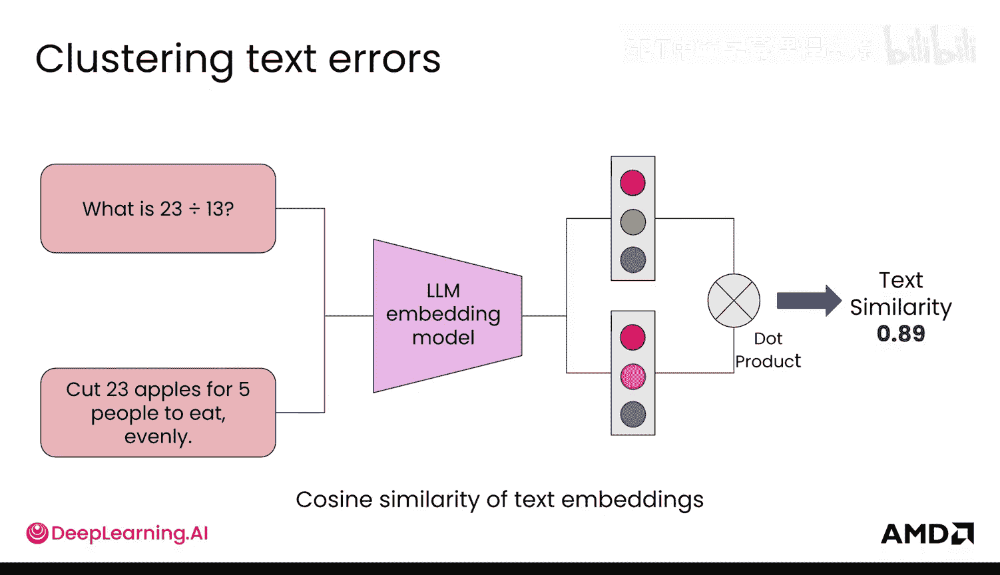

最终，你会得到一组整齐的文本聚类，这些文本具有相似的含义。

### 代码实现

以下是代码实现的样子。你可能会使用用于生成嵌入的 `sentence-transformers` 库，并从 `scikit-learn` 导入 `KMeans`。

```python
from sentence_transformers import SentenceTransformer
from sklearn.cluster import KMeans

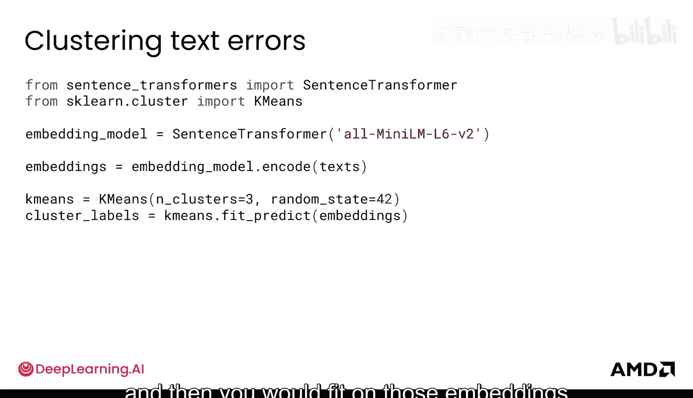

# 初始化模型
model = SentenceTransformer('all-MiniLM-L6-v2')
# 你的文本列表
sentences = ["What is 23 divided by 13?", "Cut 23 apples for five people to eat evenly"]
# 编码为嵌入向量
embeddings = model.encode(sentences)
# 运行K-means聚类，假设分为3类
kmeans = KMeans(n_clusters=3, random_state=0).fit(embeddings)
# 获取聚类标签
cluster_labels = kmeans.labels_
```

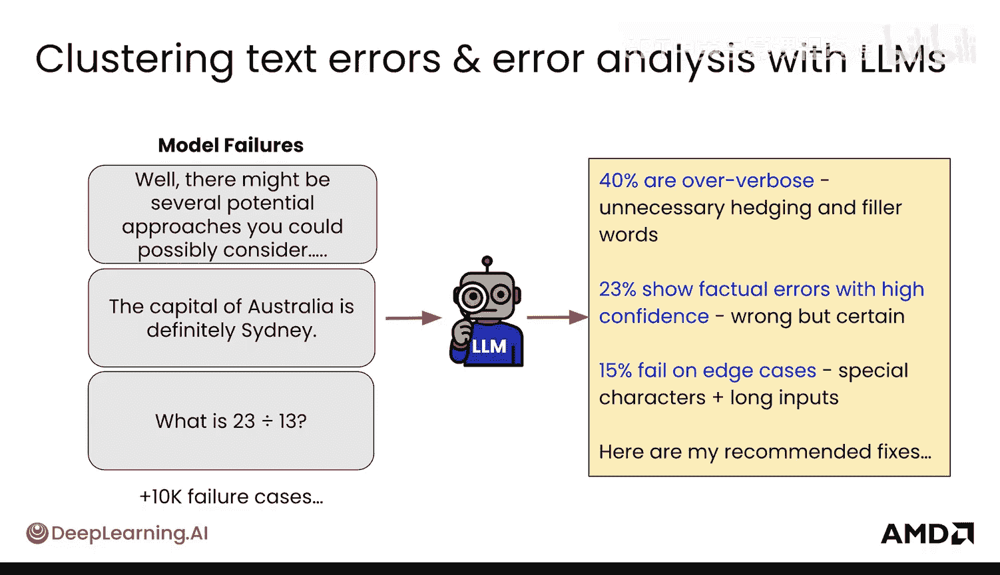

你也可以使用大型语言模型来帮助聚类。你可以给LLM提供不同的模型失败案例，询问它看到了哪些模式，并请它推荐一些修复方案。

### 使用LLM辅助聚类

在代码中，这可能看起来像这样。你可以定义不同的错误类别，然后提供一个提示，陈述问题、正确答案和预测答案，并要求LLM帮助将其归类到你定义的某个类别中。

```python
error_categories = ["幻觉", "推理错误", "格式错误", "指令遵循错误", "工具使用错误", "拒绝不足", "过度拒绝"]

prompt_template = """
问题：{problem}
正确答案：{correct_answer}
模型预测答案：{predicted_answer}

请帮助我将此错误归类到以下类别之一：{categories}。
请只输出类别名称。
"""
# 然后调用LLM API处理此提示
```

当然，你可以详细地进行这种分析。

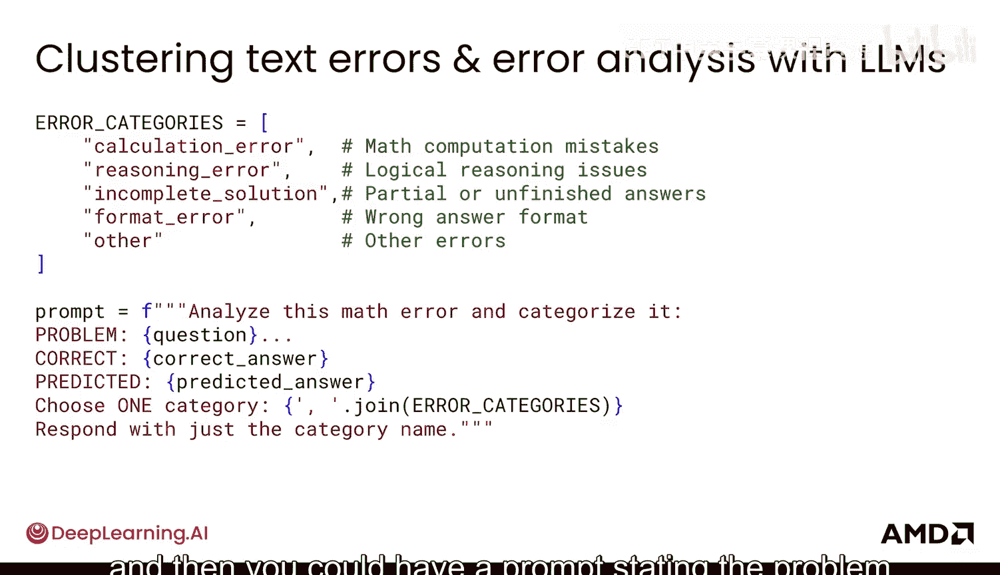

## 常见错误类型

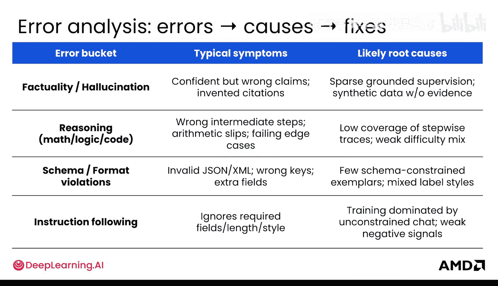

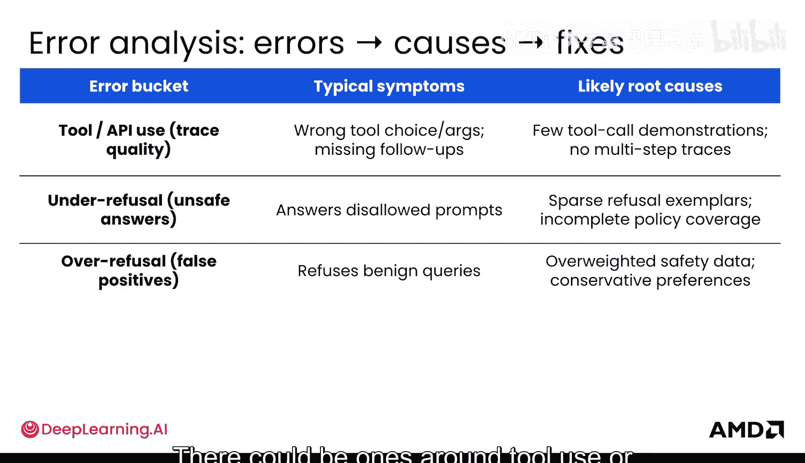

以下是一个大型的常见错误分析列表，但请注意，你无需查看每一个，这只是为了让你了解存在多少不同类型的错误。

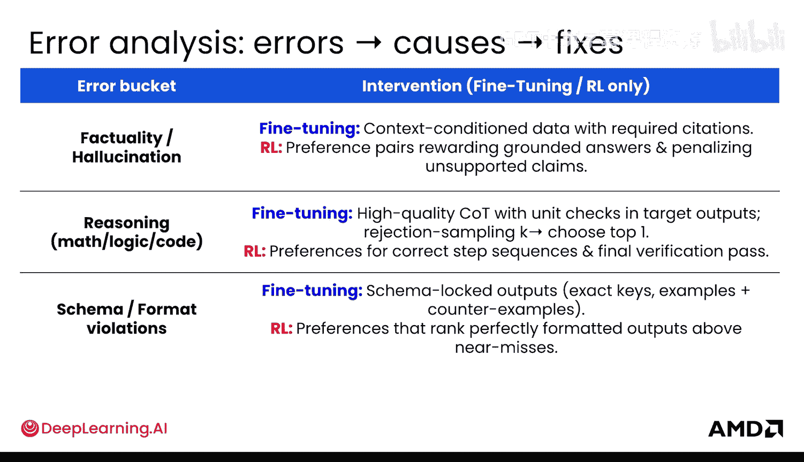

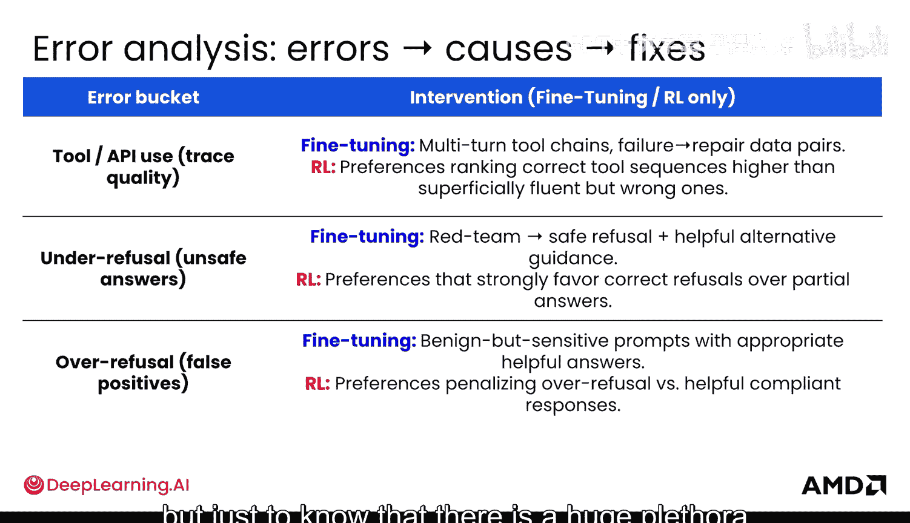

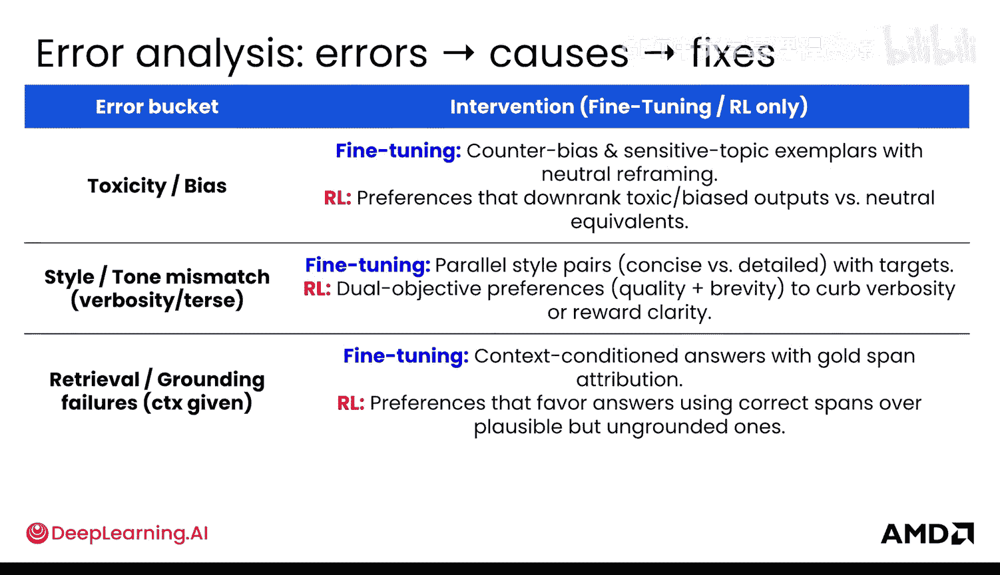

以下是常见的错误类型：
*   **幻觉**：模型生成不实或虚构的信息。
*   **推理错误**：模型的逻辑推理步骤出现错误。
*   **模式/格式错误**：输出不符合预期的结构或格式。
*   **指令遵循错误**：模型未能正确遵循给定的指令。
*   **工具使用错误**：模型在使用外部工具或API时出错。
*   **拒绝不足**：模型本应拒绝回答某些不安全或不适当的问题，但没有拒绝。
*   **过度拒绝**：模型过度谨慎，拒绝了本可以安全回答的问题。

要修复这些错误，有不同的方法，可以在数据层面处理，也可以在奖励模型层面处理（分别对应微调和强化学习）。对于每一个错误，深入分析并找到根源非常重要，但也要知道存在大量可能的错误和相应的修复方案。

## 灾难性遗忘

人工智能研究中最常见的错误类型之一称为**灾难性遗忘**。这通常在微调文献中出现，因为当模型在后续数据集上进行微调时，可能会开始忘记在预训练中学到的知识，尤其是在训练了多个周期之后。

事实证明，一个主要的修复方法是在你的微调数据集中**混合少量预训练数据**。不需要全部，只需一点点，甚至1%就能开始帮助模型避免遗忘。

有趣的是，这是一个专门分析此类错误的研究领域，已经提出了许多理解和诊断此错误的方案。

**重要提示**：对于每一种错误类型（不仅仅是这个），如果它在你的模型中不是问题，就不要去修复它。

## 错误分析流程

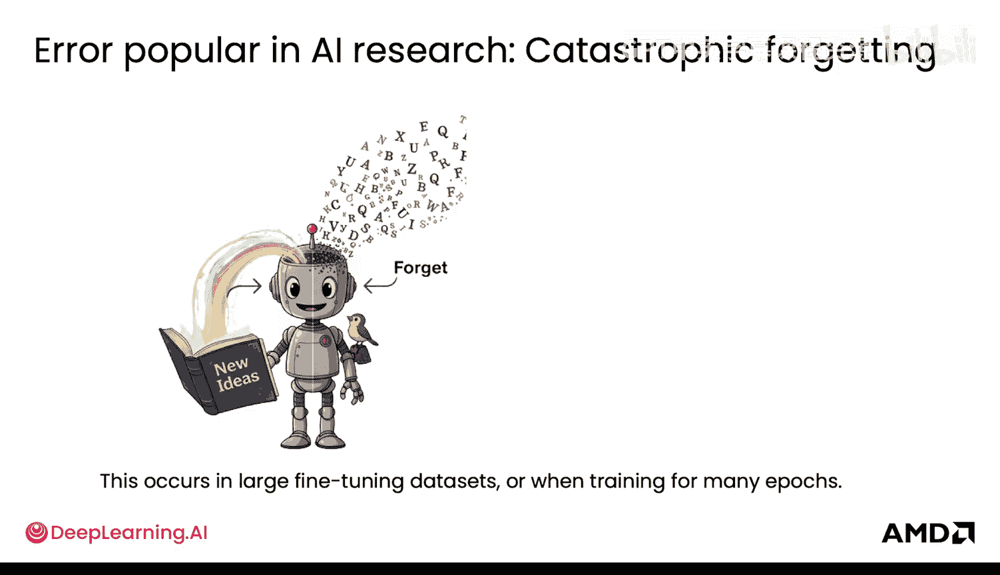

最后，错误分析的流程如下所示：
1.  **审查失败案例**：收集并查看模型出错的例子。
2.  **进行聚类**：使用上述方法将相似的错误案例分组。
3.  **提出修复假设**：针对每个聚类，提出可能导致错误的原因和潜在的修复方案。
4.  **实施与实验**：实施你的修复措施（例如，调整数据、修改训练目标），并运行实验来评估效果。
5.  **持续分析**：在实验过程中持续进行错误分析，形成迭代优化循环。

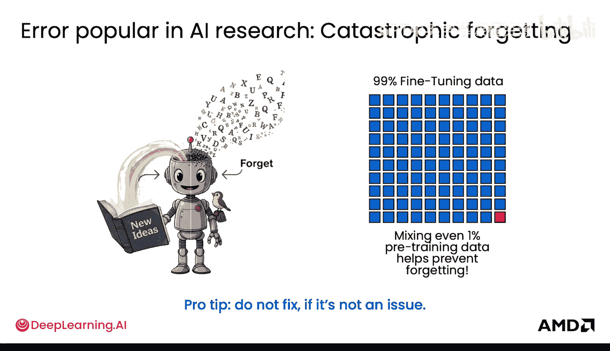

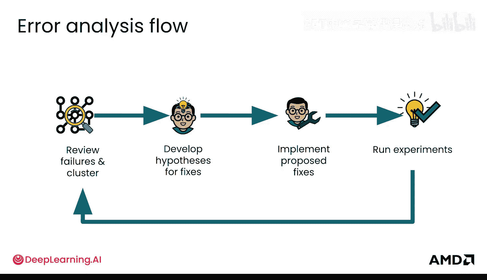

## 总结

本节课中，我们一起学习了如何对大型语言模型进行错误分析。我们了解了诊断单个错误的困难性，以及通过**聚类**寻找错误模式的重要性。我们介绍了基于嵌入相似度的K-means聚类方法，以及利用LLM辅助分类的途径。我们还浏览了常见的错误类型，如幻觉、推理错误和灾难性遗忘，并强调了错误分析是一个“审查-聚类-假设-实验”的迭代流程。掌握这些方法，将帮助你更系统、更有效地提升模型性能。