# 025：7.如何投资于高质量的评估集

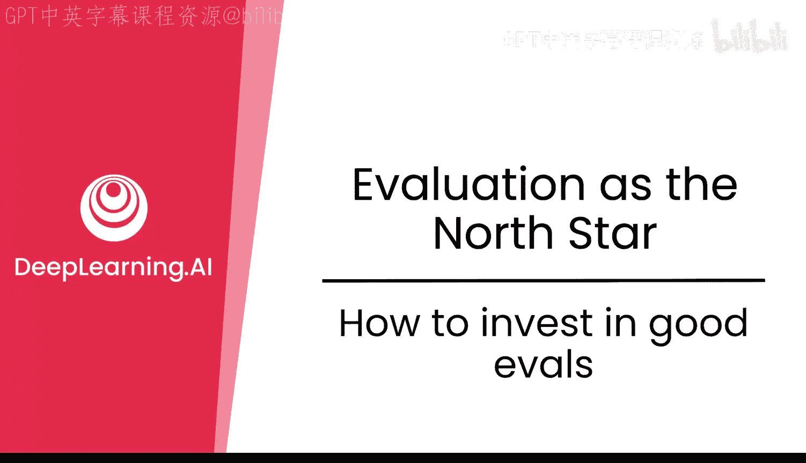

在本节课中，我们将学习如何构建高质量的评估集。我们将探讨评估集的正确规模、扩展方法，以及如何使其具备代表性、可靠性和可操作性。

## 从小规模开始 🎯

既然你已经对评估集感到兴奋，是时候真正投入精力了。正确设定评估集的规模、如何扩展它，并使其具备代表性、可靠性和可操作性，这非常重要。

你对投资评估集感到兴奋。你的第一反应可能是创建一个非常庞大的评估数据集，涵盖数学、物理、历史、政治等所有可能的话题，并花费大量资金聘请众包标注员。请不要这样做。这不是投资评估集的正确方式。

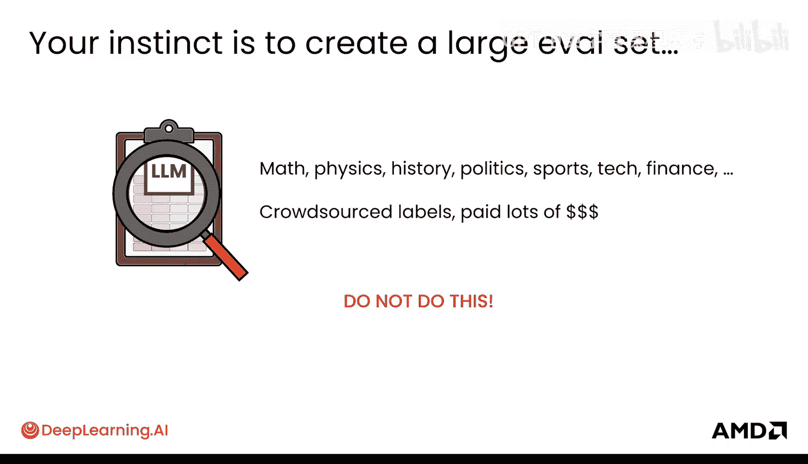

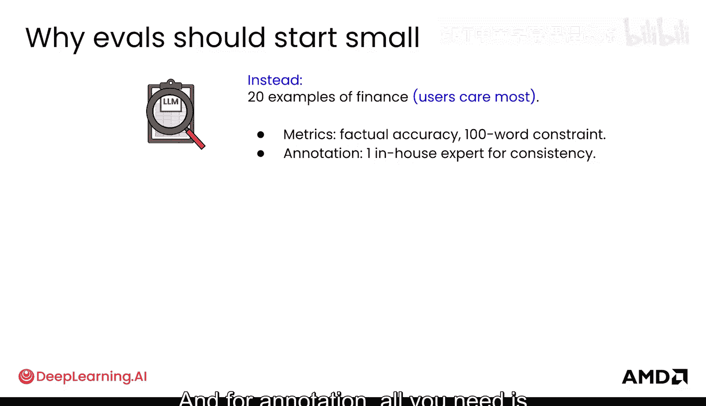

实际上，你的评估集应该从小规模开始。它可能应该从大约20个金融或用户最关心的某个主题的例子开始。它应该围绕事实准确性设定已知的指标，或许还有一个关于简洁性的指标。对于标注，你只需要一位内部专家来保证一致性。因此，评估集最初应该非常简单、非常精简。

在你的第一周内，你实际上已经可以看到模型的一些问题，因为你将完成评估集，并会发现模型可能在数字上产生幻觉，例如编造股价，或者其摘要超过了字数限制。这样，你就能获得实际的洞察来改进模型。

因此，如果你从小规模评估集开始，在第一周内，你就能对模型产生巨大的影响。这是完全正确的做法。

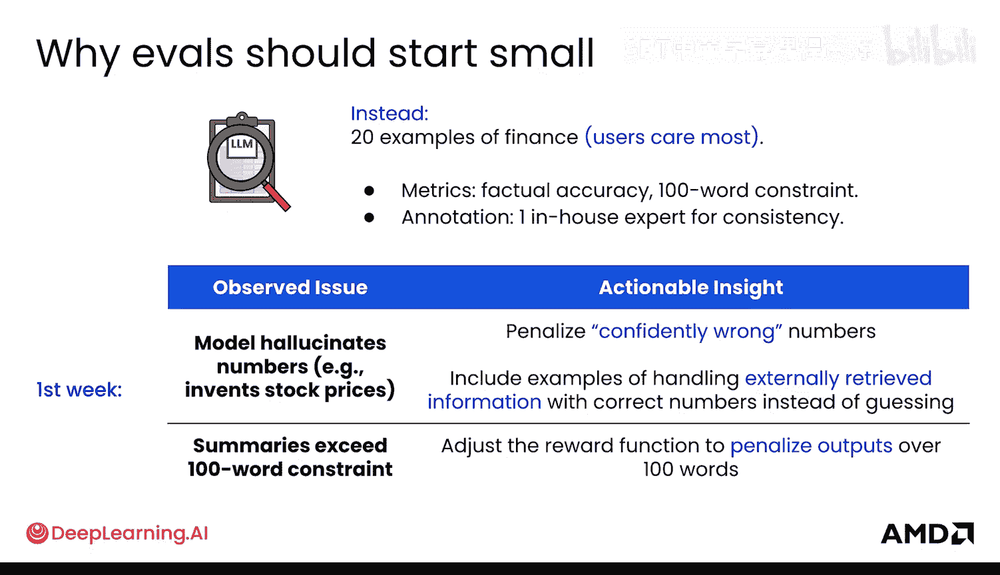

## 逐步扩展覆盖范围 📈

一旦模型在小型、有针对性的评估集上得到改进，你就可以开始将覆盖范围扩展到其他前沿领域。可能需要学习科学和政治等其他主题。你可以更有信心地这样做，并且显然可以根据遇到的失败来扩展评估集，以便更好地理解失败模式以及那些新的技能和领域。

最终，你将获得越来越大的数据集。这种扩展往往是指数级的，而非线性的。你可能从20个例子开始，然后扩展到200、2000、20000个例子。你可能希望每次都将规模扩大10倍，因为你试图覆盖更大的前沿领域。

正如你所见，你并不总是希望你的评估集在任何时候都100%正确，因为那样你实际上并没有测试模型的边界。一个最佳实践是将其正确率保持在最高80%左右。

现在你知道了如何从小规模开始，然后扩展评估集的规模。

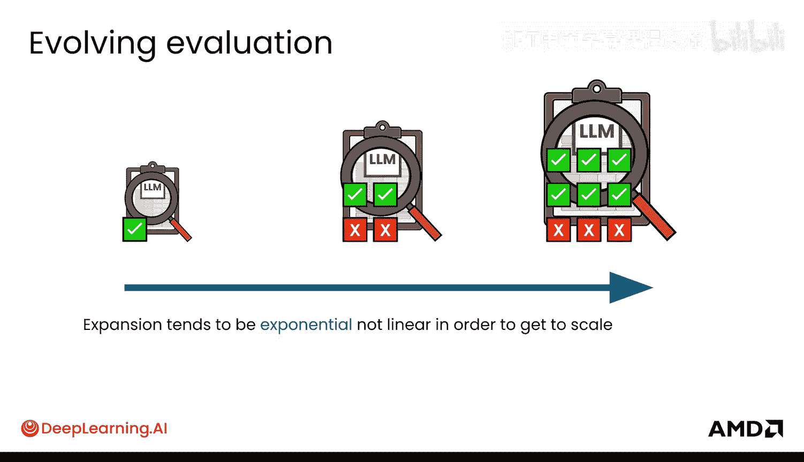

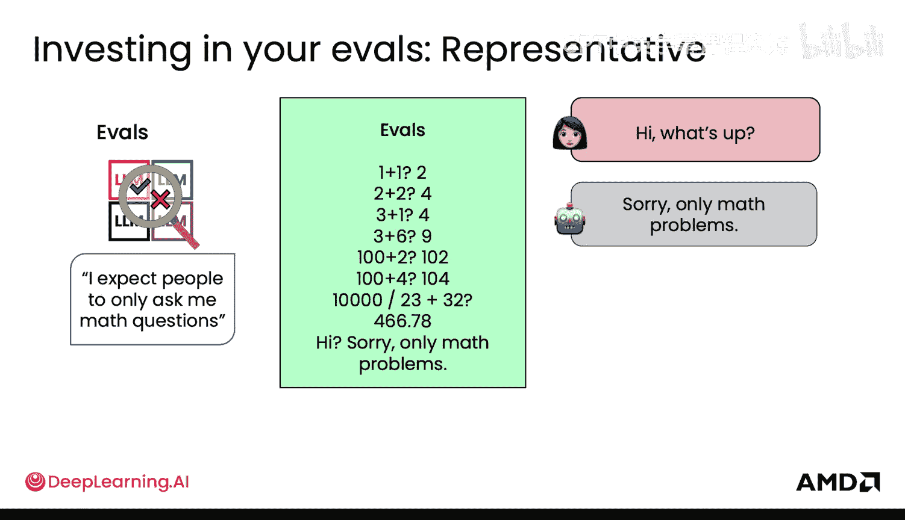

## 评估集的其他优良特性 ✨

以下是评估集应具备的其他优良特性。

### 代表性

评估集需要代表用户实际使用模型的方式。例如，用户问了一个非数学问题，而模型不知道如何处理，回答“4”。然而，你的评估集没有任何与数学无关的问题，它只有数学问题。这是一个问题。

因此，在你的评估中，你可能开始评估模型，并确保它有一些防护机制，比如“抱歉，我只回答数学问题”。你将这类拒绝回答的例子添加到评估集中，然后在训练模型时也加入这些例子，现在你的模型就能处理这种情况了。

为了更深入地理解代表性，假设你的用户有20%的问题是关于数学的，但80%是对话式的。如果你的评估集不能代表这种分布，它给对话式问题的权重比数学问题大，那么你可能会看到基于评估准确率，模型整体上有所改进，但实际上你的用户正在遭受困扰，他们会问为什么模型在数学上这么差。这是因为评估集没有代表用户实际使用模型的情况。

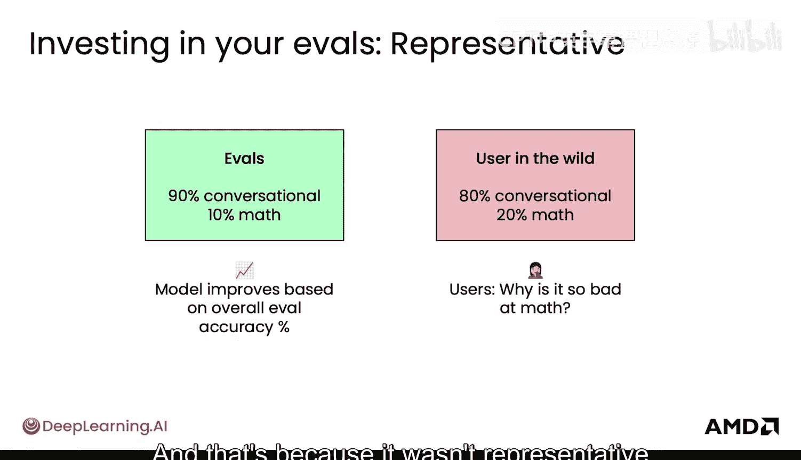

### 可操作性

下一个重要的特性是使你的评估集具有可操作性。如果评估集中错误分析的全部目的是修复模型，那么评估集本身就需要是可操作的。这意味着错误应能指向数据干预本身。

你的评估集应该能够引导你发现下一个前沿领域。例如，这里是除法。你在评估集中添加除法示例，这样你就可以为除法创建新的数据。你看到了除法上的失败模式，然后想：“好的，我需要更多的除法数据。”因此，你在评估集中添加这些除法示例，看到那些失败，这促使你创建新的数据。

这再次说明了你为什么希望评估集在任何时候的正确率最高为80%。以下是你如何采取行动的例子。

假设你正在观察你的模型，它是一个数学模型。你正在查看它在每种运算类型上的表现：加法、乘法、除法和混合表达式。当你观察错误时，你发现它在加法上没有错误，所以你不需要任何实际的干预。乘法做得相当好，也许你可以添加一些大数值乘法的例子，因为它偶尔会在大数字上出错。除法表现相当差，那么你就需要收集非常有针对性的除法问题，涵盖不同的例子：整数、小数、边界情况。对于混合表达式，你可能也想在那里添加更多例子，甚至可能将除法推理示例添加到强化学习中。

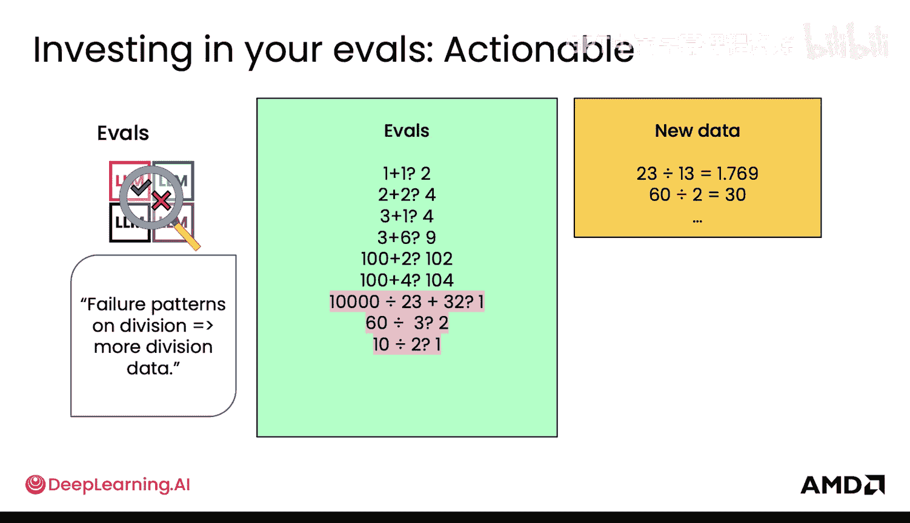

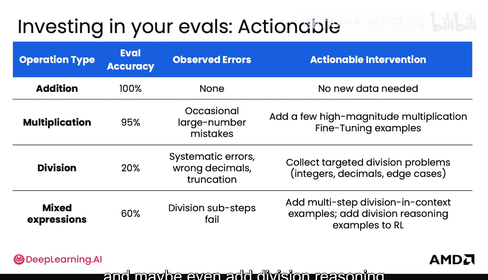

### 可靠性

你的评估集一个非常重要的特性是使其可靠。这样你才能真正信任从一个实验到下一个实验的差异。请记住，你为了分析要运行多少实验。你希望能够信任一个实验确实比另一个更好。你希望信任这里的模型B在除法上比模型A更好。

你能说服我吗？如果你看顶层数字，模型A在所有方面都正确率为90%，模型B较低，为82%。然而，当查看除法子集时，模型A为0%，模型B为100%。但是，如果你深入挖掘，查看整体情况，然后查看除法子集，你会发现除法子集中只有5个项目。也许模型B在除法上好得多，但只有5个项目，我怎么能确定呢？然后你在评估集中扩展你的除法子集，实际上获得一个更可靠的数字。有了这个更大的样本，信号更稳定，你可以说，是的，实际上模型B在除法上确实更强。

可靠性不仅仅是关于样本量，它关乎你结论的稳定性。你也可以运行统计显著性检验，跨越多个实验或在不同的随机种子下运行的模型，以确保改进是真实的。这也是为什么鼓励广泛的覆盖范围，这样你就知道你的模型在许多不同的维度和轴上是可靠的。

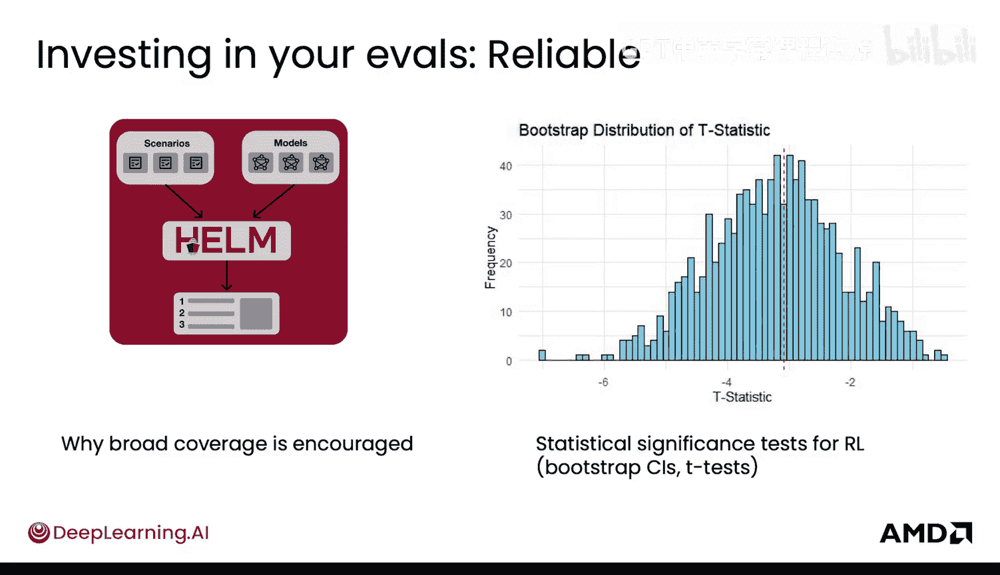

## 总结 📝

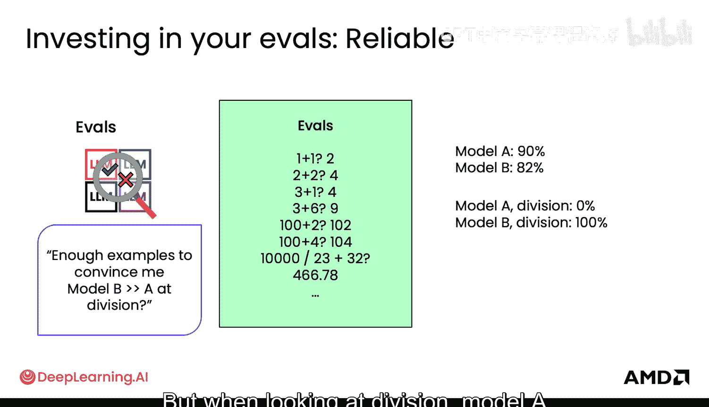

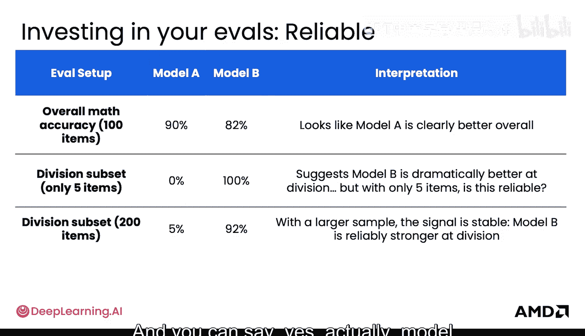

本节课中，我们一起学习了如何投资于高质量的评估集。我们从**从小规模、有针对性的评估集开始**（例如，从20个核心例子起步）的重要性讲起，然后探讨了如何**逐步指数级扩展**覆盖范围。我们详细分析了评估集应具备的三个关键特性：**代表性**（反映真实用户使用分布）、**可操作性**（错误能明确指导数据干预）和**可靠性**（结论稳定，可跨实验比较）。最后，我们了解到评估集的正确率并非越高越好，保持在**约80%** 左右有助于有效探测模型的能力边界。

现在你已经投资于你的评估集并使其质量超高，是时候通过红队测试来“破坏”你的模型了。