# 027：后训练需要多少数据

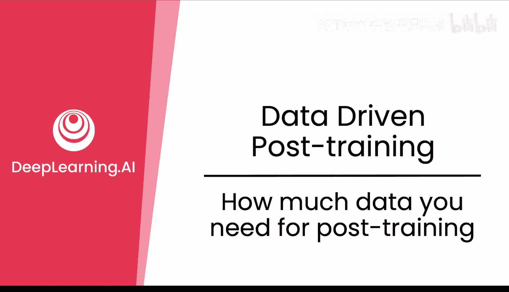

在本节课中，我们将要学习后训练阶段所需数据量的关键考量。数据是后训练中最重要的因素之一。从评估中的错误可以看出，大多数修复工作都集中在数据层面。一个常见的问题是：需要多少数据才能解决我的问题？让我们来探讨一下。

后训练所需的数据量在很大程度上取决于你所使用的预训练模型。将这两个阶段进行对比有助于理解数据的作用。对于预训练，核心在于规模。模型需要大量数据来学习通用任务集合中的各种知识。根据2022年DeepMind关于Chinchilla模型的论文，模型需要的**数据量约为每个参数对应20个token**。这意味着一个100亿参数的模型理想情况下应在2000亿个token上进行训练。GPT-3的预训练数据量约为3000亿token。预训练的规模非常庞大。这个规则并非绝对，但为理解预训练能有效处理多少数据提供了一个很好的参考点。

后训练则完全不同。它更少关注数据的规模，而更注重数据的质量，以重塑模型的行为。例如，ChatGPT使用了大约**13,000个微调样本**，远少于预训练的数十亿token。其奖励模型使用的偏好对数据也少于一百万。

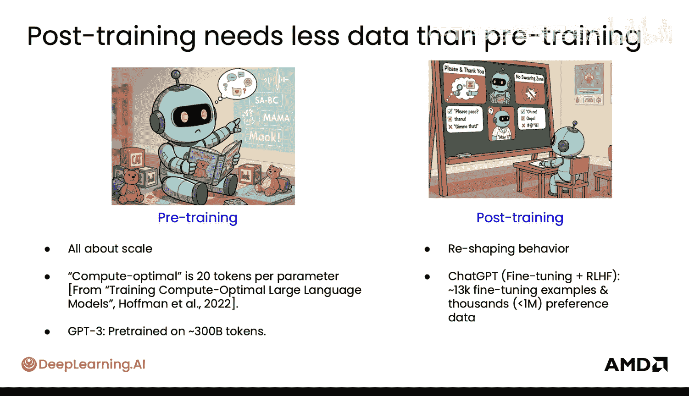

那么，什么时候50个样本就足够，什么时候又需要10万个样本？什么时候可以只用少量样本，什么时候又需要大量数据？

如果你的预训练模型已经掌握了微积分和数学知识，而后训练的目标只是学习一种新的考试格式，那么可能只需要**20个练习题**就能让模型学会这种新格式。但如果模型从未见过微积分，却需要学习这种新的微积分考试格式，那么20个样本很可能不够，因为你还需要教授整个微积分课程，这可能需要数千个样本。更进一步，如果模型完全没有数学基础，那么达到微积分考试水平的目标将困难得多，需要多得多的样本来演示数学课程。

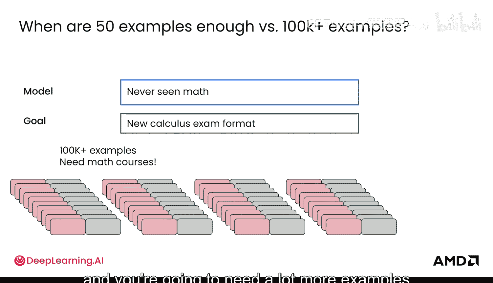

因此，关键在于评估预训练模型对你的任务已经掌握了多少知识。如果预训练模型中没有相关知识，那么在后训练中就无法廉价地创建它。因此，首先应在预训练模型上运行评估，以了解模型已有的能力和知识，这将帮助你估算后训练任务所需的数据量。

举例来说，通过评估，你可能会发现模型已经很擅长加法，但尚未掌握除法或混合运算。这样你就能明确需要什么样的干预措施和数据来教授模型基础数学。当然，你希望从最少的数据量开始。在扩大规模之前，先用最小量的数据来验证你需要什么类型的数据。甚至在确定确切数据量之前，就从更小的规模开始，因为你的假设可能不正确。

接下来，我会考虑逐步扩大数据规模，直到收益递减。也许从20个样本开始，这足以观察到格式上的微小变化。

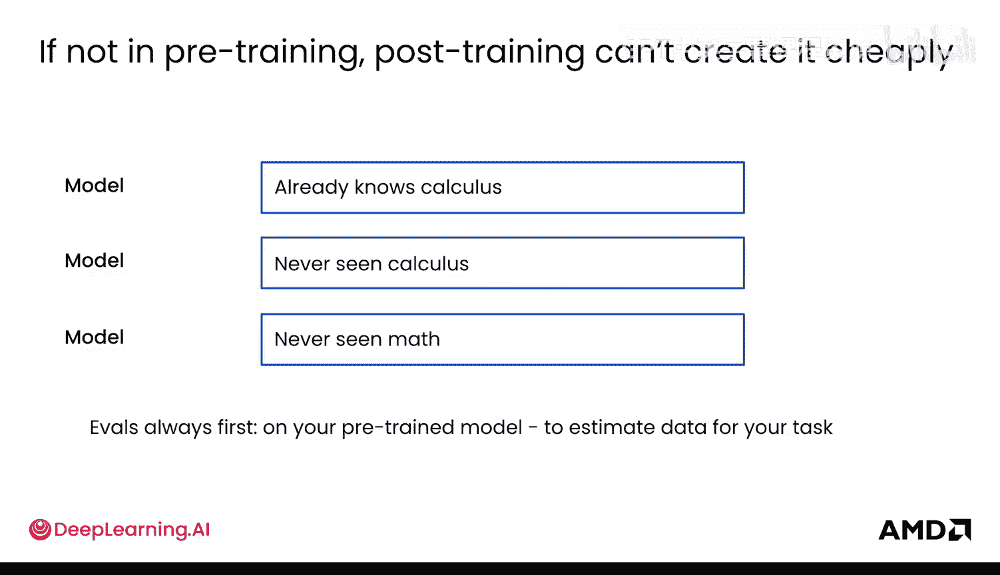

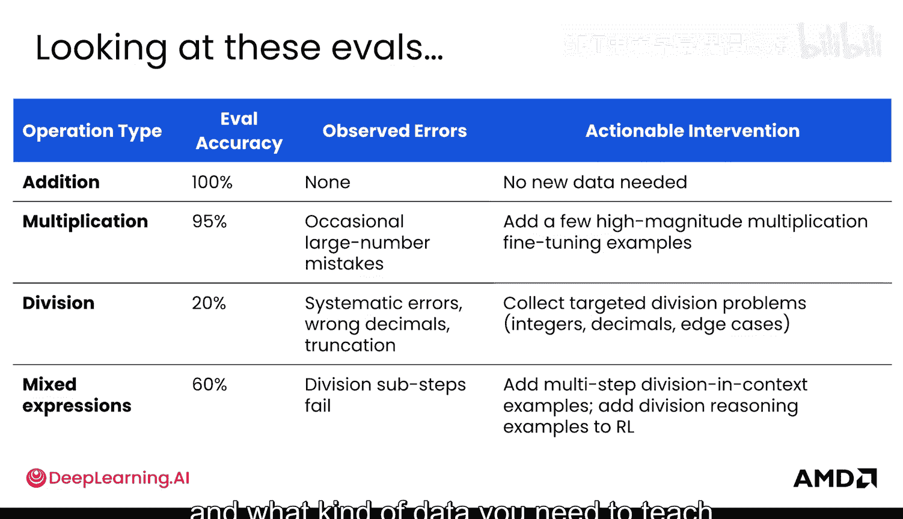

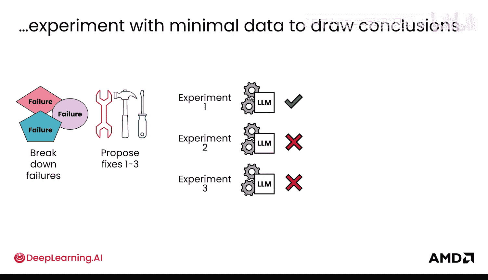

当数据量达到**数百**级别时，你会开始看到模型的一些变化。**数千**级别通常是实现许多任务的“甜蜜点”。**数万**级别可能是许多前沿实验室进行后训练的规模。而**数十万**级别则意味着你在添加新的领域知识。

LoRA技术可以帮助你用更少的数据完成任务，因为它只改变模型较少的权重，能更有效地适应目标数据。对于LoRA，你需要考虑秩的大小。你希望使用尽可能低的秩，因为这意味着调整更少的参数。对于较小的数据集，你可以使用非常小的秩；而对于较大的数据集，你可能需要增加秩才能看到模型的变化。

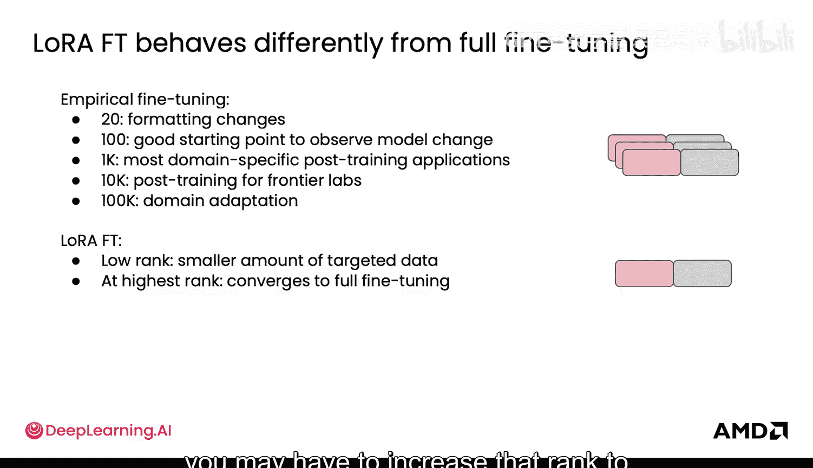

对于偏好学习，即训练奖励模型，所需的数据规模类似。经验表明，在**数千**个样本的规模上，就能看到奖励模型的改进。对于更细微的区分，例如A和B之间的精细差别，你可能需要更多数据。奖励模型更接近于一个分类器，试图理解特定偏好类型之间的界限。它可以在RL训练期间持续训练，这被称为在线偏好学习。奖励模型评估的输出不一定必须由它正在评估的LLM生成，也可以由人编写，或由不同的语言模型或其他类型的模型生成。这实际上有助于奖励模型避免对现有模型过拟合。

最终，在RL训练中，效果在很大程度上取决于奖励模型的能力。改进奖励模型可以看到由此训练的最终LLM的性能提升。当然，你也会看到性能饱和。当奖励模型的数据量增加10倍而性能不再提升时，你就知道已经达到瓶颈，无需再改进奖励模型了。因为奖励模型的最终目标是改进这个最终的LLM。

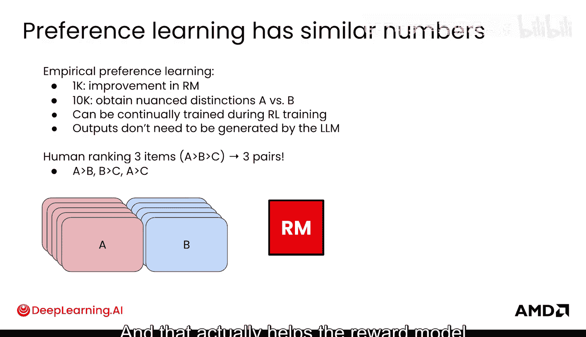
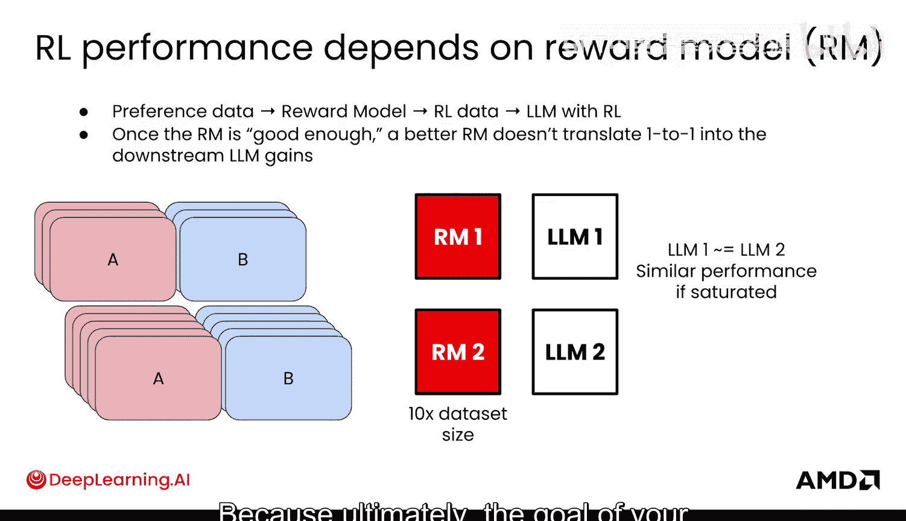

模型在RL中的表现也取决于输入分布。就像在微调中需要多样化的样本一样，在RL中你也需要非常多样化的输入来有效覆盖和代表你的任务。每个输入也可以有多个输出。Hugging Face的默认设置是**8个输出**。这实际上可以帮助你估计奖励的方差。基本上，你可以从一个输入产生多个输出，得到许多“展开”。在当今最先进的研究中，我们看到的规模是**数十万到可能上百万次展开**。这有助于模型理解在给定多种可能输出的情况下，其表现的方差有多大。

你已经了解了微调、偏好学习和展开的规模。下图展示了它们的对比。可以看到，随着样本数量的增加，确实会出现一些性能饱和。所有这些都基于经验，你需要在扩大规模之前，先进行小规模测试。

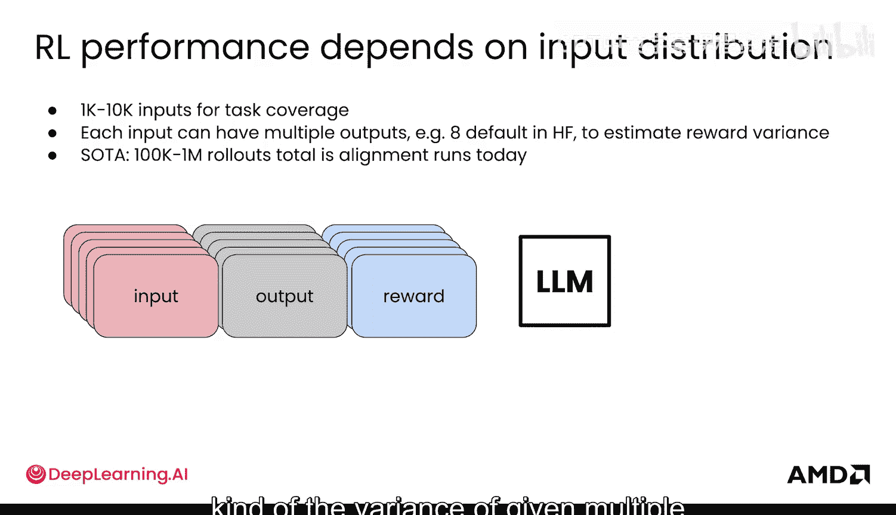

对于后训练，最重要的一点可能不是更多的数据，而是**精心准备的数据**。少量精心挑选的样本总是胜过大量嘈杂的样本。这与预训练不同。基本上，如果你有100个精心准备的样本和10,000个可能是合成生成的嘈杂样本之间的选择，你应该总是选择那100个，因为这最终会给你带来更好的模型。下图展示了一个AI Marie Con，它更喜欢精心准备的样本，而不是嘈杂混乱的样本。

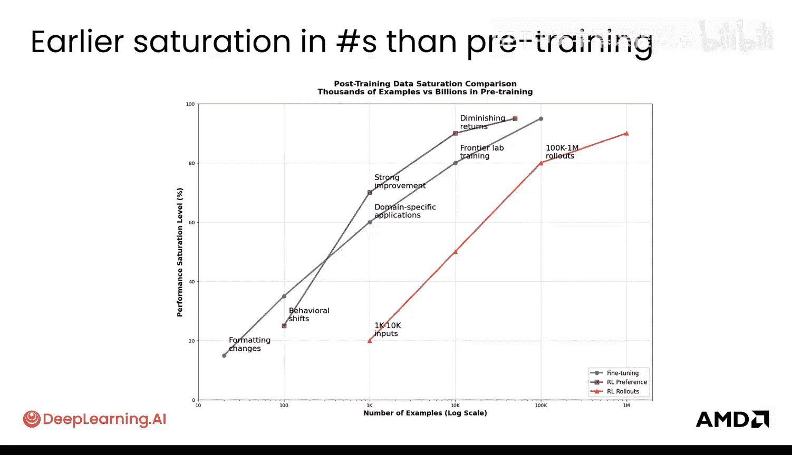
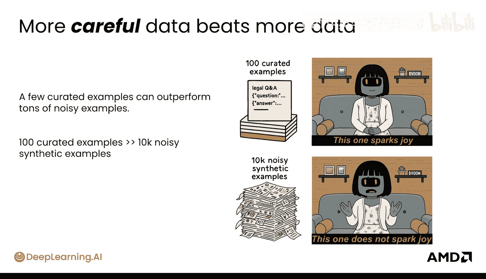

现在你已经了解了后训练需要多少数据，接下来让我们首先聚焦于微调数据。