# 028：微调数据准备 📊

在本节课中，我们将要学习微调大型语言模型（LLM）时，数据准备的核心概念与迭代优化流程。数据是微调过程中最重要的组成部分之一。

## 概述


我们将探讨如何为微调准备输入与输出数据对，并深入了解如何通过迭代的方式，针对性地添加数据样本来解决模型在微调后出现的特定错误模式。这个过程对于教会模型理解自定义标签、遵循特定格式以及提升推理能力至关重要。

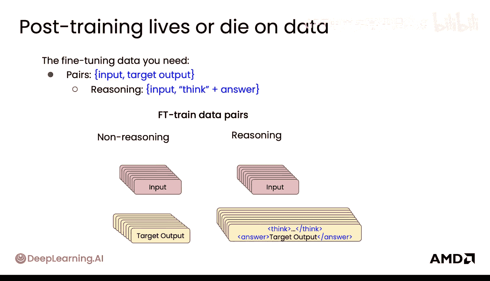

## 微调数据基础

上一节我们介绍了微调的基本概念，本节中我们来看看其核心的数据要求。进行微调时，你需要准备**输入数据**和**目标输出数据**对。

对于需要模型进行推理的任务，输出数据对需要包含“思考过程”和最终答案。其格式通常如下：
*   **输入**：`Alice has three apples buys two more how many now`
*   **目标输出**：`<think>Alice started with 3 apples. She bought 2 more, so 3 + 2 = 5.</think> The answer is 5.`

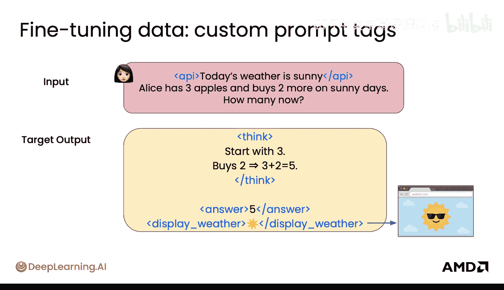

在推理任务中，你需要使用类似 `<think>` 这样的标签来包裹模型的推理过程。


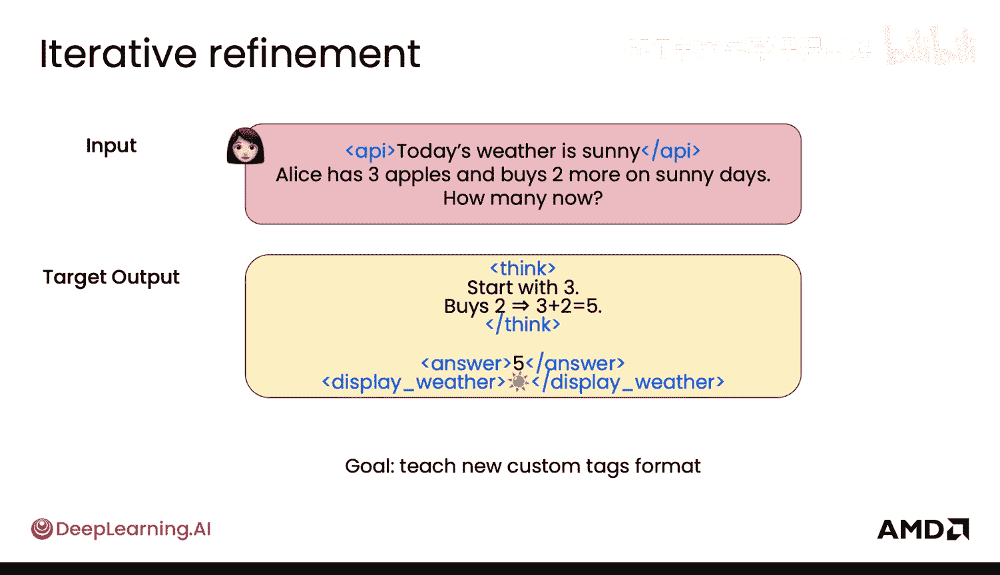

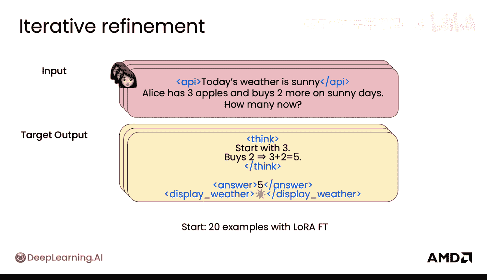

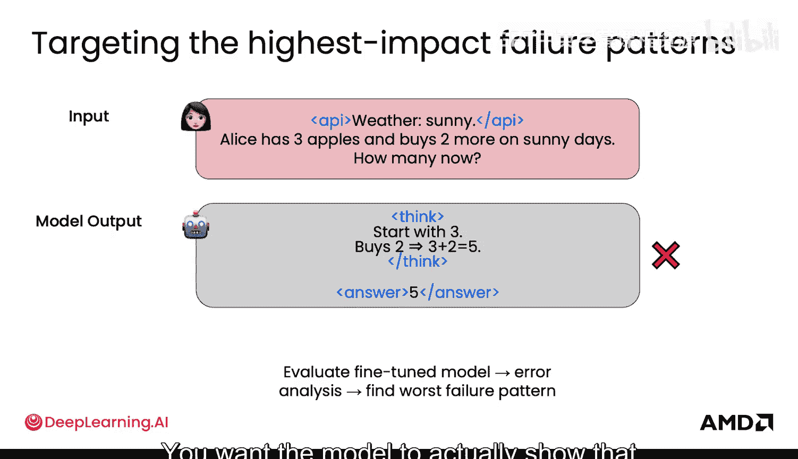

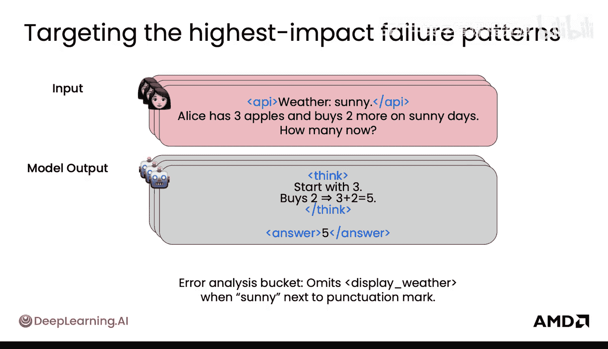

## 自定义标签与格式教学

如果你想引入自定义的提示标签，微调是一个绝佳的机会。例如，你的输入可能总是需要调用一个API来获取今日天气，并包含一个 `<weather_api>` 标签。通过微调，模型将学会理解这个标签作为输入的一部分，并据此生成正确的输出。

同样，在输出中，你可能也希望模型使用自定义标签。例如，你希望模型输出一个 `<display_weather>` 标签，后面跟着一个表示天气的表情符号，以便在网站上程序化地提取和显示。

**代码示例：一个理想的数据样本可能如下所示**
```
输入：用户查询：<weather_api>今天天气如何？
输出：<think>调用天气API，返回结果为‘晴朗’。</think><display_weather>☀️</display_weather>今天天气晴朗。
```

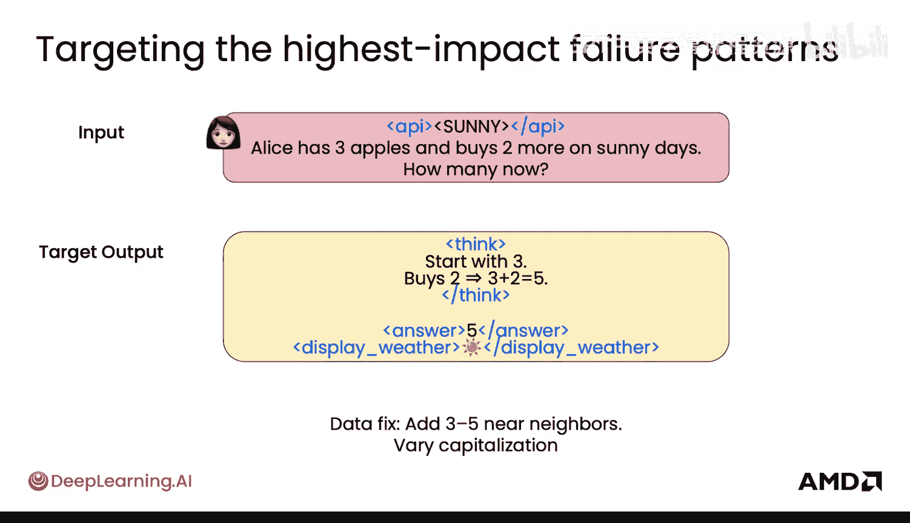

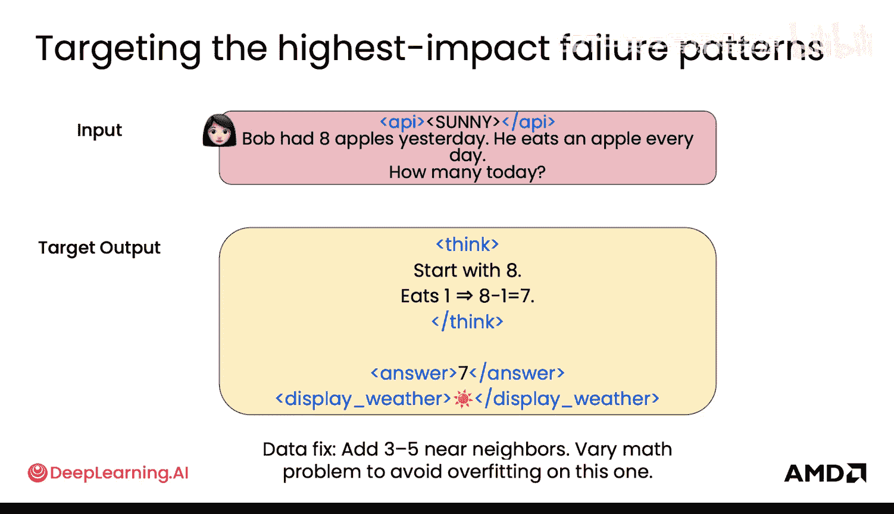

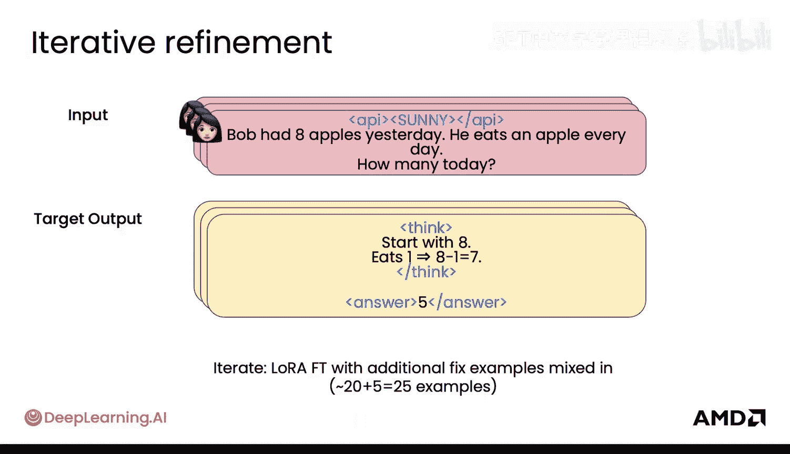

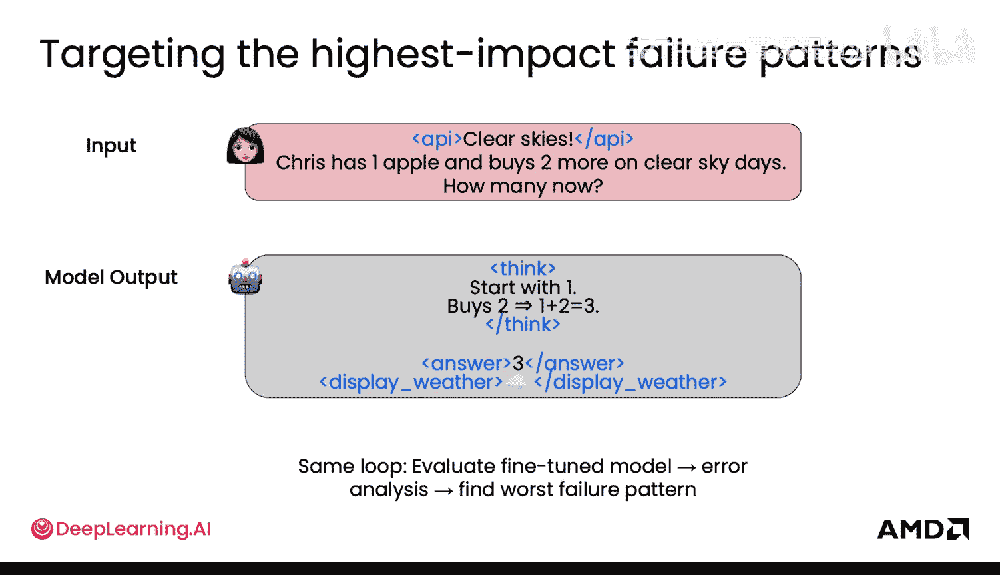

## 迭代式数据优化流程

你的目标是教会模型理解新的自定义标签和格式。这是一个迭代的过程，让我们看看具体如何操作。

以下是迭代优化模型的一般步骤：

1.  **初始微调**：你可以从少量（例如20个）示例开始，使用LoRA等技术进行微调，先让模型的行为产生初步变化。
2.  **评估与错误分析**：评估微调后的模型，进行错误分析，找出最严重的失败模式。
3.  **定位问题**：假设你发现最严重的问题是模型有时会省略 `<display_weather>` 标签。经过深入分析，你假设当“sunny”这个词紧挨着某些标点符号出现在输入中时，问题就会出现。
4.  **添加针对性数据**：为了解决这个问题，你需要添加一些“反例”来教导模型。例如，创造一些包含“sunny,”、“bright sunshine.”等不同标点和同义词的输入样本，并确保其输出包含正确的 `<display_weather>` 标签。同时，应尽可能多样化输入内容。
5.  **再次微调与评估**：混合这些新的示例，进行新一轮的LoRA微调。修复此问题后，再次评估模型，寻找下一个最严重的失败模式（例如，为“晴朗天空”错误地使用了云朵表情☁️而非太阳表情☀️）。
6.  **持续迭代**：针对新发现的问题（如标签“泄漏”、模式不严格遵守输出格式等），继续添加针对性的数据样本进行修正。

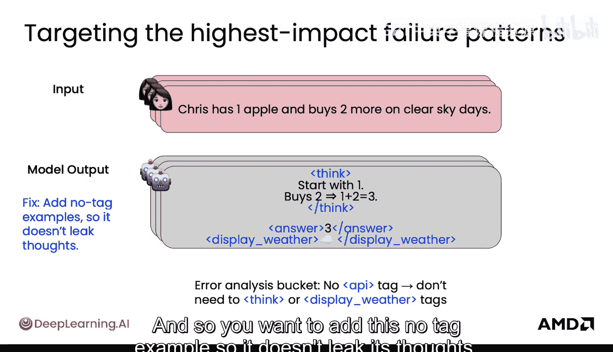

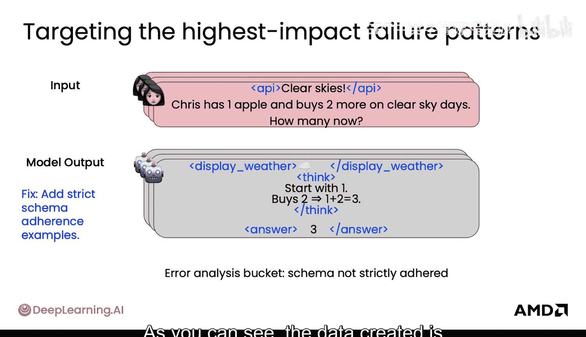

这个过程会不断重复。一个关键问题是：何时停止？AI模型可能永远无法达到完美。通常，你可以以用户评估作为指导，当模型的表现足够好，或者优于当前生产环境中的模型时，就可以考虑发布，并在实际使用中继续收集反馈。

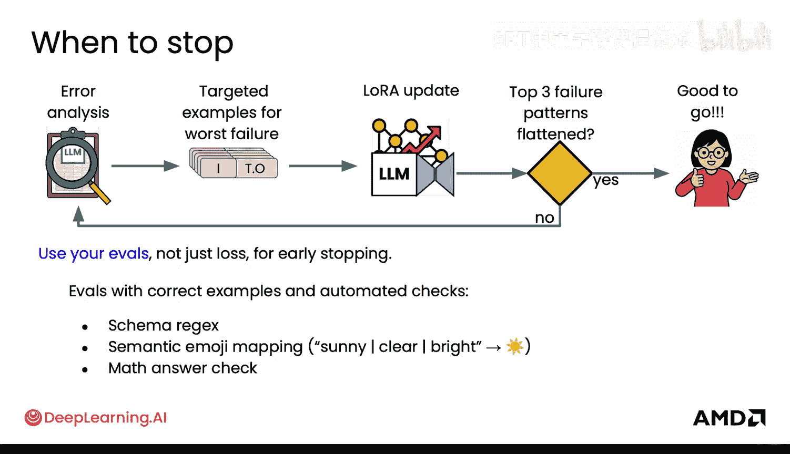

## LoRA微调的实践考量

在应用LoRA进行微调时，有几个重要的考虑因素：

*   **适配器放置位置**：通常将LoRA适配器加在注意力（Attention）层上是标准做法。如果同时加在多层感知机（MLP/线性）层上，可能有助于增强模型的事实回忆能力。
*   **秩（Rank）的选择**：LoRA的秩很重要。当数据量较少时，可以使用较低的秩；当数据量很大时，可能需要更高的秩才能有效改变模型行为。
*   **训练步骤与批次大小**：对于LoRA，通常更倾向于使用更多的训练步数和较小的批次大小，以最大化参数更新的多样性。

建议始终从LoRA微调开始。随着任务复杂度和数据量的增加，如果你发现即使增加秩和适配器数量，模型行为仍无法按预期改变，这时可能需要重新审视数据，或考虑进行**全参数微调**，这通常意味着模型需要更根本性的知识更新。

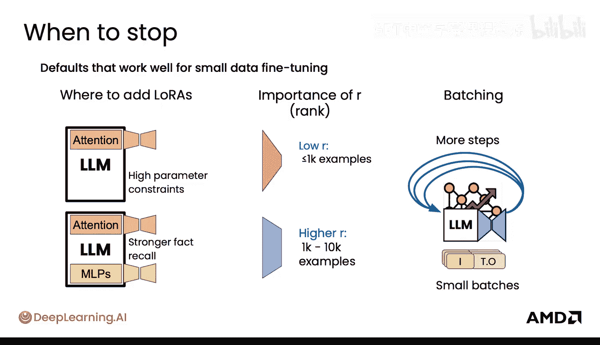

## 推理数据与任务类型的平衡

关于推理数据（即包含 `<think>` 标签的数据）的混合比例，需要仔细考量。这些“思考”标签是教导模型进行推理、从而获得更好输出的有效方式。

以下是决定混合比例时的两个主要指导原则：

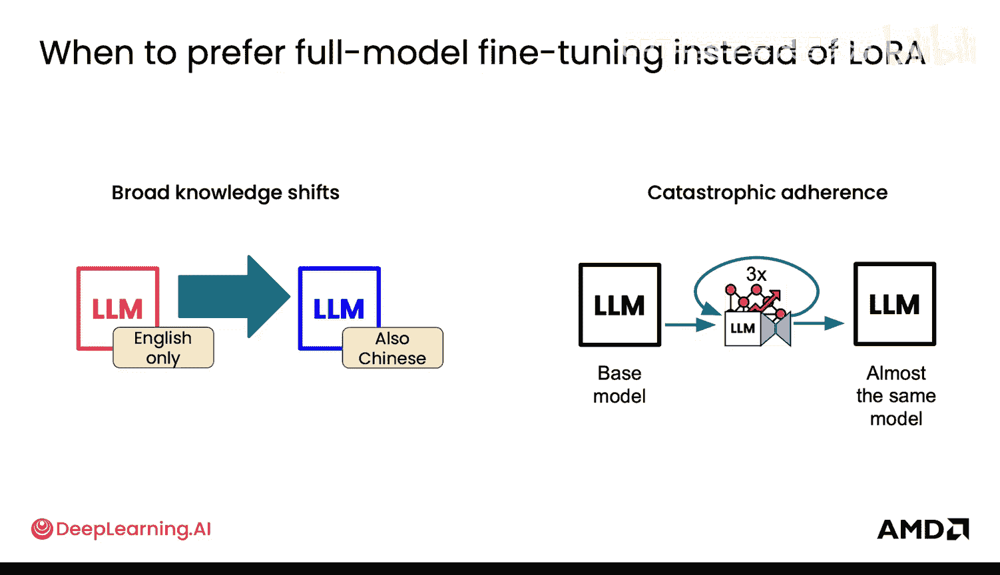

1.  **用户使用方式**：考虑用户在推理时将如何使用你的模型。例如，用户界面可能提供一个复选框让用户选择“启用思考过程”。在这种情况下，你的训练数据就应该同时包含带思考标签和不带思考标签的输入，并让模型学会相应响应，以便在服务时能动态切换。
2.  **任务类型**：
    *   如果用户任务**重度依赖推理**（如数学解题、复杂规划），建议大幅增加推理数据的比例（例如至少40%或更高），其余为直接回答的数据。
    *   如果用户任务对**延迟非常敏感**，需要模型快速响应，那么你可能需要更多直接回答的示例，让模型学会不经长时间“思考”就快速给出答案。

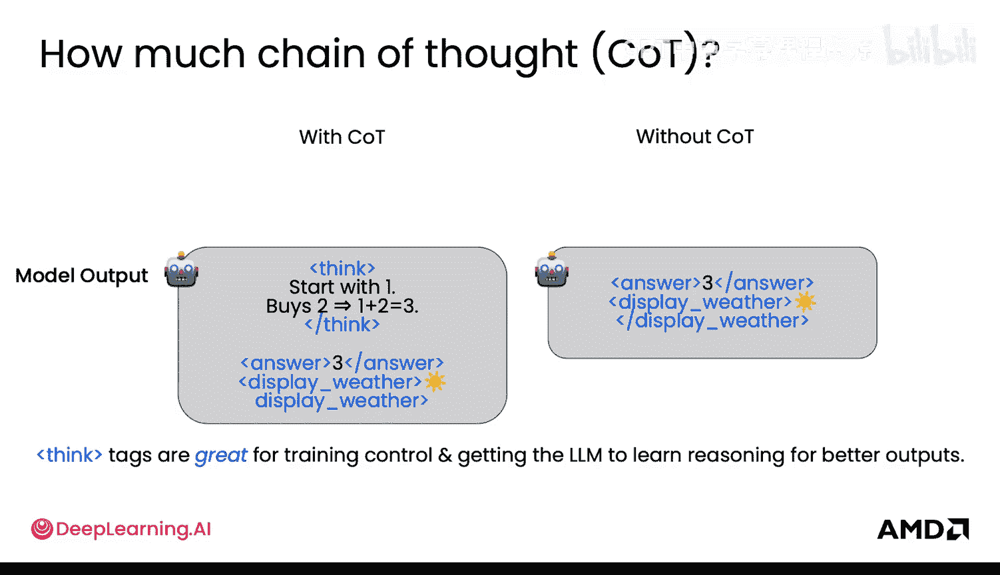

## 总结

本节课中我们一起学习了微调LLM时数据准备的核心流程。我们了解到数据需要成对的输入和输出，对于推理任务需包含思考过程。我们重点探讨了通过迭代分析错误模式、添加针对性数据样本来优化模型的实践方法。此外，我们还讨论了使用LoRA技术时的关键参数选择，以及如何根据最终的用户场景和任务类型来平衡推理数据与直接回答数据的比例。记住，数据质量和对齐目标任务的针对性是微调成功的关键。

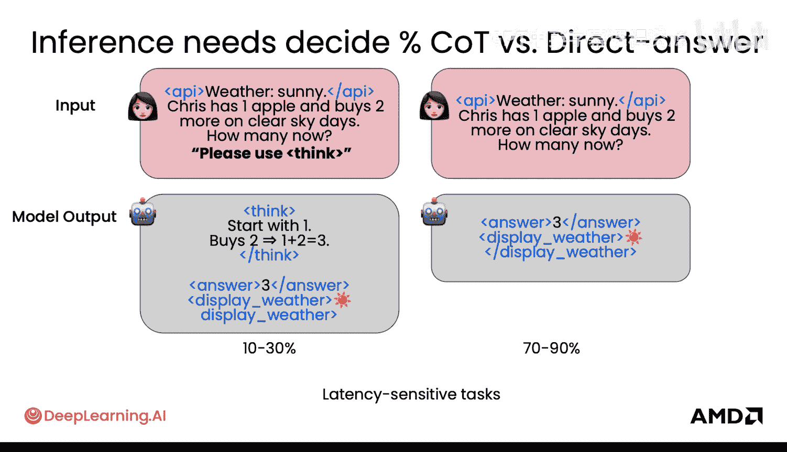

现在你已经探索了微调数据，是时候来看看用于强化学习（RL）的数据了。