# 029：RL所需数据（第一部分）📊

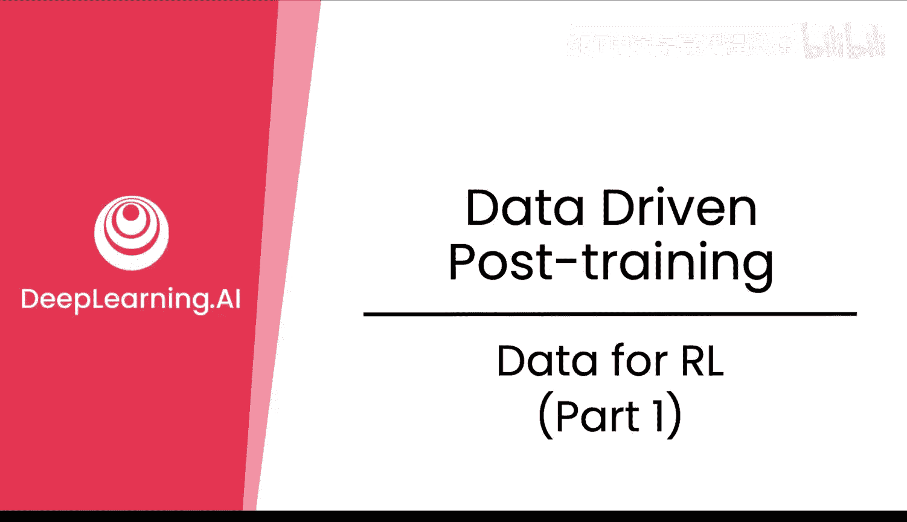

在本节课中，我们将学习强化学习所需的数据，重点关注两种关键数据：**轨迹数据**和**偏好数据**。我们将探讨它们的作用、如何获取以及在实际应用中的考量。

## 概述

强化学习训练大型语言模型需要两类核心数据。第一类是**轨迹数据**，它记录了模型在特定输入下的输出序列。第二类是**偏好数据**，用于训练奖励模型，以评估模型输出的优劣。理解这两类数据的构成和获取方式是成功应用RL的关键。

## 轨迹数据与偏好数据

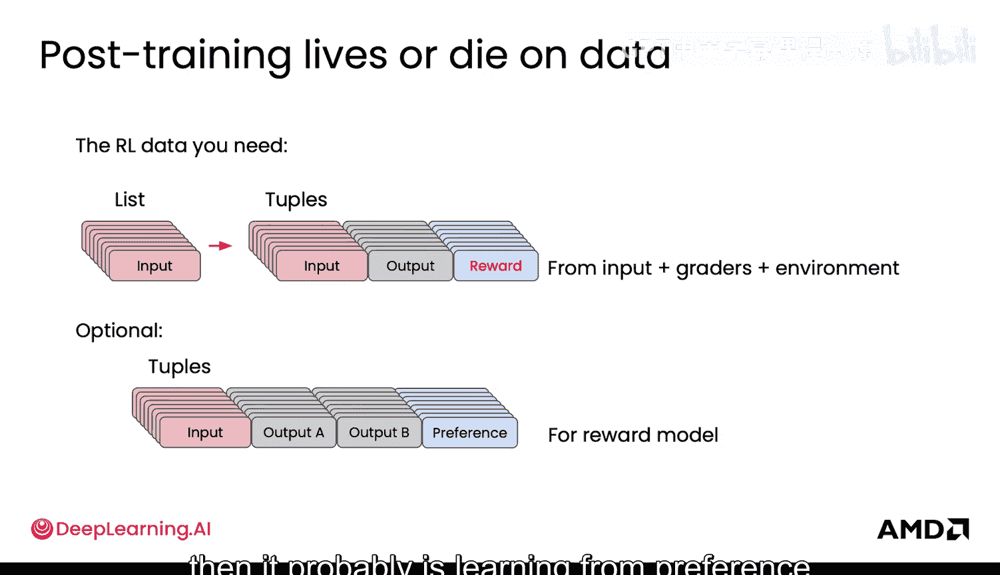

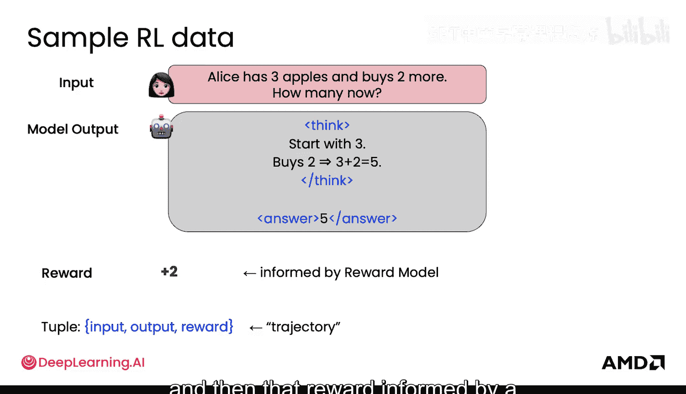

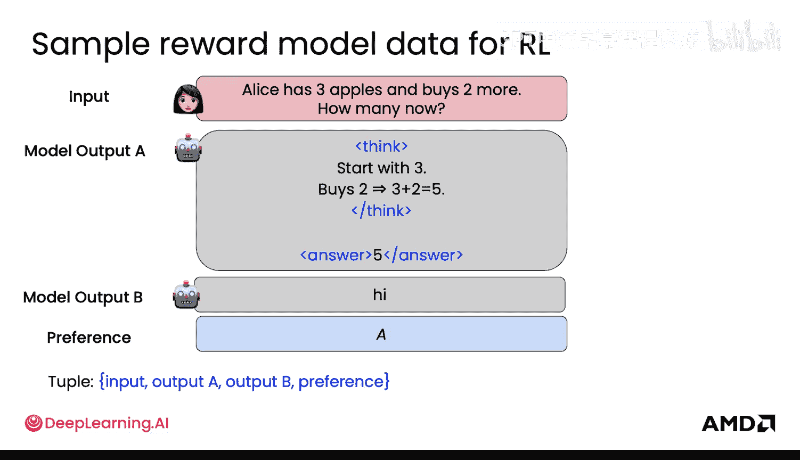

上一节我们介绍了RL的基本流程，本节中我们来看看具体需要哪些数据。强化学习的数据有两个重要的考量因素，一个是轨迹数据，另一个是用于奖励模型的偏好数据。我们来详细看看这两者。

首先回顾一下RL所需的数据。你需要一个多样化的输入列表，这最终会产生你的轨迹数据。轨迹数据包括：**输入**、**模型输出**，以及来自评分者的**奖励**。评分者可能评估整个RL环境。如果你的评分者之一是奖励模型，那么它很可能是在从偏好学习中学习。偏好数据的具体形式是：一个输入、模型的两个可能输出（A和B），以及一个偏好标签（指明哪个更好）。

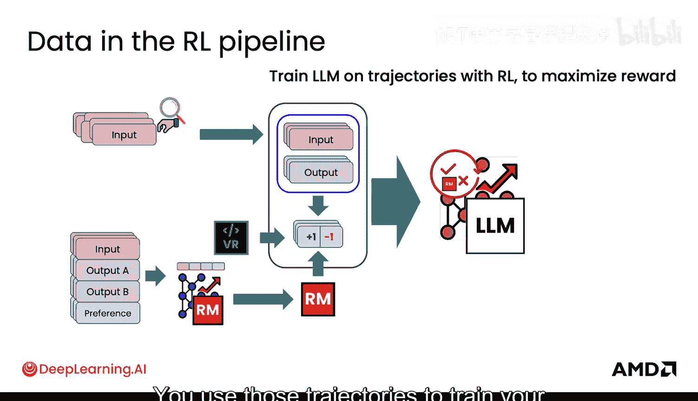

以下是RL数据管道的核心组成部分：
*   **输入**：一个多样化的指令或问题集合。
*   **模型输出**：模型针对每个输入生成的响应。
*   **奖励**：由奖励模型或验证器给出的评分。
*   **偏好数据**：用于训练奖励模型的成对比较数据，格式为 `(输入, 输出A, 输出B, 偏好)`。

## RL数据管道流程

现在我们来总结一下整个数据管道的流程。你首先需要整理一批多样化的输入，这些输入需要广泛覆盖你的目标任务。然后获取轨迹数据，即模型针对这些输入生成的输出。每个输入可以生成多个输出。

如果你使用奖励模型，你需要收集偏好数据，并基于这些数据来训练你的奖励模型。你也可以使用验证器。这些评分器会对你的轨迹数据应用奖励，从而得到完整的轨迹记录。你使用这些轨迹记录，通过RL训练你的LLM以最大化奖励。这个过程是循环进行的。

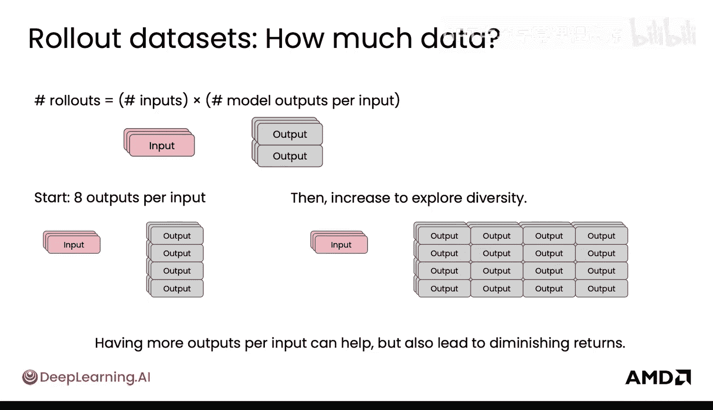

## 需要多少轨迹数据？

一个常见的问题是：到底需要多少轨迹数据？轨迹数据由一定数量的输入构成，而针对每个输入，你需要从模型中生成多少个输出？一个常见的起点是**每个输入生成8个输出**，这是Hugging Face的GRPO训练器中的默认设置。这意味着对于每一个输入，你生成8个可能的模型响应。

从这个起点开始，增加每个输入的输出数量可以让你探索模型输出的多样性，并获得不同类型的奖励。但最终，增加每个输入的输出数量会导致收益递减。这是因为你可能会得到相似的输出，或者得到的评分方式对你的RL训练没有实质性的帮助。

## 不同场景下的数据需求

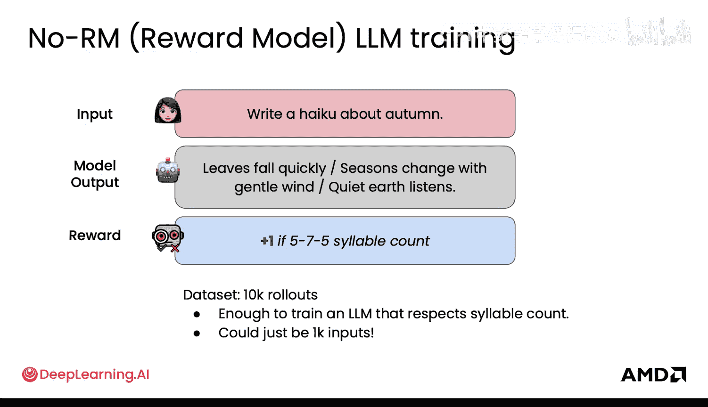

在没有奖励模型的情况下，RL训练是什么样的？这里有一个使用基础验证器来写俳句的例子。验证器只是计算音节数。你的数据集可能包含10000条轨迹数据，这听起来很多，但可能足以训练一个尊重音节计数的模型。实际上，它可能只需要100个输入。甚至可以是10个输入，每个输入对应10个模型输出（即10个俳句）。这比微调所需的准备工作要少得多，非常有趣。

对于有奖励模型指导的小规模训练，情况又是如何？你仍然可以有1000个多样化的指令作为输入，然后你的模型输出可以生成很多东西。这里每个输入有4个输出，但你现在有一个奖励模型来为每一条轨迹数据评分。然后你可以对整个轨迹数据集运行一到两个周期的PPO训练。这样做的结果是，你能够观察到模型风格发生明显转变，模型可以变得更轻快、更有帮助。这可能是你开始小规模实验的起点。

如果你有一个好的奖励模型，你可以用更少的轨迹数据完成训练。这两者是密切相关的。如果你的奖励模型给出的奖励对于不同的轨迹数据是清晰可靠的，那么你需要的样本就少。反之，如果你的奖励模型本身有噪声，你就需要更多的样本来获取信号，即需要更多的轨迹数据。

随着你扩大轨迹数据的规模，如果你的奖励模型不够好，或者你正在进行更深入的对齐调优，前沿研究可能会关注数十万甚至上百万的轨迹数据。例如，对于160,000条轨迹数据，对应20,000个输入，每个输入有8个输出。在实践中，超过这个数量后，你可能会看到收益递减，并且开始触及计算和内存的限制。

## 数据规模选择总结

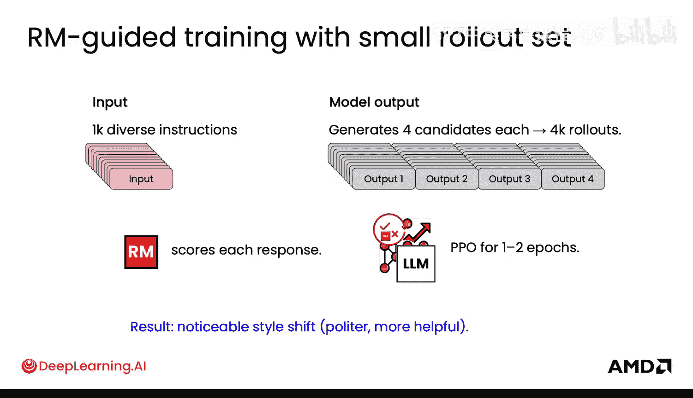

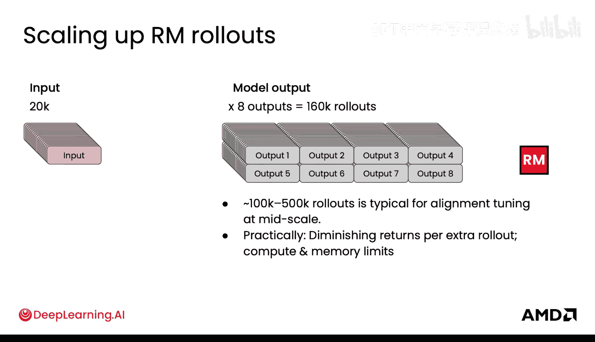

我们看到了很多不同的设置，这里总结一下何时小规模数据足够，何时需要大规模数据。

以下是不同数据规模适用的场景：
*   **数千到两万条轨迹数据**：适用于探索你的奖励模型，以塑造你的语言模型性能，进行中等规模的更新。
*   **两万到十万条轨迹数据**：适用于中等规模的更新。
*   **十万条以上轨迹数据**：适用于需要更通用、更大规模的模型，或者你的奖励模型非常脆弱且有噪声的情况。你需要数据中有大量的冗余才能从噪声中看到信号。

对于第一类规模，它适用于实验或消融研究。对于中间规模，它可能足以提供足够的覆盖，而不会在你的数据中看到崩溃。但这些都是经验性的，你需要能够测试，并且一如既往地从小的规模开始。

## 关于轨迹数据的其他考量

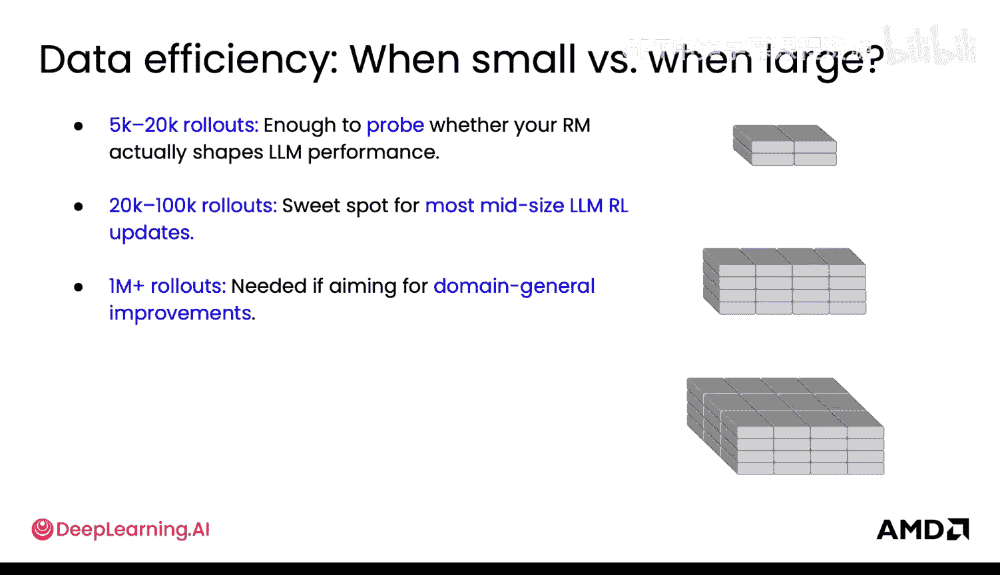

关于轨迹数据，还有几点需要考虑。首先，并非你生成的所有轨迹数据都有用。你生成了大量数据，但并非所有数据都具有信息量。你可能有很多冗余或相似的数据，这些数据并不真正具有信息量，最终对训练帮助不大。

有很多研究关注于**过滤轨迹数据**，只保留那些对训练有用的部分，就像你在合成数据管道中学到的那样。你也可以在这里进行生成和过滤。这样，你只在高质量、高信号的例子上进行训练，这最终会降低成本，并使学习更快、更有效。

向模型展示能改进它的例子也非常重要。展示太简单或太难的例子会导致奖励不具有信息量，无法区分不同的轨迹数据。你之前在学习优势计算时也了解过这一点。更进一步，你可以将重点放在**中等难度**的轨迹数据上，在这些数据上你能获得良好的奖励分布，本质上是通过对它们过采样来更多地关注它们。当然，你可以在训练期间更新你的奖励模型，因此“中等难度”的定义可能会改变。

再次强调，你应该尽可能过滤掉数据中的噪声。这种过滤可以使用奖励模型自身的不确定性来完成，这是一个非常有价值的信号，可以作为过滤器来判断哪些奖励实际上是高质量的。

## 与微调的关联

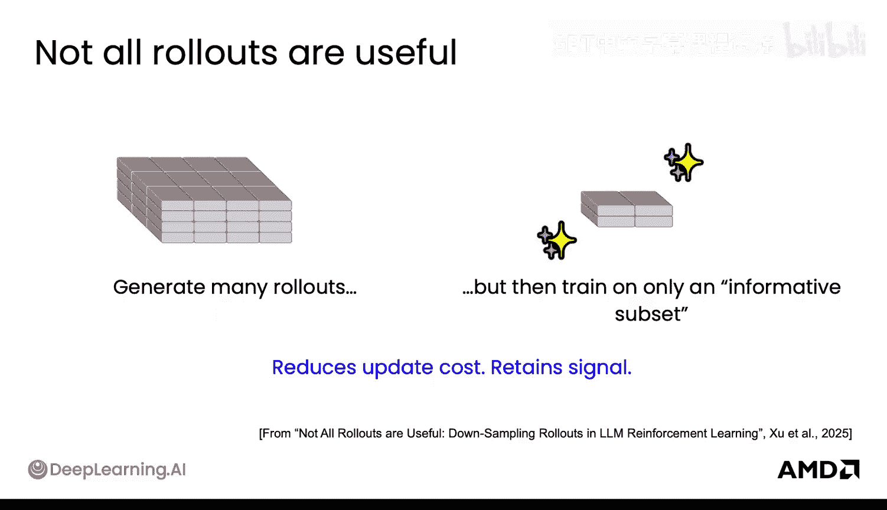

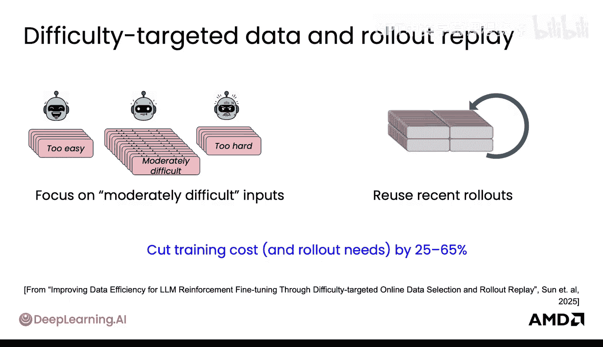

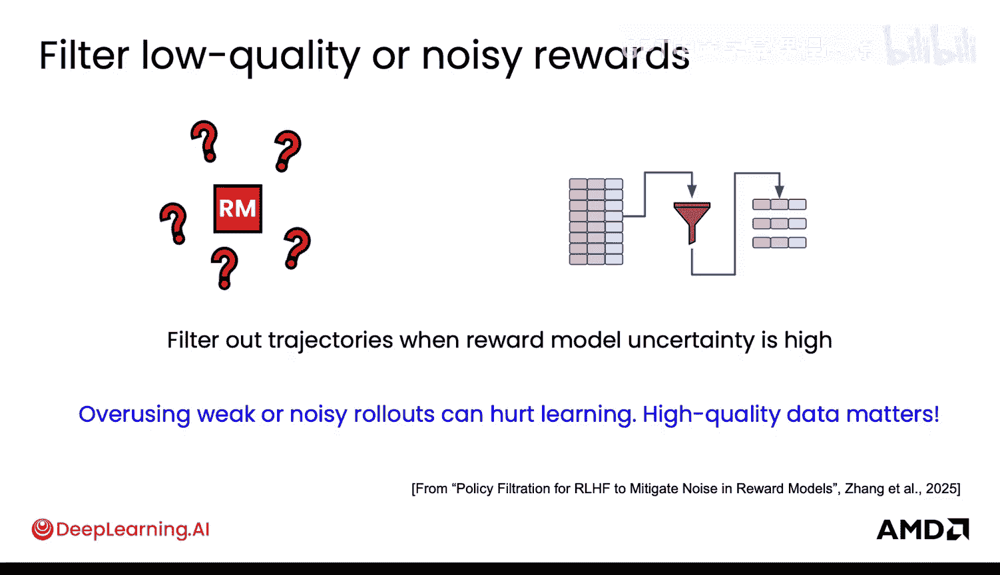

此时，你可能会想，这难道不像微调吗？在很多方面，它确实是。许多研究人员已经将这种用于LLM的RL与微调相提并论。因此，许多关于数据质量至关重要的原则同样适用。只是这次数据的组织形式略有不同，但那些基本原则同样重要。

如果所有例子都有正向的奖励信号，那么RL就更接近微调。实际上，有讨论认为这也是在RL中教导模型最有效的方式。你也可以在RL中使用LoRA来提高效率，你所做的只是更新最终模型中更少的参数。同样，数据质量和多样性在RL中和在微调中一样重要，只是你以不同的方式获取它们。

## 总结

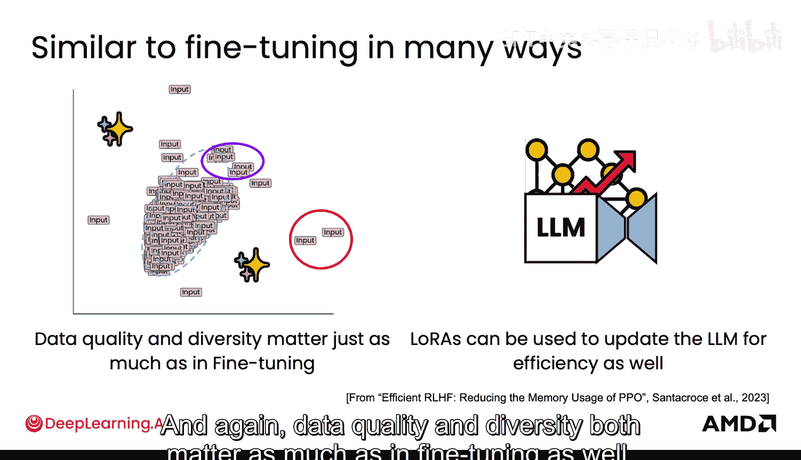

本节课中我们一起学习了强化学习训练大型语言模型所需的核心数据。我们明确了**轨迹数据**和**偏好数据**的定义与作用，探讨了不同场景下的数据规模需求，并了解了过滤低质量数据、关注中等难度样本等优化策略。最后，我们看到了RL数据准备与微调在数据质量要求上的共通之处。理解这些数据原则是构建有效RL训练流程的基础。