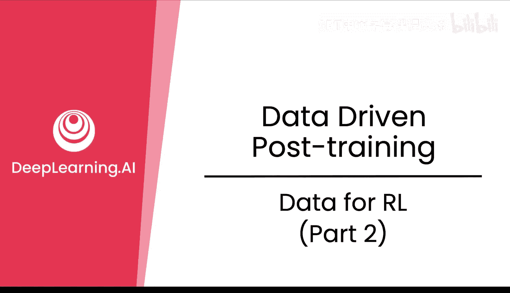
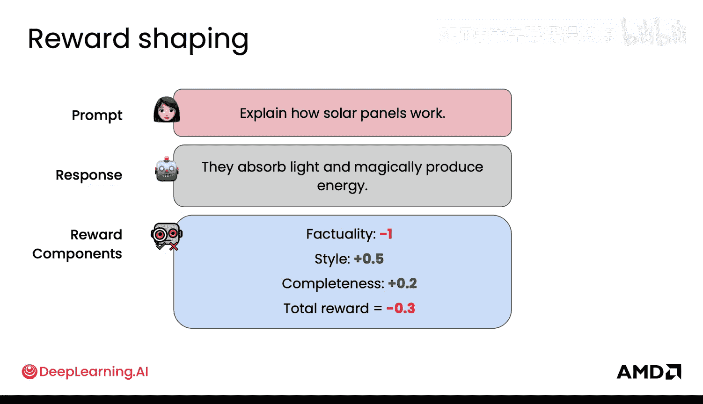
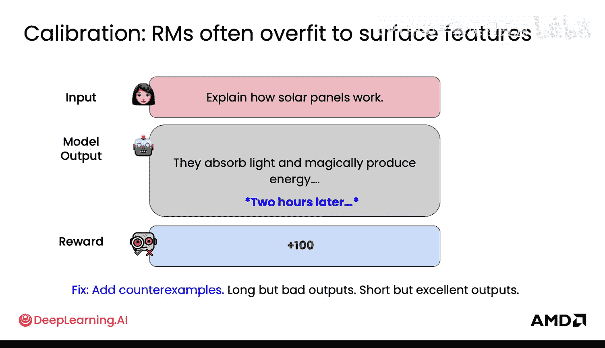
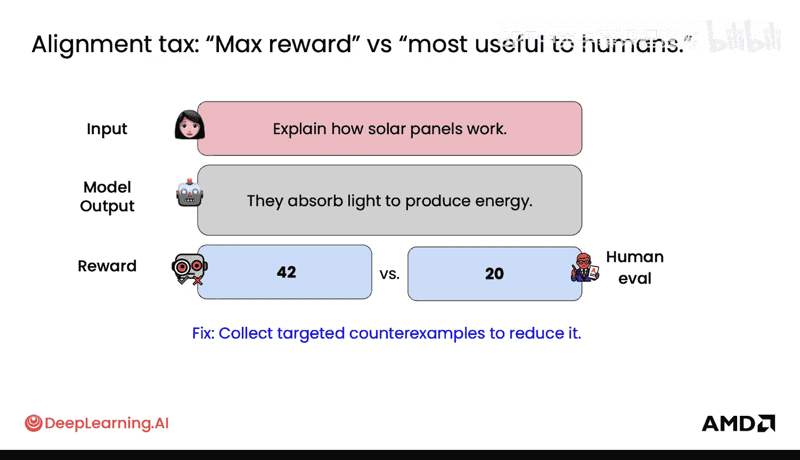
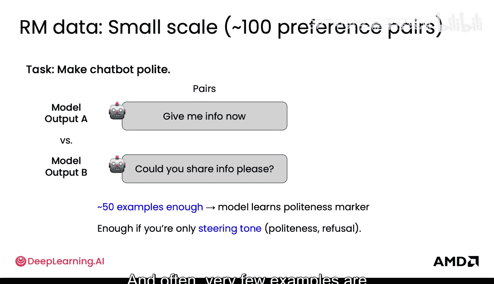
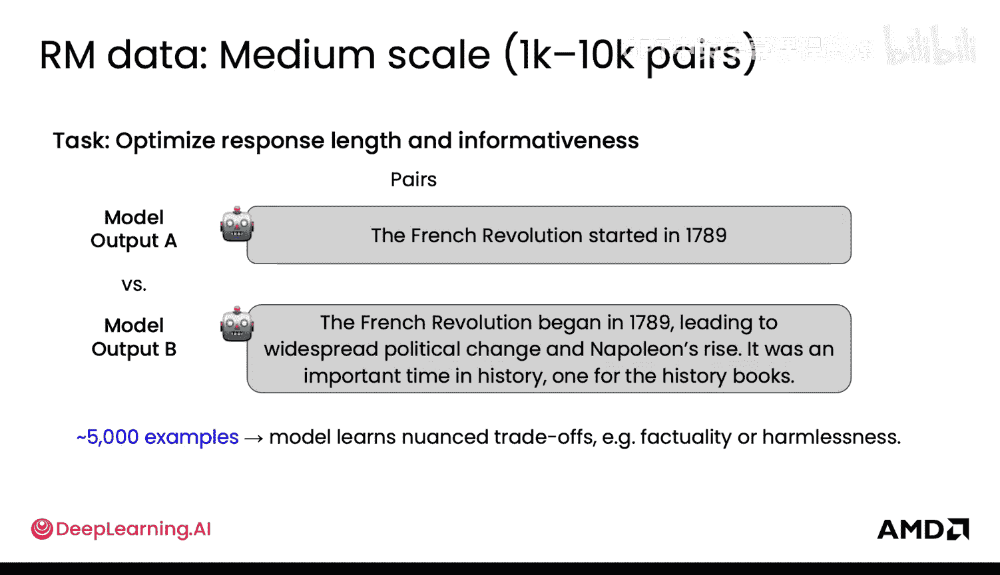
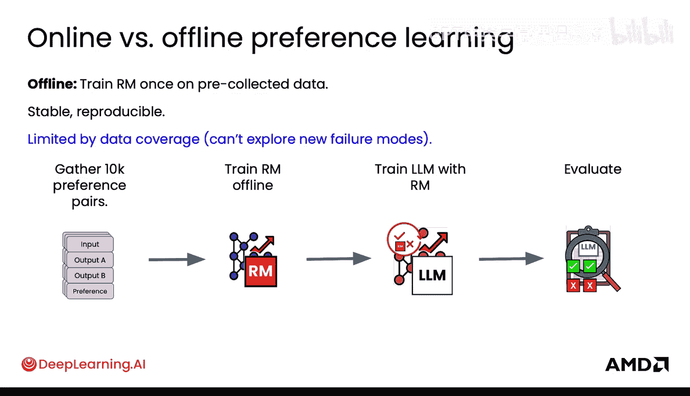
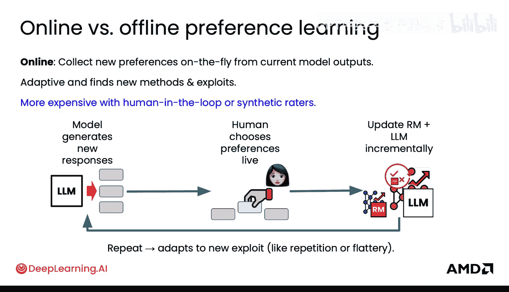
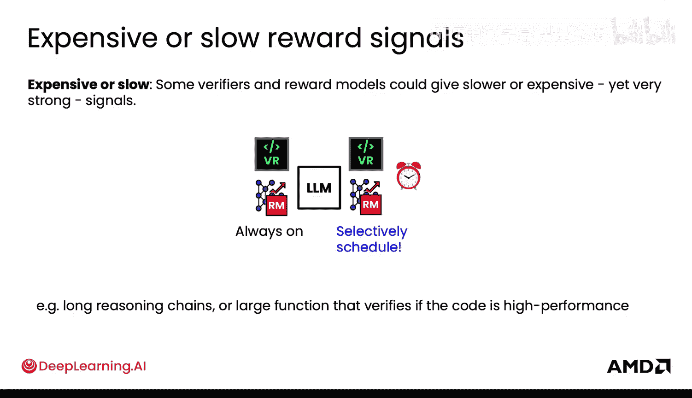

# 030：RLHF数据（第二部分）🧠

在本节课中，我们将要学习强化学习人类反馈（RLHF）中关于奖励模型数据的其他重要考量。我们将探讨奖励塑形、模型过拟合、数据规模以及训练策略等核心概念。

上一节我们介绍了偏好数据的基础知识，本节中我们来看看在奖励函数层面的一些数据考量。

## 奖励塑形与复合评分 🎯

奖励塑形是指奖励模型预测复合分数，而不仅仅是判断哪个更好。提供复合分数能让模型获得比单一分数更全面、更整体的评估视角。

**公式**：`奖励 = f(事实性， 无害性， 信息量， 长度， ...)`

## 奖励模型的过拟合与校准 🔧

奖励模型本身也会过拟合到数据模式中的某些特征，即使这些模式并非你的本意。这与“奖励黑客”现象类似，但更广泛地属于模型校准问题。在这种情况下，问题更间接地源于偏好数据中形成的模式，而非奖励函数本身。

例如，模型在回答“解释太阳能电池板如何工作”时，可能会不停地输出内容。因为在训练数据中，它间接地学习到“长度长=奖励高”的模式。奖励模型学会了如何获得这种高奖励。

以下是解决此问题的方法：

*   **添加反例**：包含“长但质量差”和“短但质量优”的输出样本。
*   **改进奖励模型**：利用这些反例来训练和优化你的奖励模型。

## 对齐差距与评估 📊

对齐差距是指奖励模型给出的分数与人类评估分数之间的差异。一个关键点是，如果你相信人类评估的绝对分数，你可以显式地缩小这个差距。

**公式**：`对齐差距 = |奖励模型分数 - 人类评估分数|`

例如，如果人类评分为20，而奖励模型评分为42，你可以直接调整模型以缩小这个22分的差距。此外，收集针对性的样本（如高人类分低奖励分，或高奖励分低人类分的例子）也能有效应对这种差异。

在实施时，需要确保偏好数据的训练集和评估集划分良好，以便准确衡量改进效果，并持续跟踪对齐税的大小。

## 奖励模型的数据规模 📈

为奖励模型准备数据时，规模很重要。本质上，你是在试图学习区分两种或多种不同的事物。通常，只需少量样本就能学会宽泛的区分，但要理解更细微或精细的差别，则需要更多、更细致的样本。

例如，要学习在事实性/无害性与响应长度/信息量之间进行权衡优化，就需要大规模的数据。如果你的奖励模型需要覆盖大量不同领域，那么它就需要能够泛化到多种可能的输出上。

一个优势在于，对于奖励模型，你为获取偏好数据所做的每次排序（ranking）都会产生比排序次数多得多的数据对（pairs），因此在这里更容易获得更大的数据集。

## 奖励模型的训练策略 ⚙️

你已经对此有所了解，但何时应该训练你的奖励模型呢？

*   **离线偏好学习**：一次性收集所有数据，训练奖励模型并保持其冻结（不变）。这种方法训练稳定，但受限于数据覆盖范围，无法适应模型改进后产生的新输出。这是最简单的方法，建议从这里开始。
*   **在线偏好学习**：奖励模型随着你使用RL训练主LLM的过程而同步适应和更新。如果你的语言模型在改进，调整奖励模型以匹配其新能力会很有趣。即使没有大量实时流量，你也可以想象更新奖励模型。奖励信号不一定来自人类偏好，也可以是其他信号（如点击数据）。

## 不同类型奖励信号的调度 🕒

有时，你获得的奖励信号并非总是快速或廉价的，它们可能昂贵或缓慢。

例如，某些验证器或奖励模型可能需要很长的推理链，导致响应时间很长。你并不希望每次更新都等待这些响应。或者，一个验证器可能需要检查代码在多个设备上的性能，这可能需要数分钟甚至数小时才能返回结果。

因此，你需要合理调度这些昂贵或缓慢的运行任务。如果是从旧版LLM汇总结果，还需注意其他奖励信号的应用。你应该根据实际情况，有选择性地安排这些任务。

## 总结 ✨

本节课中我们一起学习了RLHF中关于奖励模型数据的进阶知识。我们探讨了通过复合评分进行奖励塑形，理解了奖励模型可能过拟合数据模式并需要校准，认识了缩小奖励模型与人类评估间对齐差距的方法。我们还分析了数据规模对学习细微差别的重要性，比较了离线与在线偏好学习两种训练策略的优劣，最后了解了如何根据成本与速度合理调度不同类型的奖励信号。掌握这些数据考量，是构建高效RLHF流程的关键一步。

现在你已经理解了RL所需的数据，是时候将你的微调和RL数据整合到一个生产环境的后训练流程中了。