# 031：数据整合与生成

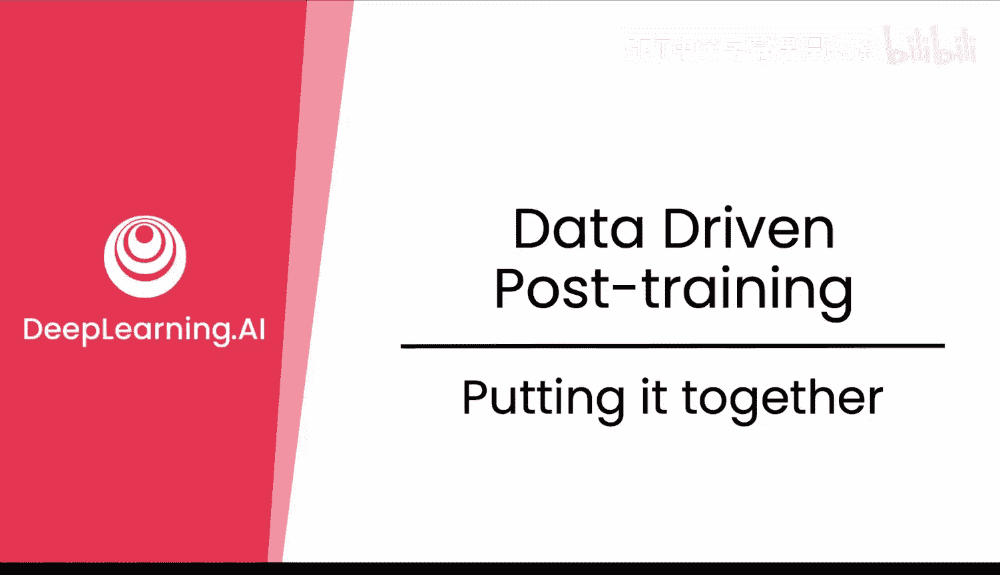

在本节课中，我们将学习一个生产级后训练流程所需的所有数据集。我们将以一个前沿实验室今年早些时候发布的流程为例，重点分析其数据管道。在下一个模块中，你将把这些模型整合到一个完整的生产级后训练流程中。

## 数据集概览

以下是整个流程中涉及的所有数据集，我们将逐一进行解析。

### 冷启动长思维链数据

首先，我们来看冷启动长思维链数据。思维链数据指的是推理数据。长思维链意味着非常冗长的推理过程，包含大量思考步骤。这里的“k examples”可能指的是一个用于冷启动的小型种子数据集。

本质上，这是一个用于微调启动的小型数据集，目的是让模型适应这种数据格式。

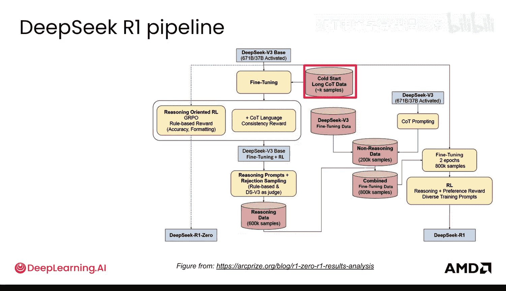

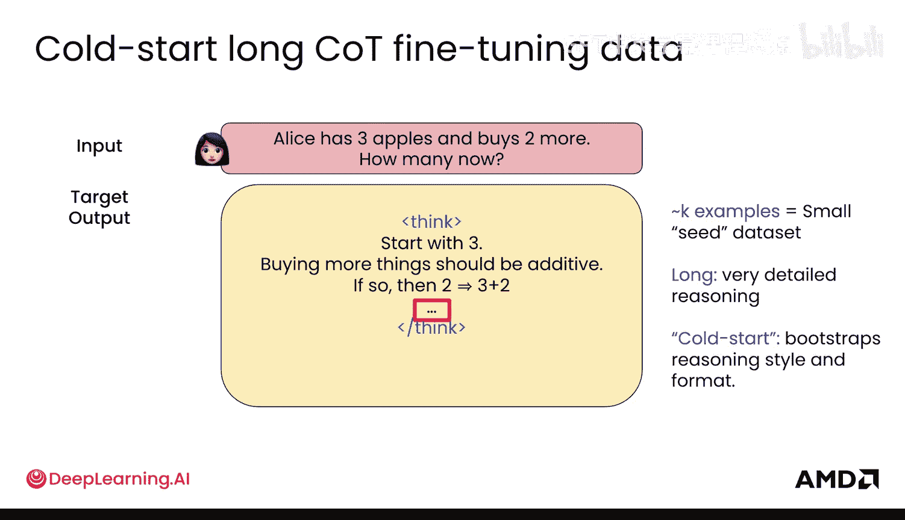

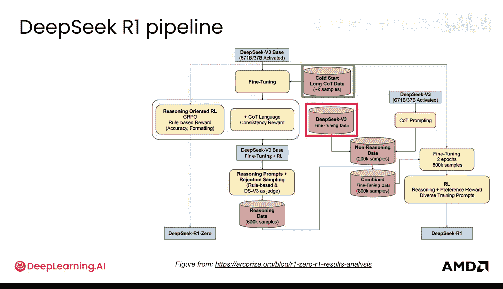

### DeepSeek-V3 微调数据

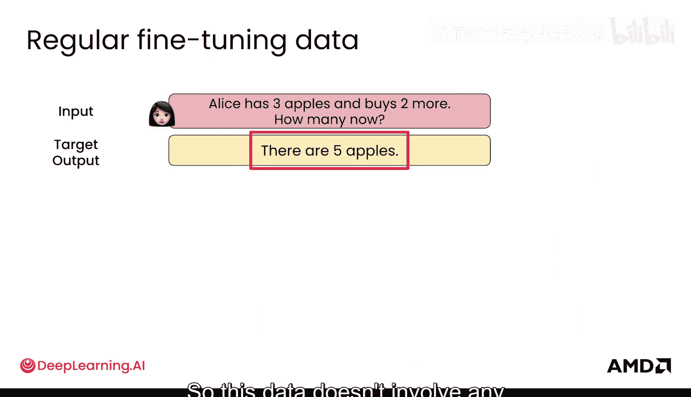

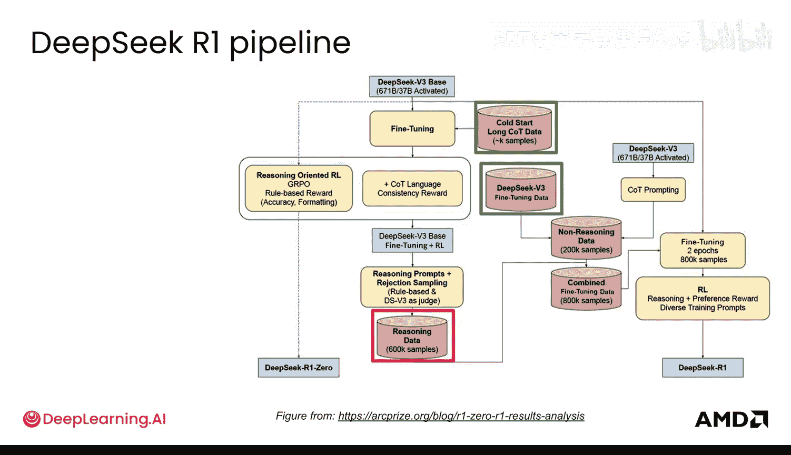

接下来是 DeepSeek-V3 微调数据。这个数据集不包含任何显式的思维链或推理过程，它基本上就是常规的输入和目标输出配对。

### 推理数据

推理数据实际上是合成的推理数据，即大量生成的推理数据。具体做法是生成海量数据，然后进行过滤。了解不同的过滤步骤很重要：

以下是关键的过滤步骤：
1.  **拒绝采样**：生成大量可能的选项，只保留最优的一个。
2.  **移除混合语言**：当数据中同时出现英语和中文时，直接移除该数据点，因为我们不希望鼓励这种行为。
3.  **移除代码**：对于这个数据集和这些输入提示，模型不应该用代码来回答。这很可能是因为模型过度生成了代码，因此这是一个简单的过滤方法。

经过这些步骤，我们得到了一个高质量的推理数据集，包含 **60万** 个样本，数量相当可观。

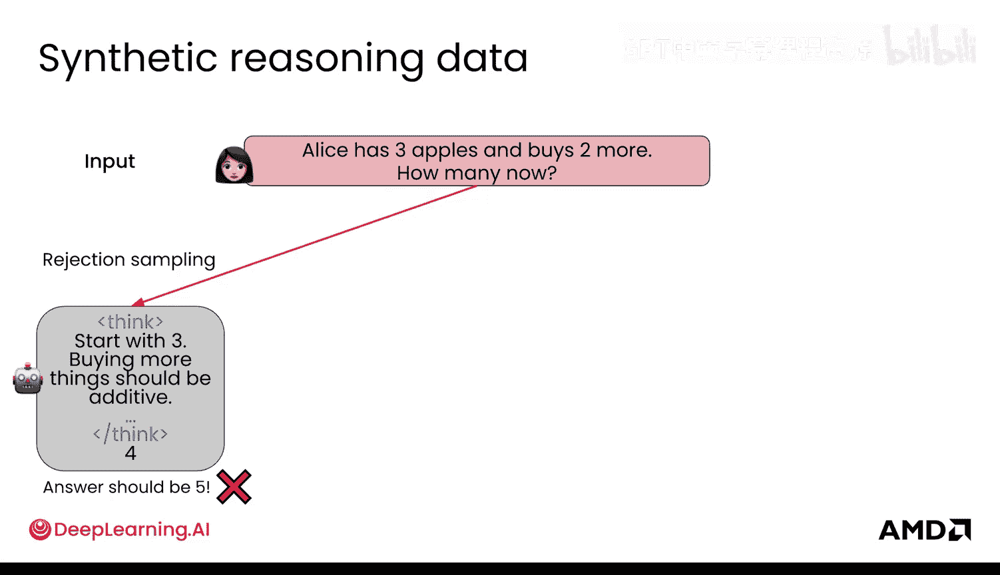

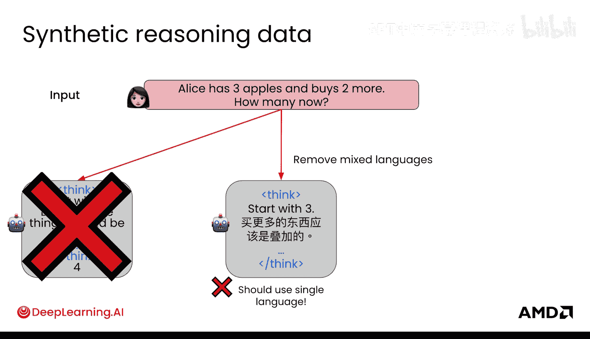

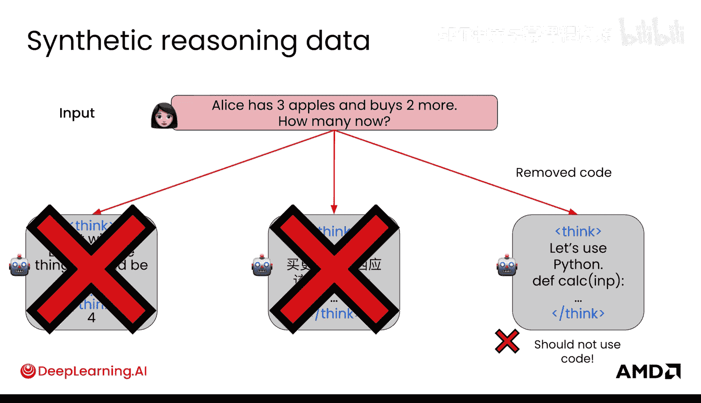

### 非推理数据

非推理数据的构成很有趣。它可能包含一些带有思维链的数据点（论文中提到），但很可能只使用目标输出作为输入-输出对。同时，它也包含像普通数据一样的输入-目标输出对，这些对不包含任何思维链。

### 最终整合数据集

最后，将所有上述数据整合在一起，形成最终的微调数据集。整合后的数据集包含 **80万** 个样本，其中大约四分之一是非推理数据，四分之三是推理数据。

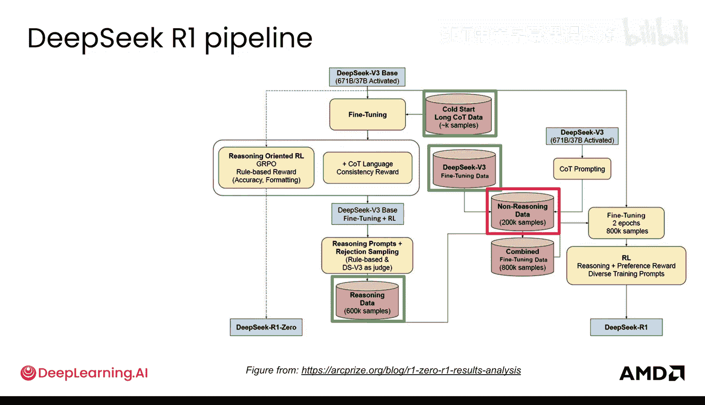
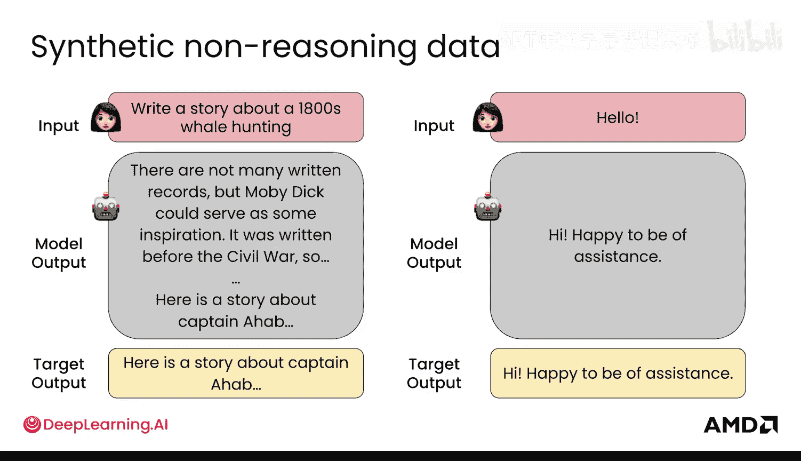
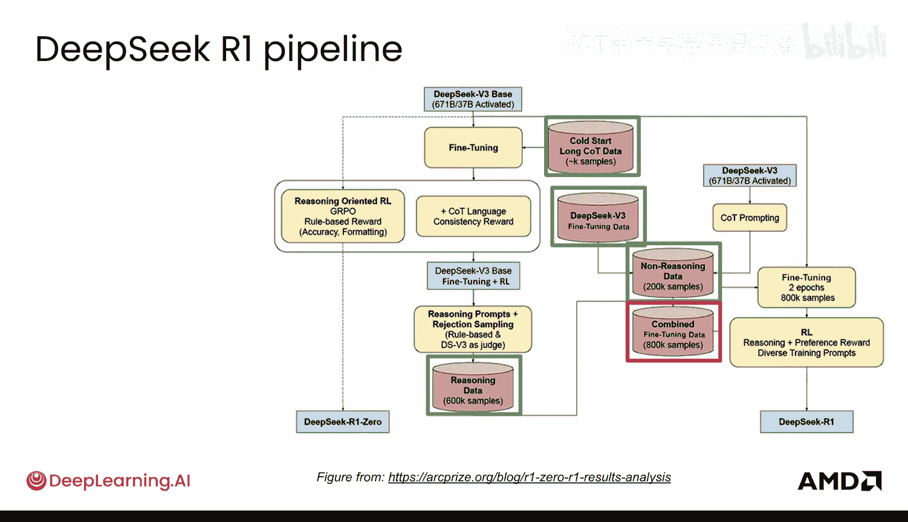
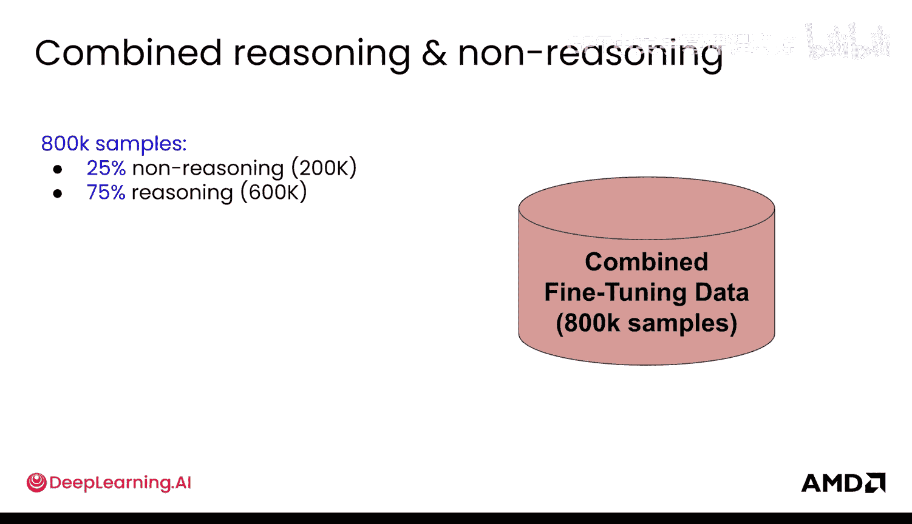
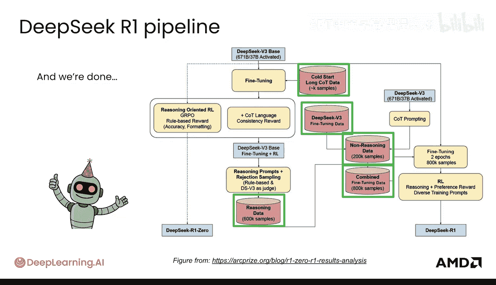

至此，我们已经了解了构成整个流程的所有不同数据集。可以看到，数据集的种类非常多，远不止两种，它们分别被用于微调和强化学习流程的不同环节。

## 利用LLM生成数据

现在你已经了解了需要哪些类型的数据，接下来我们看看如何利用大型语言模型为你生成大量此类数据。

## 总结

本节课中，我们一起学习了一个完整生产级后训练流程所需的数据集构成。我们详细分析了冷启动数据、常规微调数据、合成推理数据以及非推理数据，并了解了如何通过过滤步骤（如拒绝采样、移除混合语言和代码）来提升合成数据的质量。最后，我们看到这些不同类型的数据被整合成一个庞大的最终数据集，为模型的微调和强化学习阶段提供支持。