# 032：合成数据管道 🧪

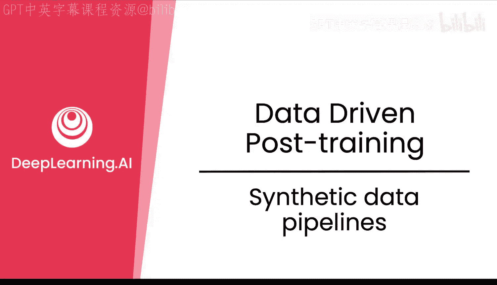

在本节课中，我们将学习如何构建高质量的合成数据管道。合成数据是扩展数据集的强大工具，但其本身可能包含噪声。我们将探讨如何利用语言模型来生成、过滤、转换和评估数据，从而获得真正有助于模型后训练的高质量数据。

## 为什么使用合成数据管道？🤔

上一节我们介绍了后训练的基本概念，本节中我们来看看如何高效地获取训练数据。人类在判断和排序答案方面非常出色，但问题是速度慢、成本高，尤其是专家资源。相反，合成信号则速度极快、成本低廉，并且可以大规模扩展。在一小时内，你可以生成数千个合成数据对，而不是仅获得少量的人工标注。

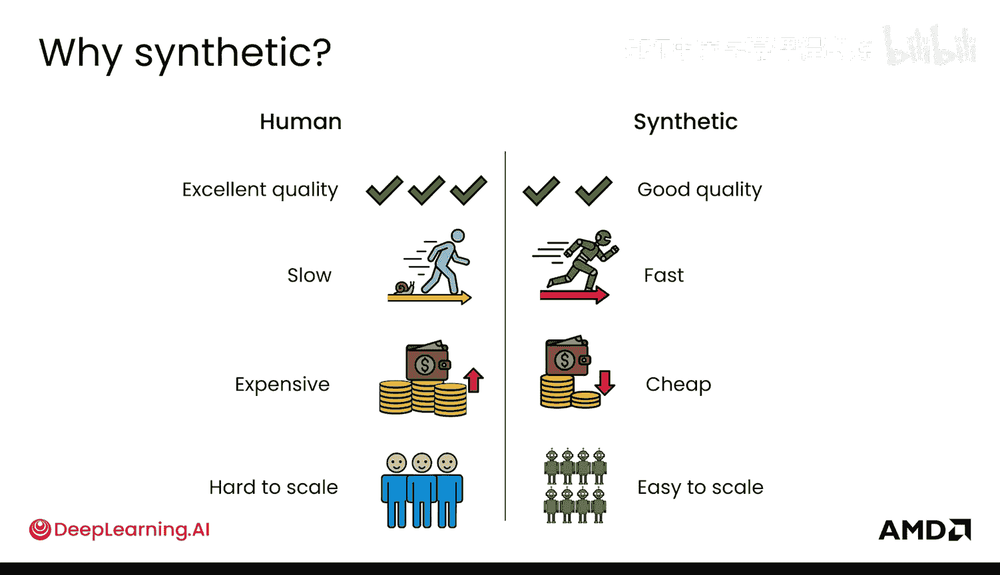

然而，关键在于质量。生成的样本可能过于通用。如果直接使用这些数据，其速度优势就会转化为噪声，而这些噪声对于实际改进模型并无用处。因此，我们需要学习如何创建真正对后训练管道有用的合成数据。

## 合成数据管道的核心环节 🔄

你已经在前面的“宪法AI”中对此有所了解。Anthropic提出的“宪法AI”就非常有效地使用了合成数据和合成管道。其核心思想是让人类专注于编写“宪法”本身，然后利用合成管道将该宪法转化为不同的方式，既用于评判模型输出，也用于选择更符合该宪法的输出。这是一种极佳的扩展方式：在人类擅长的领域运用人类的劳动和专业知识，然后通过语言模型进行大规模扩展。

语言模型在以下几个关键环节中能提供巨大帮助：
1.  **生成大量数据**。
2.  **过滤数据**，筛选出真正高质量的部分。
3.  **转换数据**，将现有数据转化为更适合微调的格式。
4.  **评估数据**，为数据打分，类似于过滤但更精细。

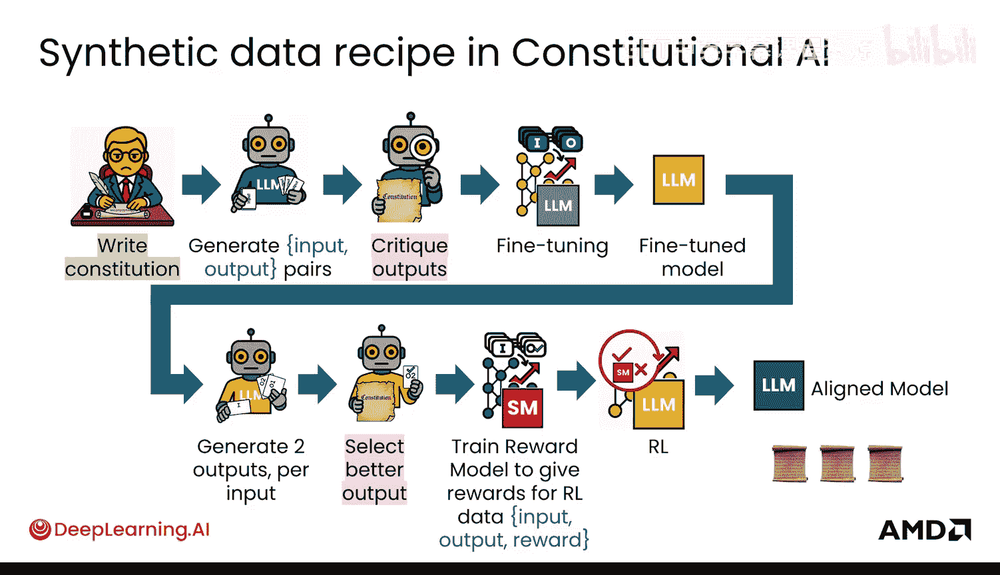

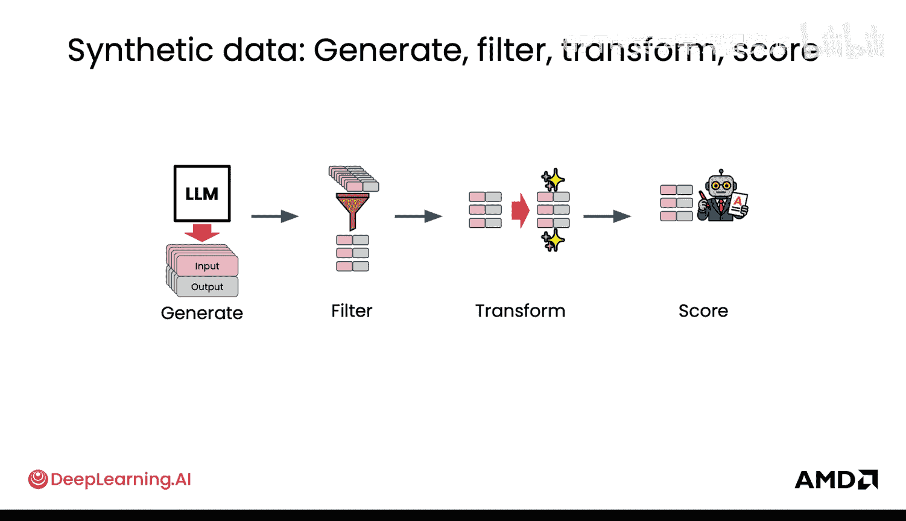

## 生成数据 🏗️

以下是生成数据的一些方法：

*   **使用提示模板**：你可以使用许多提示模板。例如，使用模板“请逐步解决这个编程问题”，并将“问题”作为一个变量。通过循环遍历一系列问题，你可以用这种方式生成数据。这样，你可以基于已有的信息循环生成，并获得数据的多样性。
*   **调整生成参数**：你可以通过调整如`temperature`（温度）等参数来改变数据的多样性。更高的温度值能让模型输出更具创造性。
*   **拒绝采样**：生成数据的一个问题是，模型可能在某些类型的输入上表现不佳，导致无法生成该类型的数据。拒绝采样是缓解此问题的方法之一。其本质是生成多个可能的输出（例如A、B、C），然后只保留最好的一个。例如，从三个输出中选一个最好的，这就是3:1的过滤。你可以将其扩展到任何数量K，生成更多输出并选择多个最佳选项，从而更有可能在数据中覆盖到特定的输入类型。

## 过滤数据 🧹

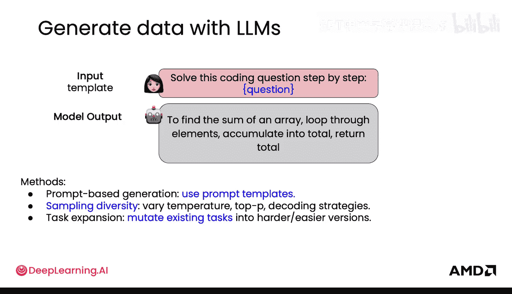

过滤数据主要帮助你避免在噪声数据上训练模型。通常，使用较小的高质量数据集比使用庞大而嘈杂的数据集更能有效改进模型。数据生成的价值取决于过滤效果，因为生成一堆噪声数据是无用的。良好的过滤能力能让你在生成阶段更大胆。对于AI而言，垃圾进，垃圾出，因此务必确保输入的是高质量数据。

以下是几种过滤数据的方法：

*   **使用语言模型作为评判者**：在拒绝采样中，你可以使用语言模型作为评判者进行过滤。这个“LM评判者”可以基于像“宪法AI”中那样的宪法、某种排名、打分或这些方法之间的一致性（例如多数投票）来进行过滤。这正是“宪法AI”的做法：生成一批候选答案，用你的“LM评判者”淘汰不好的，对剩余的进行成对偏好比较以获得排名，然后检查自洽性或多数投票的一致性，最后选择顶部的答案作为过滤后的高质量样本。
*   **程序化验证**：过滤也可以使用更程序化的验证方式。例如，使用类似“请用另一种方法解决这个编程问题”的模板，来验证之前的方法，本质上是用思维链对模型的先前输出进行双重检查。
*   **检测重复**：你不需要大量冗余的输入-输出对。如果数据没有提供额外信息，过滤掉冗余部分会非常有用，这本质上是一种去重或软去重。
*   **多数投票**：使用多数投票可以帮助你确定哪个可能的答案最可能是正确的。

## 转换数据 🔄

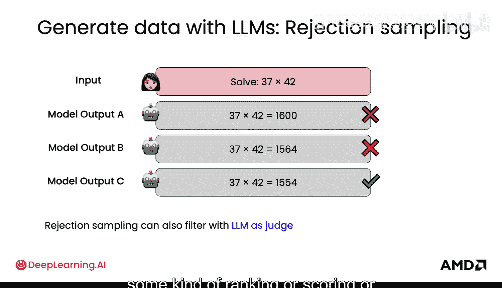

我认为数据转换目前未被充分利用，请多关注这一点。转换数据可以将现有数据变得更有用。

以下是一些转换数据的方法：

*   **简化内容**：例如，如果模型产生了非常冗长的输出，你可以将其转换为更简洁的版本。
*   **标准化风格**：统一数据的语气或风格。
*   **数据增强**：以不同方式增强数据，例如生成逐步分解的版本。
*   **难度分级**：我们知道，让模型在适当难度的数据上训练是有帮助的。因此，将任务按难度分级（简单、中等、困难）在此阶段也非常有用。

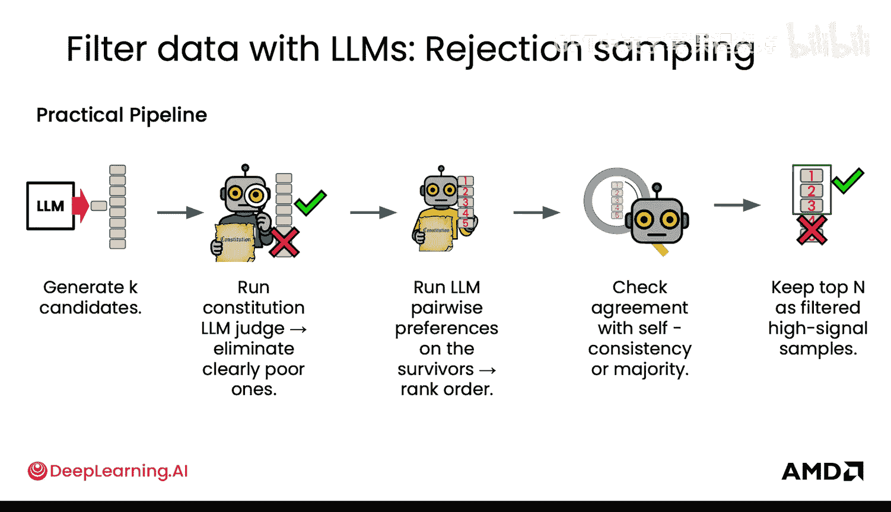

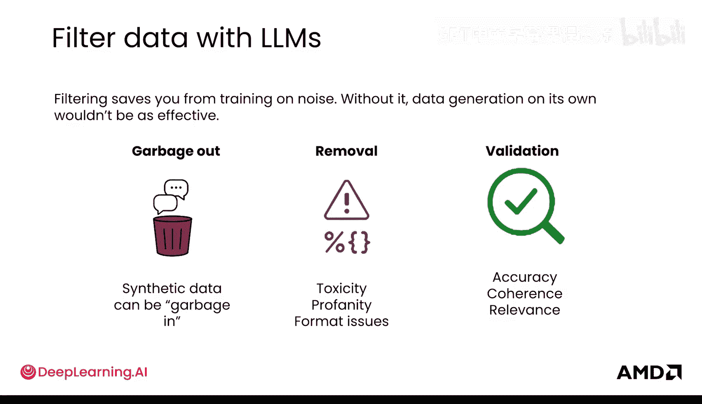

## 评估数据 📊

使用语言模型为数据打分是可行的。直接要求语言模型给出一个分数有时是有效的。更有效的方法是要求它在你关心的不同维度上打分（这些维度可能体现在你的“宪法”中），这有助于在你真正关心的维度上获得更可靠的分数。

在你的代码中，评估可以这样实现：

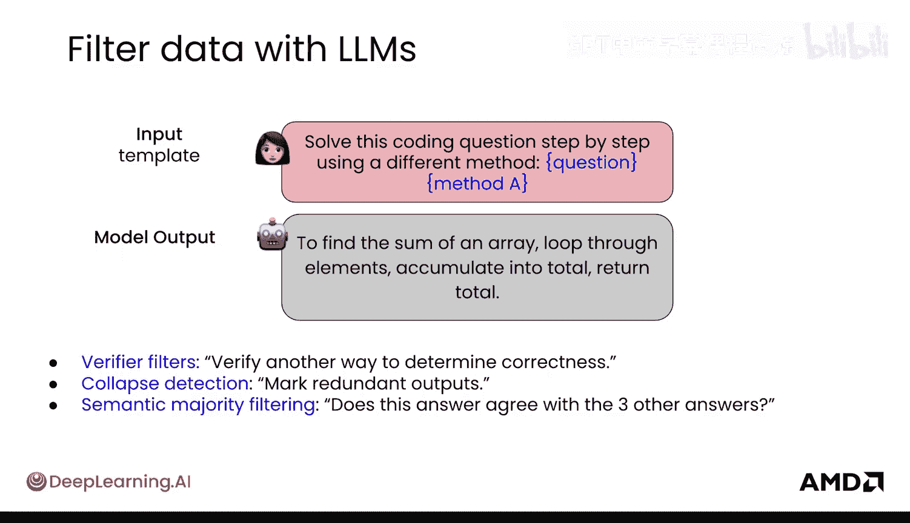

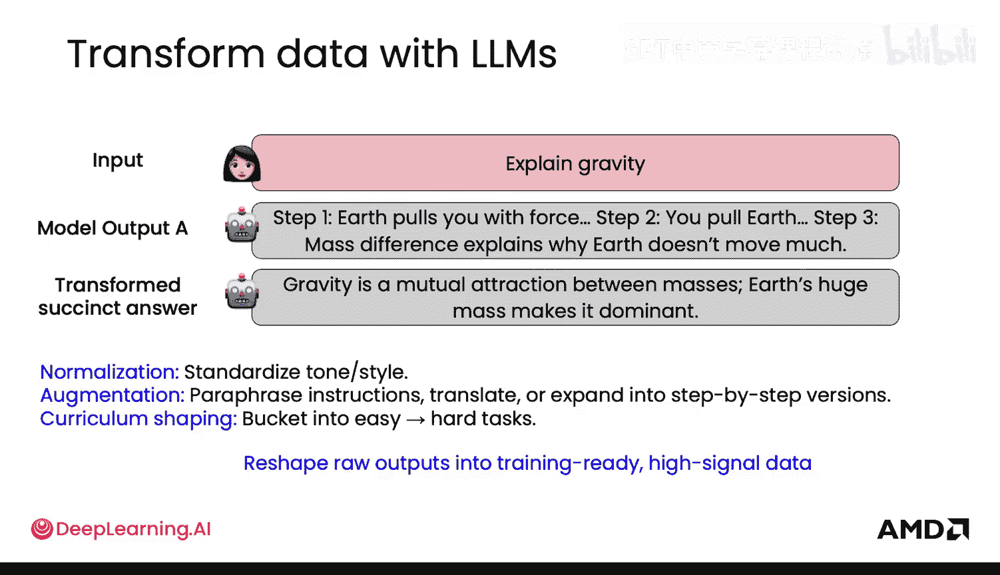

*   **提取步骤指示器**：例如，从模型的输出中，你可以看到模型逐步思考的过程（“首先做这个，其次做那个，然后计算这个或乘以那个”，这在数学问题中尤其常见）。你可以计算它采取了哪些步骤、采取了多少步骤，并据此给予部分分数。
*   **提取解释短语**：识别如“因为”、“由于”、“这意味着”等解释性短语，并同样给予部分分数。

有很多不同的方式可以为你的模型输出打分，这只是其中几种能让你更好地了解模型表现的方法。

## 总结 📝

本节课中，我们一起学习了构建合成数据管道的完整流程。我们探讨了使用合成数据的原因，并详细介绍了生成、过滤、转换和评估数据这四个核心环节。记住，高质量的数据是模型成功的关键。通过精心设计的提示模板、严格的过滤机制、灵活的数据转换和细致的评估打分，你可以将原始的、可能嘈杂的合成数据，转化为能够有效驱动模型后训练的高价值资产。

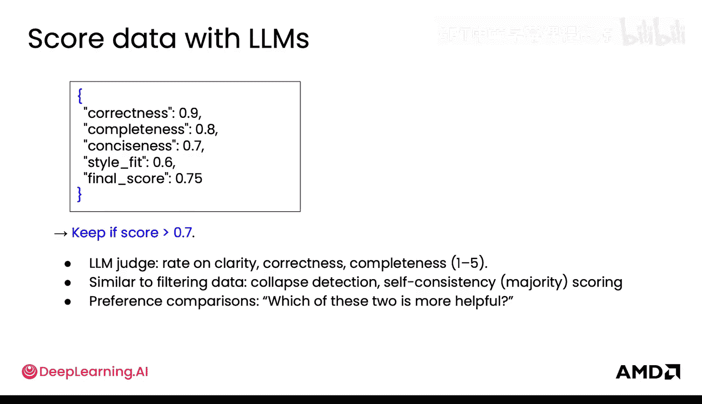

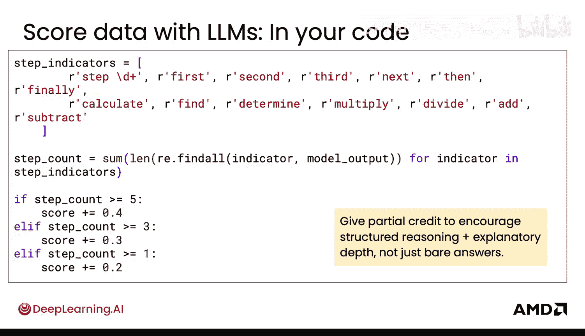

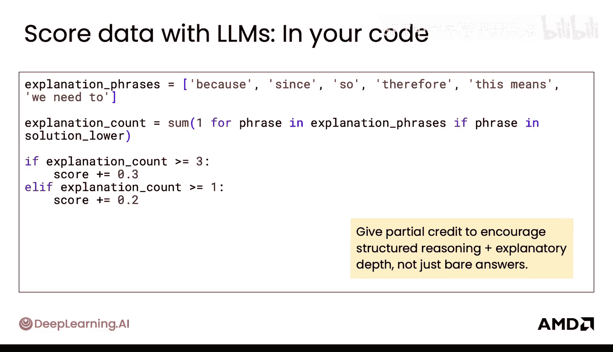

现在你已经熟悉了使用语言模型生成合成数据，接下来可以看看如何通过模板将其提升到新的水平。