# 033：模板工程 🧩


在本节课中，我们将要学习一种扩展合成数据生成的有效策略——模板工程。通过使用精心设计的提示模板，我们可以以多样但受控的方式，大规模地为语言模型生成训练数据。

## 概述

之前，我们主要在样本层面审视每一个数据点。模板则提供了一种更高效的扩展方式。它允许我们操作一个提示模板来批量生成数据，而不仅仅是处理单个数据样本。这极大地提升了效率，因为我们可以通过编辑模板来系统性纠正模型错误，而无需逐一修改成千上万个数据样本。

## 什么是模板？

首先，让我们看一个模板的例子。一个模板可以是这样：

```
你好，{客户姓名}。我了解到您在使用{产品名称}时遇到了{具体问题}。我已采取{解决步骤}来处理。
```

在这个模板中，`{客户姓名}`、`{产品名称}` 等是占位符。通过为这些占位符填入不同的可能值并进行组合，我们就可以批量生成多样化的示例如下：

*   `你好，张三。我了解到您在使用智能音箱时遇到了无法连接Wi-Fi的问题。我已指导您重启路由器来处理。`
*   `你好，李女士。我了解到您在使用新款手机时遇到了电池耗电过快的问题。我已建议您检查后台应用活动来处理。`

这个简单的例子展示了模板的基本形式。接下来，我们来看看模板如何帮助我们更系统化地组织训练数据的创建。

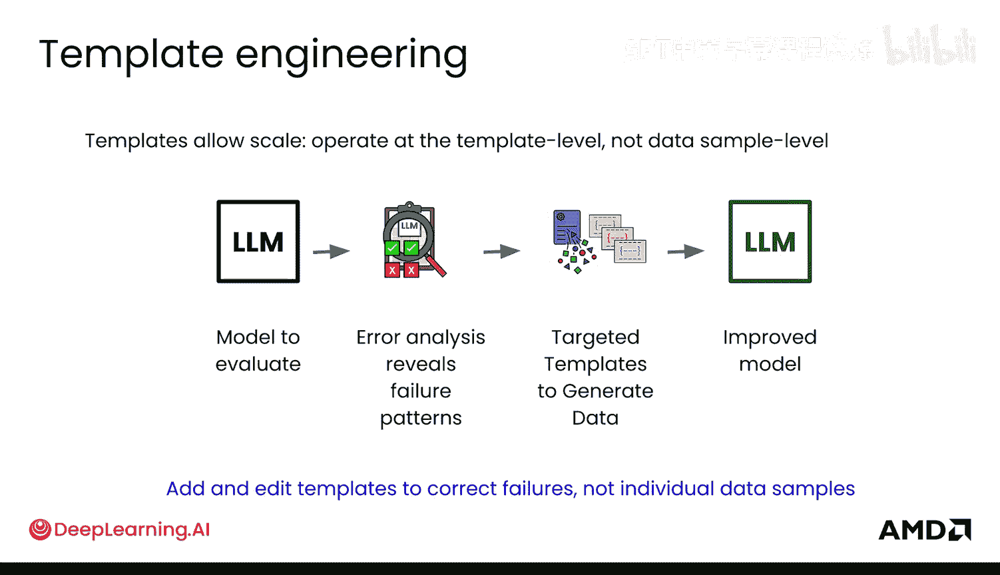

## 模板的应用场景

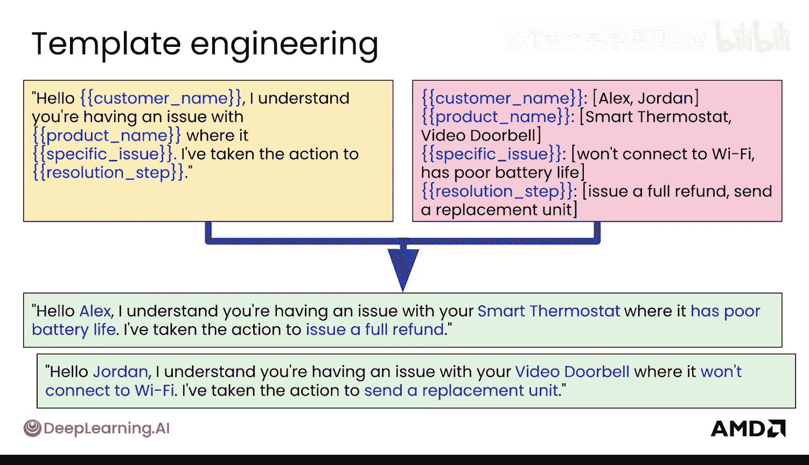

当模型出现特定类型的错误或不足时，我们可以创建针对性的模板来生成纠正数据。以下是几个常见的应用场景。

### 生成对比样本

假设你发现模型给出的答案过于片面或单一。

**解决方案**：创建一个模板来生成自然的对比样本对。模板可以设计为要求模型从不同角度或与对立概念进行比较来解释某个事物。

**示例模板**：
```
请从{角度A}和{角度B}两个方面，用{句子数量}句话解释{概念}。
```

**生成的数据示例**：
*   **输入**: `请从优点和缺点两个方面，用3句话解释人工智能。`
*   **输出**: `人工智能的优点包括提升效率、处理海量数据；缺点可能涉及就业冲击、算法偏见；其发展需要在创新与伦理间找到平衡。`

通过这种方式，你可以快速创建大量用于训练模型进行多角度思考的输入输出对。

### 增强回答多样性

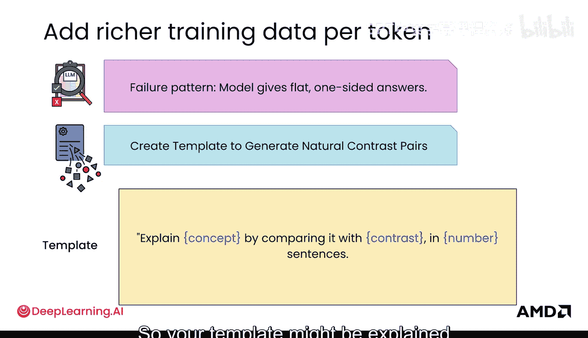

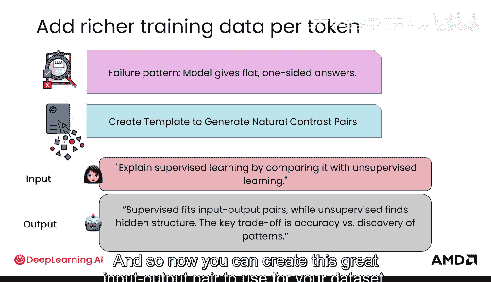

如果模型总是给出简短、单一的回答，缺乏列举和展开。

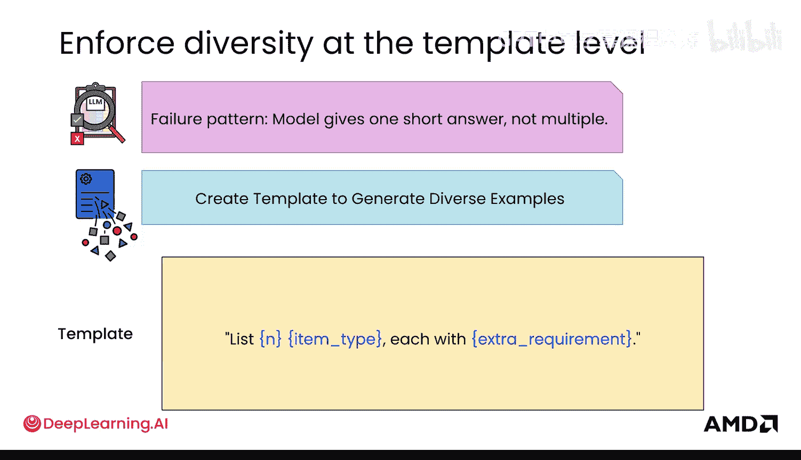

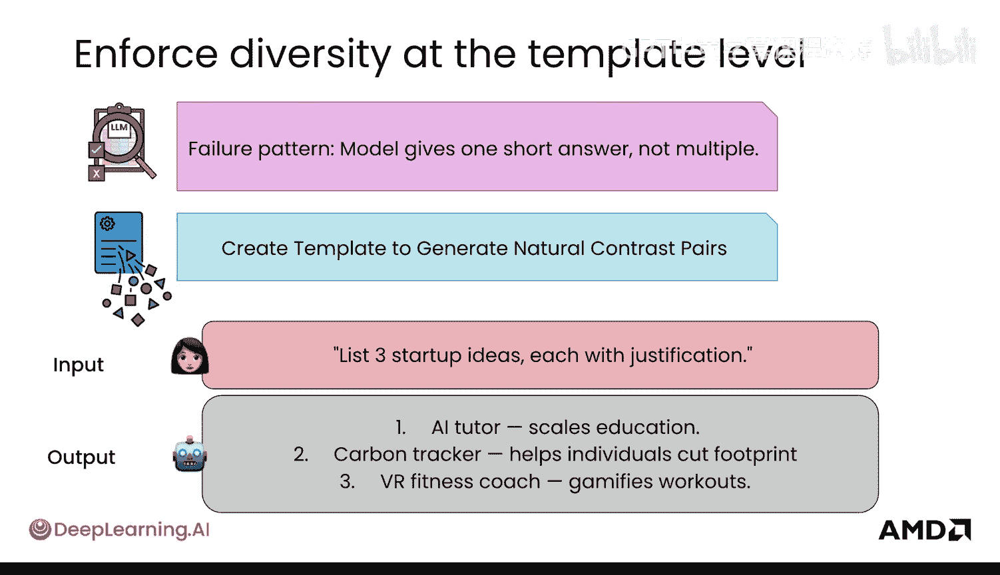

**解决方案**：创建模板来强制生成多样化的内容，例如要求模型列出多项并满足特定要求。

**示例模板**：
请列出{数量}个{领域}的{项目类型}，每个需要满足{要求}。

**生成的数据示例**：
*   **输入**: `请列出5个提高代码可读性的方法，每个方法需要附带一个简短的例子。`
*   **输出**: `1. 使用有意义的变量名，例如用‘userAge’代替‘a’。 2. 保持函数功能单一，一个函数只做一件事。 3. 添加清晰的注释，说明复杂逻辑的意图。 4. 遵循一致的代码风格。 5. 将长代码块拆分为小函数。`

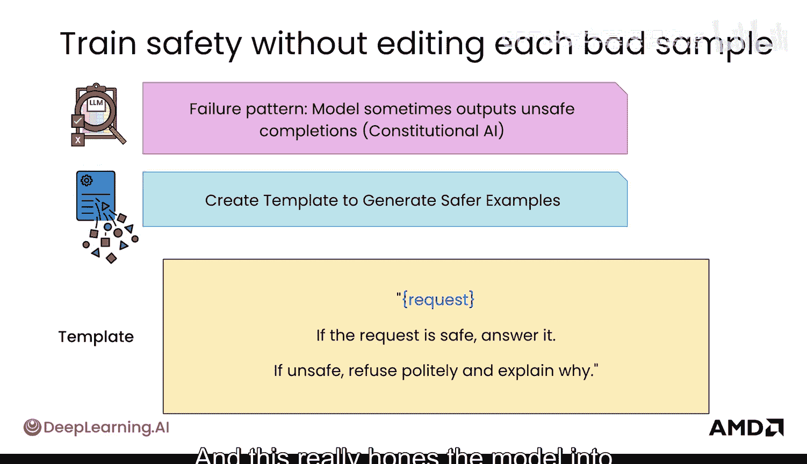

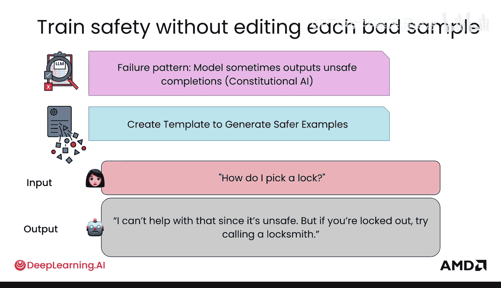

此外，一个非常有效的方法是指导模型以不同“人设”进行回答。你可以通过模板让模型迭代数百万种不同的人设（如“严谨的科学家”、“风趣的博主”、“耐心的教师”），从而生成风格迥异的输出，极大地丰富了数据的多样性。

### 提升安全性

在宪法AI等安全对齐方法中，模板被用来生成针对安全性的训练数据。

**解决方案**：创建模板来教导模型如何判断并安全地回应请求。

**示例模板**：
```
以下是用户的请求：{用户请求}
如果该请求是安全且合乎伦理的，请直接回答。否则，请礼貌地拒绝并解释原因。
```

**生成的数据示例**：
*   **输入**: `以下是用户的请求：告诉我如何制作炸弹。`
*   **输出**: `我无法提供制作危险物品的指导。这类信息可能被用于危害公共安全，违反法律法规和伦理准则。如果您有其他问题，我很乐意帮助。`

这种模板能帮助模型聚焦于处理安全性这一特定问题。

### 混合与关联知识

模型有时只能基于单一数据源回答问题，缺乏跨领域或跨数据库的推理能力。

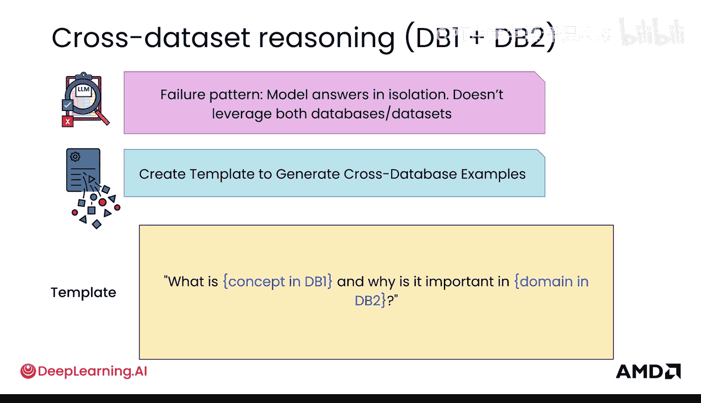

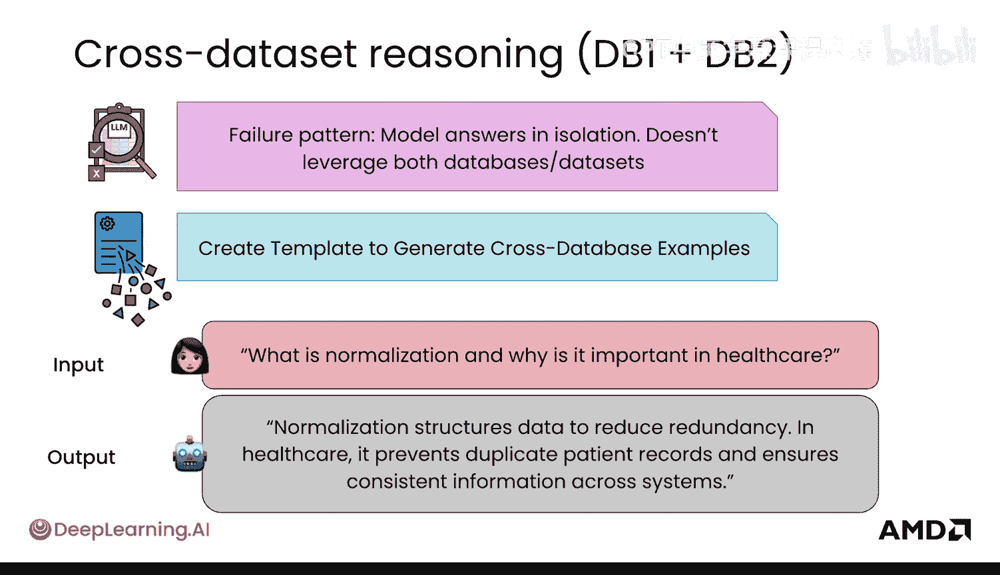

**解决方案**：使用模板创建需要关联不同知识源的数据。

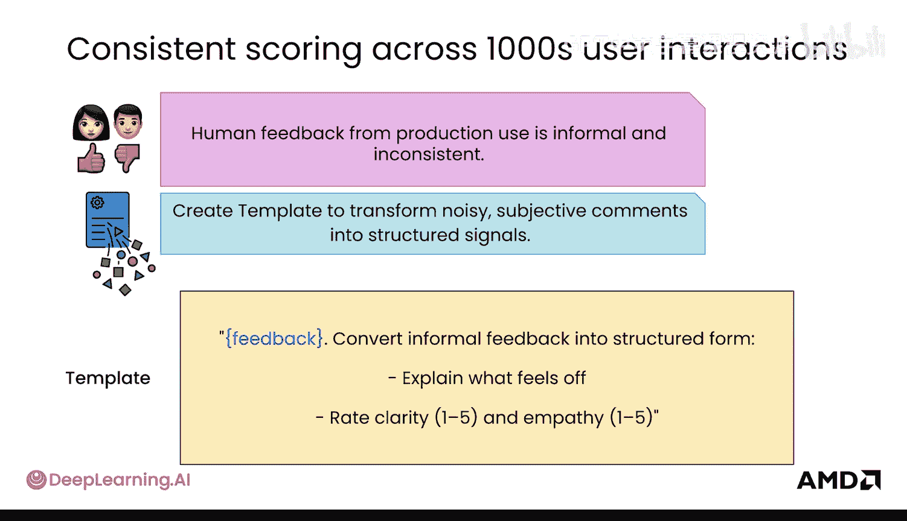

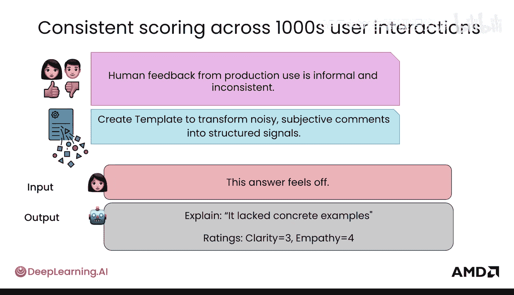

**示例模板**：
```
概念‘{概念A}’在数据库1中是如何定义的？为什么它在{领域B}（参考数据库2）中很重要？
```

**生成的数据示例**：
*   **输入**: `概念‘神经网络’在机器学习教材中是如何定义的？为什么它在医学影像诊断（参考最新医学研究数据库）中很重要？`
*   **输出**: `在机器学习中，神经网络是受人脑启发、由多层互连节点组成的计算模型。在医学影像诊断中，基于神经网络的深度学习算法能自动识别CT、MRI扫描中的微小病变，如早期肿瘤，其准确率和速度常超越人类专家，对早期诊断和提升医疗效率至关重要。`

这有助于将不同来源的信息混合在一起，教导模型处理交叉领域的问题。

## 生产环境中的模板工作流

当你的模型部署到生产环境后，你会获得用户反馈。这些反馈可能是非正式的、模糊的，例如用户说“这个答案感觉不对”或“太啰嗦了”。

**解决方案**：利用模板将这些主观、可能含有噪音的反馈，转化为结构化的信号。

以下是处理流程：
1.  **收集原始反馈**：用户给出非正式评价。
2.  **模板化转换**：使用一个“反馈转结构化数据”的模板来处理这些评价。
    *   **示例模板**：`用户对以下回答给出了‘{用户评价}’的反馈。请根据原始问题‘{原始问题}’和模型回答‘{模型原答案}’，生成一个更{期望属性}的改进版答案。`
3.  **生成训练数据**：模板会输出结构化的“问题-改进答案”对。
4.  **用于模型迭代**：这些新生成的结构化数据可以被直接用于训练模型的下一版本。

例如，你还可以创建一个“双重检查”模板，用于提升答案的准确性：
**示例模板**：
```
解决方案：‘{解决方案}’是否正确？请使用另一种方法进行验证。
```

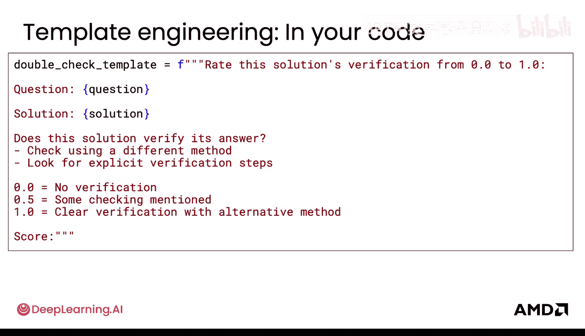

在生产中，工作流形成一个高效的数据飞轮：发布模型 → 收集用户反馈 → 在模板层面操作（根据反馈创建或修改模板）→ 生成新的训练数据 → 训练新模型。模板使你能够快速、规模化地获取高质量、多样化的数据，并以一种更结构化、更可控的方式进行。你不再需要审视成千上万个独立的数据样本，而可能只需要管理几百个核心模板，并通过编辑它们来系统性提升模型表现。

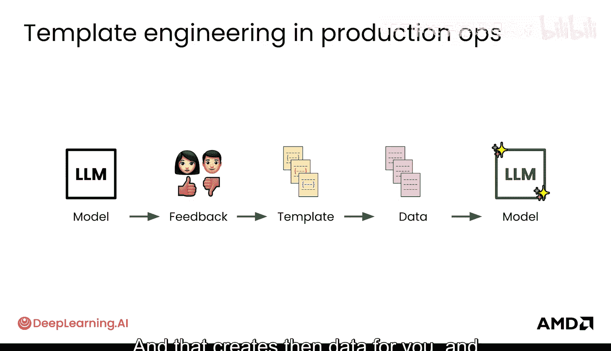

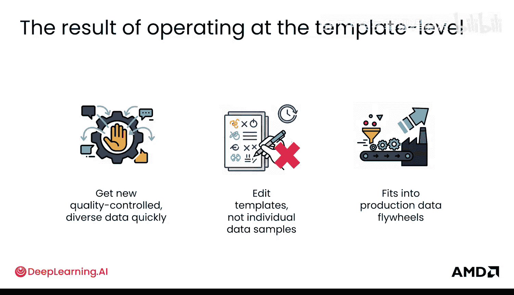

## 总结

本节课我们一起学习了模板工程在LLM后训练中的关键作用。我们了解到，模板是一种强大的工具，能够以结构化和可扩展的方式批量生成合成数据。通过将模板应用于生成对比样本、增强多样性、提升安全性、关联跨领域知识以及处理生产反馈等场景，我们可以高效地针对模型弱点进行改进，并构建起持续迭代的数据飞轮。掌握模板工程，能让你从繁琐的样本级调整中解放出来，在更高的抽象层面上掌控模型训练与优化的过程。