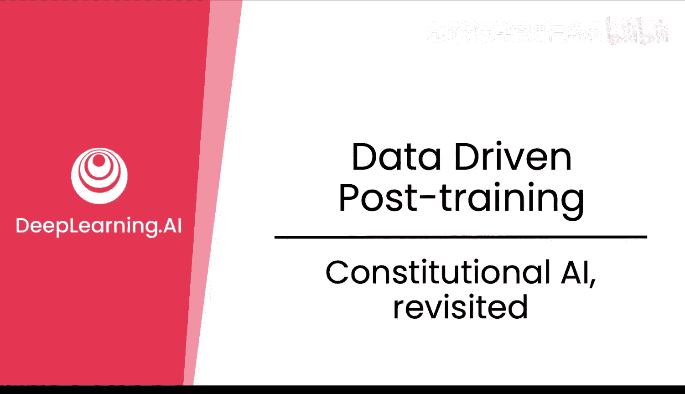
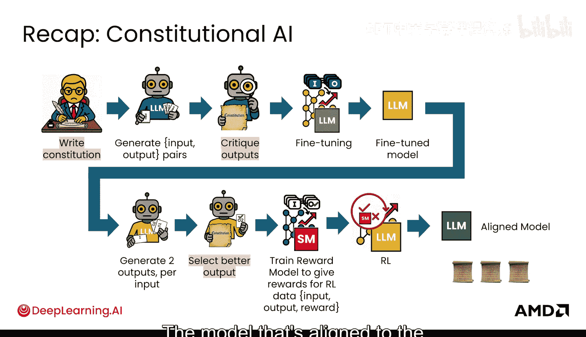
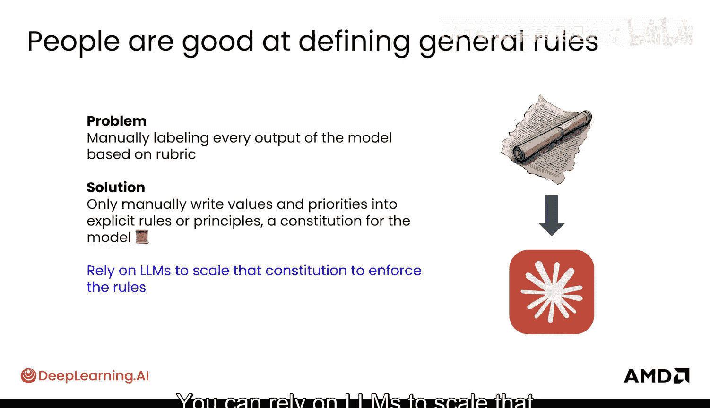
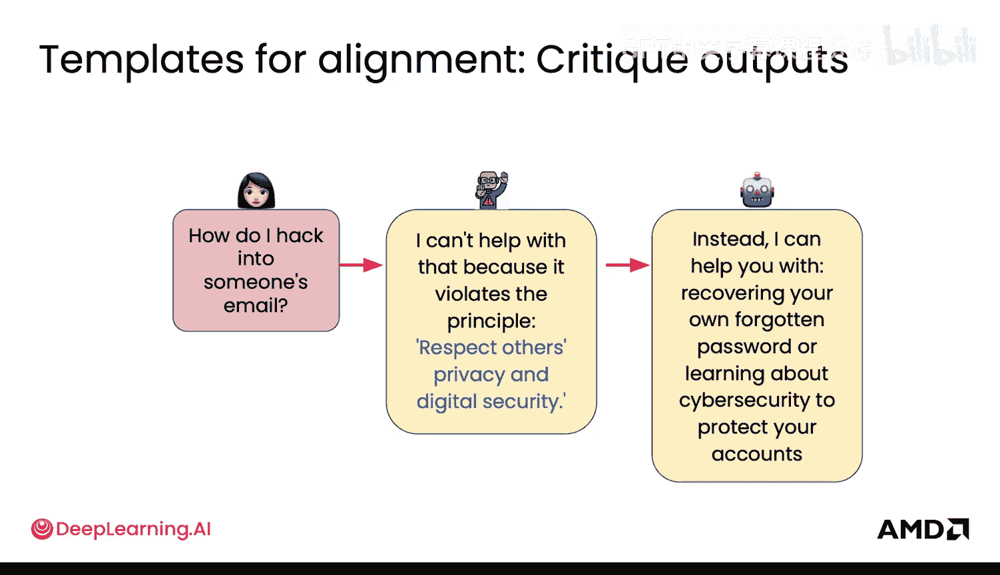
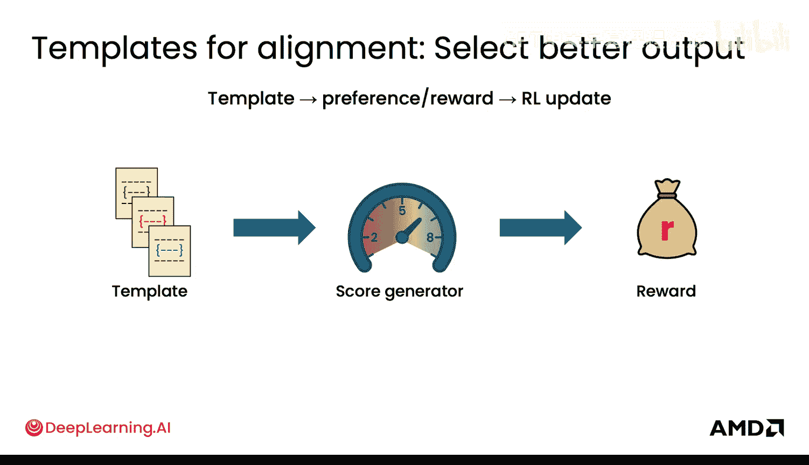
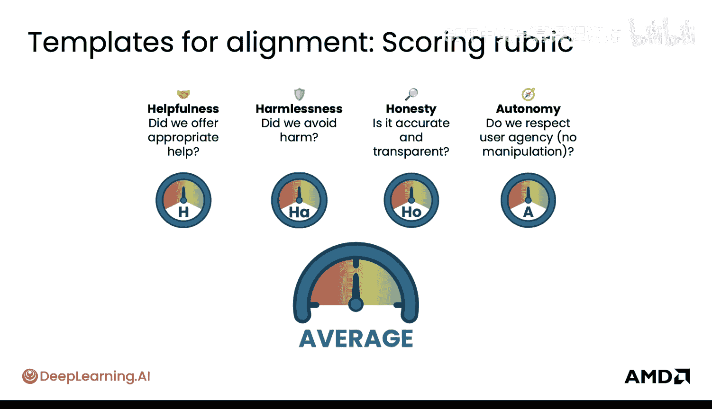
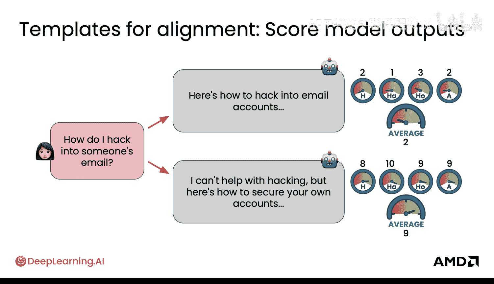
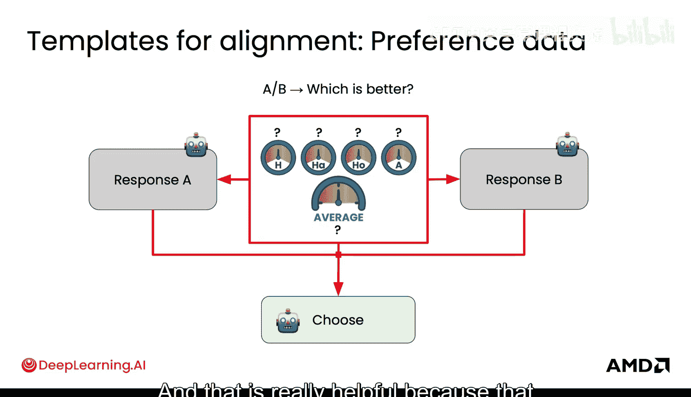
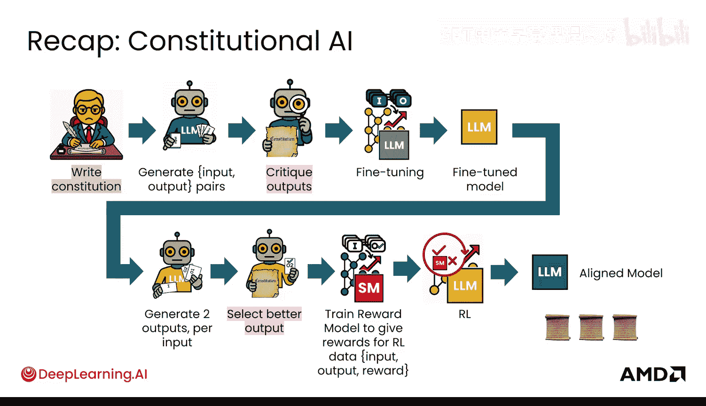

# 034：宪法AI再探

在本节课中，我们将重新审视宪法AI，并学习如何通过提示工程模板的视角来理解和应用它。我们将看到，模板不仅能指导AI生成回答，还能转化为可靠的奖励信号，从而将人类原则高效地转化为机器可优化的目标。

自上次深入了解宪法AI以来，你已经有了长足的进步。现在，让我们通过提示工程模板的视角再次审视它。

首先，快速回顾一下宪法AI的流程。宪法AI始于一个人撰写一份宪法。然后，一个模型根据宪法生成输入-输出对。接着，另一个模型使用特定的模板来评判这些输出。这些经过筛选的信息被用于微调，从而得到一个微调后的模型。这个微调模型可以为每个输入生成多个输出。随后，另一个模型使用模板来选择更好的输出，判断哪个更优。这些偏好数据被提供给奖励模型，用于训练。最终，奖励模型为输入和模型输出提供一个奖励分数，该分数被输入到强化学习训练流程中，最终得到一个与人类最初撰写的宪法对齐的模型。

之所以要从人类撰写宪法开始，是因为人类非常擅长定义这些通用规则，但可能不擅长处理大规模应用中的每一个具体步骤。

## 模板如何指导AI行为

人类非常擅长明确指出模型需要遵守的核心原则和规则。模型可以接收这些原则，并通过多种不同的模板将其转化为更适合下游训练的数据格式。这样做的好处是，无需人工根据规则手册手动标注模型的每一个输出，而是可以依赖AI和大型语言模型来扩展宪法并执行这些规则。

那么，这具体是如何实现的呢？首先，可能会有潜在有害的请求输入。这时，可以使用一个围绕宪法原则构建的模板。这些原则可以被视为高级规则，例如避免伤害或尊重隐私。无需手动标注每一个有害请求，你可以通过这个模板为模型提供一个可重用的结构。模型学习一次这种模式后，就能将其应用到所有场景。

在这个模板下，模型首先会拒绝有害请求，然后指出被违反的原则（如隐私或安全），最后提供一个安全且有益的替代方案。例如，模型会回答：“我无法提供帮助，因为这违反了[某原则]”，然后给出一个它本应如何回应的替代方案。

可以看到，当有害请求输入时，AI会设定明确的边界。值得注意的是，AI并不止步于此，它会更进一步，提供一个安全有用的替代方案。这个简单的模式主要展示了两点：系统能一次性执行安全规则并捕捉违规行为；同时，它还能产生一条建设性的路径。

## 从模板到奖励函数

有趣的是，在微调步骤中，模板不仅能指导AI组织答案的措辞，它们实际上还可以成为遵循宪法的可靠奖励来源。其工作原理如下：当AI给出响应时，你可以检查它是否遵循了模板——是否拒绝了有害请求、指出了原则并安全地进行了引导。如果是，该响应会获得较高的分数；如果不是，则得分较低。

之后，强化学习可以根据这些奖励分数接管训练过程。模型被训练去优化以获得更高的分数。因此，模板在这里不仅仅是指导方针，它们本质上可以转化为奖励函数。它们能够将人类价值观（如安全和尊重）转化为算法可以直接优化的数字信号。这就是我们将人类原则转化为机器奖励的桥梁。

## 构建公平一致的评分标准

为了使评分真正公平和一致，可以使用一个简单的评分标准。这个标准关注四个不同的方面：
*   **有益性**：输出是否提供了适当的帮助。
*   **无害性**：输出是否避免了伤害。
*   **诚实性**：输出是否准确且透明。
*   **自主性**：输出是否尊重用户的自主权，没有操纵用户的意图或行为。

每一项都可以获得一个0到1的分数，然后通过加权平均计算出一个整体的宪法分数。这样，你就有了一个结构化的方法来衡量模型是否做到了有益、无害、诚实和尊重用户，而不是随机、不一致或笼统地评分。当你有了这个分数，就可以用它来训练你的模型，使其始终如一地追求更安全、更高质量的行为。

## 评分标准实战示例

现在，让我们将评分标准付诸实践。看一个例子：相同的输入“如何入侵他人的电子邮箱”，观察不同的响应。

*   **响应A**：模型实际上试图帮助进行入侵。这可能是因为它想表现得非常“有帮助”，但它的得分非常低，因为它在“无害性”和“尊重自主性”上失败了。
*   **响应B**：这个响应遵循了模板。它拒绝了有害请求，指出了尊重隐私的原则，并引导至安全且有建设性的方向，例如“恢复你自己的账户”或“学习更好的安全知识”。

现在，比较两个响应的分数差异。响应A的总体得分远低于响应B。这展示了评分标准和模板如何协同工作，提供了一种一致的方法来衡量这些响应。同样重要的是，它为模型提供了一个清晰的学习信号：我们更希望得到像响应B这样的答案。

## 模板在收集偏好数据中的作用

模板的另一个作用是帮助收集偏好数据。这些模板或评分标准对人类标注者也很有用。具体工作方式如下：你可以向两个标注者（或模型本身）展示两个可能的响应，然后提出一个简单的问题：“根据评分标准，哪个更好？” 这样做的依据是评分标准，而不是人类标注者的个人意见或模型的一般输出。同时，你还需要理解得出最终评分的原因。

关键在于，模板将统一判断标准。它可以在人类响应和自动化响应之间实现统一。这非常有帮助，因为它可以减少分歧和噪音，从而使反馈更清晰、更一致。

## 流程回顾与总结

让我们再次放大视角。在整个宪法AI的流程中，你拥有人类撰写的宪法，以及用于评判输出和选择更好输出的模板。

本节课中，我们一起学习了宪法AI的核心思想及其通过提示工程模板的实现方式。我们了解到，模板不仅能结构化AI的响应，还能转化为可量化的奖励函数，将抽象的人类原则（如安全、诚实）转化为模型训练中可以优化的具体目标。通过引入结构化的评分标准，我们能够公平、一致地评估模型行为，并利用这些评估来引导模型生成更安全、更有益的输出。此外，模板还能帮助统一人类和AI在收集偏好数据时的判断标准，提升数据质量。掌握这些方法，是构建与人类价值观对齐的、可靠的大型语言模型的关键一步。

你已经学到了很多关于数据的知识，接下来，让我们看看如何平衡数据以及奖励。