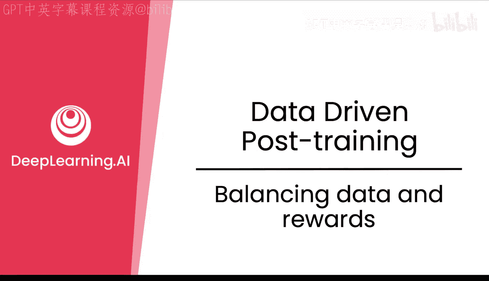
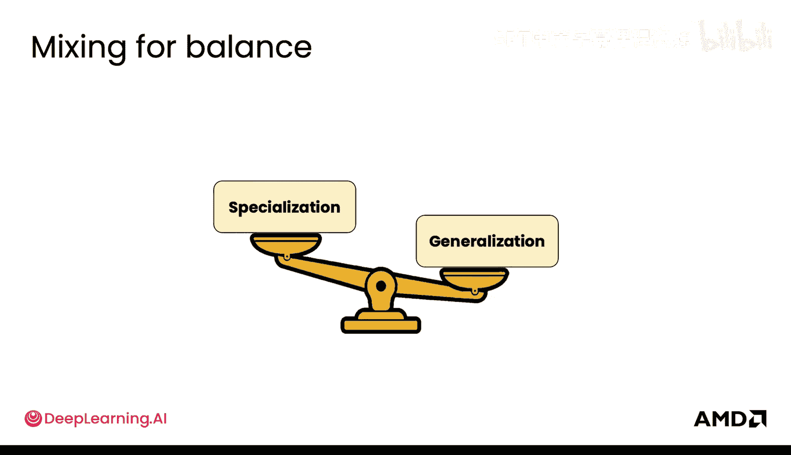
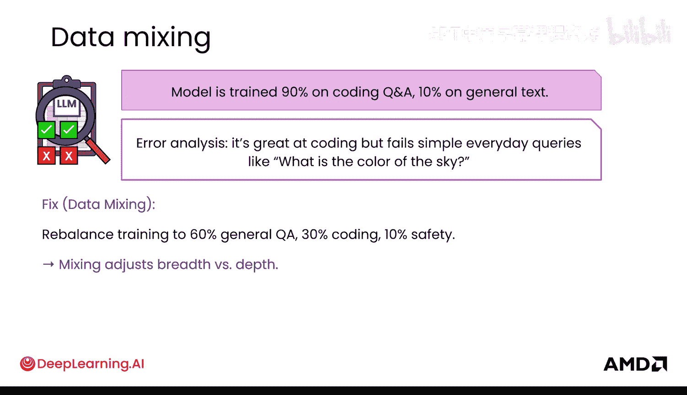
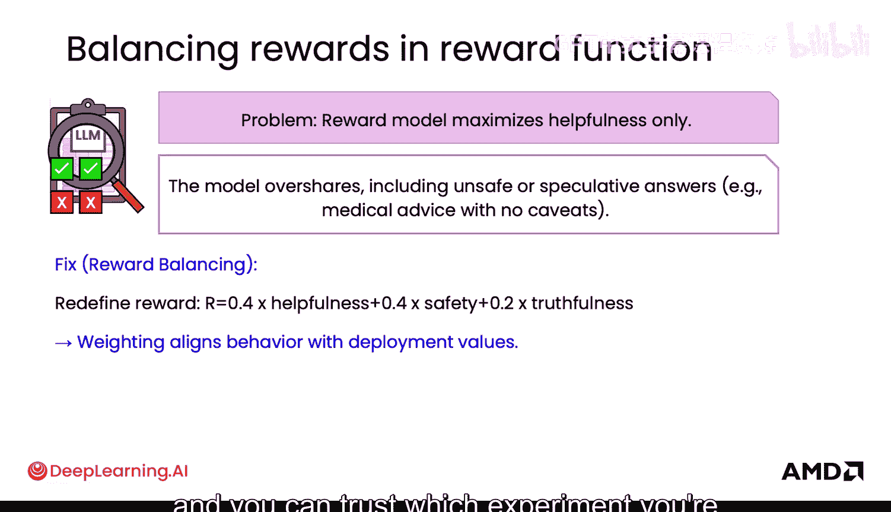
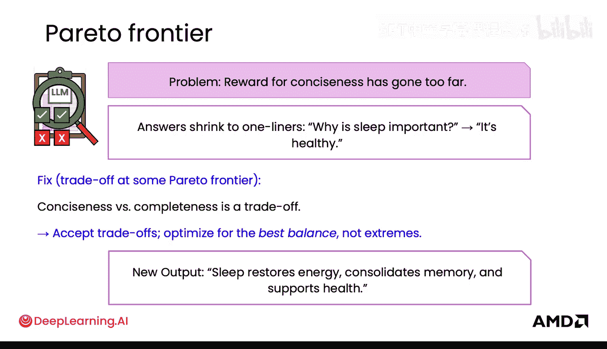
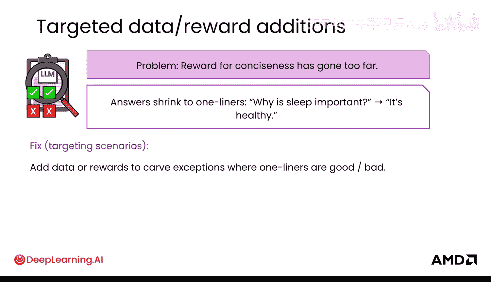
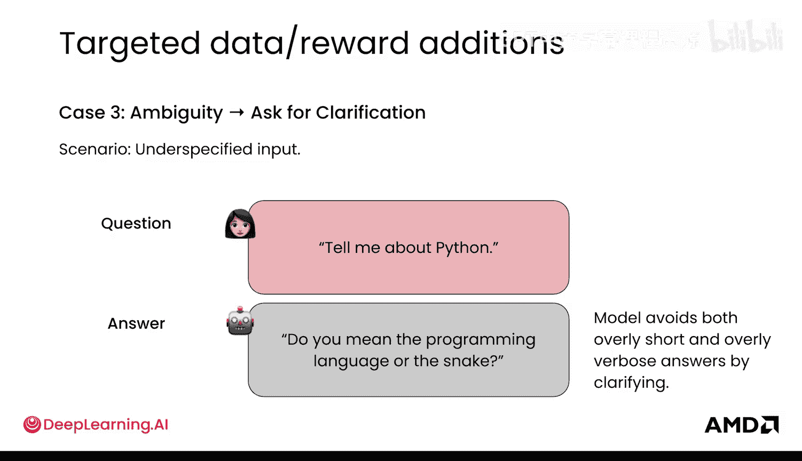
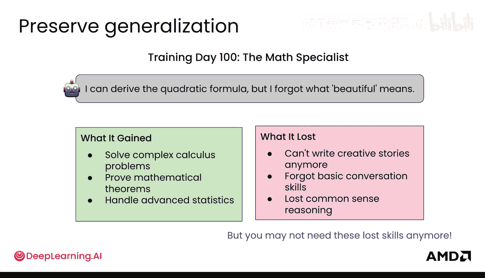
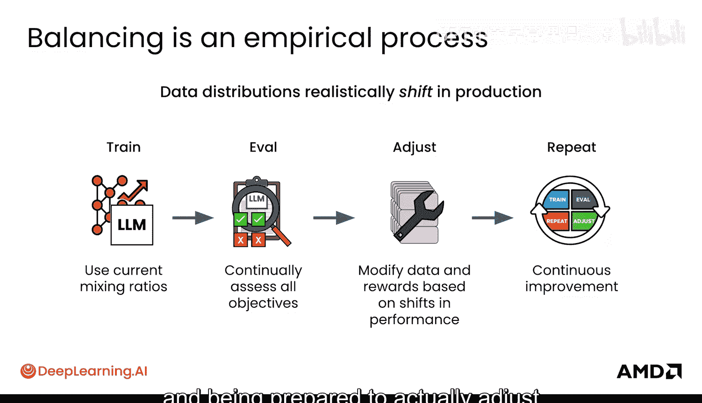

# 035：9. 数据与奖励的平衡

在本节课中，我们将要学习后训练阶段的一个核心考量：如何平衡数据与奖励。这关系到如何在模型的泛化能力与专业化能力之间找到最佳平衡点，是每个AI团队都会面临的关键挑战。

## 概述：泛化与专业化的权衡

后训练的一个关键考量是平衡你的数据和奖励，以便在泛化与专业化之间取得恰当的混合。人工智能中最大的权衡之一就是泛化与专业化。本质上，问题在于如何让模型变得更聪明，同时又不让它变得更笨。这不仅仅是一个工程挑战，也是每个前沿AI实验室每天都要面对的根本性矛盾。在进行任何后训练时，这同样是一个挑战。数据混合正是在这里发挥作用，你必须考虑如何实际混合数据，每种类型的数据需要占多大百分比，才能为你的模型想要执行的任务类型调配出精确的“配方”。

## 数据混合问题与解决方案

上一节我们介绍了平衡的核心矛盾，本节中我们来看看具体的数据混合问题。

假设你有一个模型，其训练数据90%是编程问题，10%是通用文本。在你的错误分析中，你发现它非常擅长编程，但在回答简单的日常查询时开始失败，例如“天空是什么颜色”。这就是一个数据混合问题。它在你的重点数据上表现得非常好，但其中没有足够的通用文本。因此，也许是时候重新平衡训练数据了，例如调整为60%通用问答、30%编程、10%安全性。

这本质上是一个经验性的过程。你需要实际测试几种不同的混合比例。通常的做法是，小规模地运行几个不同数量的实验，以了解模型最终用途实际需要什么样的混合百分比。

最终，这将由你的用户如何使用模型以及他们在每项任务上使用它的频率来决定。有时，这需要在不同任务和不同能力之间进行权衡。例如，我之前训练过一个翻译模型。如果我们在数据混合中加入低资源语言，我们可以让模型在这些语言上表现得非常好，但这实际上会损害它在主要语言上的表现。由于我们的大多数用户都在主要语言上使用它，这使得在生产中部署变得非常困难。因此，这可能是一个机会，可以为不同的任务使用不同的LoRA适配器，或者完全使用不同的模型。

## 奖励函数的平衡

理解了数据混合，我们再来看看奖励函数如何以类似的方式运作。

你的奖励模型可能存在问题，它只最大化“有帮助性”，导致模型有时会过度分享，可能给出不安全或推测性的答案，比如随意提供医疗建议。这时，你可能需要平衡你的奖励函数，重新定义奖励，降低“有帮助性”部分的权重，提高“安全性”的权重。这种权重的调整将使模型的行为与你实际部署的价值观保持一致。

同样，这在整个训练和测试环境中是非常经验性的。你需要非常有条理地创建正确类型的测试环境，以便你能信任输出的结果，并信任你最终要运行哪个实验。

## 其他常见问题与权衡

奖励函数的平衡可能带来其他问题，下面我们列举一些常见情况。

以下是其他一些可能出现的问题：

*   **简洁性过度**：你的“简洁性”奖励可能走得太远，导致模型总是过于简洁。例如，问“为什么睡眠很重要？”，它只回答“健康”。结果，你需要在“简洁性”（对于回答非常清晰简单的问题非常有用，不会冗长烦人）和“完整性”之间进行权衡。
*   **针对性修正**：你可以通过更有针对性的补充来修复这种情况。可能在某些领域你希望它简洁，但在其他领域你不需要这样。你可以添加数据或奖励来划定例外情况，说明一句话回答在哪些情况下好或不好。例如，对于琐事或事实性问题（如“法国的首都是什么？巴黎”），简洁是非常理想的；但对于解释性或因果性问题（如“为什么睡眠很重要？”），你可以展示具有深度的示例。
*   **请求澄清**：模型也可能通过请求澄清来避免过于简短或冗长的回答。你可以教模型请求澄清，以便为用户提供更好的回应。

## 专业化与基础能力的权衡

现在，让我们考虑一个更具体的场景：模型在专业化过程中可能失去基础能力。

假设你训练了一个数学专家模型，在训练了100天后（也许没那么极端），它已经学会了很多复杂的微积分，能够在非常高级的水平上证明数学定理，但它开始失去一些基础能力。这是你在某个时刻必须做出的权衡，即模型开始获得这些专业化能力的同时。

我想强调的一点是，你可能实际上不再需要这些失去的技能。因此，对于你的评估指标，真正需要考虑的是：你是要查看网络上针对通用能力的评估，还是要查看针对你的业务和你实际需要模型完成的任务的特定评估？

## 总结与持续迭代

正如之前所说，平衡是一个经验性的过程。在这里你能做的最重要的事情之一，就是基于不同的实验来扩展它。另一个需要记住的重要事情是，这个过程的经验主义永远不会结束，因为你的数据分布、用户使用模型的方式在生产中总是会不断变化，这是一个现实。因此，你必须非常擅长设置这些实验，并准备好随着分布的变化进行调整。

本节课中我们一起学习了后训练中数据与奖励平衡的核心概念。我们探讨了数据混合如何影响模型的泛化与专业化，以及如何通过调整数据比例和奖励函数权重来优化模型行为。我们认识到这是一个持续的经验性过程，需要根据用户反馈和任务需求不断进行实验和调整。恭喜，现在你已经了解了算法、评估和数据，是时候将所有内容整合起来并投入生产了。