# 036：生产级后训练流程解析 🏭

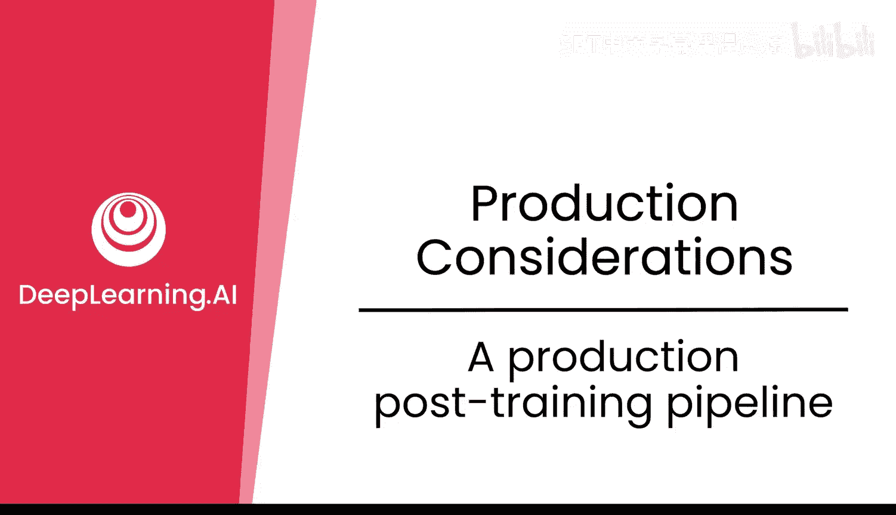

在本节课中，我们将学习一个前沿实验室（DeepSeek）在生产环境中部署模型时，所采用的全流程后训练管线。我们将详细拆解其R10和R1模型的构建过程，理解从基础模型到最终产品所需的不同数据、训练阶段和核心方法。

上一节我们介绍了后训练的基本概念，本节中我们来看看一个具体的生产级流程案例。

## 从基础模型开始

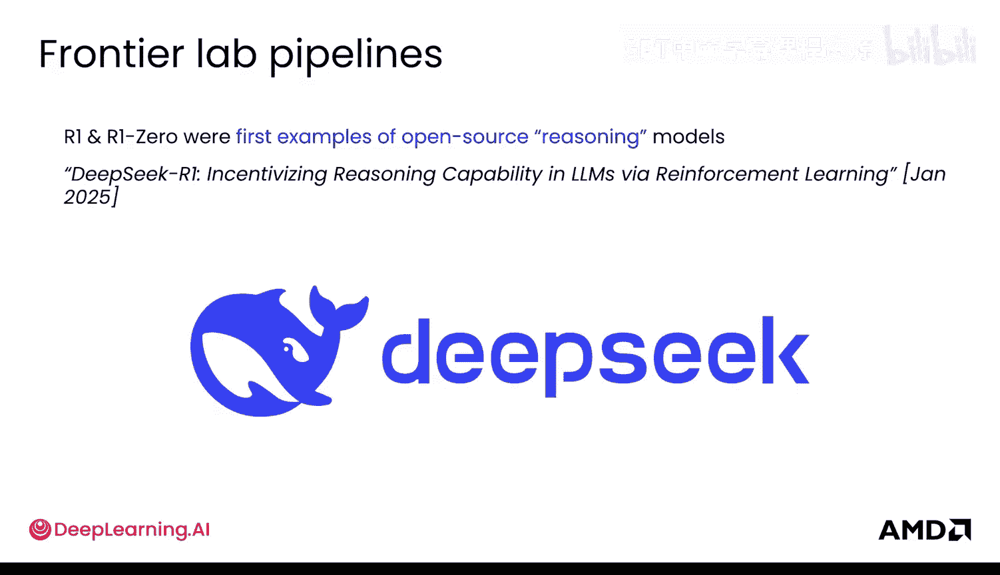

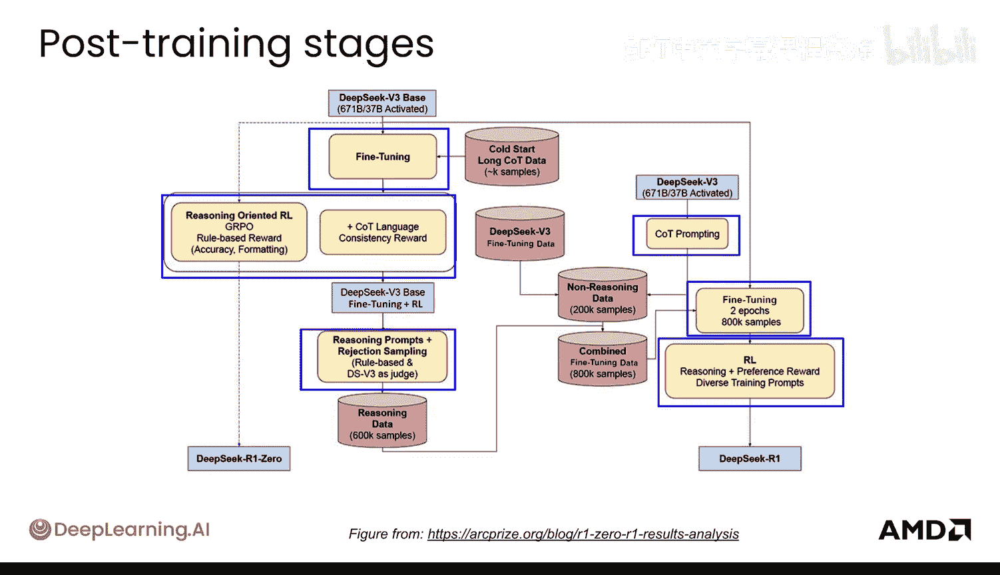

首先，一切始于一个预训练好的基础模型。在DeepSeek的案例中，他们使用的是 **DeepSeek-V3-Base** 模型。

该模型在 **14.8万亿个词元** 上进行了预训练，数据量巨大。训练过程耗时约 **18万GPU小时**，在当时，其约 **530万美元** 的成本对于如此计算密集的预训练任务而言，被认为是相对较低的。他们使用了H800 GPU，按当时约每小时2美元的成本计算，得出了这个总成本。

值得注意的是，DeepSeek-V3-Base 的性能在当时与其他基础模型相比极具竞争力，这为后续的后训练工作奠定了坚实的基础。

## DeepSeek-R10：纯强化学习实验 🧪

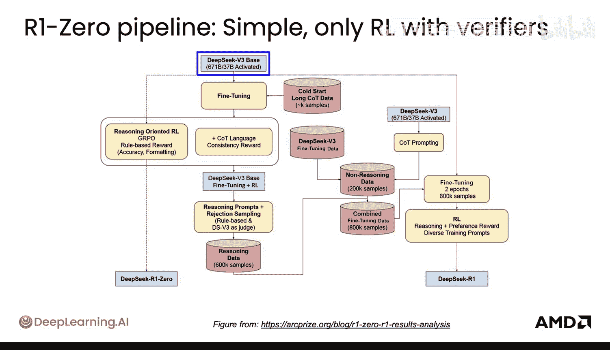

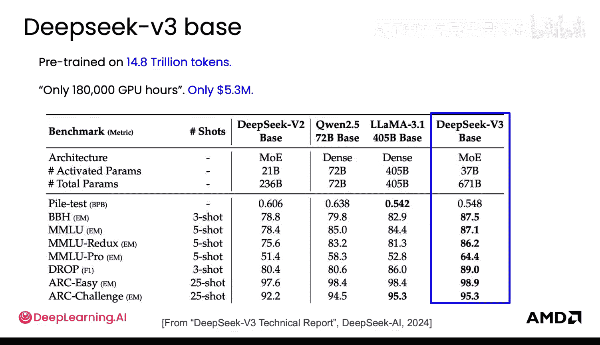

R10模型是一个独特的实验，它**仅使用强化学习（RL）进行训练**，没有使用奖励模型，甚至没有进行监督微调。其流程非常简单，仅包含三个核心步骤，但理解它有助于我们对比更复杂的R1流程。

以下是R10模型的训练步骤：

1.  **起点**：以预训练好的 DeepSeek-V3-Base 模型作为起点。
2.  **训练方法**：使用 **GRPO** 算法进行面向推理的强化学习。
3.  **奖励信号**：奖励完全基于规则，包括**答案准确性**和**输出格式**（例如，`<think>` 标签的位置是否正确）。
4.  **训练数据**：仅使用与数学和编程相关的数据。

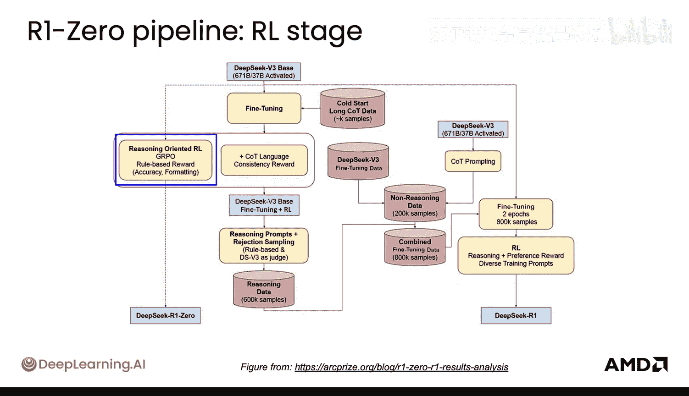

通过这种纯强化学习的方式，模型在AIME数学基准测试上的准确率从 **15.6%** 大幅提升至 **86.7%**。这一飞跃使得该开源模型在当时能够与OpenAI的o1模型竞争，引起了广泛关注。

一个有趣的现象是，在训练过程中，模型**自发地**学会了进行更长时间的“思考”。由于没有人工提供的示范答案，模型为了获得更高的准确性奖励，会倾向于在 `<think>` 标签内生成更长的推理链。这证明了强化学习能够促使模型发展出反思、探索不同解题路径等类智能体行为。

然而，R10模型也存在明显的局限性：

*   **可读性差**：模型可能会混合使用多种语言来寻找最高效的解题路径，但这导致输出对人类而言难以理解和审计。
*   **领域受限**：其能力仅限于拥有验证器（用于计算准确性奖励）的数学和编程领域。
*   **缺乏通用性**：不是一个通用的对话或任务模型。

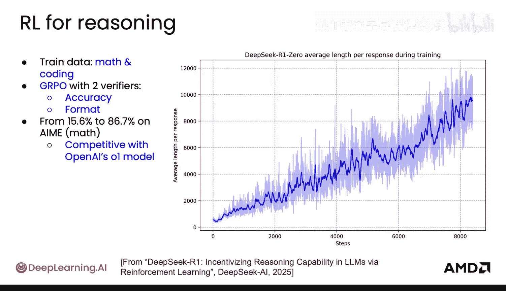

## DeepSeek-R1：复杂的通用模型管线 🔄

为了构建一个更通用、能力更全面的模型，DeepSeek设计了更为复杂的R1训练管线。其目标是融合推理和非推理能力。

整个管线可以清晰地分为两条并行的数据流水线，最终汇合。

### 推理数据流水线 🧠

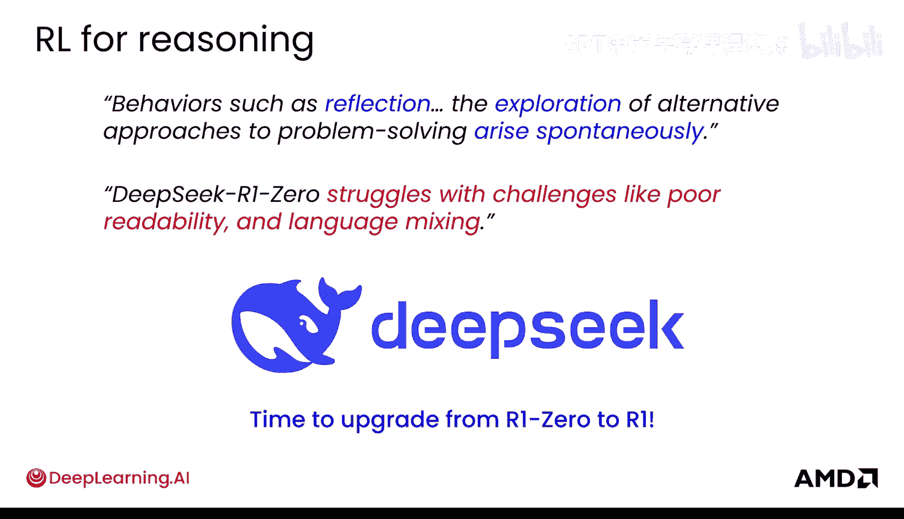

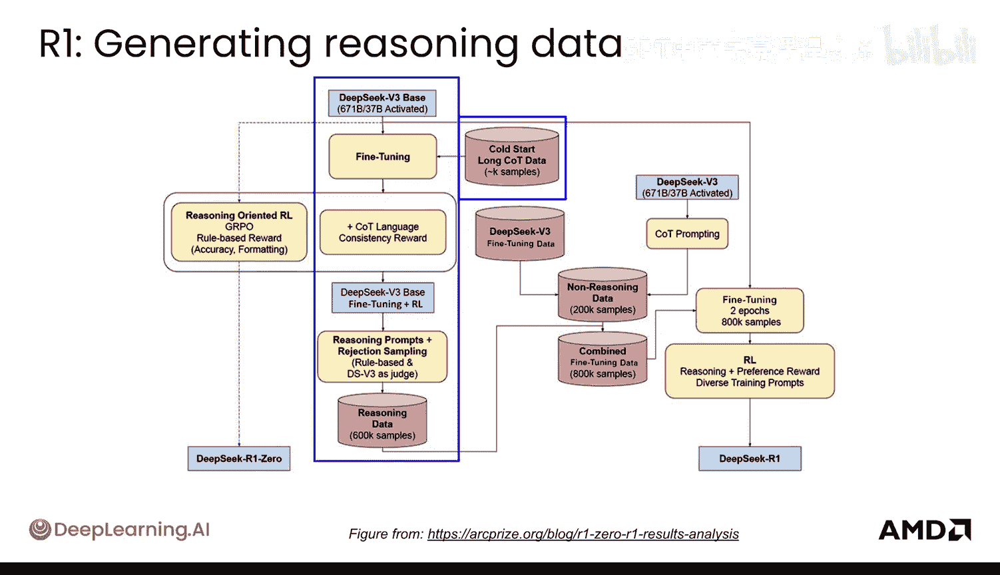

这条流水线专门用于培养模型的深度推理能力。

1.  **冷启动**：首先使用包含详细思维链的“冷启动”数据对基础模型进行少量轮次的**监督微调**。这旨在让模型初步适应生成推理过程。
2.  **强化学习初调**：使用微调后的模型进行第一轮强化学习。此阶段除了准确性奖励，还加入了**语言一致性奖励**，强制模型在输出时只使用一种语言，以提高可读性和可审计性。
3.  **数据蒸馏**：利用上一步得到的模型，通过**拒绝采样**技术生成大量推理提示及其回答。然后，使用一系列规则和其他模型（包括基础模型本身作为评判者）进行过滤，最终蒸馏出一个包含约 **60万** 个样本的**高质量合成推理数据集**。

### 非推理数据流水线 💬

这条流水线旨在提升模型在通用对话和直接问答方面的能力。

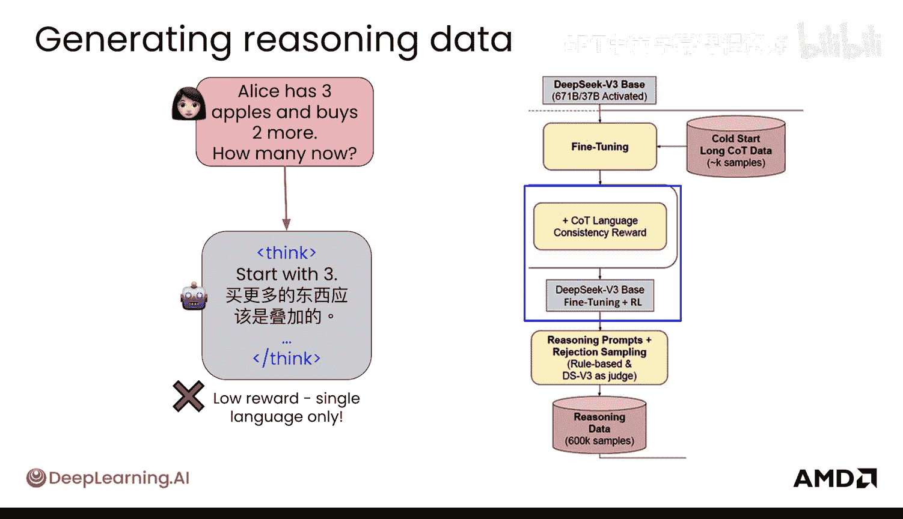

1.  **生成思维链提示**：使用 DeepSeek-V3-Base 模型生成适用于非推理任务（非数学/代码类）的思维链提示。
2.  **获取目标输出**：为这些提示生成对应的目标输出。
3.  **混合直接回答数据**：将上述生成的“输入-目标输出”对，与已有的直接回答微调数据相结合，共同构成非推理训练数据集。

### 流水线合并与最终训练 🤝

现在，我们将两条流水线的成果合并。

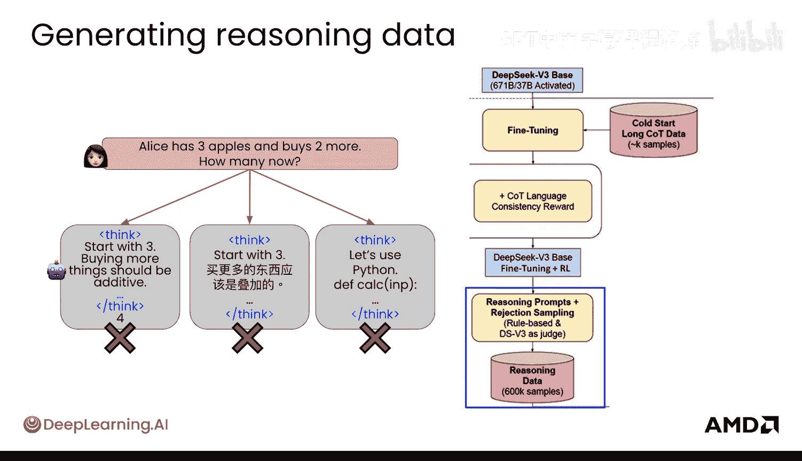

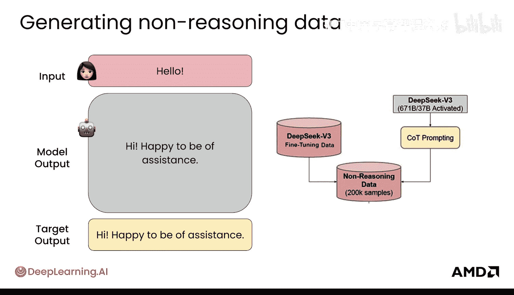

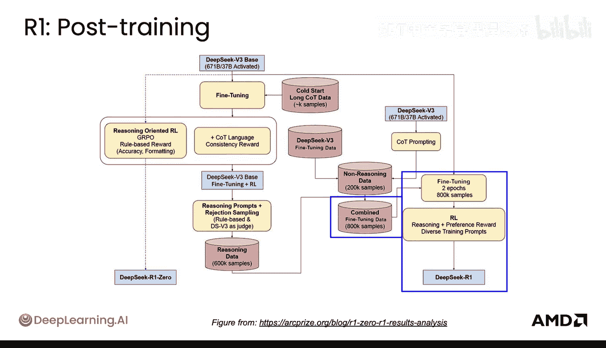

1.  **数据合并**：将约60万条的推理数据和约20万条的非推理数据合并，形成一个约 **80万** 条样本的**组合数据集**。
2.  **组合微调**：使用这个组合数据集对模型进行几轮监督微调，得到一个中间模型。这确保了模型同时具备了推理和直接回答的初步能力。
3.  **最终强化学习**：将中间模型送入最终的强化学习阶段。此阶段使用了**更丰富的训练提示**，并且引入了**奖励模型**来提供基于偏好的奖励信号，而不仅仅是规则奖励。
4.  **产出**：经过这个完整的流程，最终得到了能力全面、性能强大的 **DeepSeek-R1** 模型。

本节课中我们一起学习了生产级大模型后训练管线的完整构建过程。我们从简单的、纯强化学习的R10实验管线开始，看到了RL如何激发模型的推理潜力，但也认识到其局限性。接着，我们深入剖析了更复杂的R1通用模型管线，理解了如何通过精心设计并行的推理与非推理数据流水线，最终将它们合并，并通过多阶段微调和强化学习，训练出一个能力均衡的最终模型。这个案例清晰地展示了，将不同的后训练技术（SFT、RL、数据合成等）系统化地组合，是构建高性能生产级模型的关键。

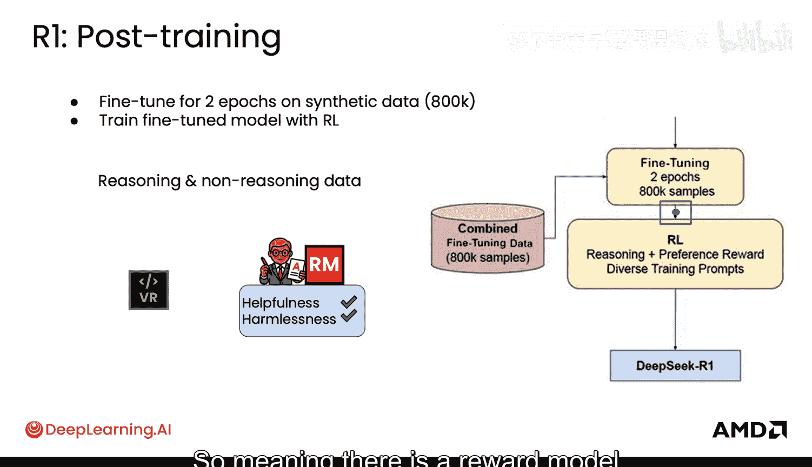

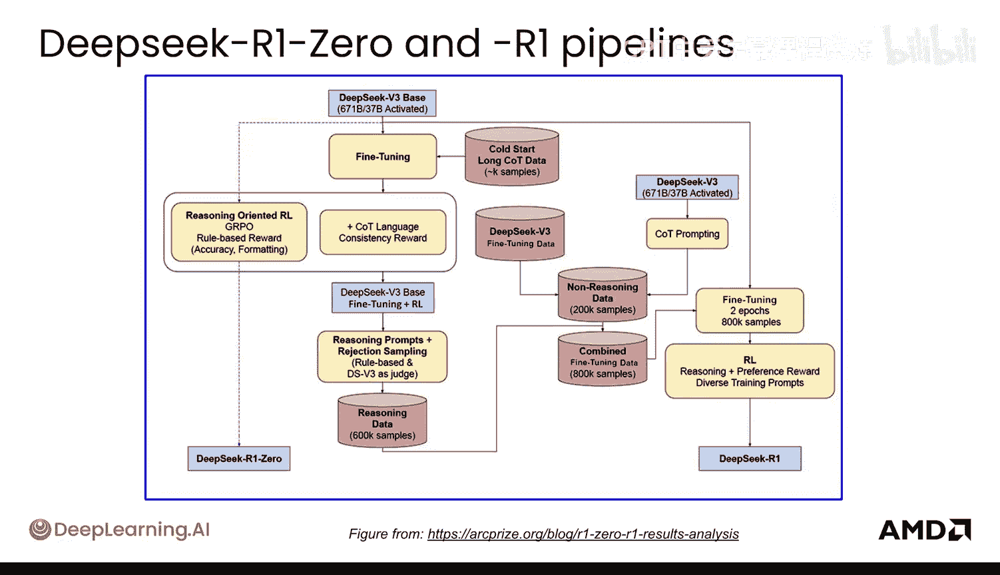

现在你已经理解了生产级后训练管线的各个组成部分，下一节让我们来看看智能体如何与现实世界进行交互。