# 037：智能体（Agents）

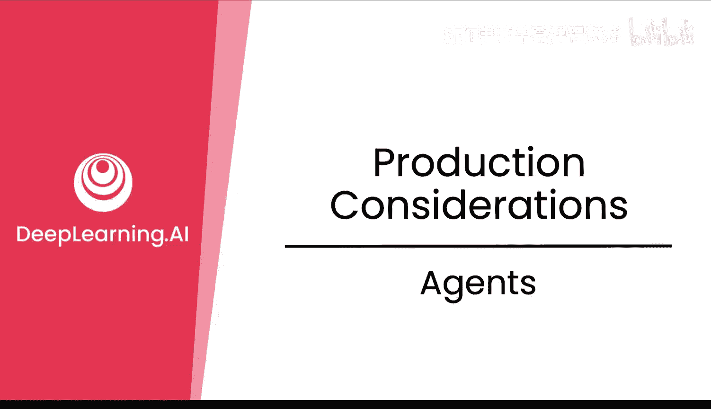

在本节课中，我们将探讨如何将大型语言模型部署为智能体。智能体是一种在生产环境中部署LLM的流行方式。我们将了解智能体与普通聊天助手的区别，并学习如何通过后训练技术赋予模型使用工具、规划、协调等关键能力，以应对真实世界中动态、复杂的环境。

## 智能体与后训练概述

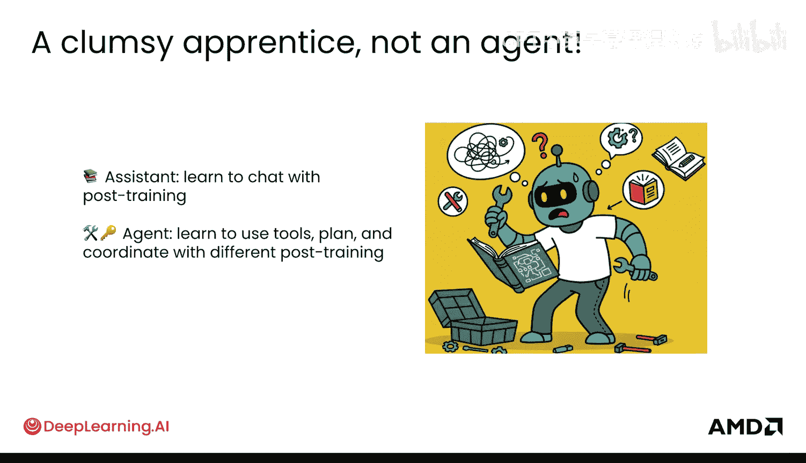

智能体是生产环境中部署LLM的一种非常流行的方法。一个在线的智能体可以帮助你了解，为了获得正确的结果，在后训练阶段需要进行哪些类型的行为调整。

如今在生产环境中运行的LLM已经超越了普通的助手。普通的助手通过后训练学习与人聊天和互动。而智能体通常是已经部署在生产环境中的系统，或者是人们希望部署的系统。后训练能够为智能体赋能多种不同的能力，例如使用工具、规划和协调。但这是一种不同类型的后训练，你之前已经看到过一些例子。

这是因为智能体的用户体验与聊天机器人不同。具体来说，聊天机器人擅长响应不同的查询、进行良好的对话，并能处理之前提到的、由后训练实现的聊天历史记录。但通过不同的后训练，你可以得到一个能够使用工具的智能体，以及你之前也见过一些的、能够进行推理的AI，使其能够更有效地进行反思循环，并最终实现协调。

接下来，我们将逐一探讨这些方面。本质上，智能体与现实世界的许多组件交互，这个过程可能很混乱。信息可能杂乱无章，它使用的工具可能随时间变化。因此，让我们看看所有这些组件如何工作，以及它们如何最终形成一个在生产环境中运行的智能体。

## 工具使用

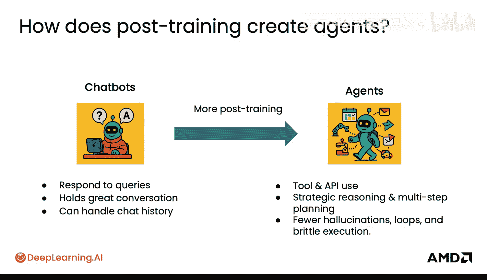

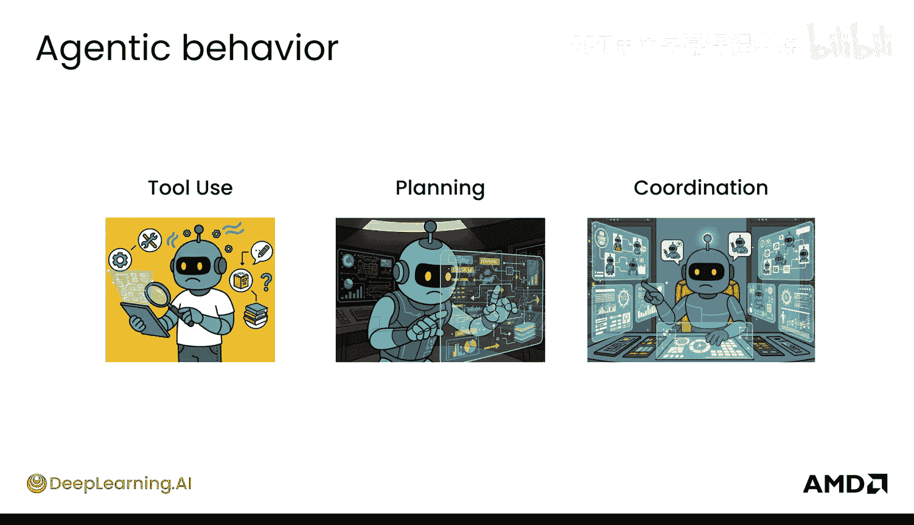

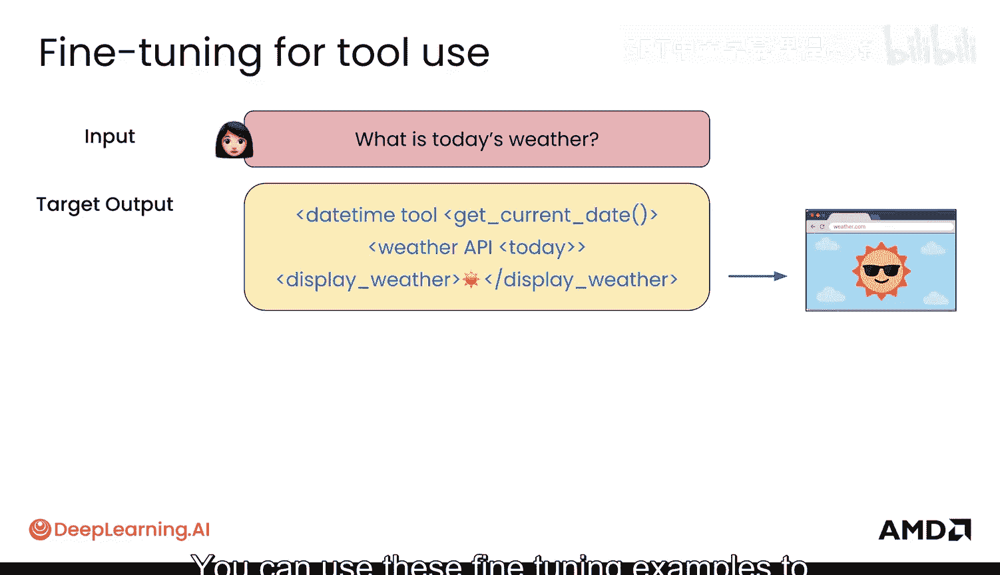

你之前已经见过工具使用。本质上，当用户问“今天天气如何”时，目标输出实际上可以使用像天气API这样的工具来获取信息并展示结果。你可以使用这些微调示例来让你的模型变得更像一个智能体。

在强化学习中，对于工具使用，你可以教它使用计算器，而不是自己计算，并为获得正确答案和/或使用工具本身获得奖励。你也见过使用搜索API、基于代码的文件等工具，在互联网上搜索以获取最新信息。

以上都是关于工具使用的后训练。

## 规划

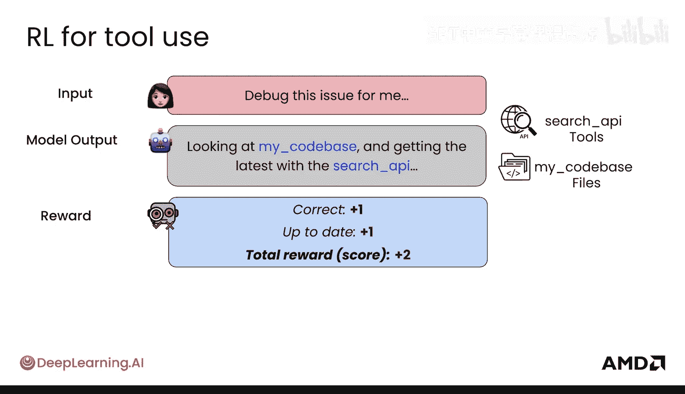

规划主要涉及推理，即模型应如何逐步思考以获得更好的答案。

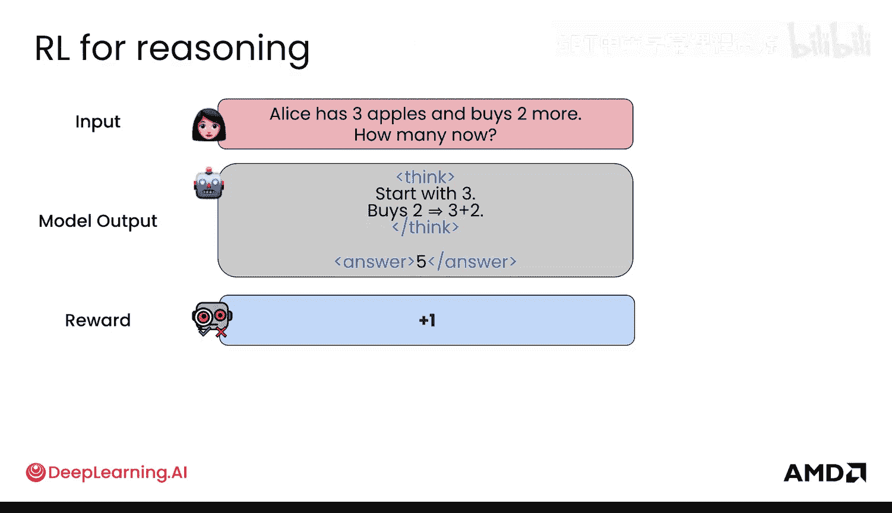

对于推理的微调，你之前见过思维链。对于强化学习，你也见过，模型会因最终获得正确答案而获得奖励，并允许它进行规划。

## 协调

协调将智能体能力提升到了一个新的层次，你之前可能见得不多。这展示了后训练如何在多智能体对话记录上进行。

本质上，你可以让一个模型更好地与其他使用不同工具的智能体协作。例如，智能体A可能负责分解数学问题，智能体B负责使用计算器工具。然后，你的目标输出是思考如何聚合来自智能体A和智能体B的信息，以得到正确答案。这就是你在这里进行微调的最终模型。

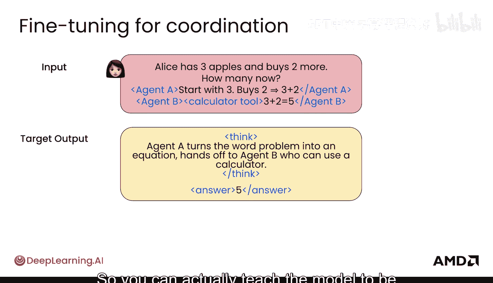

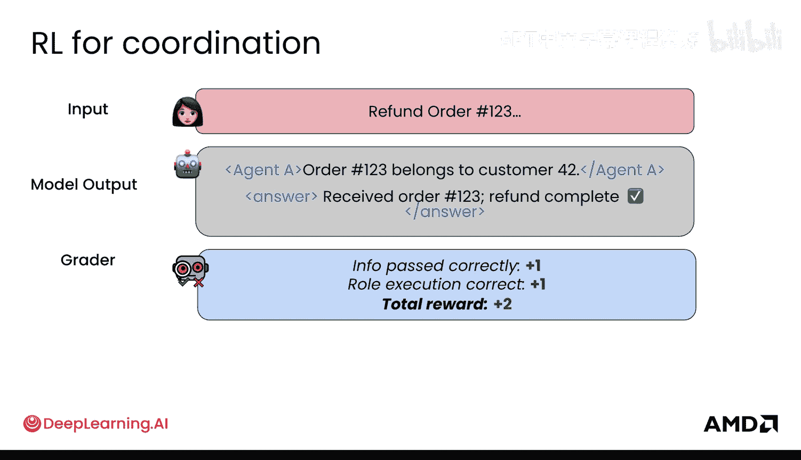

因此，这使用了多个不同的可能模型或可能的智能体来达到最终目标。在微调中，实际上这些都是可能的不同任务，所以你也可以教模型成为智能体A、智能体B和智能体C。

在协调的强化学习中，情况可能是这样的：用户说“查找订单号123的退款状态”，模型输出显示它正在寻找智能体A，以某种方式使用智能体A（同样，智能体A可能是它自己的子智能体），但它回答“抱歉，没有获取到订单信息”。你想要教模型的是，能够在其子智能体之间或向另一个智能体正确地传递信息，以获得正确的响应。

例如，这里是另一个糟糕的情况：如果智能体A说“退款正在处理中”，即使没有找到退款记录，然后你“退款了订单”，如果该订单不存在，这也不好。正确的案例是：智能体A发现该订单属于某个客户ID，然后为该客户退款。

## 生产环境中的智能体

随着我们将这些智能体部署到生产环境，为了让智能体有效工作，需要考虑哪些不同因素？

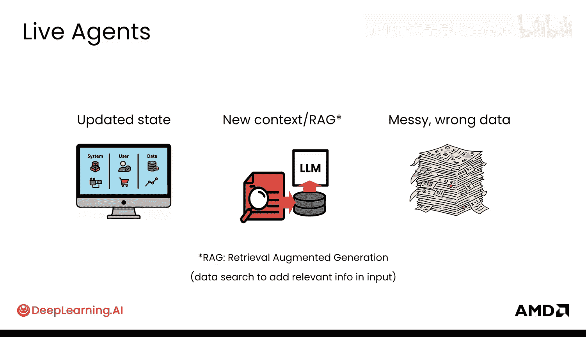

1.  **状态持续更新**：这在生产环境中更加困难。你的API会变化，你的工具自身会变化，状态只是不断在改变。因此，能够有效地管理和处理这一点非常重要。
2.  **新上下文**：新信息不断涌入，模型训练时的数据并非一成不变。因此，这就像使用搜索API获取新闻信息，或者使用检索增强生成，其本质是一种数据搜索，将可能更相关的、最新的信息添加到输入中。
3.  **混乱和错误的数据**：可能会有混乱的、甚至错误的数据以某种方式添加到模型的上下文中，模型需要能够处理这些情况。

这些都是智能体需要通过后训练来掌握处理能力的不同方面。因此，根据你希望智能体在生产环境中表现出的行为，你需要相应地设计你的智能体，使其能够对这些情况保持鲁棒性。

以下是一个持续更新工具的例子。你基本上希望模型学会使用工具来获取更新后的状态，而不是依赖其自身的内部状态，因为它自身冻结的内部状态不会持续更新。不过，持续进行后训练很困难，但我对未来这方面非常期待。

一个非常简单的例子是使用日期时间工具。因为当模型被训练时，它可能认为时间还停留在过去。随着时间推移，使用日期时间工具来理解“今天是几号”，并确保模型默认使用该工具，而不是“记住”今天的日期，这一点非常重要。

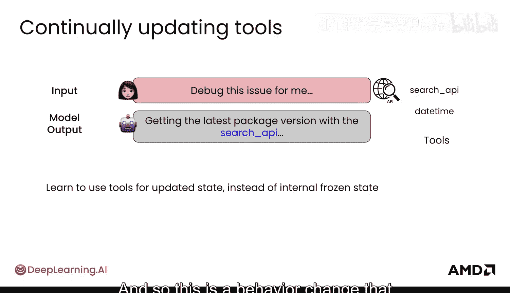

同样，使用搜索API并习惯于实际使用搜索API来获取相关信息，而不是依赖自身的知识，这也是你想要通过后训练教导的一种行为改变。

另一种需要考虑的行为是，模型如何处理从未见过的新信息，并确保模型能自如地使用这些信息。检索增强生成基本上可以从任何类型的数据源检索新看到的信息，类似于使用搜索API。你可以附加一份新的收益报告，模型应该能够处理它。

模型还应该能够处理错误情况。例如，如果那份收益报告实际上不是收益报告，或者不是最新的，模型实际上可以去检查。这里的模型正在检查“今天的日期是什么”，并发现“这不是最新的收益报告”。它可能使用了日期时间工具，然后检查并确认这实际上不是新的收益报告，从而处理了用户可能错误提供的信息，这在生产环境中可能相当常见。

## 案例研究：处理实时智能体协调

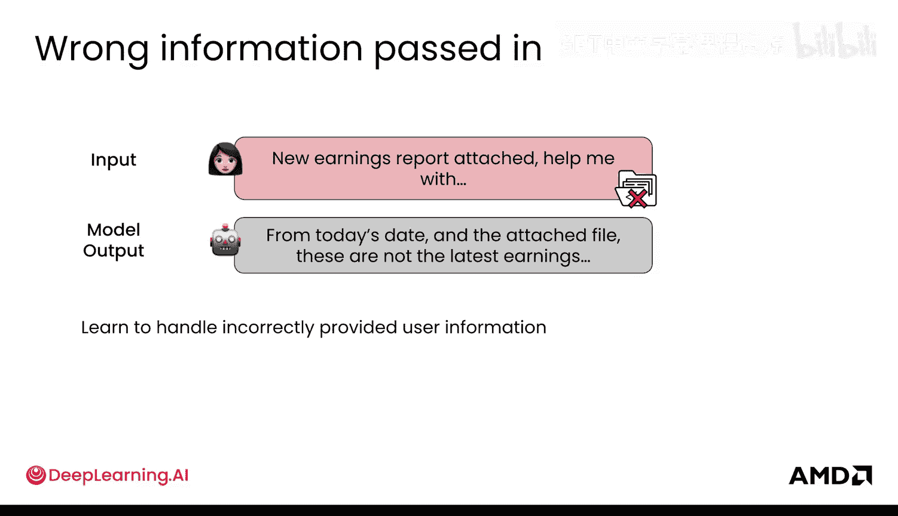

这里有一个小案例研究，展示你如何处理实时智能体协调情况，这反过来会指导你在微调和强化学习工作流程中应该做什么。

假设用户说：“我的订单晚了，追踪信息显示它丢失了，请帮忙。”

你的模型说：“好的，我需要找到用户的订单并检查追踪信息。”它写下了这样一段代码作为结果。

但它得到了一个错误。好吧，它仍然没有获取到状态。它再试一次，还是错误。好吧，它遇到了问题。再试一次，仍然是错误。最后它回答用户：“抱歉，我没有这些信息，请查看我们的常见问题页面。”你可能很熟悉看到这样的回复。当然，用户会非常不满。

你如何获取这些信息？很多时候，你必须在有限的环境中部署一个智能体来收集用户实际向你询问的这类信息，然后你需要使用后训练技术来纠正它。

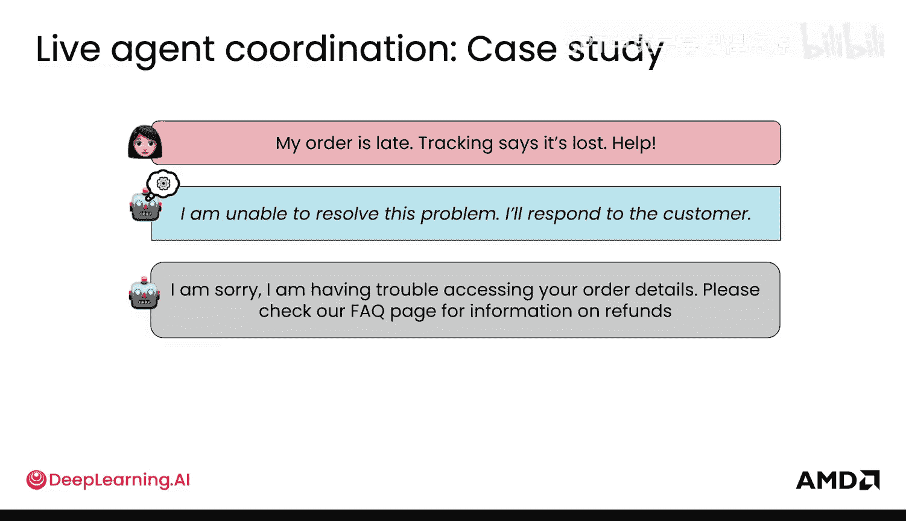

例如，在微调中，情况可能是这样的：你遇到了这个错误，你发现可能函数名甚至传入的参数有问题。因此，你想给出正确的目标输出，并教导模型：“这才是正确的函数声明，这才是你应该传入的客户ID，而不是姓名。”你创建大量这样的示例，以便模型能够有效地使用你公司的工具。

在强化学习中，情况可能是这样的：同样的错误，它没有执行并且是错的。也许如果它执行了，你给它稍高一点的奖励，但它仍然是错的。然后，如果它是正确的并且执行了，你就给它非常积极的奖励。这就是可能的样子。

在规划方面，情况可能是这样的：模型知道有很多失败，它就直接放弃了，说“去看FAQ页面”，这可能会得到一个负奖励。相反，你可能希望模型实际上进行升级上报，这对于生产环境中涉及人工的流程来说可能是一条更有效的路径。因此，对于多次失败，模型实际上能够将其上报，然后获得正奖励。

这只是思考“我的智能体在生产环境中实际需要如何运作”以及“在我的工具箱中，我有哪些工具——微调和强化学习后训练——来实际调整我的模型，使其能够适应这些情况”的一种方式。

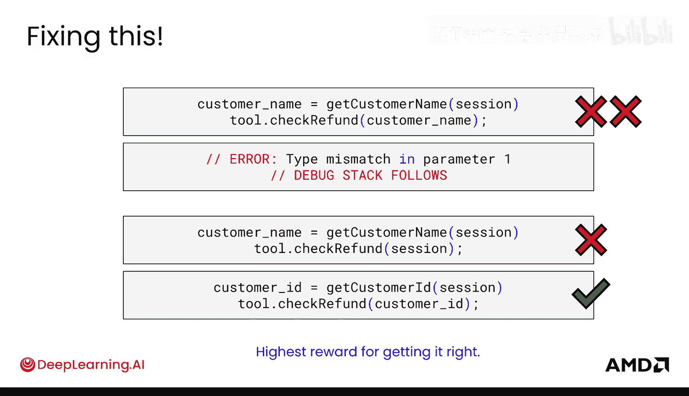

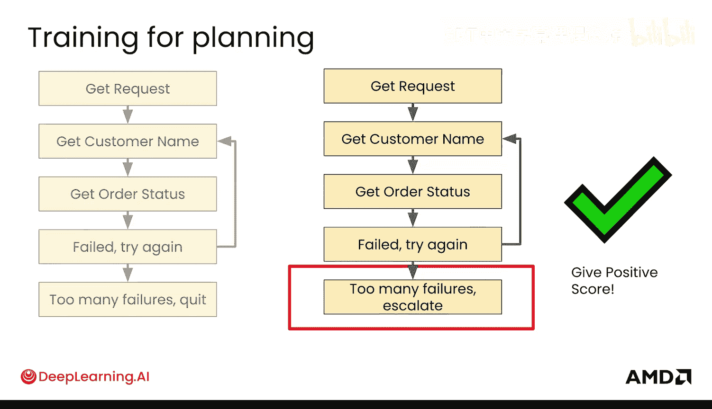

## 总结

本节课中，我们一起学习了智能体在生产环境中的部署与后训练。我们了解了智能体与普通聊天助手的核心区别，即智能体需要与现实世界动态交互。我们深入探讨了通过后训练赋予智能体的三大关键能力：**工具使用**、**规划**与**协调**。最后，我们通过一个案例分析了如何根据生产环境中的实际需求，运用微调和强化学习来设计和优化智能体，使其能够处理状态更新、新信息输入以及混乱数据等挑战。理解这些概念是构建强大、实用LLM应用的基础。