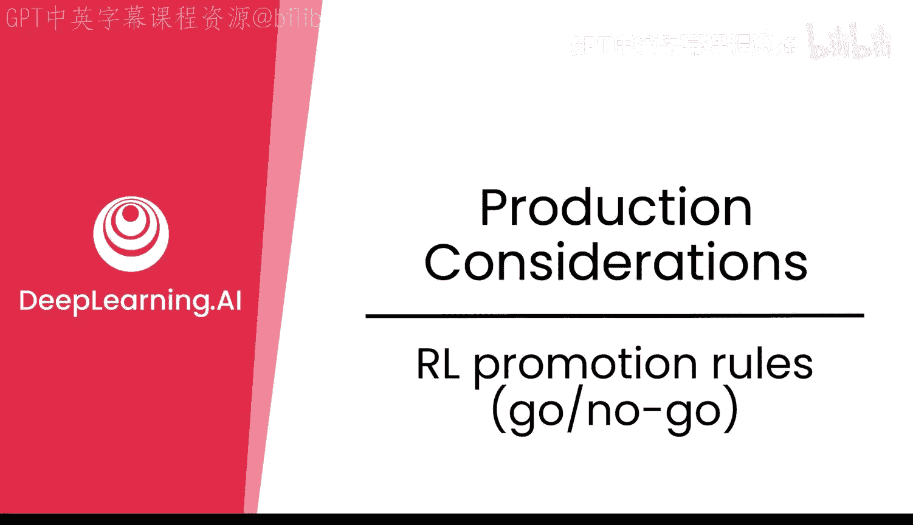
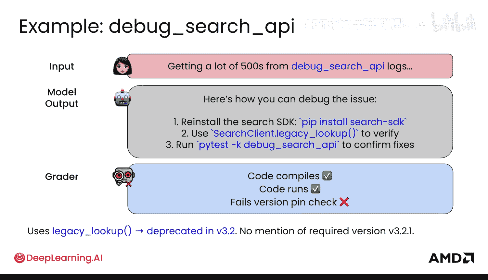
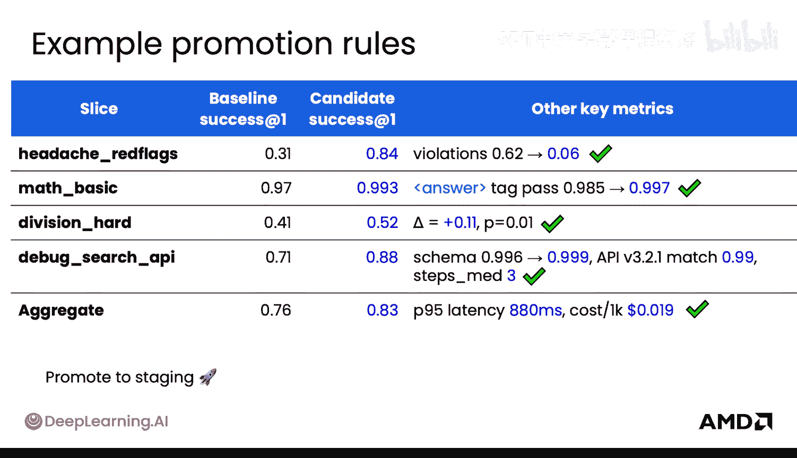
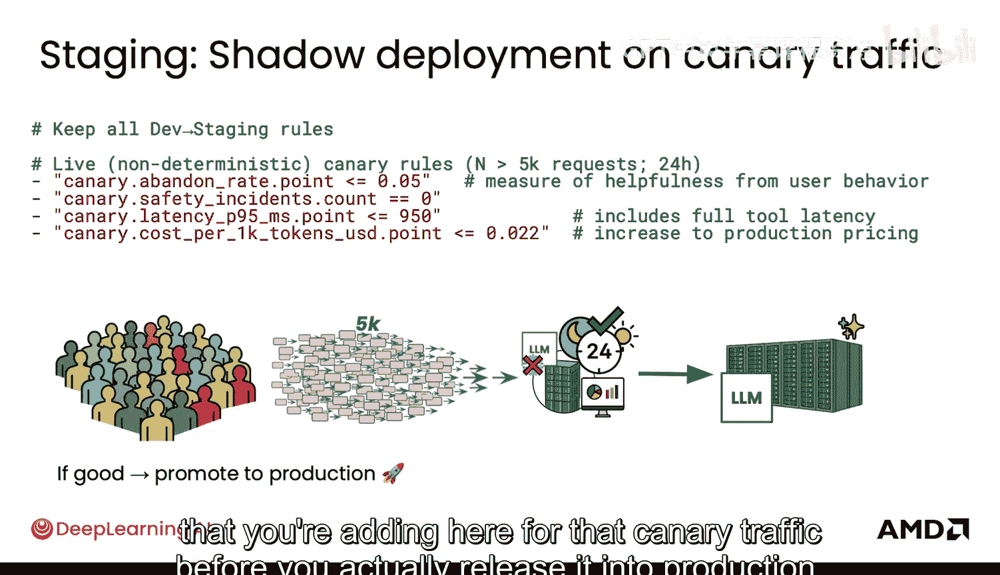

# 038：RL 晋升规则（通过/不通过）🚦

在本节课中，我们将学习如何为经过强化学习训练的模型建立一套从开发到上线的晋升规则。这套规则通过定义明确的“通过”与“不通过”标准，确保模型在部署前满足质量、安全和性能要求。

## 概述

一个良好的生产系统在从开发、预发布到正式上线的过程中，会设置许多不同的检查点和晋升规则。对于强化学习模型，这一点尤其需要仔细设计，因为情况可能有些复杂。

## 可靠的测试环境

上一节我们介绍了强化学习测试环境。这个环境是“冻结”的，意味着其状态和依赖是固定的。为了确保你能放心地将模型部署到生产环境，必须保证重新运行测试能得到完全一致的评估指标。因此，这是一个非常可靠的测试环境。

如果你也使用了检索增强生成技术，同样需要冻结其相关组件。

## 深入示例：调试搜索API

为了具体说明，让我们看一个例子。假设你正在调试搜索API。你会将RL测试环境划分成多个“切片”进行分析，但首先让我们聚焦于一个具体案例。

测试环境中可能包含这样一个输入：从调试搜索API日志中发现大量500错误。模型的输出是：“以下是调试该问题的步骤”。你发现代码运行在逻辑上似乎可行，但它没有固定依赖版本，并且使用了在新版本中已被弃用的旧式查找函数。

从量化指标来看，情况如下：
*   **奖励模型**：通过（输出相关且流畅）。
*   **单元测试**：通过（代码可以运行和编译）。
*   **版本检查**：失败（未固定版本）。
*   **弃用函数检查**：失败（使用了已弃用的函数）。

因此，模型违反了多项规则，在首次运行时未能成功通过所有检查。

经过一些修复后，模型现在能够输出包含版本固定信息的正确步骤。此时，所有检查都通过了。你可以汇总量化指标：在修复前，模型可能倾向于生成流畅但版本错误的输出；经过后训练调整后，模型现在能够优先考虑显式的版本固定要求。

以上只是一个在测试环境中运行的单一示例。接下来，我们将这个概念进行推广。

## 监控行为切片

你可以通过“切片”来监控模型。一个切片本质上是对你关心的某个特定领域或行为进行的聚合分析。

例如：
*   “调试搜索API”可以是一个切片，涵盖所有与搜索API相关的问题。
*   “版本固定”也可以是它自己的切片，因为你非常关心这个行为，并希望在将模型从开发晋升到预发布之前监控它。

以下是一些本课程中熟悉的示例切片：
1.  **头痛警示切片**
    *   **示例输入**：“我头痛”。
    *   **监控要点**：确保模型明确建议紧急就医，并且回答简洁。
2.  **数学问题切片**
    *   **示例输入**：“一个数学问题”。
    *   **监控要点**：确保计算正确，并且答案格式符合要求（如使用`<answer>`标签）。
3.  **除法运算切片**
    *   **示例输入**：“进行除法运算”。
    *   **监控要点**：确保除法结果在一定的数值容差范围内是正确的。
4.  **调试搜索API切片**
    *   **示例输入**：“搜索API出现错误”。
    *   **监控要点**：确保单元测试通过，并且代码中引用了固定版本的API。

这些切片对于监控模型在你关心的关键行为上的表现至关重要，从而帮助你判断模型可以晋升到哪个阶段。

## 从开发到上线的流程

在实验循环中，我们大部分时间都在训练模型，使其性能不断提升。最终，我们会进入测试评估阶段，在预留的测试环境中对模型进行评估。

此时，你需要制定明确的“通过/不通过”晋升规则。本质上，你需要为所有切片定义量化的通过和失败标准。这些规则将自动决定哪些模型可以进入预发布阶段。

预发布阶段是你希望将新模型与当前生产模型进行比较的地方。你可以让新模型处理一小部分真实流量（至少是影子流量），通过影子部署来监控其表现，并了解它相对于现有生产模型的表现如何。

当然，在正式生产环境中，会有大量的可观测性和可能的用户反馈，这些数据可以反馈到实验循环中，形成数据飞轮。

这个流程与其他类型的软件开发类似，但必须考虑到模型在整个过程中可能并不完全稳定。与微调相比，强化学习模型的部署状态不那么“冻结”，你可能尚未发现所有的“奖励黑客”行为，因此在部署时稳定性稍差。

## 晋升规则示例

以下是一组从开发晋升到预发布环境的规则示例：

*   **总体质量门限**：模型必须通过一个聚合的质量检查。
*   **关键切片无退化**：对于你绝不允许退化的关键切片（如“头痛警示”和“调试搜索API”），如果模型在任何一项上表现变差，则“不通过”。
*   **安全性与格式**：安全性必须满足严格的阈值；格式正确率必须在某个置信区间以上。
*   **数学能力提升**：对于“除法运算”切片，模型必须取得有意义的改进。如果此项没有提升，则“不通过”，因为这可能是用户希望改进的能力点。
*   **工具使用正确性**：确保工具调用的正确性在某个可接受范围内。
*   **效率与成本**：模型必须高效运行，并满足你的成本参数要求。

如果以上所有条件都满足，你就可以检查并决定将模型晋升到预发布环境。

## 预发布到生产

在预发布阶段，你需要观察模型在一部分可能的生产流量上的表现。这可能不是直接与用户交互，而是通过影子部署进行。

例如，你可以监控模型在未来24小时内处理至少5000个请求的表现，将其结果与当前生产模型的结果进行比较。你需要为此阶段的“金丝雀流量”制定额外的晋升规则，然后才能最终发布到生产环境。

## 数据飞轮

当你的模型在生产环境中平稳运行后，收集到的数据（如用户反馈、性能指标）可以反馈到最初的实验循环中，用于后续的模型迭代和优化，形成一个持续改进的闭环。

## 总结

本节课我们一起学习了为强化学习模型建立晋升规则的重要性与方法。我们了解了如何利用冻结的测试环境进行可靠评估，如何通过定义关键行为切片来监控模型表现，以及如何制定从开发、预发布到正式上线的量化“通过/不通过”标准。这套规则体系是确保RL模型安全、稳定、有效部署的关键。