# 039：数据反馈飞轮 🔄

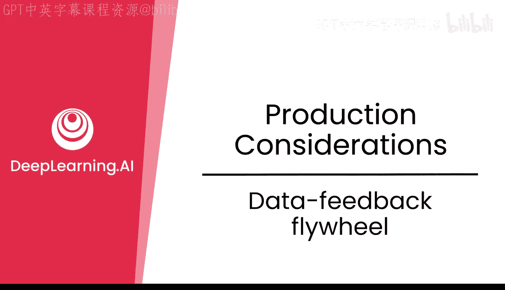

在本节课中，我们将学习如何利用生产环境中用户与模型的交互数据，构建一个持续改进模型的“数据反馈飞轮”。我们将了解如何收集、分析用户反馈和日志，并将其转化为可用于后续微调或强化学习实验的高质量数据。

---

人工智能的一大优势在于，你可以从用户正在积极使用的生产模型中获取数据，这些数据实际上可以被收集起来，用于下一代模型的后训练。

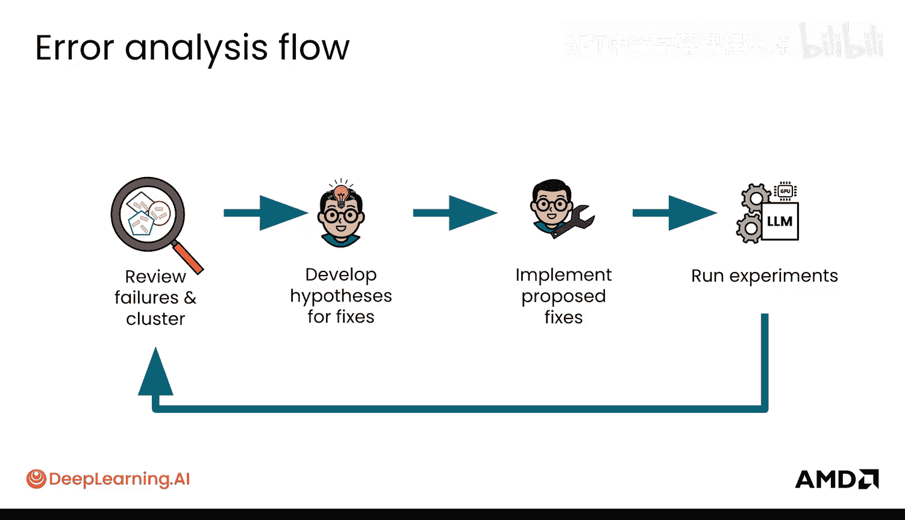

让我们看看这是如何运作的。你之前见过错误分析流程：审查不同的失败案例，将它们聚类，提出修复假设，在实验中实施这些建议的修复，然后运行大量实验，并反复进行这个流程以改进模型。

那么，在生产环境中，这看起来是怎样的？你同样可以审查这些失败案例并进行聚类。你可能是在生产环境中审查它们，因为模型已经部署上线。然后，你会有一些额外的问题：问题的紧急性如何？你是否感到恐慌，因为用户体验会非常糟糕，或者你会损失大量金钱（例如，在不该退款时开始给大量客户退款）？目前部署了哪些其他模型？也许你正在进行不同模型的A/B测试，能否撤回其中一个模型？预算是多少？需要投入多少资金、资源和人力来实际修复这个错误？基本上，这个问题有多重要？

根据这些考量，你要么重新部署一个补丁，要么记录下这些反馈以供后续使用。通常，这个过程会是这样的：你会获得一些用户反馈，也会有很多使用日志，然后你会像之前一样进行大量的聚类分析。这里会有很多额外的数据工作来清理和转换数据，你可能会有一些合成数据转换管道，然后你可以将这些数据用于下游的后训练实验。

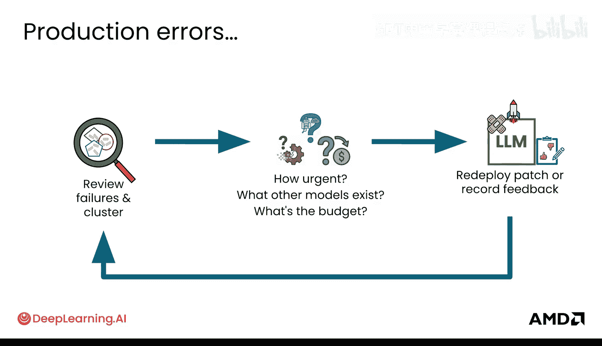

反馈可能是什么样的？你会在实验室中看到这些。基本上，你可以绘制用户满意度图表，也可以获得“点赞”、“点踩”或“中立”的分布情况。

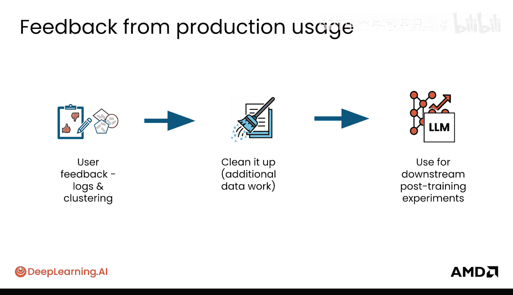

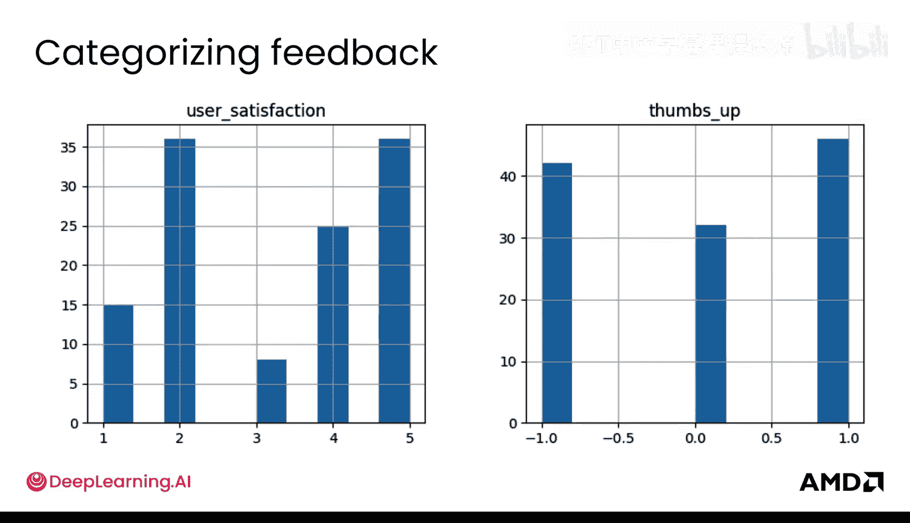

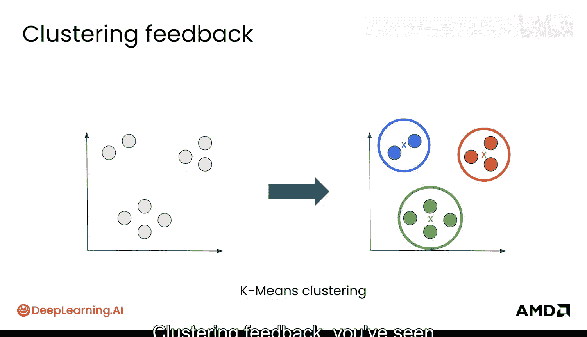

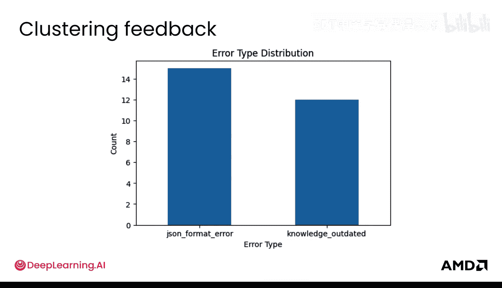

**聚类反馈**：你之前见过K均值聚类，这里同样可以应用。你可能会了解到错误分布或错误类型的分布情况，例如在你的实验室中看到的JSON格式错误与过时知识的对比。你会花大量时间在日志中寻找丰富的示例，这是利用生产模型使其变得更好的绝佳方式。

在这里，你不仅可以识别出真正典型的失败案例，也能发现非常成功的案例。你可以将这些转化为优质的微调配对数据，例如，并使用合成数据管道来扩大覆盖范围。因此，你可能会发现一些非常好的案例（比如因为某个原因而表现优异），然后如果微调数据缺乏这方面的覆盖，你可以进一步扩展它。

举个例子，你可能有一个输入和不同的模型输出，实际上可以从日志中配对出“好”与“坏”的示例。你可以通过挖掘日志中的偏好数据来找到这些例子。这里是另一个例子：正确简洁的回复与冗长回复的对比。

**数据卫生**非常重要。你会有很多日志，其中也会有很多噪音，因此你需要在这里进行相当积极的过滤。具体做法可能包括：删除大量事实错误的日志或不相关的示例，真正专注于那些正确的示例。这正是你用于过滤的合成数据管道可以发挥作用的地方，可以非常有效地进行。

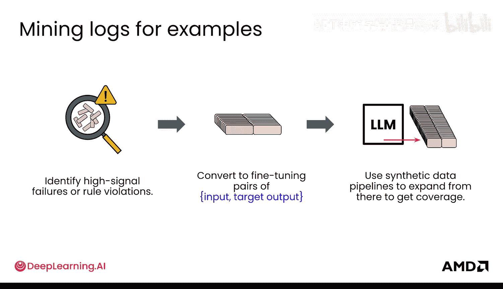

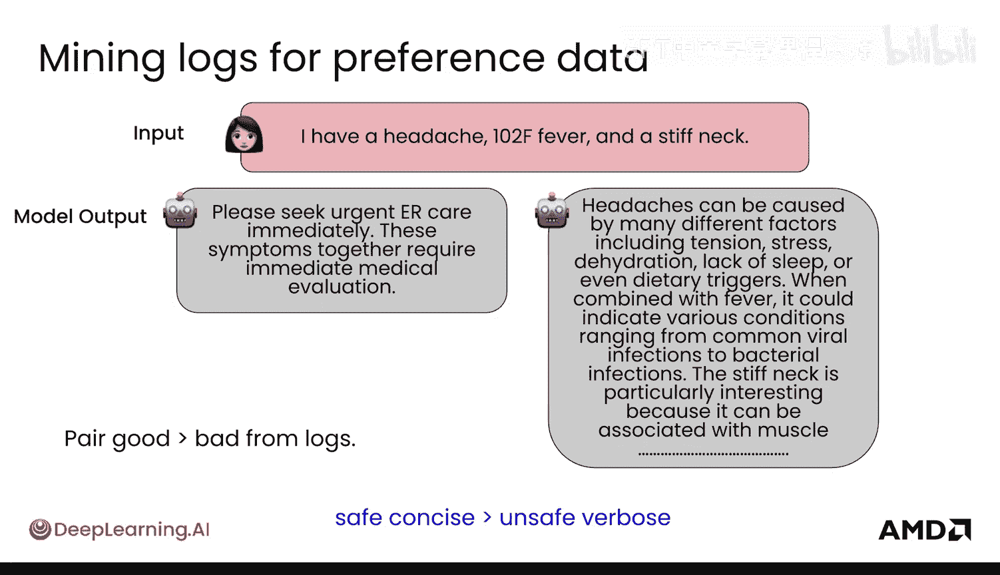

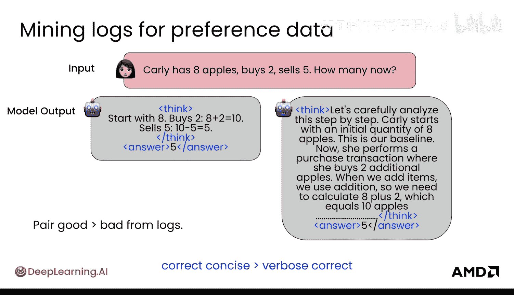

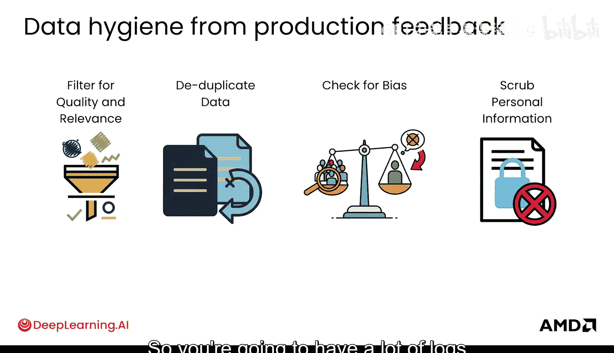

**去重**是其中重要的一环。你不希望大量完全相同的示例占据你的微调数据集，甚至是在强化学习中用于训练模型的不同输入。因此，确保有效去重也很重要，你已经学习了一些相关的策略。

**检查偏见**：这在生产环境中尤其重要。你会从用户反馈中听到偏见是否实际出现，并检查你所关心的不同敏感方面和维度。

最后，生产环境中一个非常重要的事情是，你可能会以某种方式获取敏感信息。确保清除这些个人信息对于你的模型在未来更加可信也至关重要。你肯定不希望你的模型输出人们的社保号码。我认为模型提供商实际上也非常倾向于清除这些个人信息，以便后续用作训练数据。

简单总结一下：你获取用户反馈，查看日志，进行清理，当然，之后就可以将其用于你的数据。

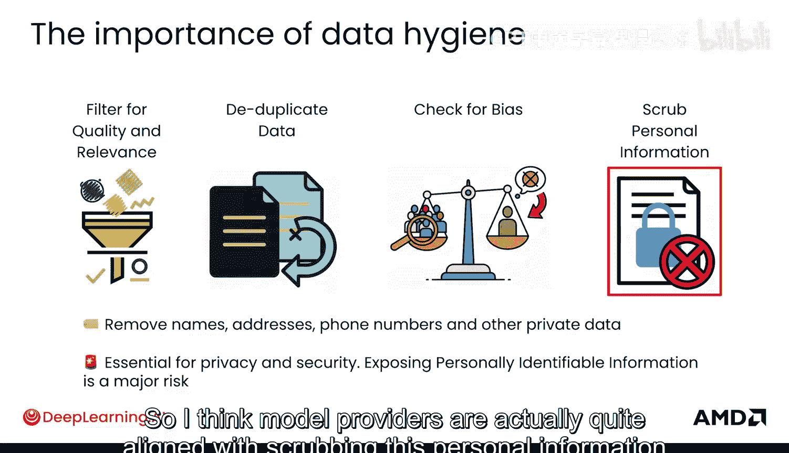

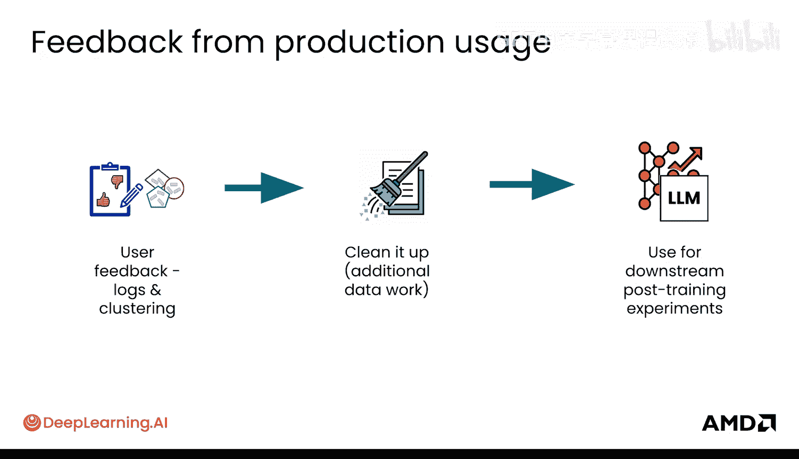

现在，让我们退一步看，针对不同的修复，有不同的干预方式。实际上，我建议，如果你需要进行一个非常重大的快速修复和改变，可以考虑**提示工程**。基本上，就是改变你的提示词、改变用户使用的基本输入模板，以适应模型的行为，并首先这样做。因为这将是一个非常快速的干预，只需改进和更新你的检索增强（RA）索引也是快速改善用户体验（针对过时信息）的一种方式。

而对于涉及微调和强化学习的后训练，大约需要一周时间才能看到一些结果，因为你需要进行许多不同的实验来实际观察改进效果，即使你已经准备好了所有基础设施。

总结一下，这些是你可能会遇到的问题类型以及可能作为首选方案的干预类型：

以下是针对不同问题的首选干预方案：

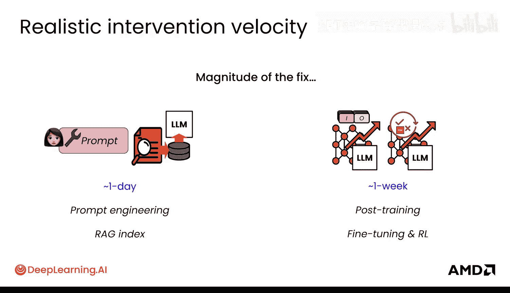

*   **大量未见过的主题**：你可能需要深入研究**微调**，并向模型提供示例以使其理解。
*   **知识过时**：**检索增强（RA）** 是一个非常好的首选方案。
*   **用户偏好发生重大转变**：例如，如果你的模型变得非常“阿谀奉承”（这正是OpenAI的GPT-4o所应对的情况），那么你可以使用**强化学习**来实际调整这种偏好，使模型更加平衡。
*   **小的不一致性问题/小问题**：我总是建议从**提示工程**开始，看看是否能充分引导模型。
*   **重大的技能问题/能力差距**：这正是你同时应用**微调**和**强化学习**的地方。

---

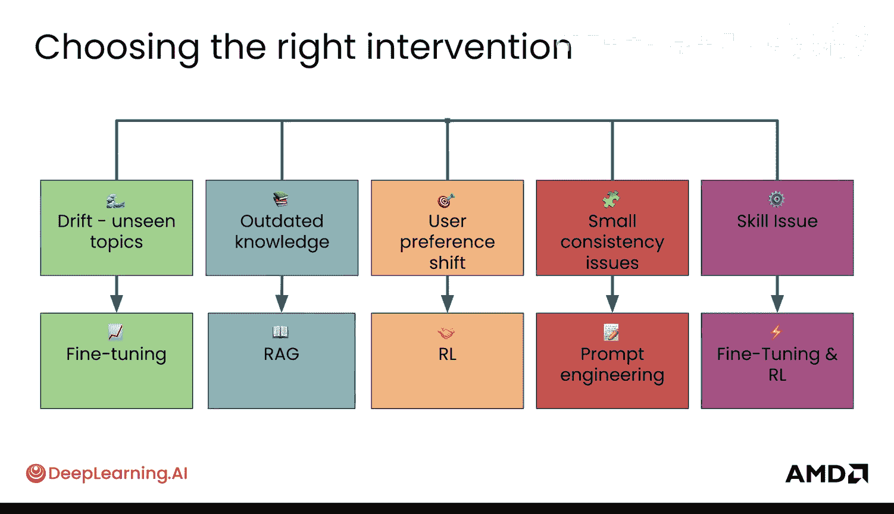

本节课中，我们一起学习了如何构建“数据反馈飞轮”。我们了解了如何从生产环境收集用户反馈和日志，通过聚类、过滤、去重和清洗将其转化为高质量数据，并针对不同类型的问题（如未知主题、知识过时、偏好转变等），选择合适的干预策略（如提示工程、检索增强、微调或强化学习）来持续改进模型。