# 040：监控与可观测性 📊

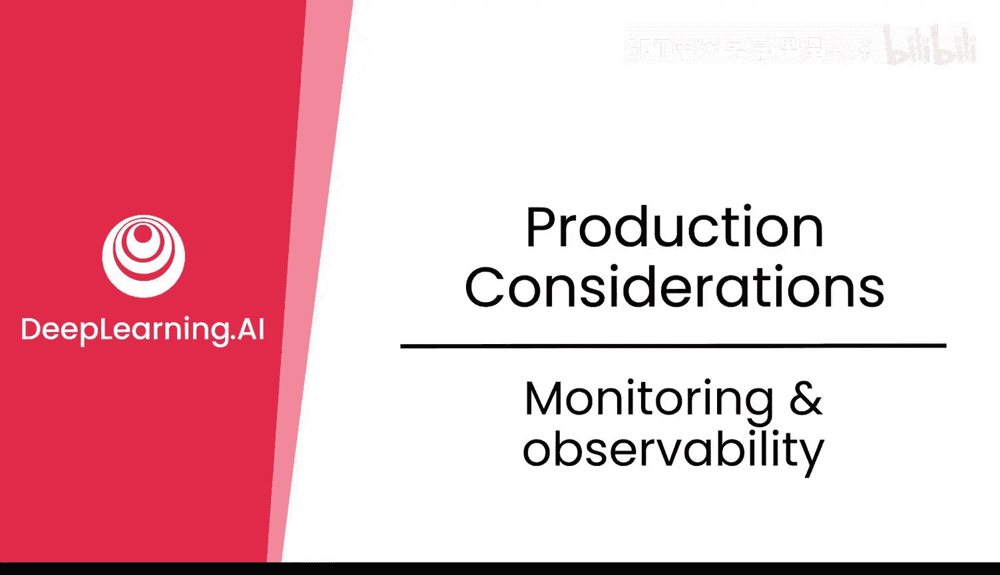

在本节课中，我们将要学习监控与可观测性对于生产环境中的后训练模型的重要性。我们将探讨需要监控的关键指标、生产周期的各个阶段，以及确保模型稳定可靠所需的实践方法。

对于任何生产系统而言，监控与可观测性都至关重要。让我们来看看这对你的后训练模型有何影响。

## 生产环境中的监控要点

在生产环境中，你需要监控一系列事项。以下是需要关注的核心方面：

*   **性能**：模型的响应速度和处理能力。
*   **成本**：运行模型所产生的费用。
*   **可靠性**：模型的稳定性和可用性。

在可靠性方面，你可能还需要监控模型的许多行为变化，因为这些变化将影响后续的模型后训练。围绕成本，例如你选择的**LoRA**大小或基础模型大小，同样会影响后训练。

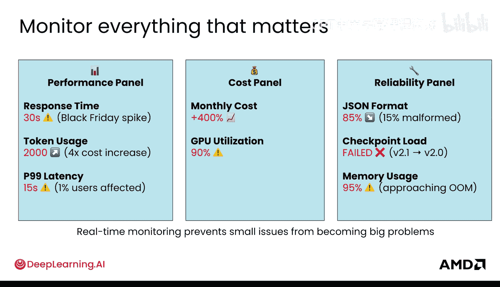

在你的代码中，监控模型表现和用户与模型交互的各个方面，可能看起来是这样的。创建图表是快速了解当前状况的好方法。

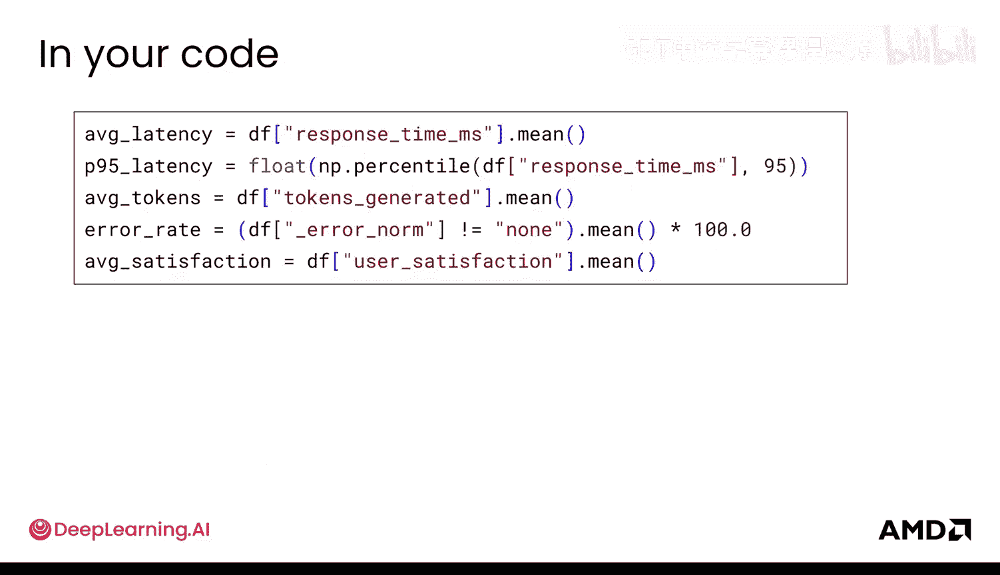

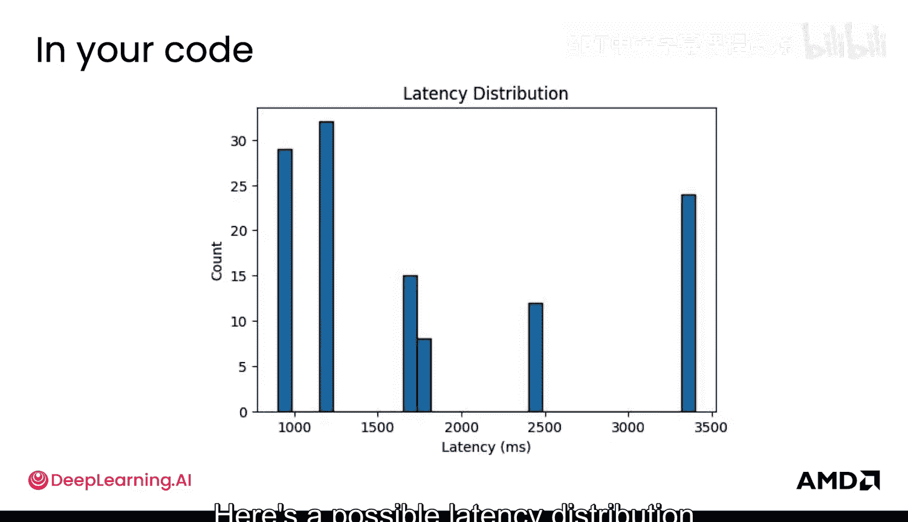

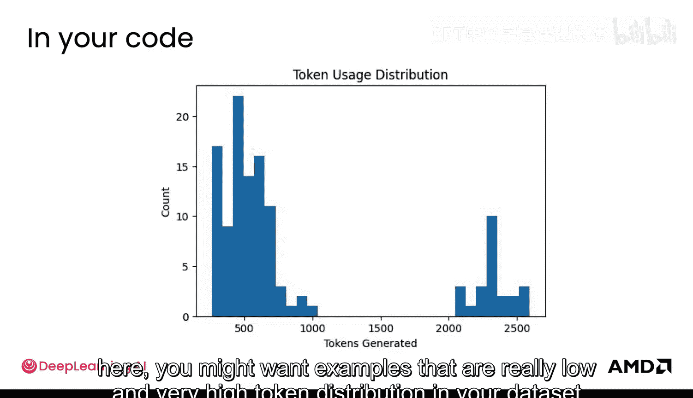

以下是一个你可能在实验室中看到的潜在延迟分布图。

同样，理解令牌使用分布也很重要，目的是了解用户究竟如何使用这个模型，以及如何利用这些信息来创建正确类型的示例。

例如，在这里你可能需要包含令牌使用量极低和极高的示例，以构建能够代表用户使用情况的数据集。

## 生产周期与版本控制

接下来，我们再次审视生产周期。这里我将其从仅针对RLHF推广到一般的后训练。

在你的实验阶段，你在测试集和测试环境中进行评估，然后进入预发布和生产环境。生产指标监控发生在生产环境中。当然，你也可以在预发布阶段监控部分指标。

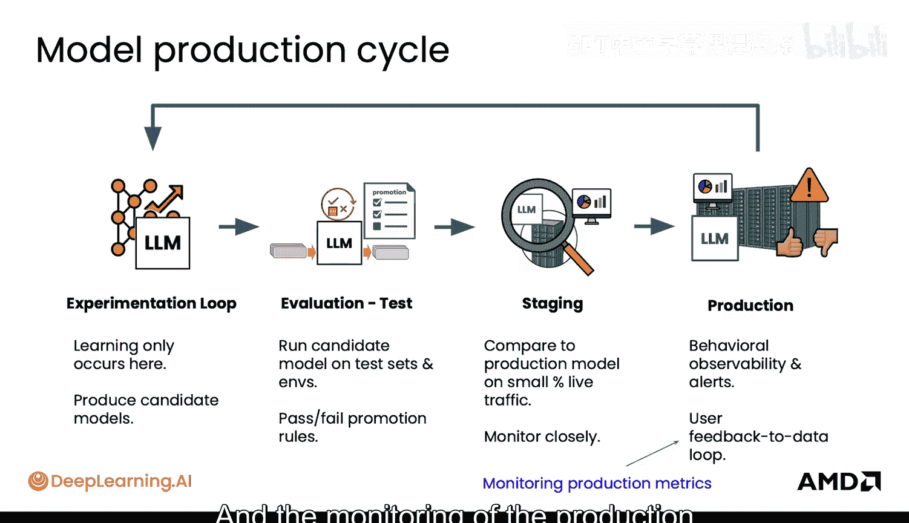

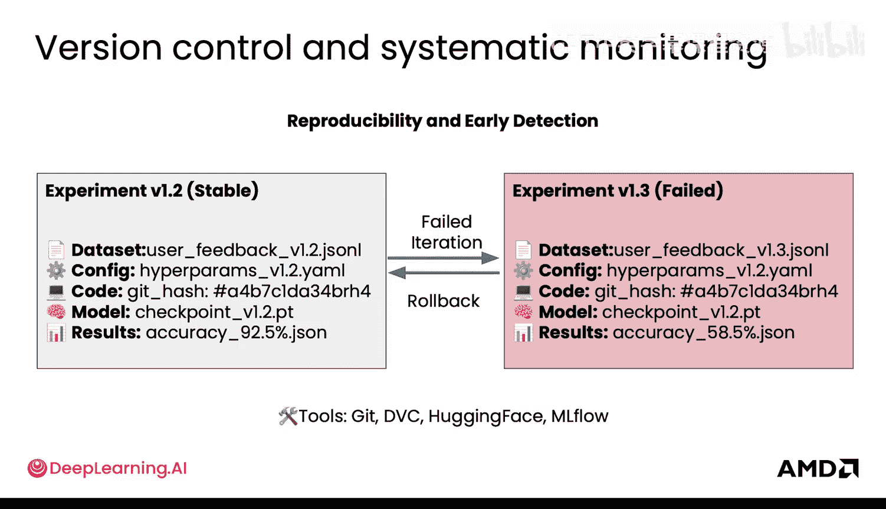

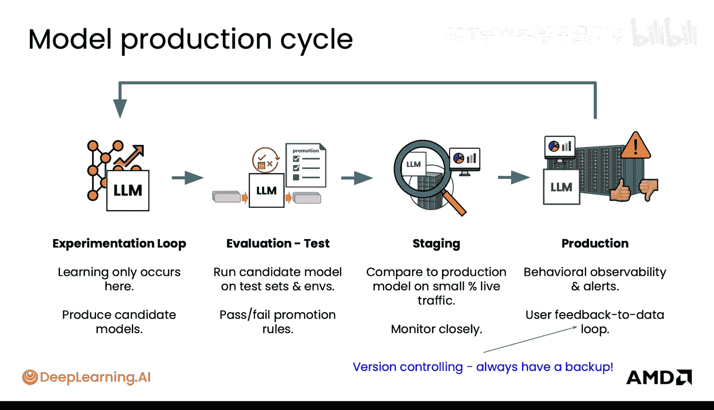

为了使系统真正可靠，最重要的事情之一是版本控制。因为当你在监控中发现问题时，你希望能够回滚到之前的版本。为了实现这一点，你必须确保许多不同的事物是稳定且冻结的，并且你能够像常规软件一样进行可靠的回滚。这在生产环境中同样适用。

## 需要监控的关键变化

然而，版本控制只是一个基础。你还需要监控其他几个不同方面的事物。

*   **数据/输入数据的变化**：数据始终在变化。用户使用模型的方式总会不同，他们可能使用不同的术语，或者拥有与你的模型应该了解的相关的新概念。也许法律以某种方式发生了变化，模型需要适应这些变化，世界已不再相同。一个例子是，疫情过后，关于远程工作的查询激增，你需要能够处理这种情况，模型也需要以某种方式应对。

*   **奖励崩溃**：这是指你的强化学习模型开始追求指标，而不是优化实际的用户满意度。这也可能发生，并且是你需要密切监控的事情。在通用人工智能中，一个非常常见的例子是：点击诱饵带来的高点击率会导致用户满意度低下，但模型会努力优化以获得那个高点击率。

*   **数据质量、基础设施问题和模型遗忘**：随着时间的推移，这些问题会导致模型性能下降，并且在大规模投入生产之前可能很难察觉。最近已有研究围绕可能导致模型表现低于其实际能力的不同问题展开。因此，将基础设施部署到位也同样重要。

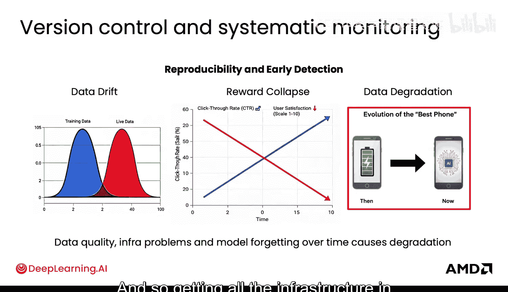

## 模型评估与测试方法

当你拥有多个模型时，能够对它们进行相互测试也很有帮助。

*   **A/B测试**：A/B测试允许你通过将实时用户分组来非常直观地了解哪个模型对于哪种不同类型的用户实际表现更好。这种A/B测试可能在这里针对不同的生产模型进行。

*   **并排比较**：你可能在ChatGPT或其他使用过的AI模型中见过这个功能。本质上，你可以看到一个响应与另一个响应的比较，并且可以让人类评估者（实际上可以是你的大规模用户）选择其中一个。这可以帮助你进行质量检查。你可能也在一些电子邮件应用中见过，它们会为可能的回复提供建议，并且提供多个建议选项，这也是让用户进行并排比较的一种非常自然的方式。这可能发生在预发布阶段，显然也可能发生在生产阶段，目的是将数据收集回实验循环。

## 安全部署与内部测试

最后，在安全部署这些模型时，为有限用户群体设置内部测试场会非常有帮助。

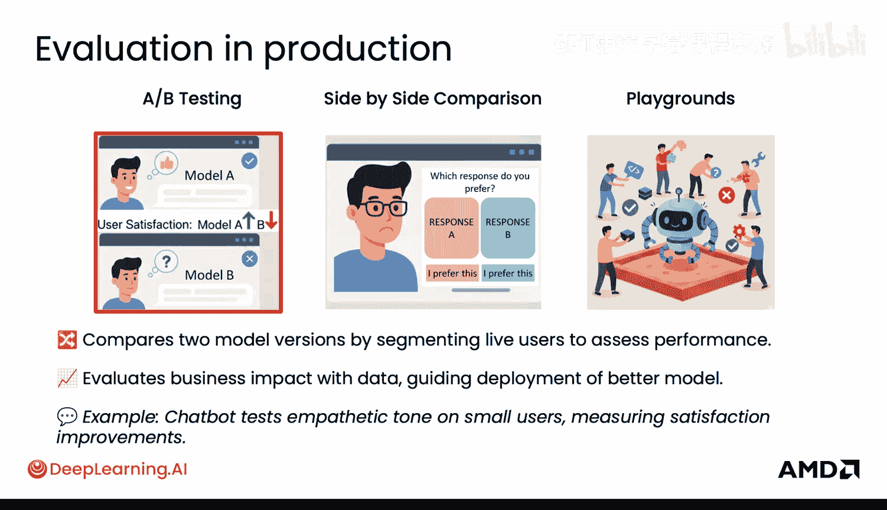

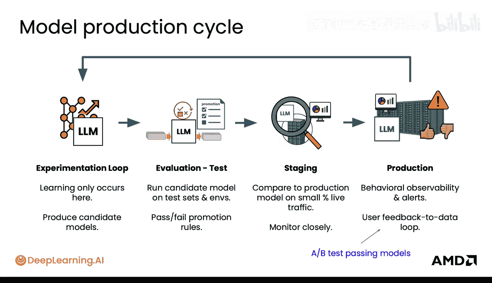

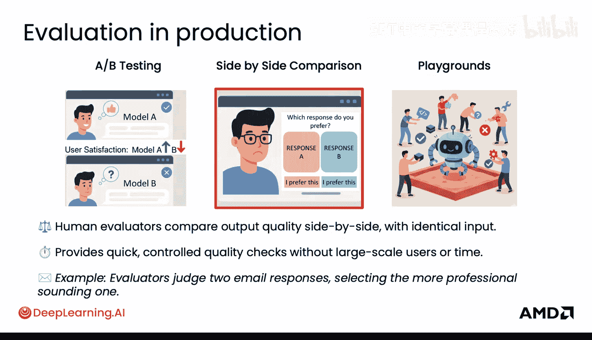
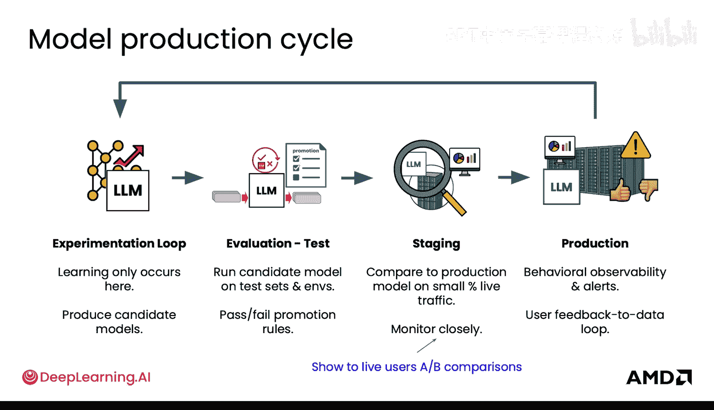

这些只是你可以让人们尝试突破这些模型、识别边界情况和故障的领域。这通常在预发布阶段完成。因此，你可以拥有内部测试场，然后也可以拥有一些外部测试场，用于进行实时的金丝雀流量测试。

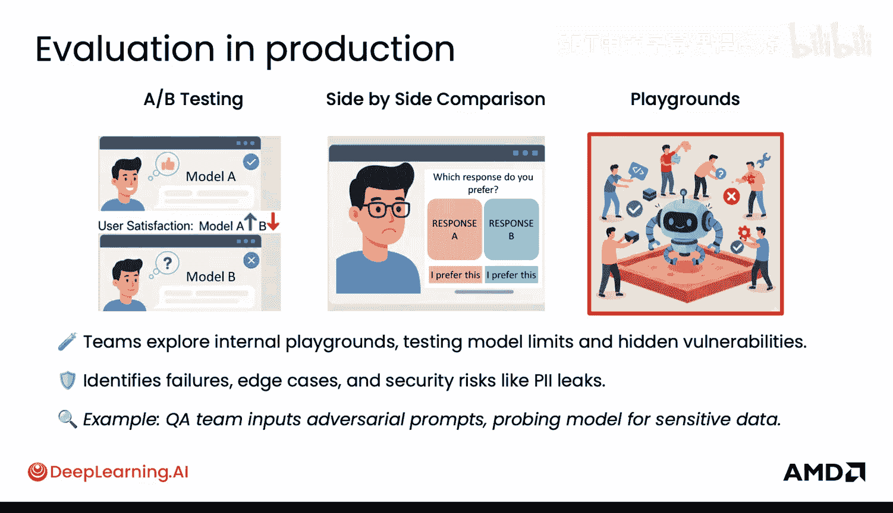
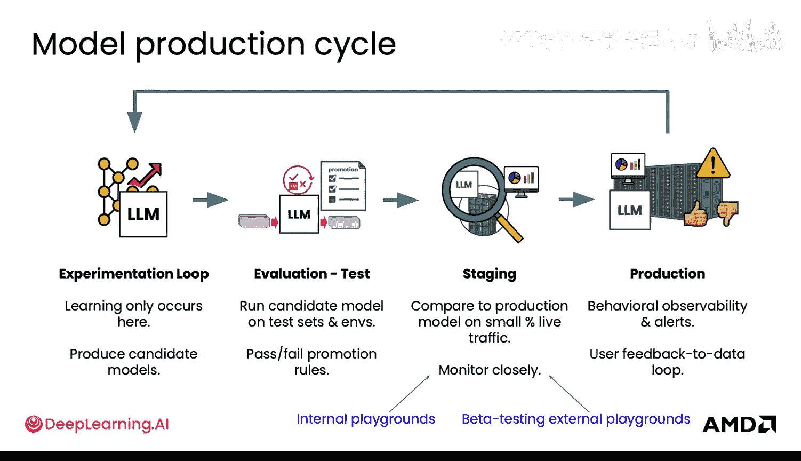

现在你已经了解了模型生产生命周期，接下来让我们看看实现所有这些神奇功能的底层基础设施。

本节课中我们一起学习了后训练模型在生产环境中监控与可观测性的重要性。我们明确了需要监控的性能、成本和可靠性三大核心指标，并深入探讨了生产周期、版本控制的关键作用，以及如何通过A/B测试、并排比较和内部测试场等方法来评估模型、应对数据变化和奖励崩溃等挑战，从而确保模型的持续稳定和优化。