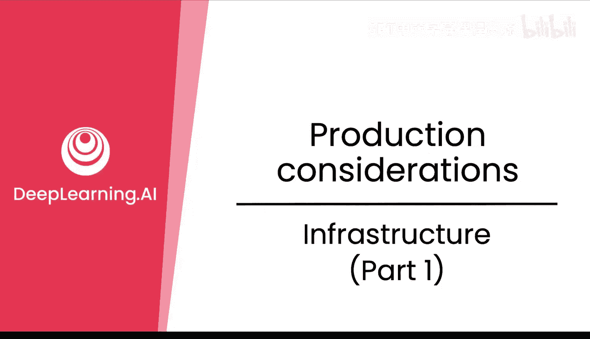
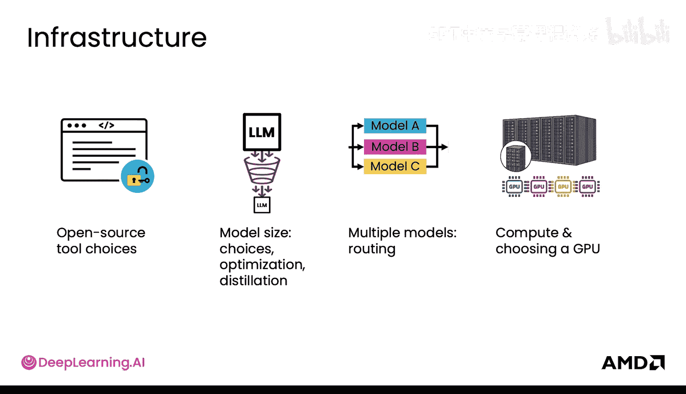
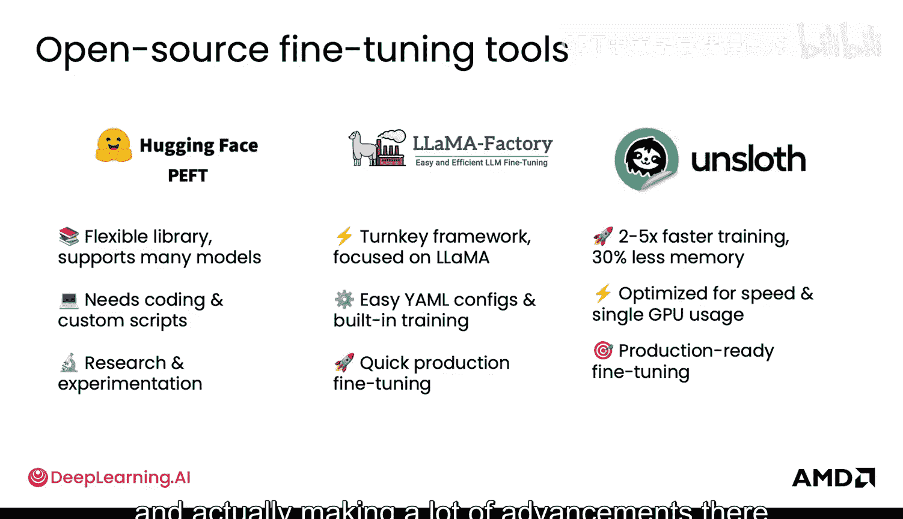
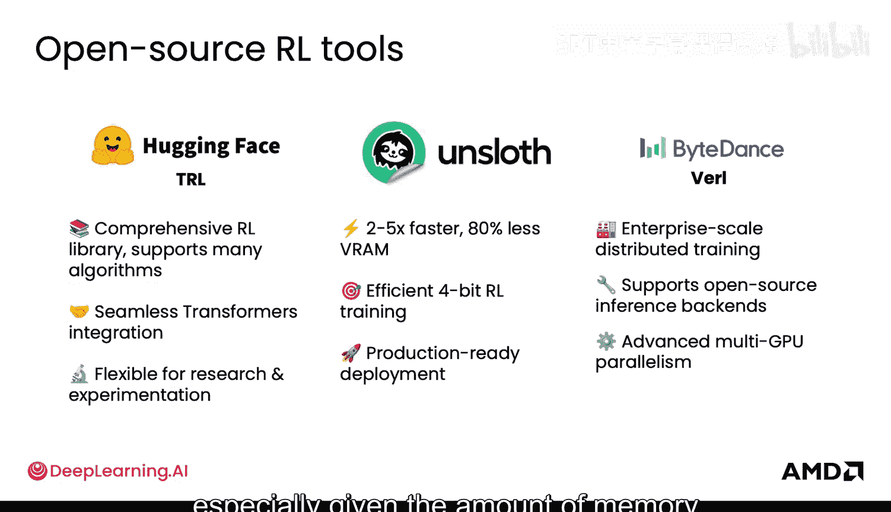
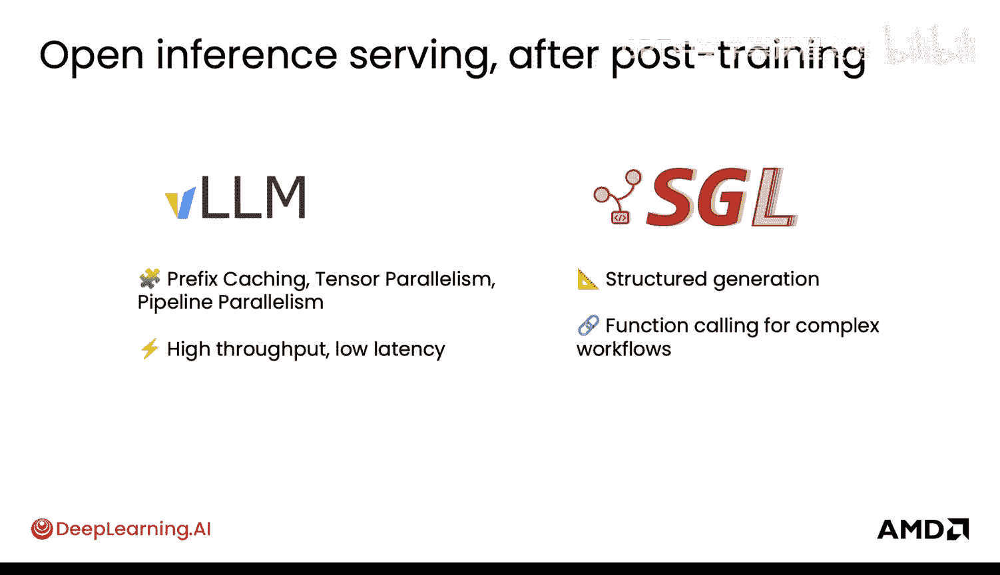
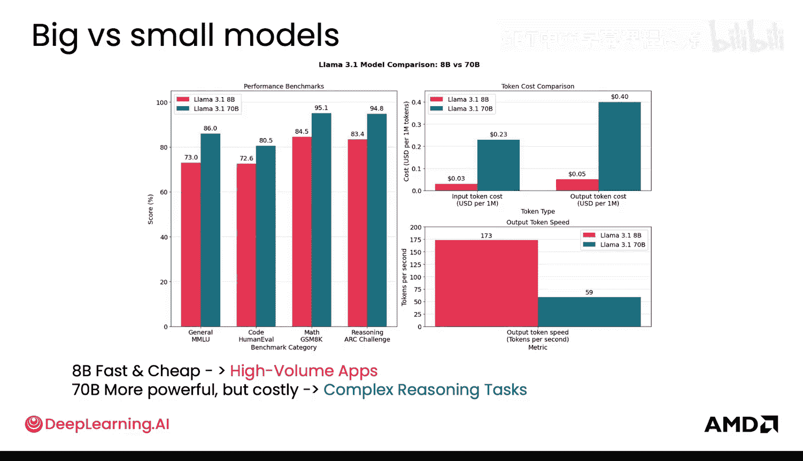
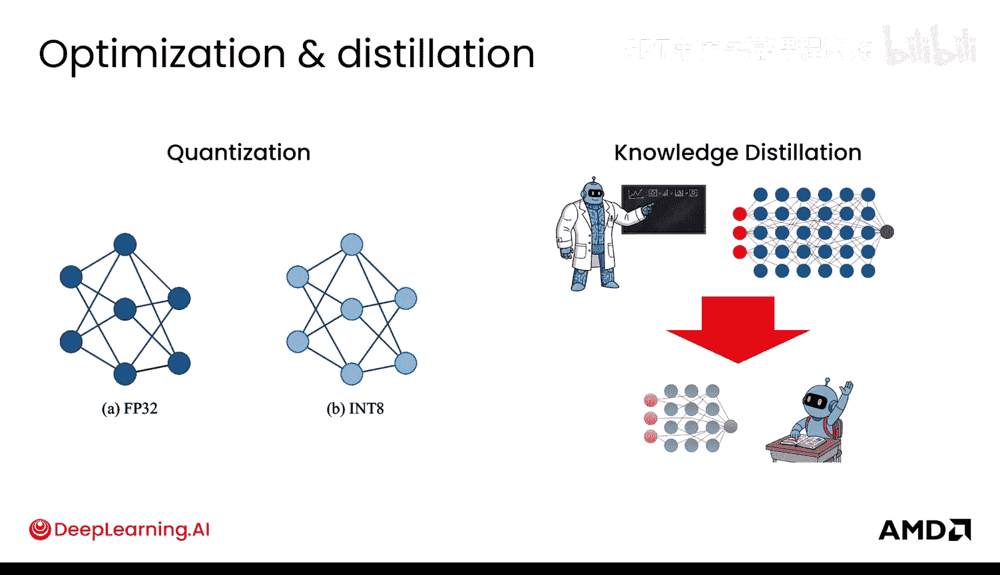
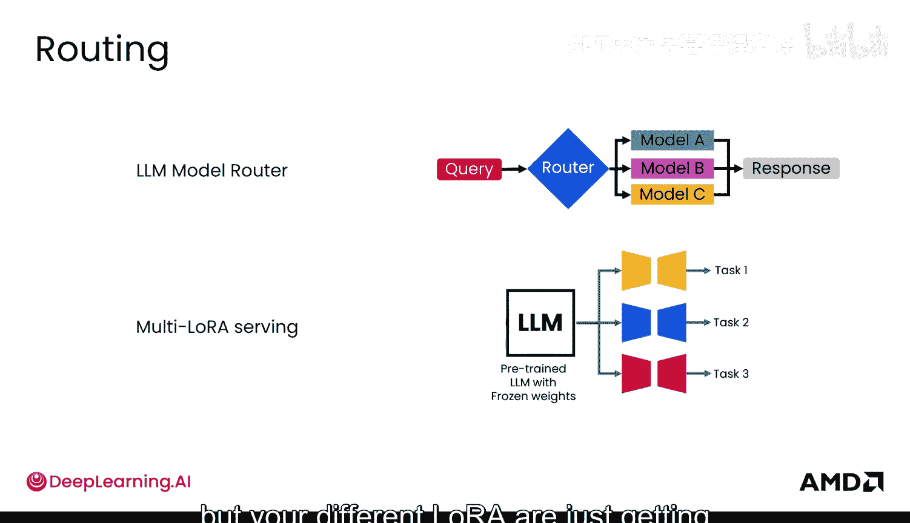
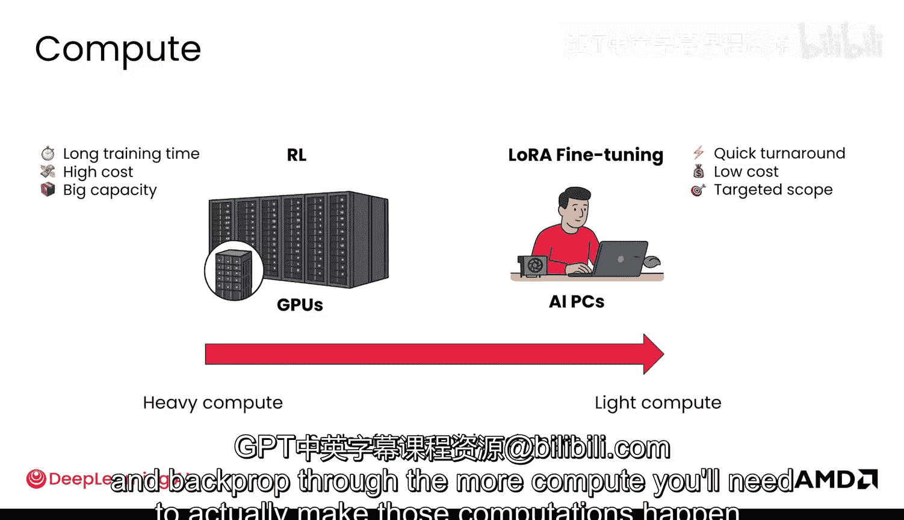

# 041：基础设施（第一部分）🏗️

在本节课中，我们将要学习构建大型语言模型后训练流程所需的基础设施。基础设施涉及从工具选择到GPU计算的一系列决策，是项目成功的关键。

## 开源微调工具 🛠️

上一节我们介绍了基础设施的整体概念，本节中我们来看看具体的工具选择。选择合适的工具可以极大地提升开发效率。

以下是几个重要的开源微调工具：

*   **Hugging Face**：您已经在实验中使用过它。它非常灵活，从用户界面角度看易于使用，是许多人的入门首选。
*   **Lama Factory**：对于生产环境的微调而言，它可能是更好的选择。它更“交钥匙”，并且集成了许多推理服务框架，使其在开源领域易于使用和推广。
*   **Unsloth**：该工具专注于优化微调速度，在GPU上实现快速微调方面取得了许多进展。

## 强化学习工具与推理服务框架 ⚙️

在了解了微调工具后，我们来看看用于强化学习的工具以及模型训练完成后的服务框架。

**强化学习工具**方面，您会再次看到Hugging Face和Unsloth。此外还有其他工具，例如字节跳动的**Verl**，它支持更大规模的企业级分布式训练。考虑到强化学习所需的内存和GPU数量，这种能力通常是必要的。

完成一些后训练后，您需要部署模型。**推理服务框架**是用于此目的的工具。目前两个非常流行的框架是**vLLM**和**SGLang**。虽然图中展示了差异，但它们在功能上确实不相上下。建议您都尝试一下，看看哪个对您来说更易用。

## 模型大小考量与优化技术 📏

模型的大小是一个重要的考量因素，因为它直接影响下游的计算决策。因此，我们需要了解如何根据模型大小进行选择和优化。

我始终建议从较小的模型开始，以观察其在各项指标上的性能表现。当需要扩展时，再转向更大的模型。较小的模型还能带来更快、更便宜的优势，因此对于高流量的场景，从小模型开始可能更合适。

有几种方法可以让大模型适应更小的空间：

*   **量化**：您可以降低表示模型权重的精度。例如，从32位或16位精度降低到8位甚至4位精度。这可以将内存占用减少2到8倍，从而节省大量成本，使您能在更便宜的硬件上运行相同模型，或在相同GPU上运行更大模型。当然，您需要根据实际情况评估其代价，即不同指标上的精度可能会有小幅下降，并且必须进行实证测试，因为量化有时会显著降低模型性能。
*   **知识蒸馏**：这种方法利用一个更大的“教师”模型，将其预测结果作为监督信号，来训练一个更小的“学生”模型。学生模型从教师模型的知识和输出的各种概率中学习，从而获得与教师模型相似的能力。当然，性能表现通常也会有所不同，因此请根据您的用例进行实证检验。

## 多模型路由与计算资源 💻

如果您有多个模型，那么设置某种**路由机制**会非常有帮助。您可以将单个用户的查询路由到不同类型的模型以获取响应，甚至可以从所有模型中聚合结果。如果您使用LoRA，这将是路由不同LoRA适配器的好机会。您可以拥有相同的预训练LLM基础模型，但根据不同的任务将查询路由到不同的LoRA适配器。

最后，您需要考虑**计算资源**。计算是训练成本的主要组成部分。强化学习对计算资源的需求非常重，耗时更长，成本也更高，因此您需要更多的计算资源来实现并行处理并加快进度。相比之下，LoRA微调对计算资源的需求较轻，成本较低，甚至可能在一台AI PC上本地完成。模型改变的规模也很重要：您在模型中改变得越多，模型需要看到、表示和通过其参数处理的数据越多，反向传播的计算量就越大，您也就需要更多的计算资源来完成这些计算。

## 总结 📝

本节课中我们一起学习了构建LLM后训练流程的基础设施关键部分。我们探讨了开源微调工具（如Hugging Face、Lama Factory、Unsloth）、强化学习工具、推理服务框架（如vLLM和SGLang），以及模型大小的影响。我们还介绍了通过**量化**和**知识蒸馏**来优化模型大小的技术，讨论了多模型环境下的路由策略，并分析了不同训练方法（如强化学习与LoRA微调）对计算资源的需求差异。理解这些基础设施组件是高效、经济地实施后训练项目的基础。