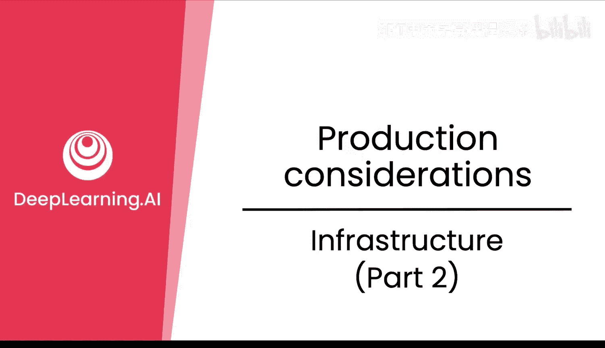
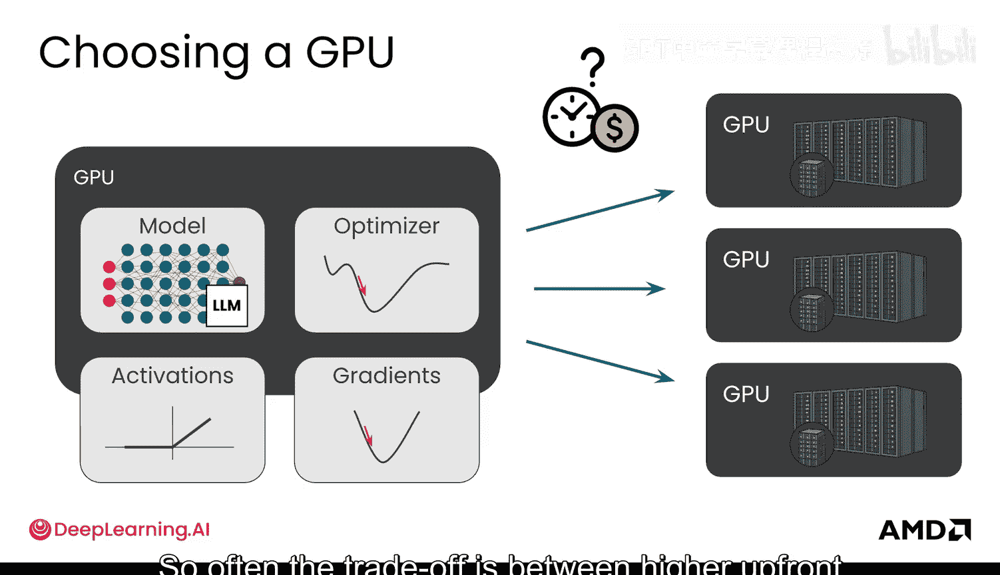
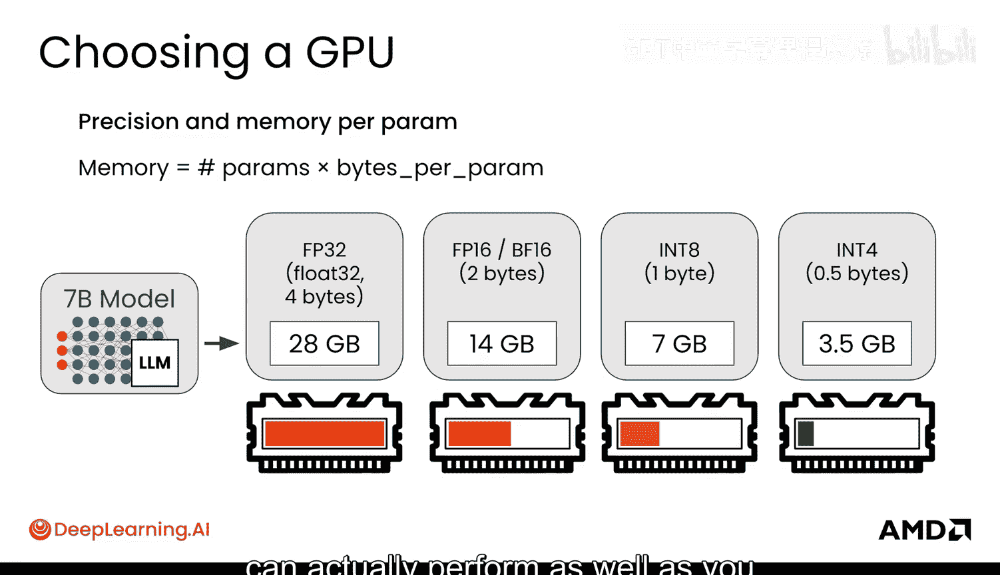
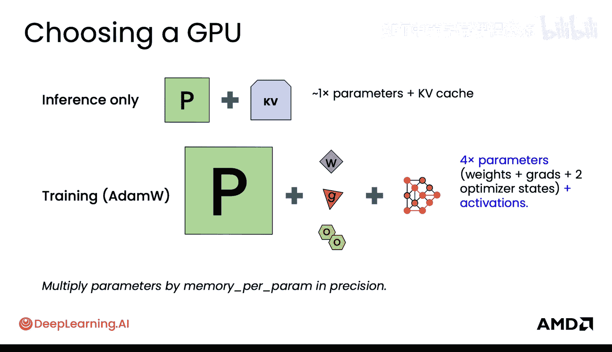
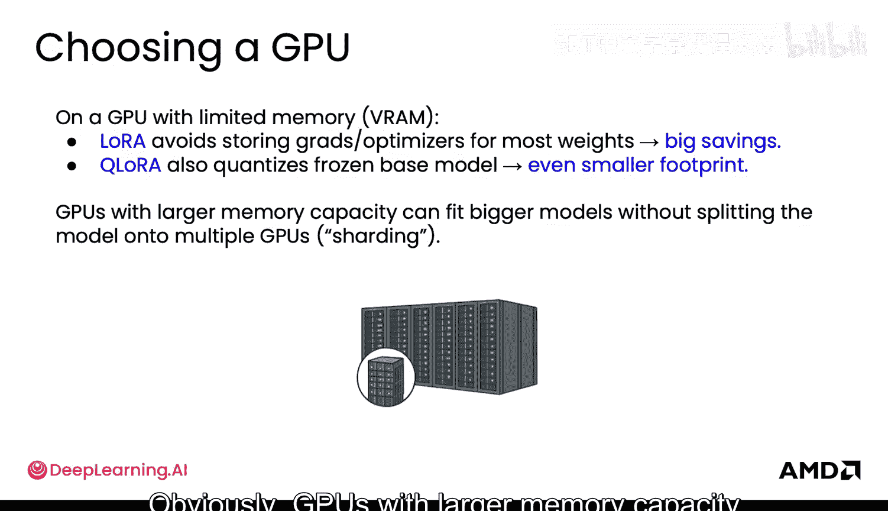
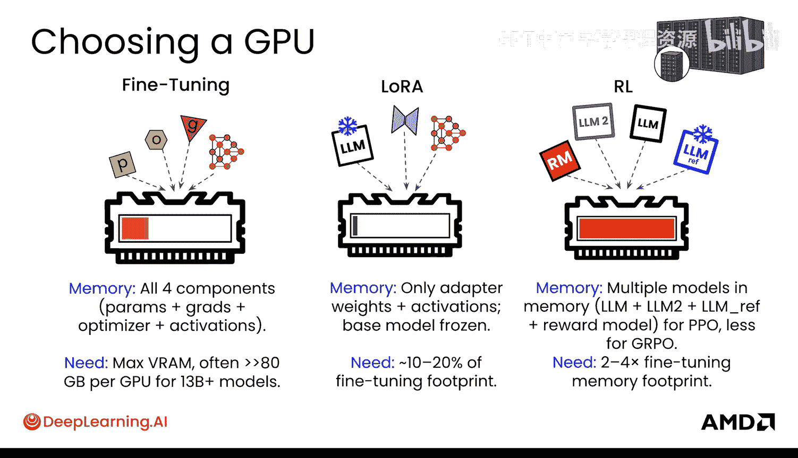
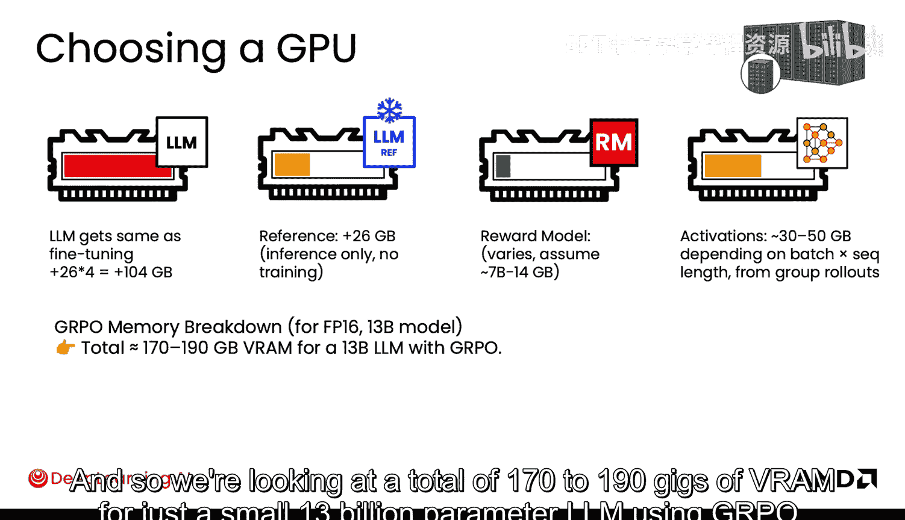
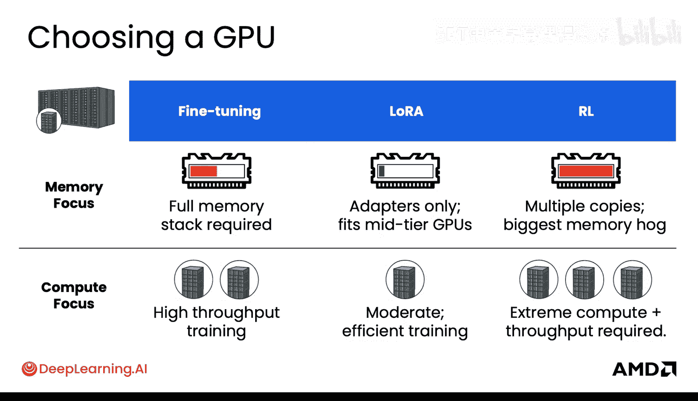
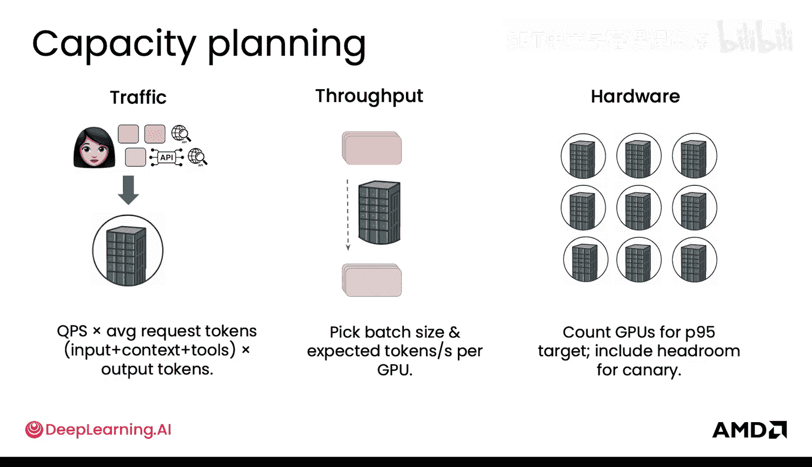
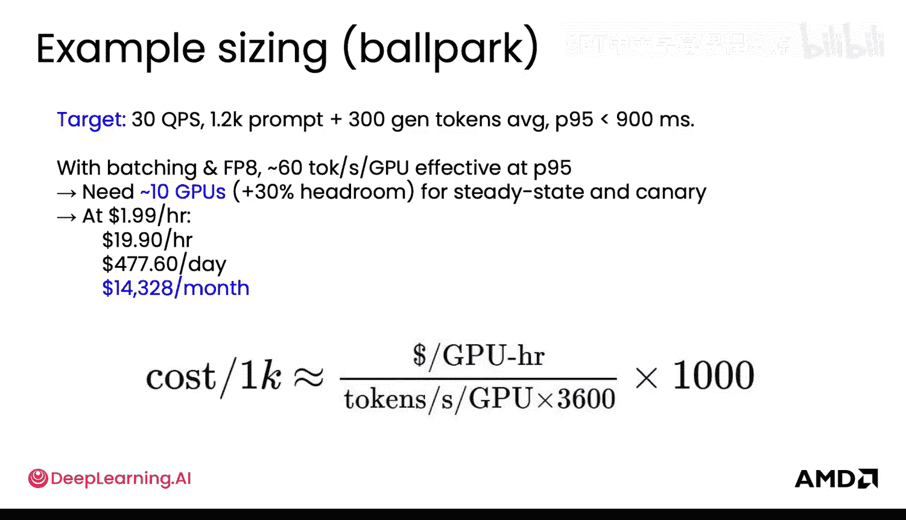

# 042：7.基础设施-(第二部分)

## 概述
在本节课中，我们将深入探讨为大型语言模型（LLM）选择合适基础设施的关键因素。我们将重点关注GPU内存需求、不同训练方法（全参数微调、LoRA、强化学习）的计算开销，以及如何为推理服务进行容量规划。

## GPU选择与内存考量
选择GPU时，内存容量至关重要。模型参数、优化器状态、激活值和梯度都必须能同时放入GPU内存中，才能成功进行模型训练和反向传播。如果内存不足，则需要使用多个GPU。如果模型本身非常大，则需要将模型拆分到多个不同的GPU上，这被称为**模型分片**。这显然会增加GPU间通信的复杂性和开销，同时也会影响训练时间和成本。

训练时长对成本估算有重要影响。在进行错误分析时，你需要运行大量不同的实验。能够并行运行的实验越多，你就能越快找到使模型达到预期性能的最佳方案。因此，使用计算资源来扩展并行实验的数量是另一种方法，但这当然也会带来成本，即使它缩短了时间。

通常，需要在**使用更多GPU并行化带来的较高前期成本**与**在较便宜的GPU上运行更长时间**之间进行权衡。

## 模型精度与内存占用
接下来，我们详细了解一下内存占用和模型精度。下图展示了一个70亿参数模型在不同精度（32位、16位、8位、4位）下所需的内存大小。

可以看到，通过降低精度，模型可以存储在更小的内存中。例如，4位精度的70亿参数模型仅需约3.5GB内存。通常，我建议在模型完全训练好并仅进行推理时考虑量化，而不是在训练过程中。因为在训练时，你希望模型能充分表示其参数。

在仅推理的场景下，你主要存储的是模型参数本身。此外，还有一种称为**KV缓存**的技术，它通过缓存注意力机制中的键（Key）和值（Value）来优化推理效率，这也会占用一些额外的内存，具体取决于提示词的长度。

## 训练过程中的内存需求
在训练过程中，需要存储的参数数量要多得多。这不仅包括模型权重，还包括梯度、优化器状态（如AdamW优化器）以及激活值。

理解训练（包括微调和强化学习训练）所需的内存规模要大得多，这一点非常重要。上图展示的仅仅是训练一个模型的情况。在强化学习中，通常会有多个模型同时参与，内存需求会更高。

## 不同微调方法的内存开销
在GPU内存或显存有限的情况下，你可以考虑使用不同的微调方法。例如，LoRA可以避免存储大部分权重（即基础模型）的梯度和优化器状态，从而节省大量内存。

以下是不同微调方法的内存开销对比：
*   **全参数微调**：需要存储模型权重、梯度、优化器状态和激活值。内存开销最大。
*   **LoRA**：基础模型被冻结，仅需存储适配器权重和激活值。通常只需全参数微调内存占用的10%到20%，甚至更少。
*   **强化学习**：计算密集且内存消耗巨大。需要同时在内存中加载多个模型（例如，在PPO中需要策略模型、参考模型和奖励模型）。GRPO虽然省去了基线估计模型，但其内存占用通常仍是微调的2到4倍。

以GRPO训练一个130亿参数的LLM为例，即使使用16位精度，总显存需求也可能高达170到190GB。

## 计算需求对比
除了内存，计算需求也是关键考量因素：
*   **全参数微调**：需要高吞吐量的训练来处理所有数据。
*   **LoRA**：由于只更新少量参数，训练效率更高。
*   **强化学习**：计算需求同样极端，通常需要处理大量数据。

## 推理服务的容量规划
训练完成后，你需要为模型推理服务进行容量规划。你需要考虑以下因素来满足生产和测试环境的需求：

1.  **用户流量**：估算每秒查询数（QPS）乘以平均请求的令牌数（包括输入和输出），并考虑模型可能使用的不同工具。
2.  **吞吐量**：确定你的批处理大小，以及每块GPU每秒能处理的预期令牌数。
3.  **GPU数量**：综合以上两点，计算需要多少GPU才能达到你的性能目标。

让我们看一个估算示例：
*   假设目标为30 QPS。
*   平均提示词长度为1.2k令牌，生成300个输出令牌（按生产环境95分位数计算）。
*   要求查询延迟低于900毫秒。
*   使用批处理和8位精度，假设每块GPU每秒能处理60个令牌。

为了达到900毫秒的延迟目标，你可能需要大约10块GPU来处理这样的推理负载，并预留30%的余量给上线前的测试模型。

进行粗略的成本估算：如果每小时每块GPU成本为$199，那么10块GPU每小时成本约为$1990，每天约$47，760，每月约$1，432，800。因此，为了进行正确的规模估算，你需要综合考虑所有这些因素，并预测用户将如何使用你的服务。当然，提前完全预测是困难的，所以确保你考虑使用云服务提供的弹性伸缩选项也非常重要和有帮助。

## 总结
本节课我们一起学习了为LLM训练和推理选择基础设施的核心知识。我们了解了GPU内存是选择硬件的关键，不同精度会极大影响内存占用。我们对比了全参数微调、LoRA和强化学习在内存与计算需求上的显著差异，其中LoRA能大幅节省资源，而强化学习则最为耗资源。最后，我们探讨了如何根据用户流量、吞吐量目标和延迟要求，为推理服务进行容量规划和成本估算。理解这些基础设施考量，是成功部署和优化大型语言模型应用的基础。