大型语言模型的微调与强化学习：后训练入门｜8：生产就绪清单 🧾

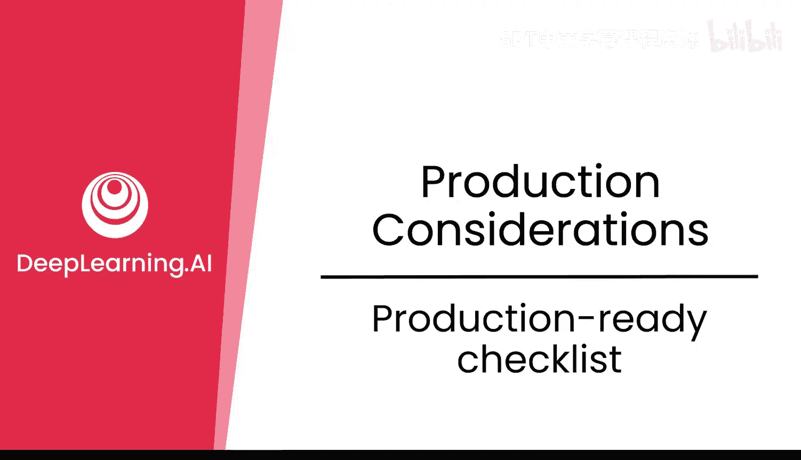

在本节课中，我们将学习如何确保你的模型已为生产环境做好准备。我们将逐一核对一份生产就绪清单，涵盖从模型配置到基础设施的各个方面。

---

### 概述

在将模型部署到生产环境之前，进行系统性的检查至关重要。本节将提供一个清晰的生产就绪清单，帮助你验证模型是否满足发布标准，确保其可靠性、可观测性和可维护性。

---

### 清晰且可复现的模型配置

首先，你需要一个清晰且可复现的模型配置。这意味着你需要一份详细的配置文件，能够确保在任何时候重新运行训练过程，都能得到完全相同的模型和性能指标。

**目标**是：你可以在所有预留的测试集和评估套件上运行该配置，并获得相同的结果（在一定的置信区间容差范围内）。这是信任你所发布模型的基础。

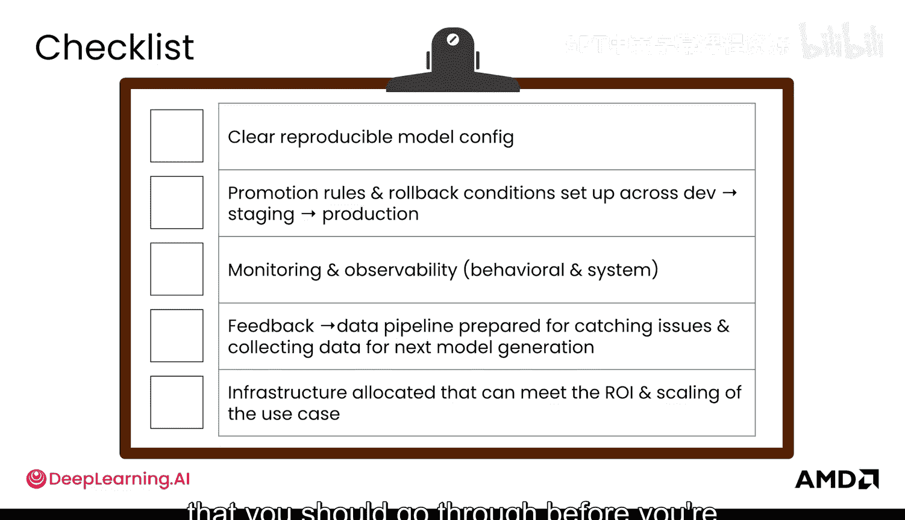

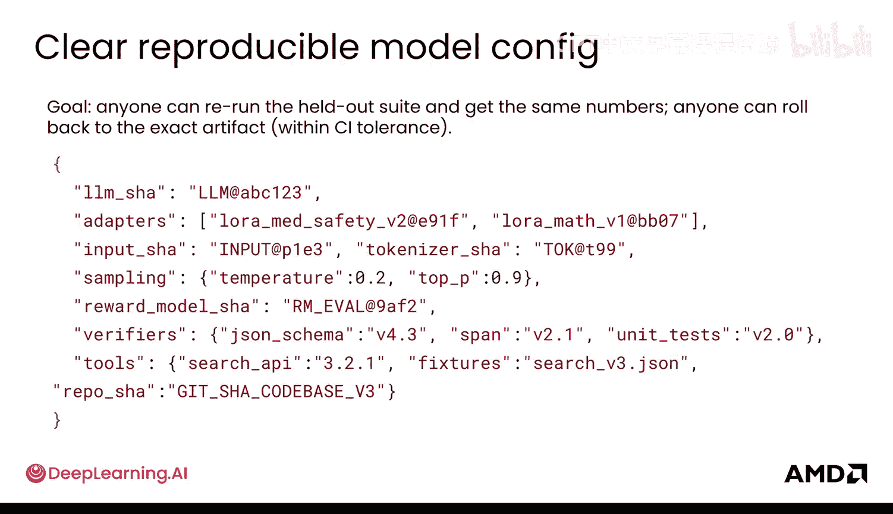

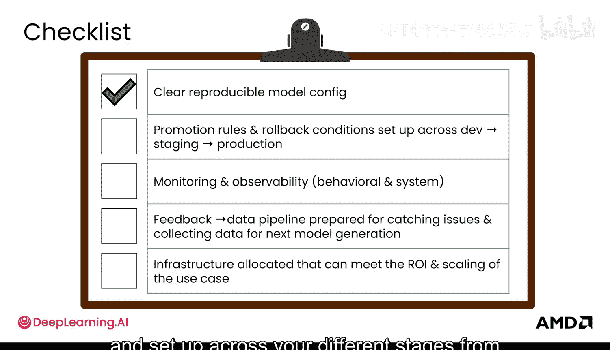

---

### 设定跨阶段的晋升规则与回滚条件

上一节我们介绍了模型配置，本节中我们来看看部署流程的管理。你需要在从开发到预发布，再到生产的各个阶段，明确设定模型的晋升规则和回滚条件。

这与我们在强化学习（RL）中看到的晋升角色类似，对于微调模型也同样适用。你需要将你的核心目标（North Star）转化为具体的“通过/不通过”标准合同。

以下是需要明确的关键点：
*   **晋升规则**：明确界定模型从开发环境进入预发布环境，以及从预发布环境进入生产环境的具体标准。
*   **规则固化**：将这些规则编写成文并进行代码化，这有助于自动化许多流程，例如决定哪个模型可以发布以及如何执行回滚。

---

### 监控与可观测性

我们之前已经探讨过监控，但这里需要再次强调其重要性。你需要为不同的服务等级目标（SLOs）建立监控体系。

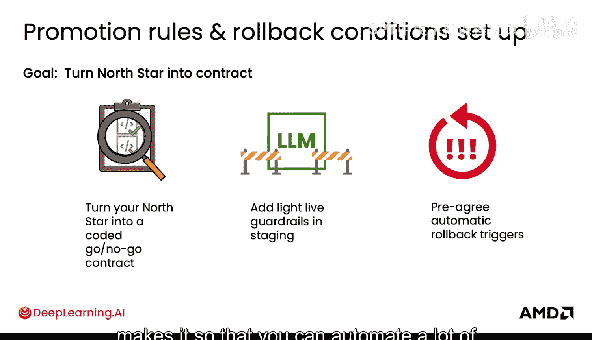

以下是监控的核心内容：
*   **行为指标与系统指标**：理解模型在不同数据切片（对你业务重要的部分）上的行为表现和系统性能。
*   **模型表现评估**：了解模型在真实世界中的表现如何。
*   **行动依据**：基于监控到的行为数据，决定可以采取哪些行动。

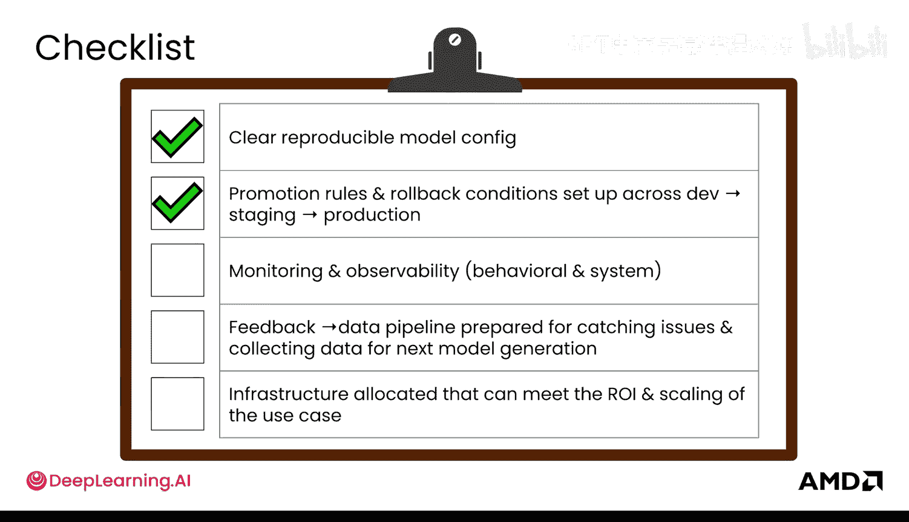

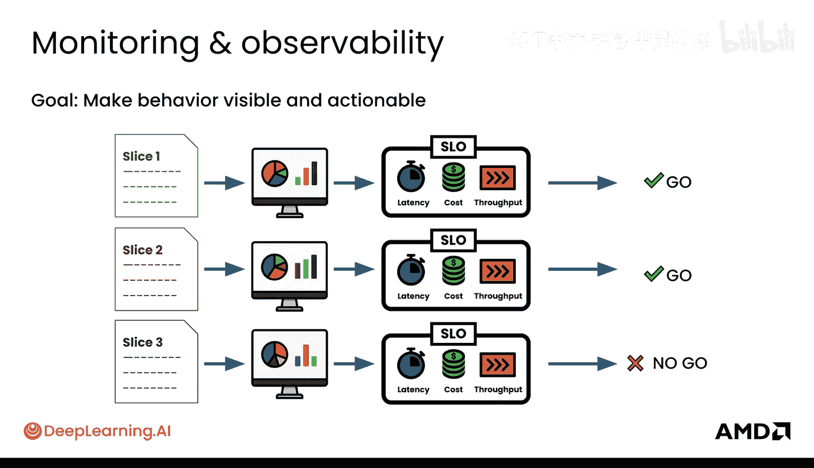

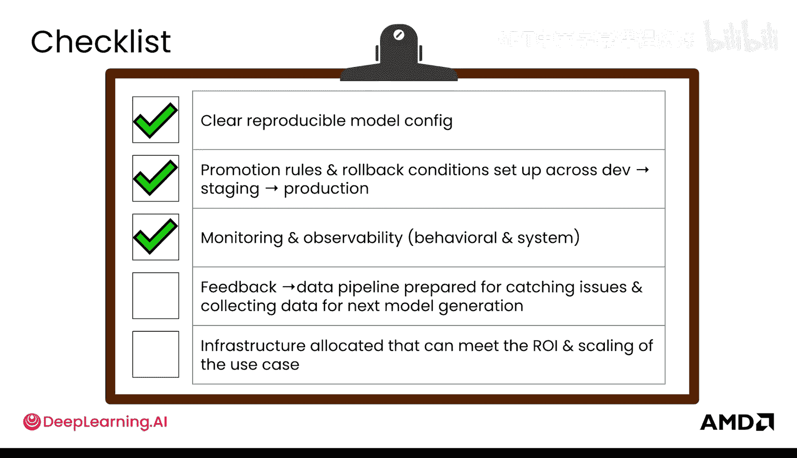

---

### 反馈到数据的管道（飞轮）

接下来是构建从反馈到数据的管道，也就是我们之前讨论过的“飞轮”。其目标是将用户使用模型过程中出现的任何失败案例，甚至成功案例，转化为高质量的信号监督数据，用于下一轮的微调或强化学习训练。

以下是构建此管道的步骤：
1.  **日志分析**：查看并挖掘你的模型日志。
2.  **模式聚类**：对日志进行聚类分析，理解其中的模式。
3.  **数据生成**：利用这些分析结果，通过合成数据管道生成覆盖这些场景的训练数据。
4.  **训练排队**：将这些新数据加入队列，为下一次微调或强化学习实验做准备。

---

### 基础设施规划

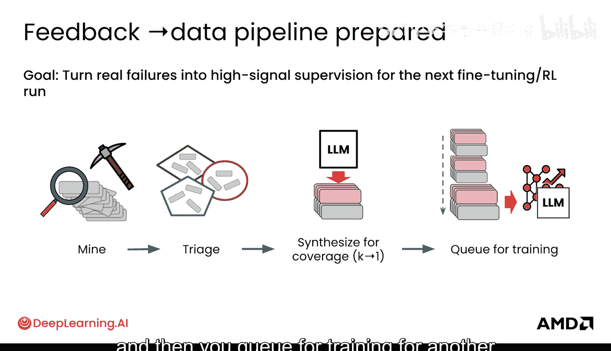

最后，基础设施的规划也极为重要。合理的资源分配不仅能让你顺利运行各种实验，还能确保为用户提供恰当的服务。

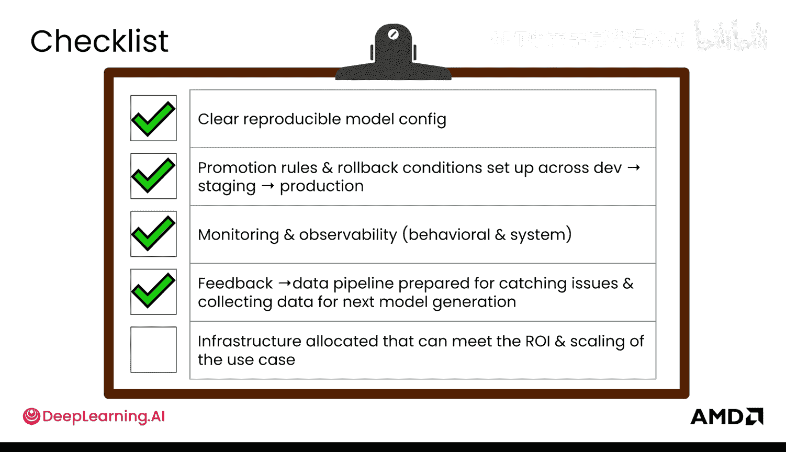

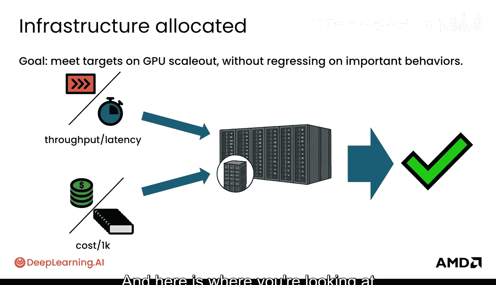

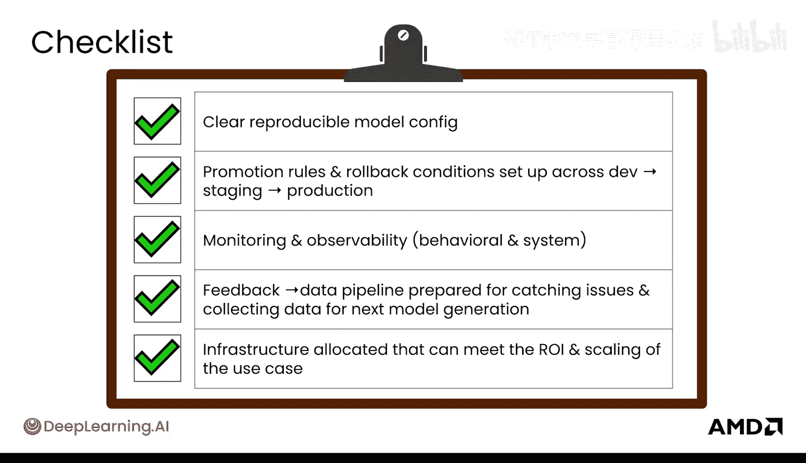

你需要关注以下基础设施目标：
*   **弹性伸缩**：根据需求弹性地扩展GPU资源，以满足性能目标。
*   **性能与成本**：关注**吞吐量**、**延迟**和**成本**这些关键指标，并确保在这些重要行为上不发生倒退。

---

### 总结

恭喜你完成了整个后训练课程的学习！本节课中我们一起学习了生产部署前的完整检查清单。你从理解强化学习和微调的基础直觉开始，深入到其背后的数学原理，学会了以评估为核心指导后训练过程，认识到数据的重要性并做出关键考量，最终来到了生产环节，准备将你的模型推向世界。

现在，你已经掌握了生产就绪清单，是时候将你的模型推出去了。期待看到你构建出精彩的应用！