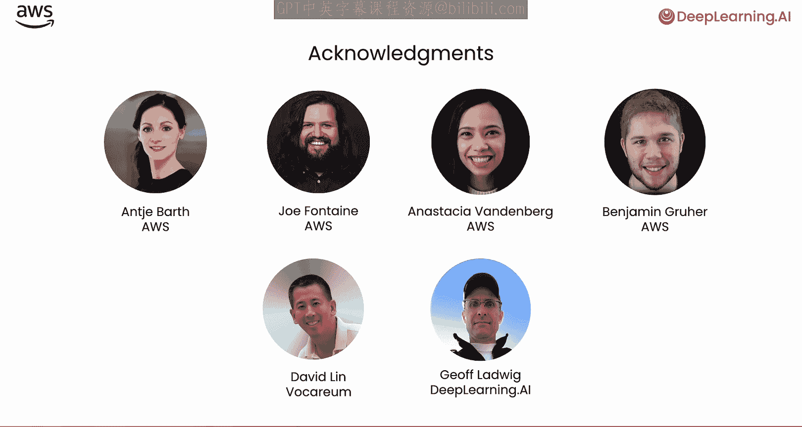

#  001：课程介绍 🚀

在本课程中，我们将学习如何使用无服务器技术，在 Amazon Bedrock 平台上部署一个负责任的人工智能代理应用。我们将涵盖从初始化代理和工具，到代码执行与安全护栏的设置，最终将其部署到无服务器环境的完整流程。

---

随着生成式人工智能的发展，应用程序正变得越来越复杂和精密。过去，您可能通过为大型语言模型添加对话历史来创建聊天机器人。如今，聊天机器人和检索增强生成应用可以复杂得多：您可能希望它从网络或本地源获取信息，甚至让它自行判断信息是否充足，并决定何时继续搜索网络或其他数据库以获取更多信息。

换句话说，这些应用已经变得更加“智能代理化”。当代理可能需要调用大量API时，这些复杂工作流的系统搭建和运行难度也随之增加。例如，现在有些代理可以访问数十个API。为了不必维护大量按分钟付费、随时准备响应API调用的热服务，无服务器架构可以让您达到同样的效果：计算资源仅在需要时才被启用，而您无需担心维护和扩展一堆服务器的问题。

本课程中另一个重要概念是将代理作为一个独立的服务来开发。我们可以从一个预构建的代理开始，然后根据您的应用需求进行配置或定制。这种将代理视为构建模块，而不仅仅是把大型语言模型视为构建模块的视角转变，是一个重要的思维转换。

---

在本课程中，您将为您销售茶杯的业务构建一个客户支持代理。以下是课程的大致进展：

首先，您将从 Amazon Bedrock 开始，创建您的第一个无服务器代理。您将学习如何调用它并检查其运行轨迹，从而了解代理的思考过程。

接下来，您将把您的代理连接到外部服务。它将实时获取客户详细信息并记录支持工单，展示其如何与CRM系统等业务工具交互。

然后，您将为您的代理配备一个代码解释器，使其能够实际执行计算。这将为数据驱动的决策开辟可能性。

之后，我们将实施安全护栏，以防止您的代理泄露敏感信息或使用不当语言。

接着，您将实现一个全托管的检索增强生成解决方案，将您的代理连接到支持文档。这将帮助代理独立解决问题，并知道何时需要升级处理。

最后，我们将简要浏览 AWS 控制台中的 Amazon Bedrock 代理界面，为您进一步的实验做好准备。

课程结束时，您将构建出一个能够处理真实世界客户支持场景的复杂AI代理，它是完全无服务器的，并已准备好进行扩展。

---

许多人为本课程的开发提供了帮助，包括来自 AWS 的 Antje Barth、Joe Flanagan、Anastasia Vandenberg 和 Benjamin Gruler，来自 Vulcanium 的 David Lynn，以及来自 TBL AI 的 Jeff Luthwig。需要说明的是，我也在亚马逊的董事会任职。

---

那么，让我们进入下一个视频，正式开始学习吧。