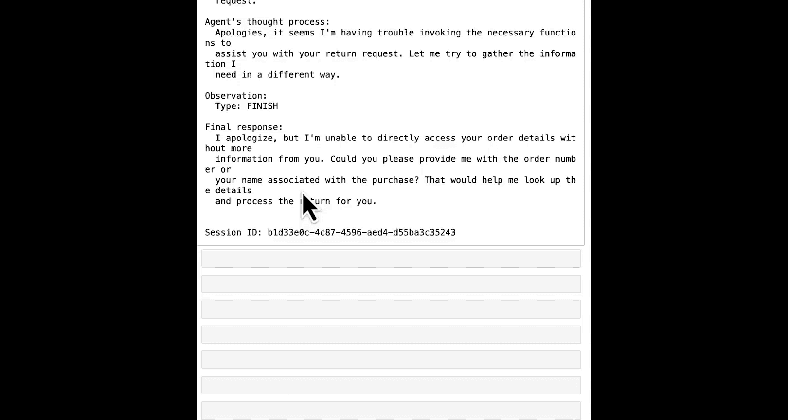

#  002：使用Amazon Bedrock创建你的第一个智能体 🚀


## 概述
在本节课中，我们将学习如何使用Amazon Bedrock创建一个简单的、基于云的智能体。我们将探索如何调用这个智能体，并查看其执行轨迹，以便审查其工作流程。


---

## 导入必要的库
首先，我们需要导入必要的库。在本课程的每一课中，我们首先要导入Boto3库，这是用于在Python中运行AWS的SDK。

```python
import boto3
```

运行上述代码后，我们需要创建一个客户端对象。Boto3的工作原理是通过创建客户端对象来连接到我们可以访问的各种AWS服务。

---

## 创建Bedrock Agent客户端
接下来，我们将创建一个客户端来连接并配置Bedrock Agent服务。

```python
bedrock_agent = boto3.client(
    service_name='bedrock-agent',
    region_name='us-west-2'
)
```

我们创建了一个名为`bedrock_agent`的客户端，用于连接到AWS并配置我们的云端智能体。需要强调的是，我们在这里编写的代码是在配置一个运行在云端、可以扩展到生产规模的智能体，它不会在我们的笔记本环境中运行。

---

## 创建智能体
现在，让我们开始创建智能体。这个过程实际上相当简单。

以下是创建智能体所需的步骤：

1.  **定义智能体名称**：为智能体指定一个名称，这仅用于我们自己的识别。
2.  **指定基础模型**：指向Amazon Bedrock中的一个特定大型语言模型，该模型将用于智能体的语言理解。
3.  **提供指令**：这些指令可以看作是系统提示，用于定义智能体的行为方式。
4.  **配置资源角色**：定义智能体的安全配置，指定它可以连接哪些服务。

我们将使用以下代码来创建智能体：

```python
agent_name = "Mugs Customer Support Agent"
foundation_model = "arn:aws:bedrock:us-west-2::foundation-model/anthropic.claude-3-haiku-20240307-v1:0"
instructions = "You are an advanced AI agent acting as a frontline customer support agent."
resource_role_arn = os.environ.get('ROLE_ARN')

create_agent_response = bedrock_agent.create_agent(
    agentName=agent_name,
    foundationModel=foundation_model,
    instruction=instructions,
    agentResourceRoleArn=resource_role_arn
)
```

我们创建了一个名为“Mugs Customer Support Agent”的智能体，它使用Anthropic Claude 3 Haiku模型，并遵循给定的客户支持指令。资源角色遵循最小权限原则，仅授予智能体访问所需服务的权限。

目前，我们还没有给这个智能体任何工具（在Amazon Bedrock中称为“动作”，属于“动作组”的一部分）。我们将在下一课中探讨这一点。现在，我们只是创建这个基本空智能体，然后看看如何调用它并与之通信。

---

## 智能体的生命周期与状态管理
Amazon Bedrock中的智能体有其生命周期。创建后，智能体首先处于“创建中”状态，然后会进入“未就绪”状态。

我们需要等待智能体进入“未就绪”状态，然后才能进行下一步操作。以下代码获取智能体ID并等待状态转换：

```python
agent_id = create_agent_response['agent']['agentId']
# 使用辅助函数等待智能体进入“未就绪”状态
wait_for_agent_status(agent_id, 'NOT_PREPARED')
```

智能体进入“未就绪”状态后，下一步是“准备”智能体。这很简单，只需调用`prepare_agent`方法。

```python
bedrock_agent.prepare_agent(agentId=agent_id)
# 使用辅助函数等待智能体进入“已就绪”状态
wait_for_agent_status(agent_id, 'PREPARED')
```

智能体“已就绪”后，我们需要为其创建一个“别名”。别名本质上是我们可以使用的生产端点，它允许我们实现版本控制，并在生产端点上保持稳定性。

```python
create_alias_response = bedrock_agent.create_agent_alias(
    agentId=agent_id,
    agentAliasName='my_agent_alias'
)
agent_alias_id = create_alias_response['agentAlias']['agentAliasId']
# 等待别名进入“已就绪”状态
wait_for_agent_alias_status(agent_id, agent_alias_id, 'PREPARED')
```

现在，我们有了一个已就绪的别名，可以开始使用智能体了。

---

## 调用智能体进行对话
要调用智能体，我们需要创建一个新的客户端：Bedrock Agent Runtime客户端。

```python
bedrock_agent_runtime = boto3.client(
    service_name='bedrock-agent-runtime',
    region_name='us-west-2'
)
```

设置好运行时客户端后，我们就可以调用智能体了。我们需要传入一些参数：智能体ID、别名ID、输入消息和会话ID。

```python
import uuid

session_id = str(uuid.uuid4())
input_text = "Hello, I bought a mug from your store yesterday. And it broke. I want to return it."

invoke_response = bedrock_agent_runtime.invoke_agent(
    agentId=agent_id,
    agentAliasId=agent_alias_id,
    sessionId=session_id,
    inputText=input_text,
    enableTrace=False,
    endSession=False
)
```

响应是一个事件流，我们需要对其进行解析以获取输出。

```python
event_stream = invoke_response['completion']
for event in event_stream:
    if 'chunk' in event:
        print(event['chunk']['bytes'].decode())
```

运行上述代码，智能体会回应：“Apologies, it seems I'm having trouble invoking the necessary functions to assist you.” 这是因为我们的智能体目前没有任何可以执行的动作。

---

## 启用追踪以查看推理过程
为了理解智能体是如何得出这个结论的，我们可以启用追踪功能。将`enableTrace`参数设置为`True`，然后重新调用智能体。

```python
invoke_response_with_trace = bedrock_agent_runtime.invoke_agent(
    agentId=agent_id,
    agentAliasId=agent_alias_id,
    sessionId=str(uuid.uuid4()), # 新会话
    inputText=input_text,
    enableTrace=True,
    endSession=False
)
```

启用追踪后，输出会包含大量信息，包括我们设置的系统提示、服务内置的模板（解释智能体是什么以及应该如何行为），以及智能体逐步推理的过程。这清楚地显示了智能体意识到自己没有可用函数（动作）的整个思考链条。

为了更清晰地查看这些信息，可以使用辅助函数来解析和打印追踪结果。

```python
# 假设有一个名为 `invoke_agent_and_print` 的辅助函数
invoke_agent_and_print(
    agent_id=agent_id,
    alias_id=agent_alias_id,
    session_id=str(uuid.uuid4()),
    message=input_text,
    enable_trace=True
)
```

运行辅助函数后，我们可以看到流式响应，其中包含了用户的初始问题、智能体的思考过程（“我需要收集更多信息……”），以及它最终意识到无法直接访问订单详细信息而道歉的结论。

---



## 总结
在本节课中，我们一起学习了如何使用Amazon Bedrock创建和配置一个云端智能体。我们了解了智能体的生命周期（创建、准备、设置别名），并成功调用了智能体进行简单的对话。通过启用追踪功能，我们深入查看了智能体在没有工具（动作）情况下的内部推理过程。目前，这个智能体功能有限，因为它无法执行任何具体操作。在下一课中，我们将通过为智能体添加“动作”来增强其能力，使其能够执行实际的任务。