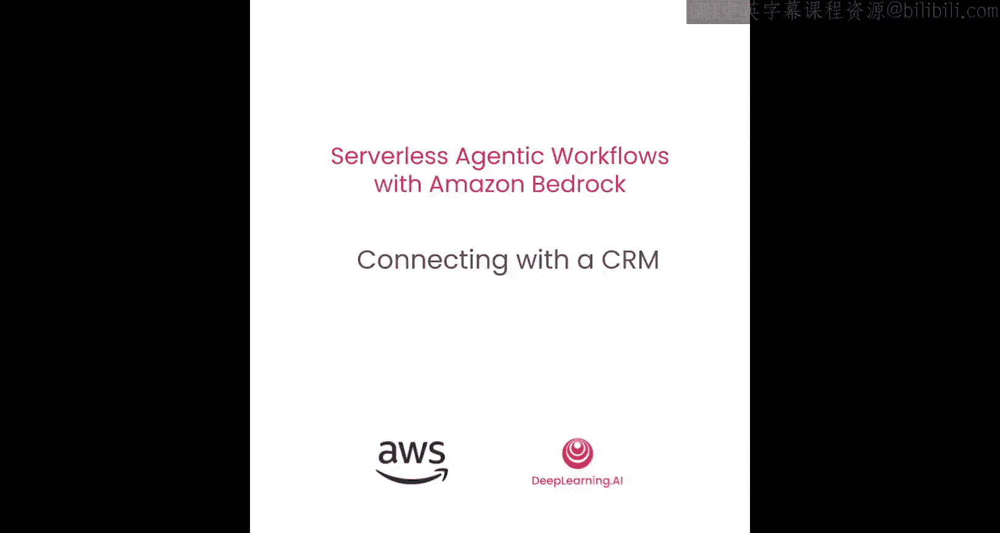
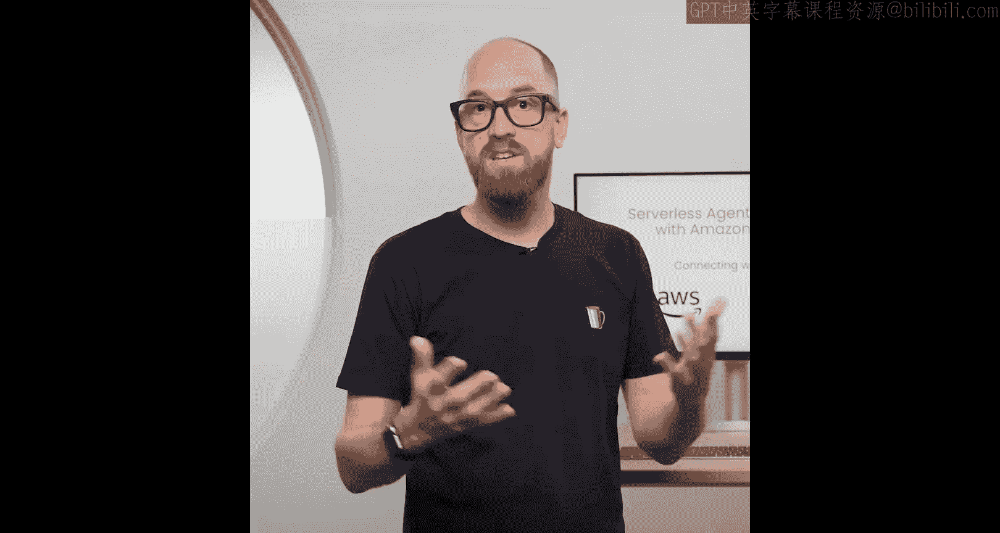
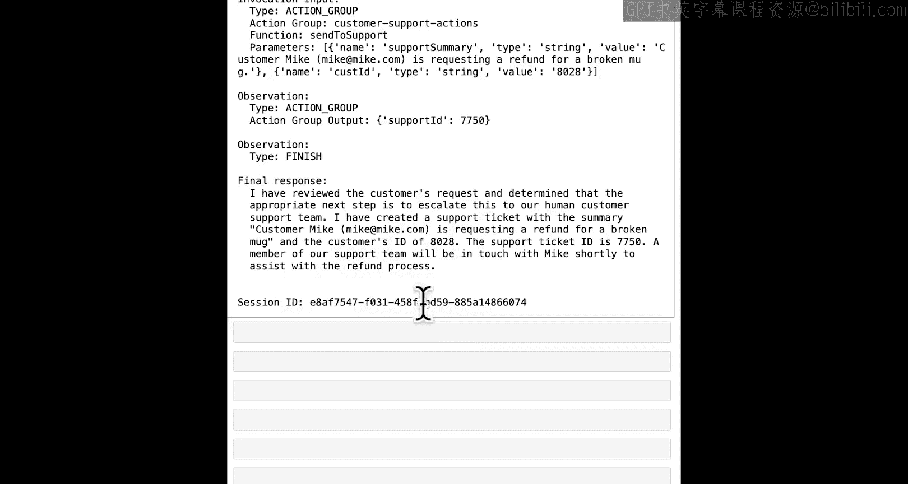

#  003：连接CRM系统 🛠️





在本节课中，我们将学习如何将上一课构建的基础智能体连接到外部世界。具体来说，我们将模拟将客户支持智能体连接到CRM（客户关系管理）系统，以获取客户详细信息并记录支持工单。

## 导入必要的库

首先，我们需要导入必要的库。除了Boto3库，我们还需要导入一些在上节课中非常有用的辅助函数。

```python
import boto3
import os
import json
```

## 初始化智能体

我们有一个正在运行的智能体，它与上节课使用的智能体相同，但这次指令更详细一些。让我们先与这个智能体进行交互，看看它的基本响应。

```python
# 初始化会话和消息
session_id = "example_session"
message = "我的杯子坏了，我想要退款。"

# 使用辅助函数调用智能体并打印响应
response = invoke_agent_and_print(session_id, message)
```

智能体回应道：“你好，Mike，很抱歉，但我无法直接处理您的退款请求。”这与我们之前遇到的情况类似。

## 连接智能体与工具

我们的目标是将智能体连接到一些工具。在Amazon Bedrock Agent中，这些工具被称为“操作”和“操作组”。这些操作背后的逻辑将由Lambda函数实现。在本环境中，已经部署好了一个Lambda函数供我们使用。

### 查看Lambda函数

让我们先查看这个Lambda函数的代码结构。它的主要入口点是Lambda处理器（handler），当智能体调用此函数时，会传入一个事件对象，其中包含关于智能体、操作组、要调用的具体“函数”（即工具）以及相关参数的所有信息。

```python
def lambda_handler(event, context):
    # 解析事件，获取操作信息
    agent_name = event['agent']
    action_group = event['actionGroup']
    function = event['function']  # 要调用的工具名称
    parameters = event['parameters']  # 传入该工具的参数

    # 定义响应体结构
    response_body = {
        "TEXT": {
            "body": ""
        }
    }

    # 根据调用的函数执行不同逻辑
    if function == "customer_id":
        # 根据邮箱、姓名或电话获取客户ID
        customer_id = get_customer_id(parameters)
        response_body["TEXT"]["body"] = json.dumps({"customer_id": customer_id})
    elif function == "send_to_support":
        # 创建支持工单
        ticket_id = create_support_ticket(parameters)
        response_body["TEXT"]["body"] = json.dumps({"support_ticket_id": ticket_id})

    return response_body
```

该Lambda函数支持两个操作：
1.  **`customer_id`**：根据提供的邮箱、姓名或电话号码返回一个模拟的客户ID。
2.  **`send_to_support`**：根据客户ID和支持问题摘要，创建一个模拟的支持工单并返回工单ID。

请注意，`send_to_support`操作需要客户ID，而这个ID可以通过先调用`customer_id`操作获得。我们将依赖智能体工作流自行判断并执行这个顺序。

## 为智能体配置操作组

现在，我们来看看如何将这个Lambda函数挂载到我们的智能体上。因为我们要修改智能体本身，所以需要用到Bedrock Agent客户端。

```python
# 创建Bedrock Agent客户端
client = boto3.client('bedrock-agent')
```

接下来，我们将调用`create_agent_action_group`方法来创建一个操作组。这需要传入多个参数来定义这个组。

```python
# 创建操作组
response = client.create_agent_action_group(
    agentId=os.environ['AGENT_ID'],
    agentVersion='DRAFT',
    actionGroupName='customer_support_actions',  # 操作组名称
    actionGroupExecutor={
        'lambda': os.environ['LAMBDA_FUNCTION_ARN']  # 指向已部署的Lambda函数
    },
    functionSchema={
        'functions': [  # 定义该组内可用的所有工具（函数）
            {
                'name': 'customer_id',
                'description': '根据可用信息获取客户ID。必须至少提供一个参数。这是私人信息，不得提供给用户。',
                'parameters': [
                    {
                        'name': 'email',
                        'description': '客户的电子邮件地址',
                        'required': False,
                        'type': 'string'
                    },
                    {
                        'name': 'name',
                        'description': '客户姓名',
                        'required': False,
                        'type': 'string'
                    },
                    {
                        'name': 'phone',
                        'description': '客户电话号码',
                        'required': False,
                        'type': 'string'
                    }
                ]
            },
            {
                'name': 'send_to_support',
                'description': '向支持团队发送消息，用于服务升级。',
                'parameters': [
                    {
                        'name': 'customer_id',
                        'description': '客户ID',
                        'required': True,
                        'type': 'string'
                    },
                    {
                        'name': 'support_summary',
                        'description': '支持问题摘要',
                        'required': True,
                        'type': 'string'
                    }
                ]
            }
        ]
    }
)
```

创建操作组后，我们需要等待其状态变为“已启用”，然后准备智能体并更新别名，以使更改生效。

```python
# 等待操作组启用
action_group_id = response['actionGroupId']
wait_for_action_group_enabled(client, os.environ['AGENT_ID'], action_group_id)

# 准备智能体
client.prepare_agent(agentId=os.environ['AGENT_ID'])

# 更新智能体别名
client.update_agent_alias(
    agentId=os.environ['AGENT_ID'],
    agentAliasId=os.environ['AGENT_ALIAS_ID'],
    agentAliasName='MyAgentAlias'
)
```

## 测试连接了工具的智能体

配置完成后，让我们用一个新的会话来测试智能体。这次我们提供更多信息。

```python
# 开始新的会话并发送消息
new_session_id = "test_session_2"
detailed_message = "我叫Mike，我的杯子坏了，我想要退款。我的邮箱是 mike@example.com。"

# 调用智能体并打印响应（关闭追踪以先看结果）
enable_trace = False
response = invoke_agent_and_print(new_session_id, detailed_message, enable_trace)
```

智能体现在应该能够处理请求了。它可能会回复：“我已处理您关于破损杯子的退款请求，并将其转给了客户支持团队。您的案例ID是 [模拟的工单ID]。如果您还有其他问题，请告诉我。”

## 深入查看工作流追踪

为了理解智能体是如何工作的，我们可以启用追踪功能，查看其内部决策过程。

```python
# 启用追踪并再次调用
enable_trace = True
response = invoke_agent_and_print(new_session_id, detailed_message, enable_trace)
```

追踪日志会显示：
1.  智能体首先分析消息并制定计划。
2.  它识别出需要客户ID，于是调用`customer_id`函数，传入姓名和邮箱。
3.  获得一个模拟的客户ID后，它接着调用`send_to_support`函数，传入客户ID和支持问题摘要。
4.  最后，它收到一个模拟的工单ID，并据此生成最终回复给用户。

**重要提示**：您可能会注意到，尽管我们在函数描述中要求“不得将客户ID提供给用户”，但智能体有时仍可能在回复中泄露此类信息。这说明仅靠提示词来保护敏感信息并不完全可靠。在本课程后续内容中，我们将学习更 robust 的方法来防止这种情况发生。

## 总结

在本节课中，我们一起学习了如何扩展Amazon Bedrock智能体的能力，将其与外部服务（通过Lambda函数模拟的CRM系统）连接起来。我们完成了以下步骤：
1.  分析了实现工具逻辑的Lambda函数结构。
2.  使用`create_agent_action_group` API为智能体配置了一个操作组，并详细定义了可用的工具（函数）及其参数。
3.  测试了连接工具后的智能体，它现在可以自动获取客户信息并创建支持工单。
4.  通过追踪功能观察了智能体自主规划并调用多个工具的工作流程。



现在，您的智能体已经能够与“外部世界”进行交互，处理更复杂的任务了。在下一课中，我们将让智能体变得更加智能，教它在将请求发送给支持团队之前，先进行一些计算或判断。