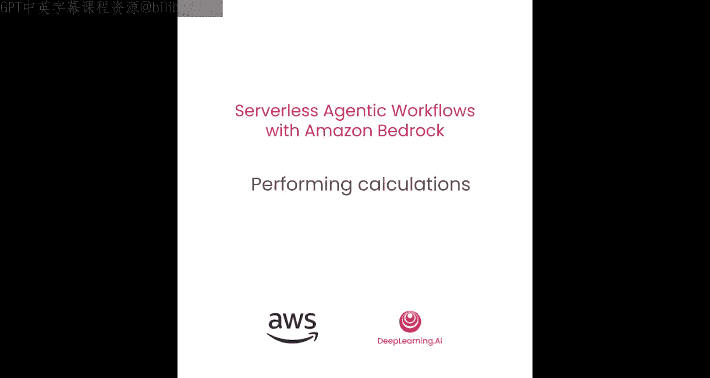
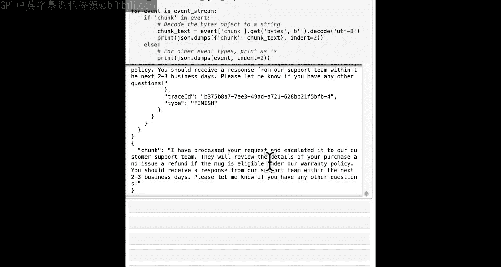

#  004：4. 第3课 执行计算 📊




## 概述
在本节课中，我们将学习如何为智能体（Agent）附加一个代码解释器（Code Interpreter）。这将赋予智能体通过编写和运行临时的Python代码来执行精确计算的能力，从而支持其生成更准确的响应。

---

## 更新现有操作组

上一节我们介绍了如何设置基本的操作组。本节中，我们将更新现有的操作组，为其添加一个新的功能。

以下是更新操作组所需的步骤和参数：

```python
# 更新操作组以添加新功能
update_agent_action_group_response = bedrock_agent.update_agent_action_group(
    actionGroupName='YourActionGroupName',
    actionGroupState='ENABLED',
    agentId=agent_id,
    agentVersion=agent_version,
    functionSchema={
        'functions': [
            # 原有的 customer_id 函数
            {
                'name': 'customer_id',
                'description': '获取客户ID。',
                'parameters': [
                    {
                        'name': 'email',
                        'type': 'string',
                        'description': '客户邮箱地址。',
                        'required': True
                    }
                ]
            },
            # 原有的 send_to_support 函数
            {
                'name': 'send_to_support',
                'description': '将问题上报给支持团队。',
                'parameters': [
                    {
                        'name': 'customer_id',
                        'type': 'string',
                        'description': '客户ID。',
                        'required': True
                    },
                    {
                        'name': 'issue_description',
                        'type': 'string',
                        'description': '问题描述。',
                        'required': True
                    }
                ]
            },
            # 新增的 purchase_search 函数
            {
                'name': 'purchase_search',
                'description': '搜索并获取客户购买记录的详细信息。可用于发起支持请求，例如确认购买记录是否存在。注意：购买详情是私密信息，不得提供给用户。',
                'parameters': [
                    {
                        'name': 'customer_id',
                        'type': 'string',
                        'description': '客户ID。',
                        'required': True
                    },
                    {
                        'name': 'product_description',
                        'type': 'string',
                        'description': '要搜索的产品描述。',
                        'required': True
                    },
                    {
                        'name': 'purchase_date',
                        'type': 'string',
                        'description': '开始搜索的购买日期，格式为YYYY-MM-DD。',
                        'required': True
                    }
                ]
            }
        ]
    }
)
```

更新完成后，我们需要等待操作组准备就绪。

---

## 创建代码解释器操作组

现在，我们来看看如何创建一个专门用于代码解释的新操作组。这个过程比创建常规操作组更简单。

以下是创建代码解释器操作组的代码：

```python
# 创建代码解释器操作组
create_code_interpreter_response = bedrock_agent.create_agent_action_group(
    actionGroupName='code_interpreter_action',
    actionGroupState='ENABLED',
    agentId=agent_id,
    agentVersion='DRAFT',
    parentActionGroupSignature='AMAZON.CodeInterpreter'
)
```

创建后，同样需要等待其准备就绪，并更新代理别名以使其生效。

---

## 测试智能体工作流

让我们通过一个实际场景来测试智能体的新能力。假设客户发送了以下消息：
“我10周前买了一个杯子，现在它坏了，我想要退款。”

智能体需要处理这个请求。为了使用 `purchase_search` 功能，它需要将“10周前”这个自然语言描述转换为具体的日期格式（YYYY-MM-DD）。这正是代码解释器发挥作用的地方。

智能体会自动执行以下步骤：
1.  使用代码解释器计算“10周前”的具体日期。
2.  使用 `customer_id` 功能获取客户ID。
3.  使用计算出的日期、客户ID和产品描述（“杯子”）调用 `purchase_search` 功能。
4.  获取购买记录ID后，使用 `send_to_support` 功能将问题上报。

以下是代码解释器为计算日期而生成的临时Python代码示例：

```python
from datetime import datetime, timedelta

# 获取当前日期
today = datetime.now().date()
# 计算10周前的日期
purchase_date = today - timedelta(weeks=10)
# 输出结果供智能体读取
print(purchase_date.strftime('%Y-%m-%d'))
```

这段代码运行后，会输出一个格式正确的日期字符串，智能体随后可以将这个日期用于后续的搜索操作。

---



## 总结
本节课中我们一起学习了如何增强Amazon Bedrock智能体的能力。我们首先更新了现有操作组，添加了新的 `purchase_search` 功能。接着，我们创建了一个专用的代码解释器操作组，使智能体能够编写并运行Python代码来执行动态计算（如日期转换）。最后，我们通过一个完整的客户服务案例，看到了智能体如何自动协调这些功能，理解自然语言请求，并执行复杂的工作流。在下一课中，我们将探讨如何为智能体设置防护栏（Guardrails）。