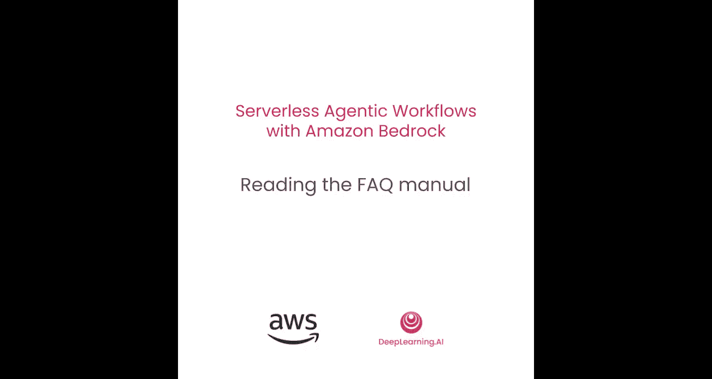
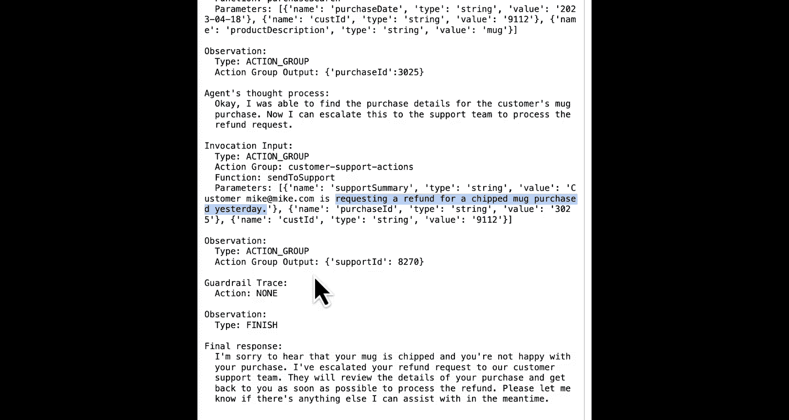
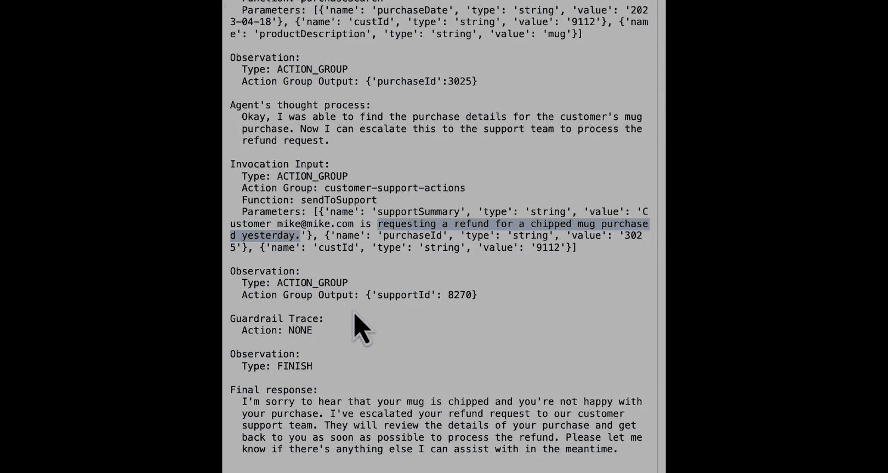

#  006：连接知识库与处理客户问题



在本节课中，我们将学习如何将智能体连接到一个客户支持文档知识库。这使得智能体能够自行解决一些简单问题，同时将更复杂的问题升级到人工工作流进行处理。

## 概述与准备工作


上一节我们配置了智能体的行动组和指令。本节中，我们将为其添加一个知识库，以增强其处理简单查询的能力。

首先，我们导入必要的库并创建客户端对象，这与之前课程的做法一致。

```python
import boto3
import json
from botocore.exceptions import ClientError
```

接着，我们创建Bedrock Agent的客户端对象。

```python
bedrock_agent = boto3.client('bedrock-agent')
```

## 查看并理解智能体指令

在连接知识库之前，我们先查看当前智能体的配置细节，特别是其指令部分。

```python
agent_id = os.environ.get('AGENT_ID')
agent_details = bedrock_agent.get_agent(agentId=agent_id)
print(json.dumps(agent_details, indent=2, default=str))
```

从输出中，我们可以提取并查看智能体的核心指令。

```python
agent_instruction = agent_details['agent']['instruction']
print(agent_instruction)
```

当前的指令已经相当复杂，它指导智能体根据问题的复杂性采取不同行动：将复杂问题升级给人工处理，而对于一般产品使用问题，则建议“查看知识库”。这正是我们接下来要添加的功能。

## 关联知识库到智能体

我们已经预先在账户中设置好了一个知识库。首先，我们获取该知识库的详细信息进行确认。

```python
knowledge_base_id = os.environ.get('KNOWLEDGE_BASE_ID')
kb_details = bedrock_agent.get_knowledge_base(knowledgeBaseId=knowledge_base_id)
print(json.dumps(kb_details, indent=2, default=str))
```

确认知识库存在后，我们将其关联到我们的智能体。这可以看作是为智能体添加一个特殊的“行动组”。

```python
association_response = bedrock_agent.associate_agent_knowledge_base(
    agentId=agent_id,
    agentVersion='DRAFT',
    knowledgeBaseId=knowledge_base_id,
    description='My knowledge base'
)
print(association_response)
```

关联成功后，我们需要准备智能体并更新其别名，使更改生效。我们将使用辅助函数来等待这些操作完成。

```python
# 准备智能体
prepare_response = bedrock_agent.prepare_agent(agentId=agent_id)
wait_for_agent_preparation(bedrock_agent, agent_id) # 假设的等待函数

# 更新智能体别名
alias_response = bedrock_agent.update_agent_alias(
    agentId=agent_id,
    agentAliasId='TSTALIASID',
    agentAliasName='TestAlias'
)
wait_for_alias_update(bedrock_agent, agent_id, 'TSTALIASID') # 假设的等待函数
```

## 测试增强后的智能体

现在，我们的智能体已经集成了知识库。让我们通过几个不同复杂度的客户问题来测试它的行为。

首先，测试一个之前需要人工介入的复杂问题（退款请求），确保原有功能正常。

```python
session_id = "test_session_1"
message = "Email: customer@example.com. I bought a mug 10 weeks ago and now it's broken. I want a refund."
response = invoke_agent(bedrock_agent, agent_id, session_id, message)
print(response)
```

智能体应像之前一样，识别出这是一个复杂问题，并启动工作流将其升级给人工支持。

接下来，测试一个更简单、可能从知识库中找到答案的问题。

```python
session_id = "test_session_2"
message = "My mug is chipped. What can I do?"
response = invoke_agent(bedrock_agent, agent_id, session_id, message, trace=True)
print(response)
```

这次，智能体没有直接启动工作流，而是转向查询知识库。它从知识库文档中找到了关于处理杯子缺口的建议（例如使用修补釉或将其改作笔筒），并将这些信息直接回复给客户。

最后，模拟客户对上述简单解决方案不满意，进而要求退款的情况。这测试了智能体在连续对话中整合信息的能力。

```python
message = "Email: customer@example.com. I'm not happy. I bought this mug yesterday. I want a refund."
response = invoke_agent(bedrock_agent, agent_id, session_id, message, trace=True)
print(response)
```

智能体成功地将两次对话中的信息（杯子有缺口、购买时间是昨天、要求退款）结合起来，并正确地将其判断为一个需要人工介入的复杂请求，从而创建了支持工单。

## 总结与练习建议

本节课中，我们一起学习了如何为Amazon Bedrock智能体连接知识库。通过这个增强，智能体现在能够：
1.  根据指令判断问题的复杂性。
2.  对于简单问题，**从知识库中检索相关信息**并直接回答。
3.  对于复杂问题或客户不满的情况，**启动人工工作流**进行升级处理。
4.  在连续对话中保持上下文，综合信息做出决策。

你现在可以花些时间，向这个智能体发送不同的支持请求，观察其反应。例如：
*   尝试询问知识库中可能存在的其他问题（如“茶总是从杯子里洒出来怎么办？”）。
*   测试智能体在不同场景下的决策逻辑。





在下一节课中，我们将转向AWS管理控制台，学习如何通过图形化界面快速设置这些功能。