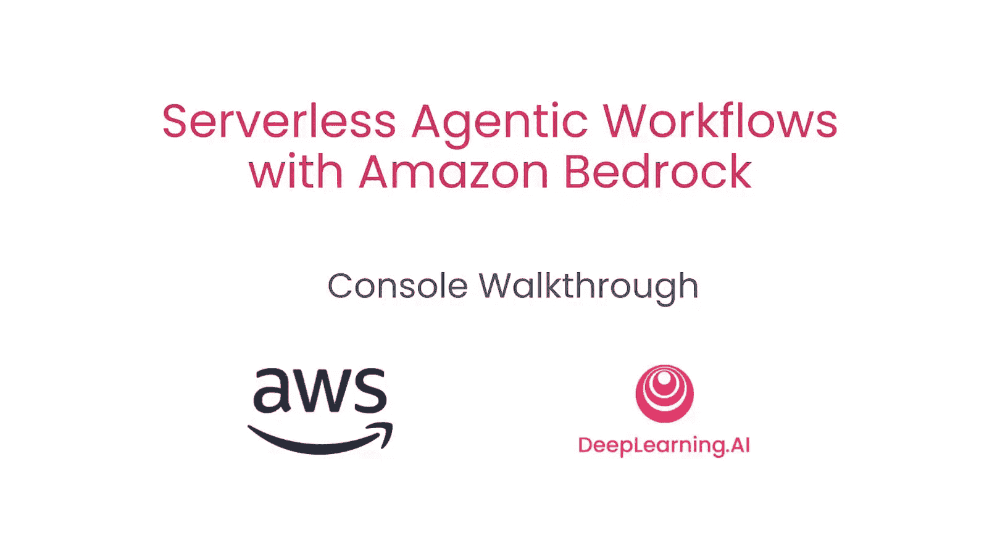
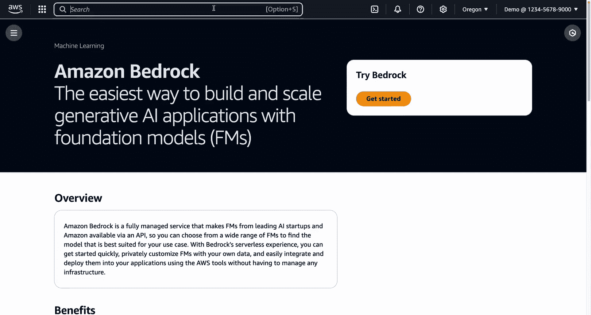
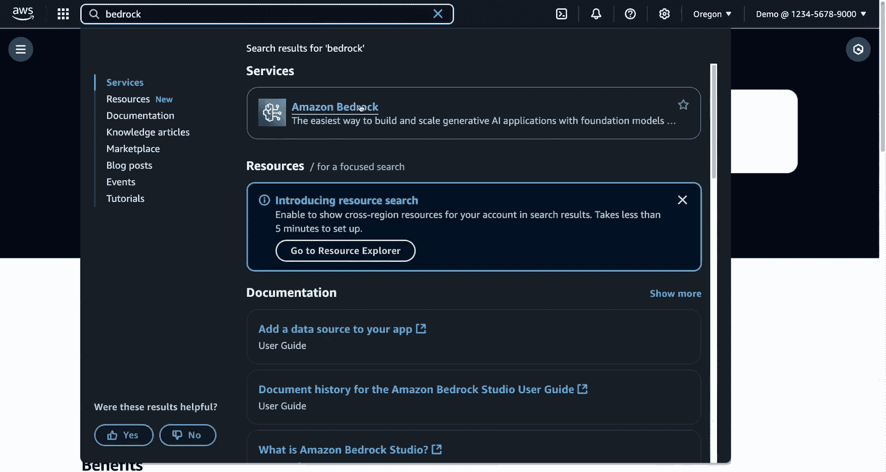
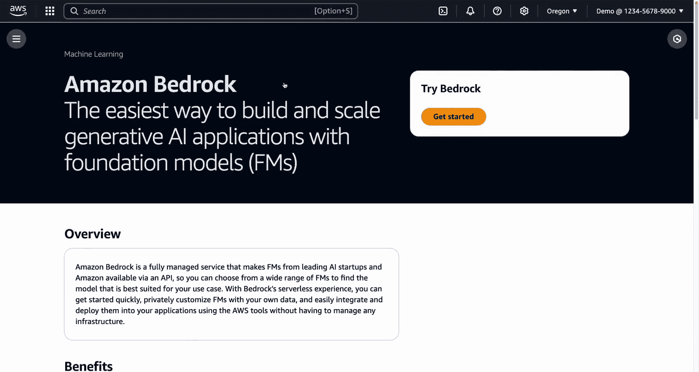
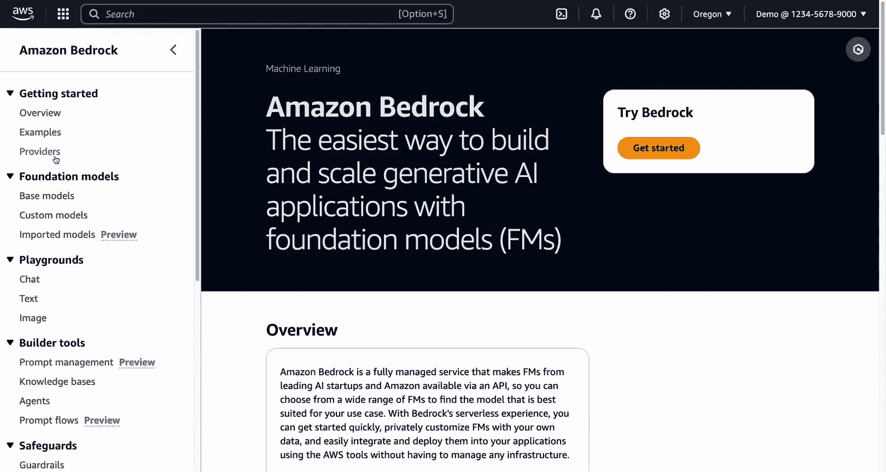
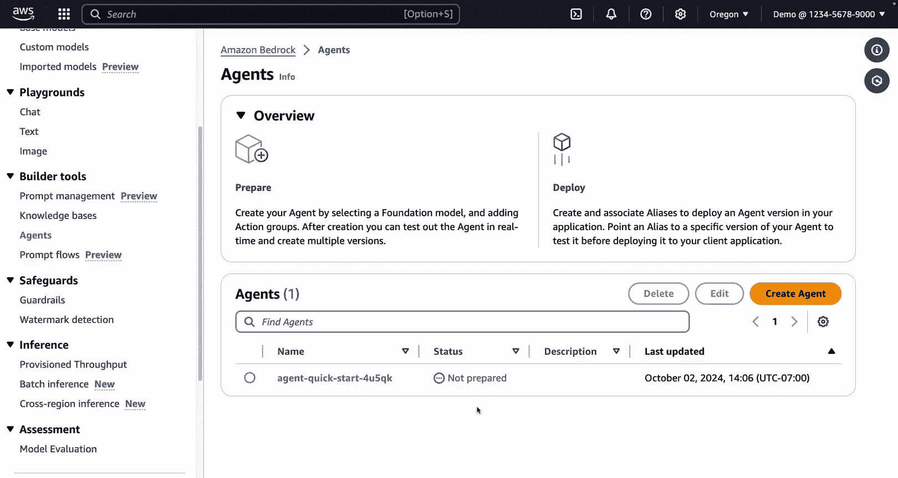
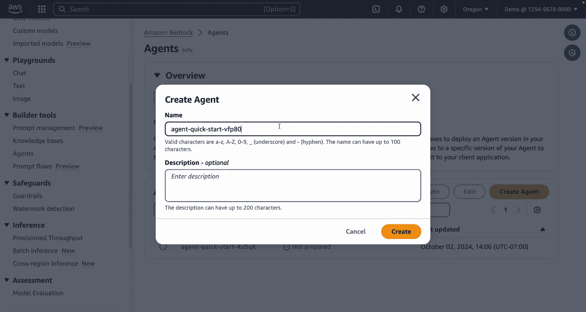
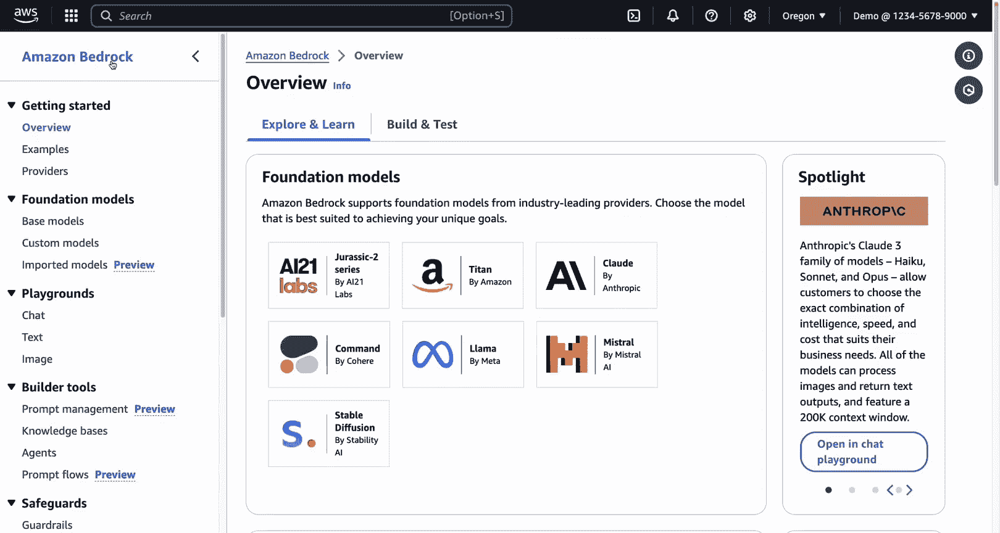

#  007：控制台操作指南 🖥️

在本节课中，我们将通过AWS控制台界面，快速浏览Amazon Bedrock的核心功能。我们将了解如何配置模型访问、创建智能体、设置护栏以及构建知识库，这些操作都可以通过直观的图形界面完成，无需编写代码。

---

## 访问Amazon Bedrock服务

首先，我们需要进入Amazon Bedrock控制台。登录您的AWS账户后，在顶部的搜索栏中输入“bedrock”，即可找到并进入Amazon Bedrock服务页面。

## 配置模型访问权限

上一节我们介绍了如何进入控制台，本节中我们来看看如何管理可用的AI模型。

在左侧菜单栏的“入门”下方，点击“提供商”。这里列出了全球多家AI实验室提供的模型，例如Amazon、Anthropic（本课程使用其模型）、AI21 Labs、Cohere、Meta、Mistral和Stability AI。

如果您看到某些模型不可用的错误提示，通常是因为在当前区域或账户中尚未启用它们。以下是启用模型的步骤：

1.  返回左侧菜单，滚动到底部并点击“模型访问”。
2.  在此页面，您可以看到当前区域和账户下所有可用的模型及其访问状态。
3.  如果您没有访问权限，可以选中特定模型，同意其最终用户许可协议来获取访问权。
4.  或者，点击“修改模型访问”按钮，可以一次性选择或取消选择多个模型，然后点击“下一步”来批量更改访问权限。

获取所需模型的访问权限后，您就可以开始使用它们了。

## 探索与构建智能体

现在我们已经配置好了模型，接下来进入本课程的核心部分：智能体、护栏和知识库。首先，让我们看看如何创建和配置智能体。

在左侧菜单中点击“智能体”。如果您之前创建过智能体，会在此处看到列表。点击“创建智能体”可以从头开始构建。

创建智能体时，您需要进入智能体构建器进行配置，这与我们在代码中完成的工作类似：

*   **智能体详情**：包括名称和描述。
*   **模型选择**：指定为该智能体提供语言理解能力的大语言模型。
*   **指令**：在此处输入给智能体的详细指令。文本框可以调整大小以容纳更多内容。
*   **代码解释器**：在高级设置中，您可以启用本课程中提到的代码解释器功能。

配置完基本信息后，下一步是设置行动组，这是智能体调用外部工具的关键。

以下是创建行动组的步骤：

1.  在“行动组”部分点击“添加”。
2.  为行动组命名并添加描述。
3.  关键选项是“快速创建新的Lambda函数”。选择此项后，控制台会自动创建一个包含示例代码的Lambda函数（代码与本课程早期内容非常接近），并配置好该行动组所需的所有权限。
4.  Lambda函数创建完成后，您可以编辑其代码以实现您想要的业务逻辑。
5.  最后，在行动组配置中，您需要为函数提供名称、描述（这些信息会提供给大语言模型以理解函数功能）以及必要的参数。

智能体配置完成后，您可以为其创建别名，并利用右侧的测试区域与智能体进行对话，测试其在不同用例下的响应。

## 设置内容护栏

智能体配置好后，我们还需要考虑安全性和内容控制。本节中我们来看看如何通过控制台设置护栏。

在左侧菜单点击“护栏”。请注意，护栏是独立于智能体存在的资源，可以在多个场景（包括智能体）中使用。点击“创建护栏”按钮。

创建过程与我们用代码实现时类似，但这里是通过表单进行点选配置：

1.  您可以配置内容过滤器，例如设置拒绝的主题。
2.  可以设置词汇过滤器。
3.  点击“下一步”后，可以配置有害内容类别，并通过滑动条为不同类型的过滤器设置强度。

这样，您就无需编写代码，通过点选操作即可在Amazon Bedrock控制台中完成护栏的配置。

## 创建与管理知识库

最后，我们来探讨如何为智能体添加外部知识。本节将展示如何在控制台中轻松创建知识库。

在左侧菜单点击“知识库”，然后点击“创建知识库”。创建过程如下：

1.  **基本信息**：提供知识库的名称和描述。
2.  **权限**：控制台会为您创建一个执行角色，通常使用默认提供的角色即可。
3.  **选择数据源**：
    *   在本课程之前的实践中，数据源是一个存有公司支持文档PDF文件的S3存储桶。
    *   但您不仅限于S3。目前（录制时）的选项还包括：使用网络爬虫抓取您有权限访问的公开网站内容；或连接Confluence、Salesforce、SharePoint等第三方数据源。
4.  如果选择S3，点击“下一步”后需要配置S3：
    *   指向存储文档的S3存储桶。
    *   可以选择是否调整文档分块和解析的高级设置。
5.  **选择嵌入模型和向量数据库**：
    *   选择要使用的嵌入模型，并可选择性地调整向量维度。
    *   选择后端使用的向量数据库。在上节课中，我们使用了由课程环境创建的Amazon OpenSearch Serverless集合。在控制台中，选择相应的选项，系统会自动为您创建并配置一个新的OpenSearch Serverless集合。
    *   您也可以选择连接已有的向量存储，如已有的OpenSearch Serverless集合、Amazon Aurora、MongoDB Atlas、Pinecone或Redis Enterprise Cloud。

配置完成后，点击“创建知识库”。知识库创建成功后，您可以触发文档摄取过程，开始将数据向量化并存入向量数据库。最后，只需将知识库连接到您的智能体，即可开始运行。

---

本节课中我们一起学习了如何在Amazon Bedrock控制台中导航和操作。我们了解了如何管理模型访问、通过图形界面构建和配置智能体、设置内容护栏以及创建知识库。控制台提供了直观的方式来实验和管理这些功能。请注意，随着服务更新，控制台界面可能会发生变化，建议定期查看以了解新功能。