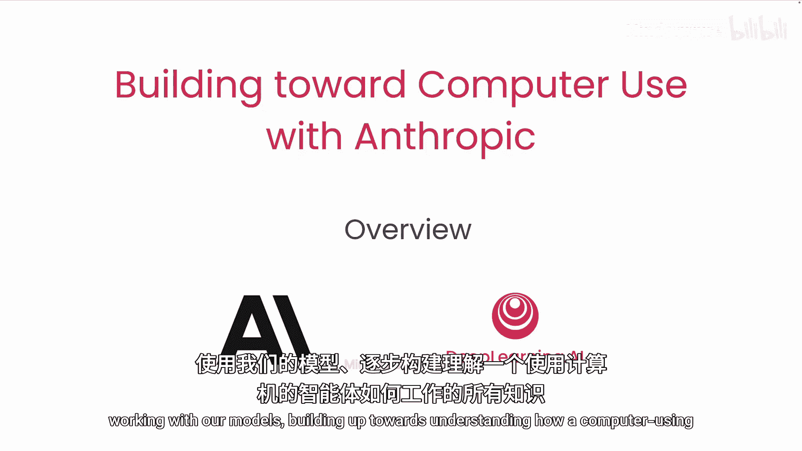
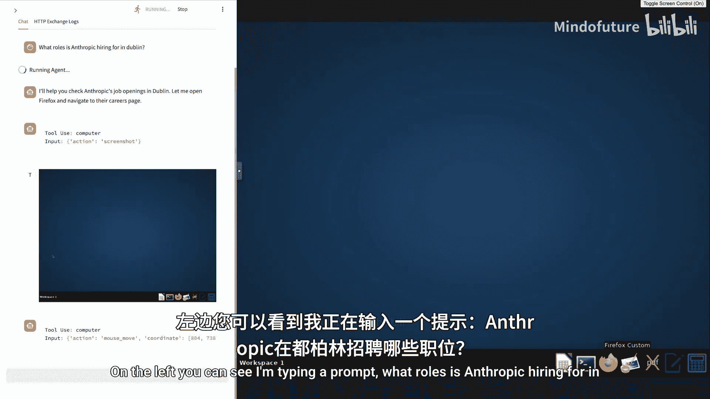
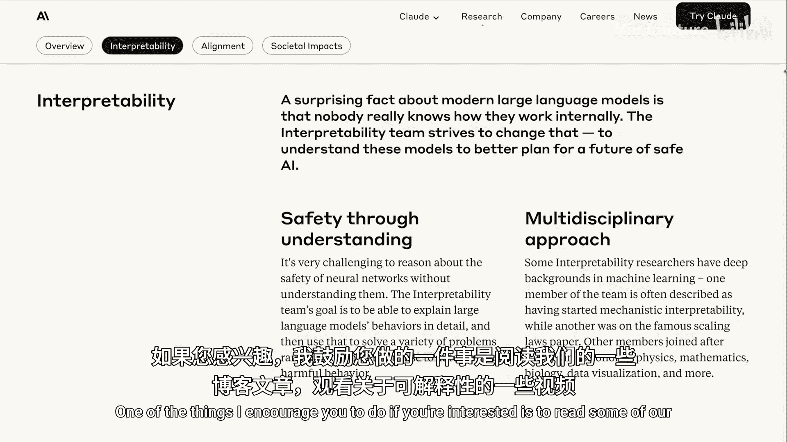
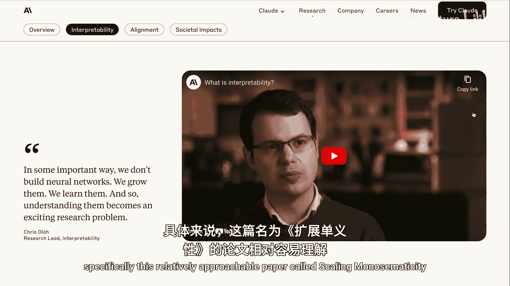
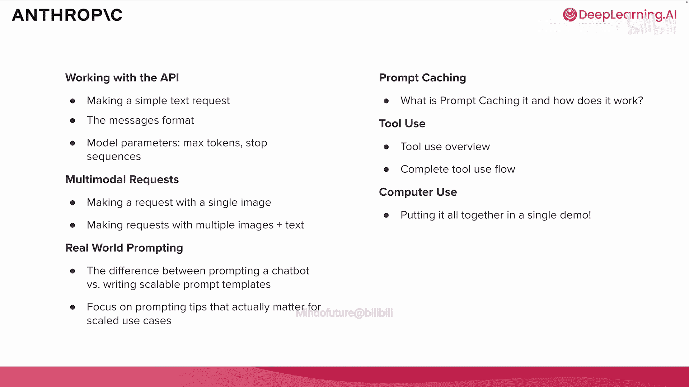

# 001：课程概述 🧭

在本节课中，我们将学习Anthropic在人工智能研究与开发上的核心理念，了解AI安全性、对齐性和可解释性的关键原则，并区分Anthropic旗下的不同模型系列。课程结束时，你将能够解释Anthropic的研究方法，并为其模型家族进行分类。

## 课程结构预览

上一节我们介绍了课程目标，本节中我们来看看整个课程将如何展开。本课程将涵盖使用Anthropic API所需的一切知识，从基础模型交互开始，逐步构建，最终理解“计算机使用智能体”的工作原理。

那么，什么是“计算机使用智能体”？请看左侧示例：我正在输入一个提示——“Anthropic在都柏林招聘哪些职位？”。

（注：演示视频经过加速处理。）你可以看到，右侧的模型正在操作计算机。它点击、移动鼠标、选择下拉菜单、展开折叠面板。最终，它导航到Anthropic招聘页面，筛选出都柏林的职位，并展开两个职位描述：技术项目经理和安全审计与合规专员。

这就是我所说的“计算机使用智能体”。你刚才看到的这个智能体，建立在所有基础概念之上。我们将按顺序讲解这些主题，最终以计算机使用智能体的演示作为收官。

以下是本课程将涵盖的核心主题列表：
*   **提示与消息格式**：我们将首先学习如何构建提示，并使用消息格式与模型交互。
*   **模型参数**：接下来，我们将了解如何调整各种模型参数以控制输出。
*   **多模态请求**：你可能注意到模型使用了屏幕截图来决定点击、拖拽和输入的位置。你将学习如何发起包含图像（包括截图）的请求。
*   **真实世界提示工程**：这部分将重点探讨与Claude AI等聊天机器人进行对话式交互，与使用API进行可扩展、可重复的提示模板工程之间的显著区别。
*   **提示缓存**：你将学习提示缓存策略，这是计算机使用智能体采用的一种方法，也是一种极佳的成本与延迟优化措施。
*   **工具使用**：这部分将讲解如何让模型执行点击、滚动、输入等操作，或连接API、执行Bash命令、运行代码等。我们可以为模型提供各种工具，模型可以告知我们它希望执行哪些工具。
*   **计算机使用智能体**：最后，你将看到如何运行刚才演示的计算机使用智能体。它综合了我们所学的所有主题，难度有所提升，但这是一个极佳的顶点项目，涵盖了使用Anthropic API的所有核心概念。

## 关于Anthropic：前沿研究与安全

在深入探讨API使用之前，我想简要介绍一下Anthropic。Anthropic是一个独特的人工智能实验室，其研究高度重视安全性，并将其置于最前沿。

简而言之，Anthropic致力于构建前沿模型（有时是全球最佳的模型），同时利用这些模型进行尖端研究。下图的时间线很好地融合了这两个理念。

在顶部，你可以看到Anthropic成立于2021年，以及直至2024年Claude 3.5 Sonnet发布的一系列模型发布时间线。在底部，你可以看到同期发布的一些关键研究论文。

虽然这不是一门研究课程，但我希望你能关注Anthropic网站的研究页面。这是一个很好的资源，可以通过易于理解的形式或完整的研究论文来深入了解我们的研究。

我们重点关注的领域包括**可解释性**、**对齐性**和**社会影响**。这里我想特别强调**对齐性**。对齐科学专注于确保AI系统的行为符合人类价值观和意图。核心问题是：我们如何创建能够可靠追求我们设定目标的AI系统，即使它们的能力变得越来越强？

Anthropic另一个重点研究领域是**可解释性**。这个词有点拗口，但它是AI研究中一个非常迷人且关键的方面。可解释性旨在理解大型语言模型的内部工作原理，本质上是对它们进行逆向工程，或者给模型做“MRI”或“脑部扫描”，以便我们能在任何时间点准确了解其内部发生的情况。如果不理解模型的工作原理，改进模型并确保其安全性将非常困难。

如果你感兴趣，我鼓励你阅读我们的一些博客文章，观看关于可解释性的视频，特别是这篇相对易于理解的论文《Scaling Monosemanticity》。我知道这个名字听起来不那么平易近人，但文中充满了很酷的图表和可视化内容，逐步讲解了一些关键的可解释性研究，读起来也很有趣，包含一些有趣的例子。

## Anthropic模型家族

正如开头提到的，Anthropic不仅是一个专注于安全、对齐和可解释性的研究实验室，还发布最先进的大型语言模型。在我们的文档模型页面上，你可以找到当前模型的最新列表。像AI领域的一切一样，这个列表更新相当频繁，因此实际页面可能与此处展示的略有不同。

目前，**Claude 3.5 Sonnet**是我们最智能的模型，其次是**Claude 3.5 Haiku**。Haiku能力稍弱，但仍然非常智能，且速度更快。这是目前使用我们模型时的两个主要选择。

如果我们放大这个模型对比表格，可以看到Claude 3.5 Sonnet和Claude 3.5 Haiku，以及最初的Claude 3系列模型。但两个最新、能力最强的模型位于左侧：3.5 Sonnet和3.5 Haiku。表格清晰地对比和分解了它们的能力、优势及视觉能力。

总的来说：
*   **Claude 3.5 Sonnet**是我们提供的最智能模型，最聪明、能力最强。它支持多语言、多模态（支持图像输入），并支持我们的批量API。需要注意的一点是，它有多个版本，包括最新的升级版 **`claude-3-5-sonnet-20241022`**。我们将在下一个视频中详细讨论模型字符串，但这是Claude 3.5 Sonnet的最新版本。它速度很快，但不如Claude 3.5 Haiku快。
*   **Claude 3.5 Haiku**是我们提供的最快模型，在极快的速度下仍保持高智能。它比Claude 3.5 Sonnet更快，在一些流行基准测试上能力稍弱，且目前不支持视觉功能。

现在，我们来谈谈上下文窗口。这两个模型的上下文窗口都是 **`200,000`** 个令牌，最大输出令牌数为 **`8192`**。显然，Claude 3.5 Haiku更便宜、更快。但Claude 3.5 Sonnet是最智能的模型，也是本课程中将主要使用的模型。它性价比很高，并且是目前在计算机使用任务上表现最佳的模型，很大程度上是因为它支持图像输入。

在下一个视频中，我们将学习如何使用这些模型，开始发送请求。但我希望你先了解这个文档页面，以便随时查找最新模型信息，并查看这些模型在各种指标上的对比情况。

## 总结

本节课中，我们一起学习了Anthropic作为前沿研究实验室和尖端模型创造者的基本定位，了解了AI安全、对齐与可解释性的核心研究重点，并初步认识了Claude 3.5 Sonnet和Claude 3.5 Haiku这两个主力模型及其关键特性。我们还预览了从基础提示到复杂计算机使用智能体的完整学习路径。接下来，我们将正式动手，开始使用API发送第一个简单的文本请求。